# Spark Push 认证子集详细教学文档

本文档是基于 C++ 的实时消息推送系统的**认证子集**教学材料，专注于用户身份认证和 WebSocket 连接管理的核心功能。

---

# 0. 目标与范围

## 0.1 项目概述

本项目是一个基于 C++ 的实时消息推送系统的**认证子集**，专注于用户身份认证和 WebSocket 连接管理。系统采用微服务架构，包含两个核心服务：

- **Logic 服务**：负责业务逻辑（注册/登录、token 鉴权）
- **Comet 服务**：负责长连接管理（WebSocket 网关）

## 0.2 功能范围

- **用户注册**：通过 HTTP API 接收账号密码，写入 MySQL，生成 token 存入 Redis
- **用户登录**：验证账号密码，生成 token 并返回
- **Token 鉴权**：通过 gRPC 接口验证 token 有效性
- **WebSocket 握手**：客户端携带 token 建立长连接，Comet 调用 Logic 完成鉴权
- **路由管理**：维护用户与 Comet 服务器的映射关系

## 0.3 技术栈

- **网络库**：muduo (Reactor 模式)
- **RPC 框架**：gRPC + Protobuf
- **数据存储**：MySQL（用户数据）、Redis（token 与路由信息）
- **构建工具**：CMake 3.14+
- **编程语言**：C++17

## 0.4 代码路径

- `auth_subset/CMakeLists.txt`：顶层构建配置
- `proto/`：Protobuf 消息定义与 gRPC 服务接口
- `common/`：配置、日志、连接池等公共组件
- `logic/`：HTTP 注册/登录 + gRPC 鉴权服务
- `comet/`：WebSocket 网关服务
- `conf/`：配置文件（logic.conf、comet.conf）
- `sql/`：数据库表结构（schema.sql）
- `third_party/json.hpp`：JSON 解析库（nlohmann/json）

---

# 1. 目录与模块关系

- 顶层：`auth_subset/CMakeLists.txt` 统一拉起子模块
- `muduo/`：网络基础库（本地源码，优先于系统）
- `common/`：配置、日志、MySQL/Redis 连接池
- `proto/`：`spark_push.proto` 及生成规则
- `logic/`：HTTP 注册/登录，gRPC VerifyToken
- `comet/`：WebSocket 网关，握手鉴权
- `conf/`：`logic.conf`、`comet.conf`
- `sql/`：`schema.sql`（用户表）
- `third_party/json.hpp`：JSON 头文件库

Mermaid（模块依赖图）：

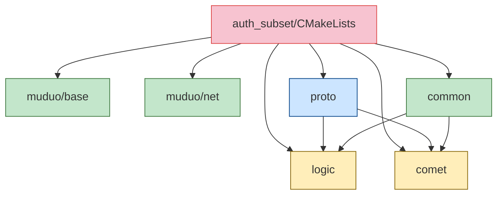

---

# 2. 顶层 CMake 组织

关键点：

- C++17：`set(CMAKE_CXX_STANDARD 17)`
- 头文件路径：`include_directories(${CMAKE_CURRENT_SOURCE_DIR}/third_party ${CMAKE_CURRENT_SOURCE_DIR})`
- 子目录顺序：
  - `add_subdirectory(muduo/base)`
  - `add_subdirectory(muduo/net)`
  - `add_subdirectory(common)`
  - `add_subdirectory(proto)`
  - `add_subdirectory(logic)`
  - `add_subdirectory(comet)`

---

# 3. Proto 构建链

## 3.1 gRPC 与 Protobuf 的发现策略

- `find_package(Protobuf REQUIRED)` 获取 `protoc` 与 `protobuf::libprotobuf`
- 优先 pkg-config：`pkg_check_modules(GRPC_PKG QUIET grpc++)`
- 若无 `.pc`，回退：`find_package(gRPC CONFIG REQUIRED)`

## 3.2 生成规则

- `PROTO_SRC` 仅含 `spark_push.proto`
- 生成目录：`${CMAKE_CURRENT_BINARY_DIR}/generated`
- `add_custom_command`：
  - `--cpp_out` 生成 `*.pb.cc/.pb.h`
  - `--grpc_out` 生成 `*.grpc.pb.cc/.grpc.pb.h`
  - `--plugin=protoc-gen-grpc=${GRPC_CPP_PLUGIN_EXECUTABLE}` 指定 gRPC 插件
- 链接分支：
  - pkg-config 存在：`protobuf::libprotobuf + ${GRPC_PKG_LIBRARIES}`
  - 否则：`protobuf::libprotobuf + gRPC::grpc++ gRPC::grpc`

Mermaid（proto 生成流程）：

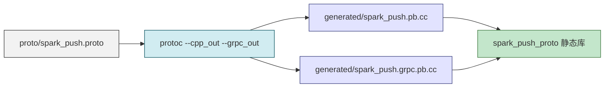

---

# 4. Common 组件

- 源码：`config.cpp`、`logging.cpp`、`mysql_pool.cpp`、`redis_pool.cpp`、`thread_pool.cpp`
- 链接：`Threads::Threads`、`mysqlclient`、`hiredis`、`muduo_base`
- 作用：为 logic/comet 提供配置读取、日志、数据库/缓存连接池

---

# 5. Logic 服务

## 5.1 HTTP 注册/登录（logic/http_server.cpp/.h）

- 路由表：`/api/login`、`/api/register`
- 管理员内置账号：
  - 账号 `admin`，MD5 哈希 `0192023a7bbd73250516f069df18b500`
  - 登录直接生成 token，`SetToken(token, admin_id, 24h)`
- 普通注册：
  - 解析 JSON `account/password/name`
  - `UserDao::CreateUser` 写 MySQL
  - 生成 token，`RedisStore::SetToken(token, uid, 24h)`
- 普通登录：
  - `UserDao::GetUserByAccount` 读 MySQL
  - 比较 `password_hash`（假设前端已 MD5）
  - 生成 token，存 Redis
- 响应统一 JSON：`code/message/data`，带 CORS 头

## 5.2 gRPC 鉴权（logic/grpc_service.cpp/.h）

- 只实现 `VerifyToken`：
  - 从 Redis 取 `token -> user_id`，失败返回 error code=401
  - 成功写入路由 `AddRoute(user_id, comet_id)`，返回 `user_id` 与 code=0

## 5.3 启动（logic/main.cpp）

- 初始化 MySQL/Redis 连接池，构造 `UserDao`、`RedisStore`
- 启动 gRPC：监听 `listen_addr:listen_port`，注册 `LogicServiceImpl`（仅 VerifyToken）
- 启动 HTTP：监听 `http_port`，注册 `HttpApiServer`
- gRPC 独立线程 `server->Wait()`，muduo `EventLoop` 运行 HTTP

Mermaid（注册/登录到 token 下发）：

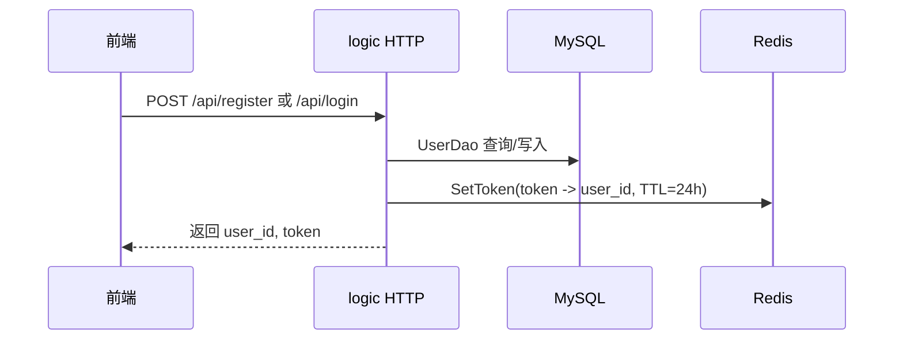

---

# 6. Comet 网关

## 6.1 WebSocket 握手与鉴权（comet_server.cpp/.h）

- 握手 URL 携带 `token`：`GET /ws?token=...`
- 调 logic gRPC `VerifyToken(token, comet_id)`：
  - 成功：绑定 `user_id`，回复 101 Switching Protocols，维护 `user_id -> connection` 映射
  - 失败：关闭连接
- 断开时清理 `user_conns_` 映射

## 6.2 工具（websocket_utils.*）

- `BuildWebSocketTextFrame`：构造 WebSocket 文本帧（服务端发送用）

## 6.3 启动（comet/main.cpp）

- 读 `conf/comet.conf`，初始化日志、配置、`CometServer`，设置线程数并 `Start()`

Mermaid（WS 握手鉴权链路）：

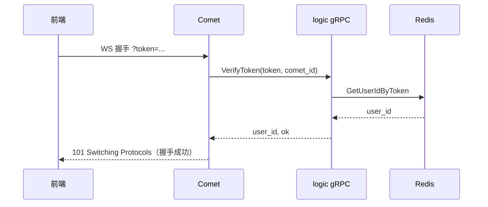

---

# 7. 配置与数据库

- `conf/logic.conf`：HTTP 端口、gRPC 端口、MySQL/Redis 主机/端口/密码/DB、池大小
- `conf/comet.conf`：WebSocket 监听端口、comet_id、logic gRPC 地址、线程数
- `sql/schema.sql`：user 表（`id`、`account`、`name`、`password_hash`、`created_at`）

---

# 8. 构建与运行步骤

## 8.1 安装依赖（Ubuntu/Debian）

```bash
sudo apt-get update
sudo apt-get install -y build-essential cmake libprotobuf-dev protobuf-compiler \
    libgrpc-dev libgrpc++-dev protobuf-compiler-grpc libssl-dev zlib1g-dev \
    libmysqlclient-dev libhiredis-dev
```

## 8.2 生成与编译

```bash
cd /home/alientek/spark_push/auth_subset
cmake -S . -B build
cmake --build build
```

可选参数：
- 指定 gRPC config：`-DgRPC_DIR=/usr/lib/x86_64-linux-gnu/cmake/grpc`
- pkg-config：确保 `grpc++` 的 `.pc` 在 `PKG_CONFIG_PATH`

## 8.3 初始化数据库

```bash
mysql -u root -p < sql/schema.sql
```

## 8.4 启动服务

**终端 1：启动 Logic**
```bash
cd /home/alientek/spark_push/auth_subset
./build/logic/logic_server -c conf/logic.conf
```

**终端 2：启动 Comet**
```bash
cd /home/alientek/spark_push/auth_subset
./build/comet/comet_server -c conf/comet.conf
```

## 8.5 验证

**注册用户：**
```bash
curl -X POST http://localhost:9002/api/register \
  -H "Content-Type: application/json" \
  -d '{"account":"test","password":"test123","name":"测试用户"}'
```

返回示例：
```json
{
  "code": 0,
  "message": "ok",
  "data": {
    "user_id": 1,
    "token": "tk-1-1701234567",
    "name": "测试用户"
  }
}
```

**登录：**
```bash
curl -X POST http://localhost:9002/api/login \
  -H "Content-Type: application/json" \
  -d '{"account":"test","password":"test123"}'
```

**WebSocket 连接测试：**
```bash
# 安装 websocat
sudo apt-get install websocat

# 连接 WebSocket（替换为实际 token）
websocat "ws://localhost:8000/ws?token=tk-1-1701234567"
```

成功时会看到：
- Comet 日志：`WebSocket handshake done, user_id=1`
- Logic 日志：`VerifyToken called with token: tk-1-1701234567`

---

# 9. 常见问题与排查

**Q：gRPC 未找到**
- 确认安装 `libgrpc-dev`/`libgrpc++-dev`
- 或用 `-DgRPC_DIR=...`
- 或确保 `grpc++` `.pc` 可见

**Q：找不到 `grpc_cpp_plugin`**
- 安装 `protobuf-compiler-grpc`

**Q：Redis/MySQL 连不通**
- 检查 `logic.conf` 地址/密码
- 确认服务已启动
- 在 build 目录启动时注意配置文件路径：`../conf/logic.conf`

**Q：密码校验**
- 演示版假设前端已做 MD5
- 真实环境需加盐、HTTPS

---

# 10. 详细实现原理

## 10.1 用户注册流程详解

### 10.1.1 整体流程

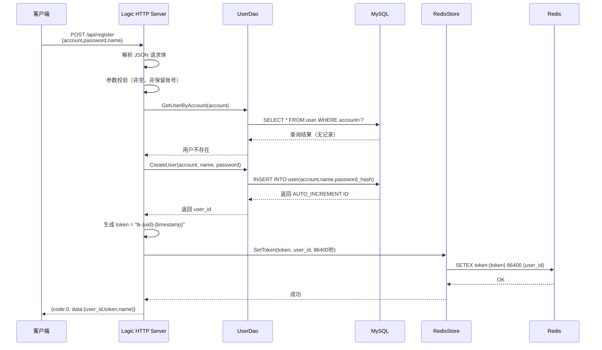

### 10.1.2 核心代码解析

**步骤 1：JSON 解析与参数验证**（`http_server.cpp`）
```cpp
// 解析请求体，提取 account、password、name 三个字段
bool ParseJsonRegister(const std::string& body, 
                       std::string* account,
                       std::string* password, 
                       std::string* name) {
    auto j = nlohmann::json::parse(body);
    *account = j["account"].get<std::string>();
    *password = j["password"].get<std::string>();
    // name 可选，默认使用 account
    if (j.contains("name") && j["name"].is_string()) {
        *name = j["name"].get<std::string>();
    } else {
        *name = *account;
    }
    return true;
}

// 拒绝保留账号 "admin"
if (account == kAdminAccount) {
    WriteJson(resp, 409, "admin account is reserved");
    return;
}
```

**步骤 2：账号重复性检查**
```cpp
User existing;
std::string err;
// 先查询是否已存在该账号
if (user_dao->GetUserByAccount(account, &existing, &err)) {
    // 账号已存在，返回 409 Conflict
    WriteJson(resp, 409, "account already exists");
    return;
}
```

**步骤 3：MySQL 写入**（`user_dao.cpp`）
使用 MySQL Prepared Statement 防止 SQL 注入：
```cpp
bool UserDao::CreateUser(const std::string& account, 
                         const std::string& name,
                         const std::string& password, 
                         int64_t* user_id,
                         std::string* err_msg) {
    // 从连接池获取连接（RAII 自动归还）
    auto guard = pool_->Acquire();
    MYSQL* conn = guard.get();
    
    // 预编译 SQL 语句
    const char* sql = 
        "INSERT INTO user(account, name, password_hash) VALUES(?, ?, ?)";
    MYSQL_STMT* stmt = mysql_stmt_init(conn);
    mysql_stmt_prepare(stmt, sql, strlen(sql));
    
    // 绑定参数（防止 SQL 注入）
    MYSQL_BIND bind[3];
    // ... 参数绑定代码 ...
    
    mysql_stmt_execute(stmt);
    
    // 获取自增 ID
    *user_id = static_cast<int64_t>(mysql_insert_id(conn));
    
    mysql_stmt_close(stmt);
    return true;
}
```

**步骤 4：Token 生成与存储**（`http_server.cpp`）
```cpp
// Token 格式：tk-{user_id}-{unix_timestamp}
// 示例：tk-100000000001-1701234567
std::string token = "tk-" + std::to_string(user_id) + 
                    "-" + std::to_string(::time(nullptr));

// 存入 Redis，TTL = 24 小时
redis_store->SetToken(token, user_id, 24 * 3600);
```

Redis 存储实现（`redis_store.cpp`）：
```cpp
bool RedisStore::SetToken(const std::string& token, 
                          int64_t user_id,
                          int ttl_seconds) {
    auto guard = pool_->Acquire();  // 从连接池获取
    redisContext* ctx = guard.get();
    
    // 使用 SETEX 命令：设置值并指定过期时间
    // Key 格式：token:{token_value}
    // Value：user_id（整数）
    redisReply* reply = (redisReply*)redisCommand(
        ctx, "SETEX token:%s %d %lld", 
        token.c_str(), ttl_seconds, (long long)user_id
    );
    
    bool ok = (reply->type != REDIS_REPLY_ERROR);
    freeReplyObject(reply);
    return ok;
}
```

### 10.1.3 关键设计点

1. **密码安全**（演示简化）
   - 当前实现：假设前端已做 MD5 哈希
   - 生产建议：使用 bcrypt/scrypt + 随机盐，后端强制 HTTPS

2. **事务处理**
   - MySQL 写入成功但 Redis 失败时，返回 500 错误
   - 实际生产可增加补偿机制（定时任务同步）

3. **并发控制**
   - MySQL UNIQUE 约束保证账号唯一性
   - 多实例同时注册相同账号时，只有一个成功

4. **连接池优势**
   - 避免频繁建立/断开 MySQL 和 Redis 连接
   - 通过 RAII（guard）自动归还连接到池中

---

## 10.2 用户登录流程详解

### 10.2.1 整体流程

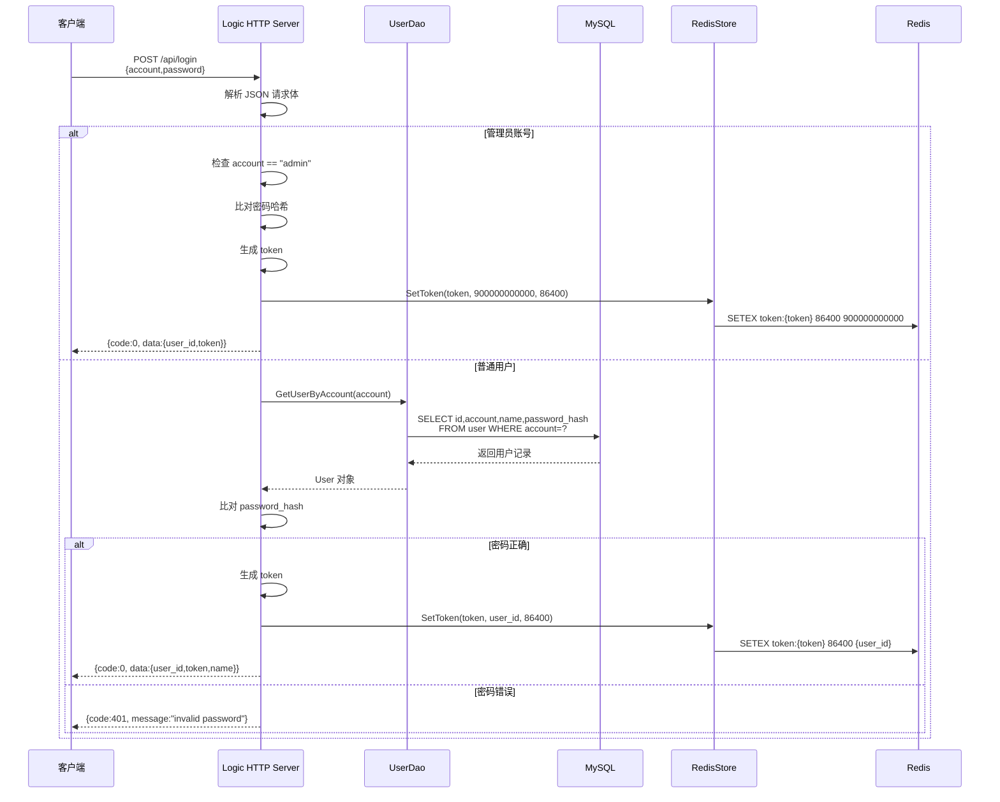

### 10.2.2 核心代码解析

**管理员账号特殊处理**（`http_server.cpp`）
```cpp
// 预设管理员账号（硬编码，仅用于演示）
const std::string kAdminAccount = "admin";
const std::string kAdminPasswordHash = 
    "0192023a7bbd73250516f069df18b500";  // MD5("admin123")
const int64_t kAdminUserId = 900000000000LL;

if (account == kAdminAccount) {
    // 直接比对密码哈希（不查数据库）
    if (password != kAdminPasswordHash) {
        WriteJson(resp, 401, "invalid password");
        return;
    }
    // 生成固定 user_id 的 token
    std::string token = "tk-" + std::to_string(kAdminUserId) + 
                        "-" + std::to_string(::time(nullptr));
    redis_store->SetToken(token, kAdminUserId, 24 * 3600);
    WriteJson(resp, 0, "ok", 
              "{\"user_id\":900000000000,\"token\":\"" + token + "\"}");
    return;
}
```

**普通用户登录**
```cpp
User user;
std::string err;
// 从 MySQL 查询用户记录
if (!user_dao->GetUserByAccount(account, &user, &err)) {
    WriteJson(resp, 404, "user not found, please register first");
    return;
}

// 比对密码哈希（假设前端已 MD5）
if (user.password_hash != password) {
    WriteJson(resp, 401, "invalid password");
    return;
}

// 生成新 token（每次登录生成新的）
std::string token = "tk-" + std::to_string(user.id) + 
                    "-" + std::to_string(::time(nullptr));

// 存入 Redis（覆盖旧 token）
redis_store->SetToken(token, user.id, 24 * 3600);
```

### 10.2.3 关键设计点

1. **Token 刷新策略**
   - 每次登录生成新 token（时间戳不同）
   - 旧 token 会因 TTL 过期自动失效
   - 前端需保存新 token 替换旧的

2. **管理员账号设计**
   - 不存储在数据库（硬编码）
   - 便于系统初始化和测试
   - 生产环境应存数据库并增加角色权限系统

3. **密码错误码区分**
   - 404：用户不存在（引导注册）
   - 401：密码错误

---

## 10.3 WebSocket 握手鉴权详解

### 10.3.1 整体流程

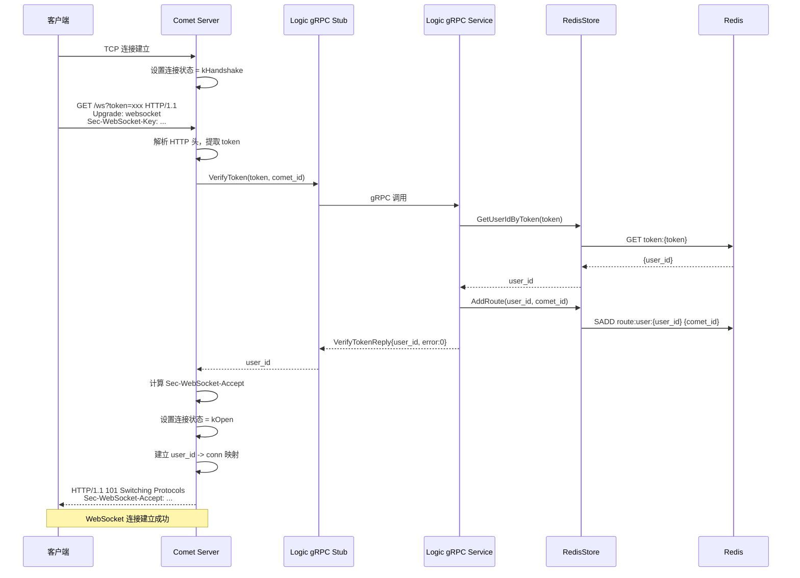

### 10.3.2 核心代码解析

**步骤 1：TCP 连接建立**（`comet_server.cpp`）
```cpp
void CometServer::OnConnection(const TcpConnectionPtr& conn) {
    if (conn->connected()) {
        // 初始化连接上下文
        ConnContext ctx;
        ctx.state = ConnContext::kHandshake;  // 握手状态
        ctx.user_id = 0;  // 未绑定用户
        conn->setContext(ctx);  // muduo 连接上下文
        
        LOG_INFO << "New TCP connection from " 
                 << conn->peerAddress().toIpPort();
    }
}
```

**步骤 2：解析 token**（`comet_server.cpp`）
```cpp
std::string CometServer::ParseTokenFromHandshake(const std::string& req) {
    // 从请求行提取 token：GET /ws?token=xxx HTTP/1.1
    auto pos = req.find("GET ");
    if (pos == std::string::npos) return {};
    pos += 4;
    
    auto end = req.find(' ', pos);  // 找到路径结束
    std::string path = req.substr(pos, end - pos);
    
    // 查找 query 参数
    auto qpos = path.find("token=");
    if (qpos == std::string::npos) return {};
    qpos += 6;
    
    std::string token = path.substr(qpos);
    // 截断 & 后的其他参数
    auto amp = token.find('&');
    if (amp != std::string::npos) 
        token = token.substr(0, amp);
    
    return token;
}
```

**步骤 3：gRPC 鉴权调用**（`comet_server.cpp`）
```cpp
// 创建 gRPC 请求
VerifyTokenRequest vreq;
vreq.set_token(token);
vreq.set_comet_id(comet_id_);  // 当前 comet 标识

VerifyTokenReply vrep;
grpc::ClientContext ctx_rpc;

// 同步调用 logic 服务的 VerifyToken
auto status = logic_stub_->VerifyToken(&ctx_rpc, vreq, &vrep);

// 检查结果
if (!status.ok() || vrep.error().code() != 0) {
    std::string msg = status.ok() ? vrep.error().message()
                                  : status.error_message();
    LOG_ERROR << "VerifyToken failed: " << msg;
    conn->shutdown();  // 鉴权失败，关闭连接
    return;
}

int64_t user_id = vrep.user_id();  // 获取用户 ID
```

**步骤 4：Logic 侧鉴权实现**（`grpc_service.cpp`）
```cpp
::grpc::Status LogicServiceImpl::VerifyToken(
    ::grpc::ServerContext*, 
    const ::sparkpush::VerifyTokenRequest* request,
    ::sparkpush::VerifyTokenReply* response) {
    
    LOG_INFO << "VerifyToken called with token: " << request->token()
             << ", comet_id: " << request->comet_id();
    
    // 从 Redis 查询 token
    int64_t uid = 0;
    if (!redis_store_->GetUserIdByToken(request->token(), &uid)) {
        SetError(response->mutable_error(), 401, 
                 "invalid or expired token");
        return ::grpc::Status::OK;  // 业务层错误，gRPC 成功
    }
    
    // 鉴权成功，返回 user_id
    response->set_user_id(uid);
    SetError(response->mutable_error(), 0, "ok");
    
    // 添加路由信息（user_id -> comet_id）
    redis_store_->AddRoute(uid, request->comet_id());
    
    return ::grpc::Status::OK;
}
```

**步骤 5：添加路由信息**（`redis_store.cpp`）
```cpp
bool RedisStore::AddRoute(int64_t user_id, const std::string& comet_id) {
    auto guard = pool_->Acquire();
    redisContext* ctx = guard.get();
    
    // 使用 Redis SET 存储用户在哪个 comet 上
    // Key: route:user:{user_id}
    // Value: SET {comet_id1, comet_id2, ...}
    redisReply* reply = (redisReply*)redisCommand(
        ctx, "SADD route:user:%lld %s", 
        (long long)user_id, comet_id.c_str()
    );
    
    bool ok = (reply->type != REDIS_REPLY_ERROR);
    freeReplyObject(reply);
    return ok;
}
```

**步骤 6：计算 WebSocket Accept**（`comet_server.cpp`）
```cpp
// 提取 Sec-WebSocket-Key 头
std::string ws_key;
if (!ExtractHeader(req, "Sec-WebSocket-Key", &ws_key)) {
    LOG_ERROR << "No Sec-WebSocket-Key";
    conn->shutdown();
    return;
}

// 按 RFC 6455 计算 Accept 值
std::string accept_val = ComputeWebSocketAccept(ws_key);

// 构造 101 响应
std::string resp =
    "HTTP/1.1 101 Switching Protocols\r\n"
    "Upgrade: websocket\r\n"
    "Connection: Upgrade\r\n"
    "Sec-WebSocket-Accept: " + accept_val + "\r\n\r\n";

conn->send(resp);
buf->retrieve(headerLen);  // 移除已处理的数据
```

WebSocket Accept 计算：
```cpp
std::string ComputeWebSocketAccept(const std::string& client_key) {
    // RFC 6455 规定的魔术字符串
    static const std::string kGuid = 
        "258EAFA5-E914-47DA-95CA-C5AB0DC85B11";
    
    // SHA1(client_key + GUID)，然后 Base64 编码
    auto digest = SHA1(client_key + kGuid);
    return Base64Encode(digest.data(), digest.size());
}
```

**步骤 7：建立连接映射**（`comet_server.cpp`）
```cpp
// 更新连接状态
ConnContext ctx = std::any_cast<ConnContext>(conn->getContext());
ctx.state = ConnContext::kOpen;  // 进入开放状态
ctx.user_id = user_id;  // 绑定用户 ID
conn->setContext(ctx);

// 维护 user_id -> connections 映射（一个用户可能多个连接）
{
    std::lock_guard<std::mutex> lock(conns_mu_);
    user_conns_[user_id].insert(conn);  // 添加到集合
}

LOG_INFO << "WebSocket handshake done, user_id=" << user_id;
```

### 10.3.3 连接状态机设计

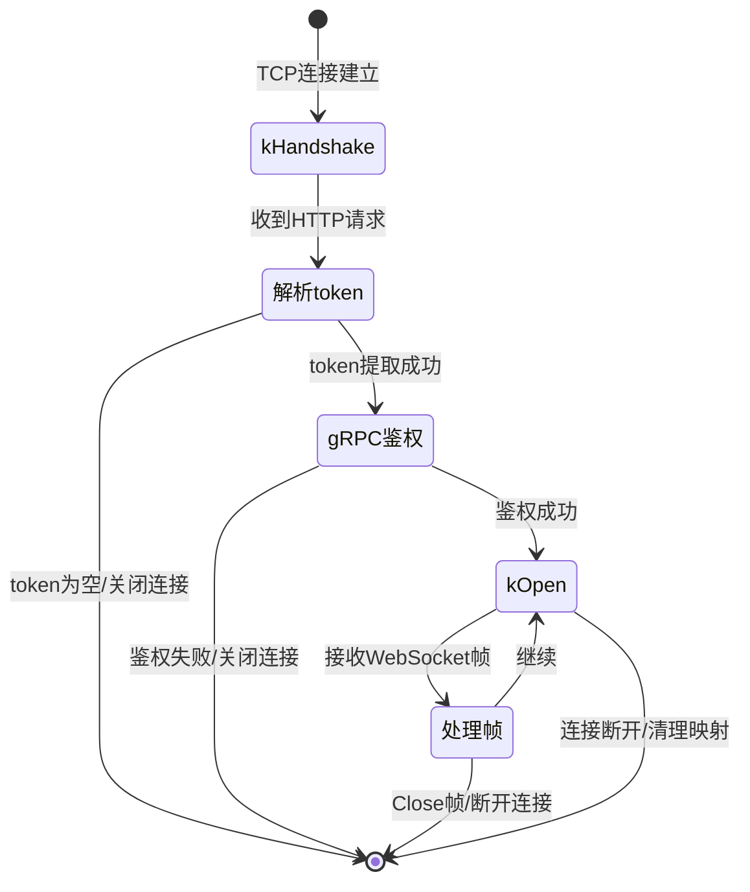

**状态定义**（`comet_server.h`）：
```cpp
struct ConnContext {
    enum State {
        kHandshake,  // 等待 HTTP 升级握手
        kOpen        // WebSocket 已建立
    };
    State state = kHandshake;
    int64_t user_id = 0;
};
```

### 10.3.4 关键设计点

1. **同步 gRPC 调用的影响**
   - 当前实现在 muduo IO 线程中同步调用 gRPC
   - 鉴权耗时会阻塞该线程处理其他连接
   - 改进方案：使用异步 gRPC 或独立线程池

2. **多设备支持**
   - `user_conns_` 使用 `map<int64_t, set<TcpConnectionPtr>>`
   - 同一用户可以有多个活跃连接（手机 + PC）

3. **路由信息用途**
   - Redis 中的 `route:user:{uid}` 记录用户在哪些 comet 上
   - 支持跨 comet 节点的消息分发（扩展功能）

4. **安全性考虑**
   - Token 通过 URL 参数传递（非 Header），可能被日志记录
   - 生产建议：使用 wss:// 加密传输

---

## 10.4 Token 机制设计原理

### 10.4.1 Token 结构

```
格式：tk-{user_id}-{unix_timestamp}
示例：tk-100000000001-1701234567

组成部分：
- 前缀：tk- （标识 token 类型）
- 用户 ID：唯一标识用户
- 时间戳：生成时间（秒级），用于区分不同登录会话
```

### 10.4.2 存储结构

```
Redis Key-Value 设计：
Key：token:{token_value}
Value：{user_id}  （整数）
TTL：86400 秒（24 小时）

示例：
token:tk-100000000001-1701234567 = "100000000001"
```

### 10.4.3 生命周期管理

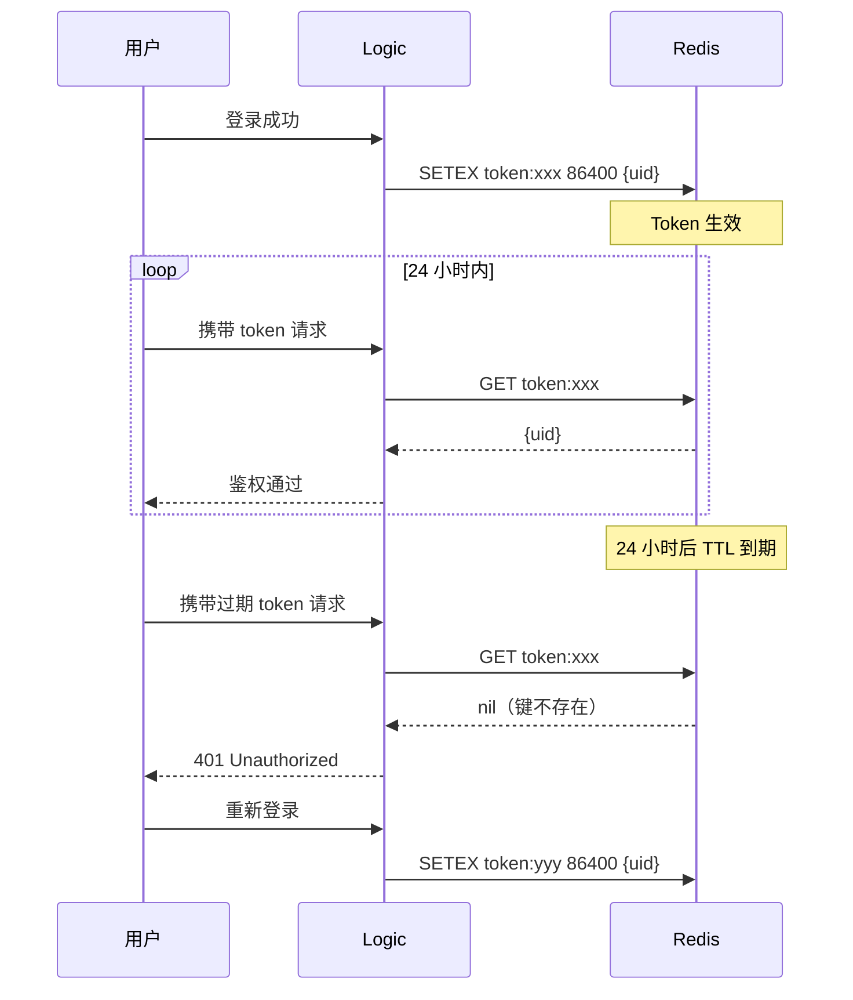

### 10.4.4 设计优势

1. **无状态性**
   - Token 本身包含 user_id，便于调试和日志追踪
   - Logic 服务可以水平扩展（共享 Redis）

2. **自动过期**
   - Redis TTL 自动清理过期 token
   - 无需额外的定时清理任务

3. **支持强制下线**
   - 删除 Redis 中的 token 即可立即失效
   - 支持"踢人"功能

---

## 10.5 用户路由管理设计

### 10.5.1 路由数据结构

```
Redis SET 结构：
Key: route:user:{user_id}
Value: SET {comet_id1, comet_id2, ...}

示例：
route:user:100000000001 = {"comet-01", "comet-02"}
```

**意义**：
- 记录用户当前连接在哪些 Comet 服务器上
- 支持多设备同时在线
- 扩展功能可根据路由进行消息分发

### 10.5.2 Redis 操作详细流程

**场景一：单用户单设备连接**

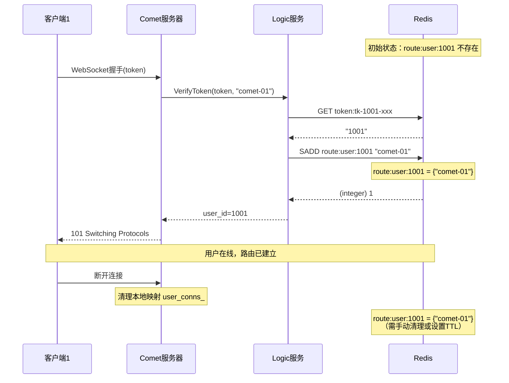

**场景二：单用户多设备连接**

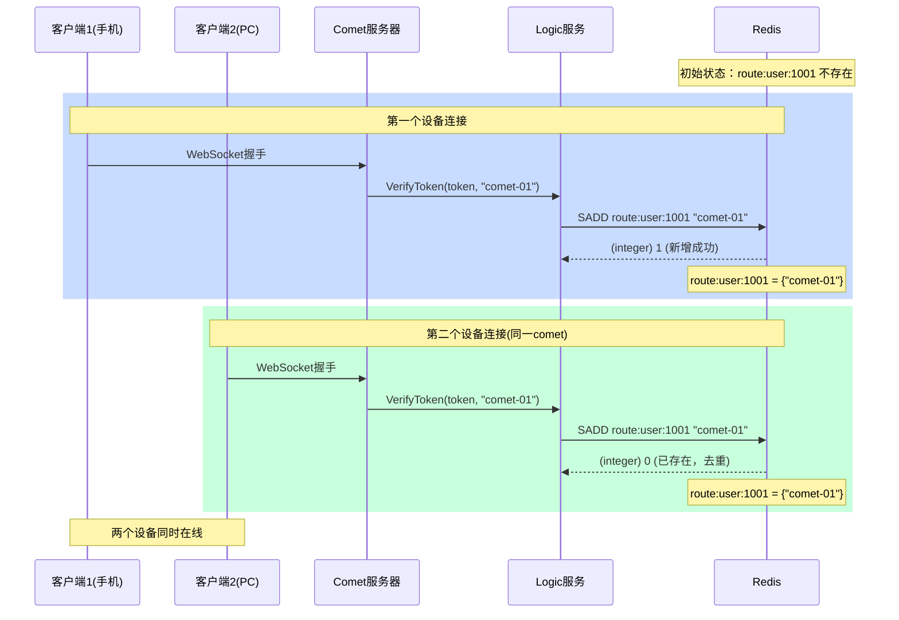

**场景三：多Comet节点分布式路由**

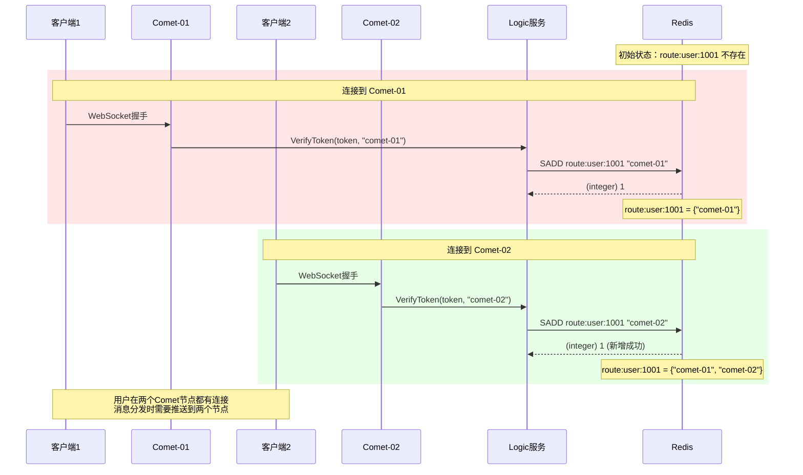

### 10.5.3 Redis 数据变化可视化

```
时间线：用户1001的路由变化

T0: 用户离线
    redis-cli> EXISTS route:user:1001
    (integer) 0

T1: 手机连接到 comet-01
    redis-cli> SADD route:user:1001 "comet-01"
    (integer) 1
    redis-cli> SMEMBERS route:user:1001
    1) "comet-01"

T2: PC连接到 comet-01（同一节点）
    redis-cli> SADD route:user:1001 "comet-01"
    (integer) 0    # SET自动去重，返回0表示未新增
    redis-cli> SMEMBERS route:user:1001
    1) "comet-01"

T3: 平板连接到 comet-02（不同节点）
    redis-cli> SADD route:user:1001 "comet-02"
    (integer) 1
    redis-cli> SMEMBERS route:user:1001
    1) "comet-01"
    2) "comet-02"
    redis-cli> SCARD route:user:1001
    (integer) 2    # 当前在2个comet节点上

T4: 手机+PC都断开（comet-01上无连接）
    redis-cli> SREM route:user:1001 "comet-01"
    (integer) 1
    redis-cli> SMEMBERS route:user:1001
    1) "comet-02"

T5: 平板也断开（所有连接断开）
    redis-cli> SREM route:user:1001 "comet-02"
    (integer) 1
    redis-cli> SMEMBERS route:user:1001
    (empty array)
    redis-cli> EXISTS route:user:1001
    (integer) 1    # 键仍存在但为空SET
    
    # 可选：删除空SET
    redis-cli> DEL route:user:1001
    (integer) 1
```

### 10.5.4 路由更新时机状态图

```
                    WebSocket握手成功
                           │
                           ▼
    ┌───────────────────────────────────────────────────┐
    │                                                   │
    │             [初始状态：用户离线]                   │
    │                                                   │
    └───────────────────────┬───────────────────────────┘
                           │
                           │ 握手鉴权成功
                           ▼
    ┌───────────────────────────────────────────────────┐
    │         建立连接 (Comet收到101响应)                │
    │                                                   │
    │    执行：SADD route:user:{uid} {comet_id}         │
    └───────────────────────┬───────────────────────────┘
                           │
                           │ Redis操作完成
                           ▼
    ┌───────────────────────────────────────────────────┐
    │                                                   │
    │              路由写入 (Redis更新)                  │◄─┐
    │                                                   │  │
    │     Redis: route:user:{uid} = {comet_id, ...}     │  │
    └───────────────────────┬───────────────────────────┘  │
                           │                              │
                           │ 用户上线                      │
                           ▼                              │
    ┌───────────────────────────────────────────────────┐  │
    │                                                   │  │
    │               在线状态 (用户活跃)                  │  │
    │                                                   │  │
    │  - 可接收消息                                     │  │
    │  - 可发送消息                                     │  │
    │  - 维持心跳                                       │  │
    │                                                   │  │
    └─────┬────────────────────────────────────┬────────┘  │
          │                                    │           │
          │ 其他连接断开                        │ 最后一个  │
          │ (SET仍保留其他元素)                 │ 连接断开   │
          └────────────────────────────────────┘           │
                                              │           │
                                              │ 需要多个   │
                                              │ 连接全断   │
                                              ▼           │
    ┌───────────────────────────────────────────────────┐  │
    │                                                   │  │
    │        路由删除 (清理Redis)                        │  │
    │                                                   │  │
    │    执行：SREM route:user:{uid} {comet_id}         │  │
    │    或：DEL route:user:{uid} (全部清空)             │  │
    │                                                   │  │
    └───────────────────────┬───────────────────────────┘  │
                           │                              │
                           │ 清理完成                      │
                           ▼                              │
    ┌───────────────────────────────────────────────────┐  │
    │                                                   │  │
    │          [最终状态：用户离线]                      │  │
    │                                                   │  │
    └───────────────────────────────────────────────────┘  │
                           │                              │
                           │ 用户重新连接                  │
                           └──────────────────────────────┘

状态说明：
├─ 初始状态：用户未建立任何WebSocket连接
├─ 建立连接：TCP连接成功，完成WebSocket握手
├─ 路由写入：调用Logic服务VerifyToken，写入Redis路由
├─ 在线状态：用户至少有一个活跃连接
├─ 路由删除：所有连接断开，清理Redis路由信息
└─ 最终状态：用户完全离线，可重新发起连接
```

**代码实现**（`comet_server.cpp`）：
```cpp
void CometServer::OnConnection(const TcpConnectionPtr& conn) {
    if (!conn->connected()) {
        // 连接断开：清理路由
        try {
            auto ctx = std::any_cast<ConnContext>(conn->getContext());
            if (ctx.user_id > 0) {
                std::lock_guard<std::mutex> lock(conns_mu_);
                auto it = user_conns_.find(ctx.user_id);
                if (it != user_conns_.end()) {
                    it->second.erase(conn);  // 移除该连接
                    
                    if (it->second.empty()) {
                        // 该用户所有连接都断开
                        user_conns_.erase(it);
                        // 可在此调用 RemoveRoute 或 NotifyUserOffline
                    }
                }
            }
        } catch (const std::bad_any_cast&) {}
    }
}
```

### 10.5.5 Redis 路由命令详解

**核心命令**：

```bash
# 1. 添加路由（用户连接到comet）
SADD route:user:{user_id} {comet_id}
# 返回值：1表示新增成功，0表示已存在（去重）

# 2. 查询用户在哪些comet上
SMEMBERS route:user:{user_id}
# 返回值：comet_id列表

# 3. 检查用户是否在某个comet上
SISMEMBER route:user:{user_id} {comet_id}
# 返回值：1存在，0不存在

# 4. 获取用户连接的comet数量
SCARD route:user:{user_id}
# 返回值：整数

# 5. 移除路由（用户从某comet断开）
SREM route:user:{user_id} {comet_id}
# 返回值：1删除成功，0不存在

# 6. 删除用户所有路由（强制下线）
DEL route:user:{user_id}
# 返回值：1删除成功，0键不存在
```

### 10.5.6 手动测试流程

**准备工作**：
```bash
# 1. 连接到Redis
redis-cli

# 2. 切换到项目使用的数据库（默认db 0）
SELECT 0

# 3. 清空测试数据（可选）
FLUSHDB
```

**测试场景一：模拟单设备连接**

```bash
# 步骤1：启动Logic和Comet服务
# 终端1
cd /home/alientek/0voice/spark_push/02_auth_subset
./build/logic/logic_server -c conf/logic.conf

# 终端2
./build/comet/comet_server -c conf/comet.conf

# 步骤2：注册并登录获取token
curl -X POST http://localhost:9002/api/register \
  -H "Content-Type: application/json" \
  -d '{"account":"testuser","password":"test123","name":"测试用户"}'

# 假设返回：{"code":0,"data":{"user_id":100000000001,"token":"tk-100000000001-1701234567"}}

# 步骤3：Redis中查看初始状态
redis-cli
127.0.0.1:6379> EXISTS route:user:100000000001
(integer) 0    # 用户未连接

127.0.0.1:6379> SMEMBERS route:user:100000000001
(empty array)

# 步骤4：建立WebSocket连接
# 新终端
websocat "ws://localhost:8000/ws?token=tk-100000000001-1701234567"

# 步骤5：Redis中查看路由建立
127.0.0.1:6379> EXISTS route:user:100000000001
(integer) 1    # 键已存在

127.0.0.1:6379> SMEMBERS route:user:100000000001
1) "comet-01"  # 假设comet.conf中comet_id=comet-01

127.0.0.1:6379> SCARD route:user:100000000001
(integer) 1    # 1个comet节点

127.0.0.1:6379> SISMEMBER route:user:100000000001 "comet-01"
(integer) 1    # 确认在comet-01上

# 步骤6：断开WebSocket连接（Ctrl+C断开websocat）

# 步骤7：查看路由清理（当前实现可能未自动清理）
127.0.0.1:6379> SMEMBERS route:user:100000000001
1) "comet-01"  # 仍存在（需扩展代码实现自动清理）

# 手动清理
127.0.0.1:6379> SREM route:user:100000000001 "comet-01"
(integer) 1

127.0.0.1:6379> SMEMBERS route:user:100000000001
(empty array)
```

**测试场景二：模拟多设备连接**

```bash
# 步骤1：第一个设备连接
# 终端A
websocat "ws://localhost:8000/ws?token=tk-100000000001-1701234567"

# Redis查看
127.0.0.1:6379> SMEMBERS route:user:100000000001
1) "comet-01"

# 步骤2：第二个设备连接（同一token，同一comet）
# 终端B
websocat "ws://localhost:8000/ws?token=tk-100000000001-1701234567"

# Redis查看（SET去重，仍然只有一个comet-01）
127.0.0.1:6379> SMEMBERS route:user:100000000001
1) "comet-01"

127.0.0.1:6379> SCARD route:user:100000000001
(integer) 1    # 仍然是1，因为是同一个comet

# 步骤3：模拟连接到不同comet节点
# 手动添加另一个comet（模拟分布式场景）
127.0.0.1:6379> SADD route:user:100000000001 "comet-02"
(integer) 1

127.0.0.1:6379> SMEMBERS route:user:100000000001
1) "comet-01"
2) "comet-02"

127.0.0.1:6379> SCARD route:user:100000000001
(integer) 2    # 现在在2个节点上
```

**测试场景三：批量查询与管理**

```bash
# 1. 模拟多个用户在线
127.0.0.1:6379> SADD route:user:100000000001 "comet-01"
127.0.0.1:6379> SADD route:user:100000000002 "comet-01"
127.0.0.1:6379> SADD route:user:100000000002 "comet-02"
127.0.0.1:6379> SADD route:user:100000000003 "comet-02"

# 2. 查找所有路由键
127.0.0.1:6379> KEYS route:user:*
1) "route:user:100000000001"
2) "route:user:100000000002"
3) "route:user:100000000003"

# 3. 查询特定comet上有哪些用户（需遍历，复杂度高）
# 方式1：通过KEYS遍历（仅开发环境使用）
127.0.0.1:6379> KEYS route:user:*
# 对每个键执行 SISMEMBER route:user:{uid} "comet-01"

# 方式2：反向索引（需额外维护）
# SADD comet:comet-01:users 100000000001
# SADD comet:comet-01:users 100000000002

# 4. 强制某个用户下线（删除所有路由）
127.0.0.1:6379> DEL route:user:100000000001
(integer) 1

# 5. 某个comet节点下线，清理所有相关路由
# 需要遍历所有用户路由（生产环境应通过Lua脚本批量处理）
127.0.0.1:6379> SREM route:user:100000000002 "comet-01"
127.0.0.1:6379> SREM route:user:100000000002 "comet-01"
```

**测试场景四：监控路由变化**

```bash
# 1. 开启Redis监控（新终端）
redis-cli MONITOR

# 2. 在另一终端建立WebSocket连接
websocat "ws://localhost:8000/ws?token=xxx"

# 3. MONITOR输出示例：
# 1701234567.123456 [0 127.0.0.1:50123] "GET" "token:tk-100000000001-1701234567"
# 1701234567.234567 [0 127.0.0.1:50123] "SADD" "route:user:100000000001" "comet-01"

# 4. 使用SLOWLOG查看慢查询（可选）
127.0.0.1:6379> SLOWLOG GET 10
```

### 10.5.7 性能测试与优化建议

**测试工具**：
```bash
# 1. 使用redis-benchmark测试SET操作性能
redis-benchmark -t sadd -n 100000 -d 10

# 2. 测试路由查询性能
redis-benchmark -t smembers -n 100000

# 3. 查看Redis内存使用
127.0.0.1:6379> INFO memory
127.0.0.1:6379> MEMORY USAGE route:user:100000000001
```

**优化建议**：

1. **设置TTL防止僵尸路由**：
```bash
# 当前实现未设置TTL，可改进：
SADD route:user:100000000001 "comet-01"
EXPIRE route:user:100000000001 86400  # 24小时过期
```

2. **使用管道（Pipeline）批量操作**：
```cpp
// C++代码中使用hiredis pipeline
redisAppendCommand(ctx, "SADD route:user:%lld %s", uid, comet_id);
redisAppendCommand(ctx, "EXPIRE route:user:%lld %d", uid, ttl);
redisGetReply(ctx, (void**)&reply1);
redisGetReply(ctx, (void**)&reply2);
```

3. **反向索引加速查询**：
```bash
# 维护comet -> users的反向映射
SADD comet:comet-01:users {user_id}
# 查询comet-01上的所有用户
SMEMBERS comet:comet-01:users
```

### 10.5.8 关键设计点

1. **SET 数据结构优势**
   - 自动去重：同一 comet 重复添加不会产生多余元素
   - 成员操作：SADD/SREM 原子性保证
   - 遍历方便：SMEMBERS 获取所有路由

2. **分布式一致性**
   - Redis 作为单一事实来源（Single Source of Truth）
   - Comet 本地映射（user_conns_）仅用于快速查找连接对象

3. **路由清理策略**
   - 当前实现：连接断开时清理本地映射，Redis路由需手动维护
   - 建议改进：增加TTL或在OnConnection断开时调用SREM

---

## 10.6 路由故障恢复机制（解决 Comet 崩溃问题）

### 10.6.1 问题分析

**核心问题**：当 Comet 服务崩溃时，来不及执行 `SREM` 清理 Redis 路由，导致"僵尸路由"。

```
场景示例：
1. 用户连接到 comet-01
   Redis: route:user:1001 = {"comet-01"}

2. comet-01 进程崩溃（kill -9 或 OOM）
   - 无法执行正常的断开连接回调
   - 无法调用 SREM 清理路由

3. Redis 中仍保留：route:user:1001 = {"comet-01"}
   - 用户实际已离线
   - 其他服务尝试推送消息到 comet-01 会失败

4. 用户重新连接到 comet-02
   Redis: route:user:1001 = {"comet-01", "comet-02"}
   - comet-01 是"僵尸路由"
   - 消息推送会浪费资源，甚至丢失消息
```

**影响范围**：
- 消息推送失败率上升
- 资源浪费（尝试连接不存在的节点）
- 用户状态不准确（误判在线）
- 运维成本增加（需手动清理）

### 10.6.2 解决方案一：心跳 + TTL 机制（推荐）

**设计思路**：为每个路由设置 TTL，Comet 定期刷新，崩溃后自动过期。

```
Redis 数据结构改进：
Key: route:user:{user_id}:{comet_id}
Value: {timestamp}
TTL: 30秒

心跳策略：
- Comet 每 10 秒刷新一次 TTL
- 崩溃后最多 30 秒自动清理
```

**实现架构图**：

```
┌─────────────────────────────────────────────────────────┐
│                   Comet 服务器                           │
│                                                         │
│  ┌──────────────────────────────────────────────────┐  │
│  │  用户连接管理 (user_conns_)                       │  │
│  │  user_id -> set<TcpConnectionPtr>                │  │
│  └────────────────────┬─────────────────────────────┘  │
│                       │                                 │
│  ┌────────────────────▼─────────────────────────────┐  │
│  │  心跳守护线程 (HeartbeatDaemon)                   │  │
│  │                                                   │  │
│  │  while (running) {                               │  │
│  │    for (user_id in user_conns_) {                │  │
│  │      RefreshRoute(user_id, comet_id, TTL=30s)    │  │
│  │    }                                             │  │
│  │    sleep(10s)                                    │  │
│  │  }                                               │  │
│  └────────────────────┬─────────────────────────────┘  │
│                       │                                 │
└───────────────────────┼─────────────────────────────────┘
                        │
                        │ SETEX route:user:{uid}:{cid} 30 {ts}
                        ▼
┌─────────────────────────────────────────────────────────┐
│                      Redis                              │
│                                                         │
│  route:user:1001:comet-01 = "1701234567" (TTL: 30s)    │
│  route:user:1002:comet-01 = "1701234568" (TTL: 30s)    │
│  route:user:1003:comet-02 = "1701234569" (TTL: 30s)    │
│                                                         │
│  [Comet崩溃后30秒，这些键自动过期删除]                   │
└─────────────────────────────────────────────────────────┘
```

**代码实现示例**（`comet_server.cpp`）：

```cpp
// comet_server.h 添加成员
class CometServer {
private:
    std::thread heartbeat_thread_;
    std::atomic<bool> running_{false};
    
    void HeartbeatLoop();  // 心跳线程
    void RefreshAllRoutes();  // 刷新所有用户路由
};

// comet_server.cpp 实现
void CometServer::Start() {
    // ... 原有启动代码 ...
    
    // 启动心跳线程
    running_ = true;
    heartbeat_thread_ = std::thread([this]() {
        HeartbeatLoop();
    });
}

void CometServer::Stop() {
    running_ = false;
    if (heartbeat_thread_.joinable()) {
        heartbeat_thread_.join();
    }
    // ... 原有停止代码 ...
}

void CometServer::HeartbeatLoop() {
    while (running_) {
        RefreshAllRoutes();
        std::this_thread::sleep_for(std::chrono::seconds(10));
    }
}

void CometServer::RefreshAllRoutes() {
    std::lock_guard<std::mutex> lock(conns_mu_);
    
    auto guard = redis_pool_->Acquire();
    redisContext* ctx = guard.get();
    
    for (const auto& [user_id, conn_set] : user_conns_) {
        if (!conn_set.empty()) {
            // 刷新该用户的路由 TTL
            std::string key = "route:user:" + std::to_string(user_id) 
                            + ":" + comet_id_;
            std::string value = std::to_string(::time(nullptr));
            
            redisReply* reply = (redisReply*)redisCommand(
                ctx, "SETEX %s 30 %s", key.c_str(), value.c_str()
            );
            
            if (reply) {
                if (reply->type == REDIS_REPLY_ERROR) {
                    LOG_ERROR << "Failed to refresh route for user " 
                              << user_id << ": " << reply->str;
                }
                freeReplyObject(reply);
            }
        }
    }
    
    LOG_DEBUG << "Refreshed routes for " << user_conns_.size() << " users";
}
```

**Redis 操作变化对比**：

```bash
# 旧方案：SET 结构，无 TTL
SADD route:user:1001 "comet-01"
# 问题：崩溃后永久残留

# 新方案：独立键 + TTL
SETEX route:user:1001:comet-01 30 "1701234567"
# 优势：30秒后自动清理

# 查询用户在哪些 comet 上（需要改为 SCAN）
SCAN 0 MATCH route:user:1001:*
# 返回：route:user:1001:comet-01, route:user:1001:comet-02
```

**测试验证**：

```bash
# 1. 启动 Comet，建立连接
websocat "ws://localhost:8000/ws?token=xxx"

# 2. 观察 Redis 中的路由（带 TTL）
redis-cli
127.0.0.1:6379> KEYS route:user:*
1) "route:user:100000000001:comet-01"

127.0.0.1:6379> TTL route:user:100000000001:comet-01
(integer) 28  # 还剩 28 秒

# 3. 等待 10 秒，TTL 自动刷新
127.0.0.1:6379> TTL route:user:100000000001:comet-01
(integer) 30  # 刷新回 30 秒

# 4. 模拟 Comet 崩溃（kill -9）
kill -9 $(pgrep comet_server)

# 5. 观察 Redis，30 秒后路由自动消失
127.0.0.1:6379> TTL route:user:100000000001:comet-01
(integer) 15  # 倒计时
... 等待 15 秒 ...
127.0.0.1:6379> EXISTS route:user:100000000001:comet-01
(integer) 0  # 已自动清理
```

### 10.6.3 解决方案二：定期清理任务

**适用场景**：无法修改 Comet 代码时的运维方案。

```bash
#!/bin/bash
# route_cleaner.sh - 定期清理僵尸路由

REDIS_CLI="redis-cli"
COMET_HEALTH_API="http://{comet_host}:{port}/health"

while true; do
    # 1. 获取所有路由键
    routes=$($REDIS_CLI KEYS "route:user:*")
    
    for route in $routes; do
        # 提取 comet_id（假设格式：route:user:1001:comet-01）
        comet_id=$(echo $route | awk -F: '{print $NF}')
        
        # 2. 健康检查
        if ! curl -sf "${COMET_HEALTH_API/\{comet_host\}/$comet_id}" > /dev/null; then
            echo "Comet $comet_id is down, cleaning routes..."
            
            # 3. 删除该 comet 的所有路由
            $REDIS_CLI KEYS "route:user:*:$comet_id" | xargs $REDIS_CLI DEL
        fi
    done
    
    sleep 60  # 每分钟检查一次
done
```

**部署方式**：

```bash
# 作为 systemd 服务运行
sudo tee /etc/systemd/system/route-cleaner.service <<EOF
[Unit]
Description=Spark Push Route Cleaner
After=redis.service

[Service]
Type=simple
ExecStart=/usr/local/bin/route_cleaner.sh
Restart=always

[Install]
WantedBy=multi-user.target
EOF

sudo systemctl enable route-cleaner
sudo systemctl start route-cleaner
```

### 10.6.4 解决方案三：启动时路由重建

**设计思路**：Comet 启动时清理自己的历史路由。

```cpp
// comet_server.cpp
void CometServer::Start() {
    // 1. 清理本 comet 的历史路由（防止重启后的僵尸路由）
    CleanupMyRoutes();
    
    // 2. 启动服务
    server_.start();
}

void CometServer::CleanupMyRoutes() {
    auto guard = redis_pool_->Acquire();
    redisContext* ctx = guard.get();
    
    // 使用 Lua 脚本批量删除
    const char* lua_script = R"(
        local keys = redis.call('KEYS', ARGV[1])
        for i=1,#keys do
            redis.call('DEL', keys[i])
        end
        return #keys
    )";
    
    std::string pattern = "route:user:*:" + comet_id_;
    redisReply* reply = (redisReply*)redisCommand(
        ctx, "EVAL %s 0 %s", lua_script, pattern.c_str()
    );
    
    if (reply && reply->type == REDIS_REPLY_INTEGER) {
        LOG_INFO << "Cleaned up " << reply->integer 
                 << " old routes for " << comet_id_;
    }
    
    if (reply) freeReplyObject(reply);
}
```

**测试流程**：

```bash
# 1. Comet 正常运行时
redis-cli KEYS route:user:*:comet-01
1) "route:user:1001:comet-01"
2) "route:user:1002:comet-01"

# 2. 模拟崩溃（僵尸路由残留）
kill -9 $(pgrep comet_server)

redis-cli KEYS route:user:*:comet-01
1) "route:user:1001:comet-01"  # 仍然存在
2) "route:user:1002:comet-01"

# 3. 重新启动 Comet
./build/comet/comet_server -c conf/comet.conf
# 日志输出：Cleaned up 2 old routes for comet-01

# 4. 验证清理结果
redis-cli KEYS route:user:*:comet-01
(empty array)  # 已清理
```

### 10.6.5 解决方案四：健康检查 + 路由验证

**设计思路**：消息推送前验证路由有效性。

```cpp
// 推送消息前验证路由
bool MessageDispatcher::PushToUser(int64_t user_id, const std::string& msg) {
    // 1. 从 Redis 获取路由
    auto comet_ids = GetUserRoutes(user_id);
    
    for (const auto& comet_id : comet_ids) {
        // 2. 健康检查（可缓存结果）
        if (!IsCometHealthy(comet_id)) {
            LOG_WARN << "Comet " << comet_id << " is unhealthy, removing route";
            RemoveRoute(user_id, comet_id);
            continue;
        }
        
        // 3. 尝试推送
        if (PushToComet(comet_id, user_id, msg)) {
            return true;  // 成功
        } else {
            // 推送失败，可能是僵尸路由，立即清理
            LOG_ERROR << "Failed to push to " << comet_id << ", removing route";
            RemoveRoute(user_id, comet_id);
        }
    }
    
    return false;  // 所有路由都失败
}

bool MessageDispatcher::IsCometHealthy(const std::string& comet_id) {
    // 实现方式1：HTTP 健康检查
    // curl http://comet-01:8000/health
    
    // 实现方式2：从注册中心查询
    // consul.Health().Service(comet_id)
    
    // 实现方式3：尝试连接
    // TcpClient::Connect(comet_host, comet_port, timeout=1s)
}
```

### 10.6.6 方案对比与选择建议

| 方案 | 优点 | 缺点 | 适用场景 |
|------|------|------|----------|
| **心跳+TTL** | • 自动清理<br>• 无额外服务<br>• 实时性好 | • 需修改代码<br>• 心跳开销 | **生产环境首选** |
| **定期清理任务** | • 无需改代码<br>• 集中管理 | • 有延迟<br>• 需健康检查 | 快速修复现有系统 |
| **启动时重建** | • 实现简单 | • 只在重启时清理<br>• 崩溃期间路由仍残留 | 辅助方案 |
| **推送时验证** | • 精确<br>• 按需清理 | • 增加推送延迟<br>• 代码复杂 | 配合其他方案 |

**综合方案（推荐）**：

```
┌─────────────────────────────────────────────────────┐
│              多层路由容错机制                        │
├─────────────────────────────────────────────────────┤
│                                                     │
│  第1层：心跳+TTL（主动防御）                         │
│  ├─ Comet 每10秒刷新路由                            │
│  └─ 崩溃后30秒自动过期                              │
│                                                     │
│  第2层：启动时清理（启动防御）                       │
│  ├─ Comet 启动删除自己的历史路由                    │
│  └─ 防止重启后的僵尸路由                            │
│                                                     │
│  第3层：推送时验证（被动防御）                       │
│  ├─ 推送失败立即删除路由                            │
│  └─ 兜底保护机制                                   │
│                                                     │
│  第4层：监控告警（发现问题）                         │
│  ├─ 统计僵尸路由数量                                │
│  └─ 阈值告警                                       │
│                                                     │
└─────────────────────────────────────────────────────┘
```

### 10.6.7 监控指标

**关键指标采集**：

```cpp
// metrics.h
struct RouteMetrics {
    std::atomic<int64_t> zombie_route_count{0};     // 僵尸路由数量
    std::atomic<int64_t> heartbeat_failure_count{0}; // 心跳失败次数
    std::atomic<int64_t> route_cleanup_count{0};     // 清理路由次数
};

// 定期上报到监控系统（Prometheus）
```

**监控查询**：

```bash
# Prometheus 查询
# 1. 僵尸路由率
sum(zombie_routes) / sum(total_routes) > 0.1  # 超过10%告警

# 2. 心跳失败率
rate(heartbeat_failures[5m]) > 10  # 5分钟内超过10次

# 3. Comet 崩溃检测
up{job="comet"} == 0  # 服务下线
```

### 10.6.8 完整测试步骤

```bash
# ========== 测试心跳+TTL机制 ==========

# 1. 修改代码，添加心跳功能（参考 10.6.2）
# 2. 重新编译
cd /home/alientek/0voice/spark_push/02_auth_subset
cmake --build build

# 3. 启动服务
./build/logic/logic_server -c conf/logic.conf &
./build/comet/comet_server -c conf/comet.conf &

# 4. 建立连接
TOKEN=$(curl -s -X POST http://localhost:9002/api/register \
  -H "Content-Type: application/json" \
  -d '{"account":"test123","password":"test123"}' \
  | jq -r '.data.token')

websocat "ws://localhost:8000/ws?token=$TOKEN" &
WS_PID=$!

# 5. 观察 Redis（有 TTL）
redis-cli
127.0.0.1:6379> KEYS route:user:*
1) "route:user:100000000001:comet-01"

127.0.0.1:6379> TTL route:user:100000000001:comet-01
(integer) 30

# 6. 等待10秒，观察 TTL 刷新
sleep 10
127.0.0.1:6379> TTL route:user:100000000001:comet-01
(integer) 30  # 刷新成功

# 7. 模拟崩溃
kill -9 $(pgrep comet_server)

# 8. 观察自动清理
watch -n 1 'redis-cli TTL route:user:100000000001:comet-01'
# 30 -> 29 -> 28 -> ... -> -2 (键已删除)

# 9. 验证清理完成
redis-cli EXISTS route:user:100000000001:comet-01
(integer) 0  # ✅ 自动清理成功

# ========== 测试启动时清理 ==========

# 1. 手动制造僵尸路由
redis-cli SETEX route:user:99999:comet-01 300 "1701234567"

# 2. 启动 Comet
./build/comet/comet_server -c conf/comet.conf
# 日志：Cleaned up 1 old routes for comet-01

# 3. 验证清理
redis-cli EXISTS route:user:99999:comet-01
(integer) 0  # ✅ 启动时已清理
```

---

---

## 10.7 数据库表设计详解

### 10.7.1 用户表（user）

```sql
CREATE TABLE IF NOT EXISTS `user` (
  `id` BIGINT NOT NULL AUTO_INCREMENT,
  `account` VARCHAR(64) NOT NULL UNIQUE,
  `name` VARCHAR(64) NOT NULL DEFAULT '',
  `password_hash` VARCHAR(128) NOT NULL,
  `created_at` TIMESTAMP NOT NULL DEFAULT CURRENT_TIMESTAMP,
  PRIMARY KEY (`id`),
  UNIQUE KEY `uk_account` (`account`)
) ENGINE=InnoDB DEFAULT CHARSET=utf8mb4;
```

**字段说明**：
- `id`：用户唯一标识（自增 ID）
- `account`：登录账号（唯一索引保证不重复）
- `name`：显示名称
- `password_hash`：密码哈希（当前简化为 MD5，生产应使用 bcrypt）
- `created_at`：注册时间

**索引设计**：
- 主键索引：`id`（聚簇索引，范围查询高效）
- 唯一索引：`account`（登录查询，防止重复注册）

**查询场景**：
1. 注册检查：`SELECT * FROM user WHERE account = ?`
2. 登录验证：`SELECT id, password_hash FROM user WHERE account = ?`
3. 用户信息：`SELECT * FROM user WHERE id = ?`

---

## 10.8 配置管理设计

### 10.8.1 配置文件格式

**logic.conf 示例**：
```ini
# HTTP 服务配置
http_port=9002

# gRPC 服务配置
listen_addr=0.0.0.0
listen_port=9001

# MySQL 配置
mysql_host=127.0.0.1
mysql_port=3306
mysql_user=root
mysql_password=your_password
mysql_db=spark_push
mysql_pool_size=10

# Redis 配置
redis_host=127.0.0.1
redis_port=6379
redis_password=
redis_db=0
redis_pool_size=10
```

**comet.conf 示例**：
```ini
# WebSocket 监听端口
listen_port=8000

# Comet 标识（用于路由）
comet_id=comet-01

# Logic gRPC 地址
logic_grpc_target=127.0.0.1:9001

# Worker 线程数（muduo EventLoop 线程池）
thread_num=4
```

### 10.8.2 配置加载实现（`common/config.cpp`）

```cpp
Config LoadConfig(const std::string& path) {
    Config cfg;
    
    std::ifstream ifs(path);
    if (!ifs) {
        LOG_ERROR << "Failed to open config file: " << path;
        return cfg;
    }
    
    std::string line;
    while (std::getline(ifs, line)) {
        // 跳过注释和空行
        line = Trim(line);
        if (line.empty() || line[0] == '#') continue;
        
        // 解析 key=value
        auto pos = line.find('=');
        if (pos == std::string::npos) continue;
        
        std::string key = Trim(line.substr(0, pos));
        std::string value = Trim(line.substr(pos + 1));
        
        // 根据 key 设置对应字段
        if (key == "http_port") {
            cfg.http_port = std::stoi(value);
        } else if (key == "mysql_host") {
            cfg.mysql_host = value;
        }
        // ... 其他字段
    }
    
    return cfg;
}
```

---

# 11. 实验任务设计

## 任务 1：注册登录流程

**目标**：理解 HTTP API + MySQL + Redis 交互

**步骤**：
1. 用 curl 注册新账号
2. 查看 MySQL 中的 user 表记录
3. 查看 Redis 中的 token 键
4. 修改 token TTL，观察过期行为

## 任务 2：WebSocket 鉴权

**目标**：理解 Comet 与 Logic 的 gRPC 通信

**步骤**：
1. 启动 Logic 和 Comet 服务
2. 用浏览器 console 建立 WebSocket 连接
3. 查看 Comet 日志中的 VerifyToken 调用
4. 尝试使用错误 token，观察连接被拒绝

## 任务 3：多设备场景模拟

**目标**：理解用户路由管理

**步骤**：
1. 用两个浏览器标签页同时登录同一账号
2. 查看 Redis 中的 route:user:{uid} 集合
3. 断开一个标签页，观察路由变化
4. 分析 Comet 日志中的 user_conns_ 映射

---

# 12. 常见问题解答

**Q1：为什么 token 使用时间戳而不是随机数？**
```
A：当前设计便于调试（可读性高），生产环境建议：
- 使用 UUID 或加密随机数
- 或者使用 JWT（包含签名和过期时间）
```

**Q2：如何支持"踢人"功能？**
```
A：实现方式：
1. 删除 Redis 中的 token（立即失效）
2. 主动关闭 WebSocket 连接（扩展功能）
```

**Q3：密码如何加密存储？**
```
A：当前演示版使用 MD5（前端处理）
生产环境建议：
1. 使用 bcrypt 或 scrypt
2. 添加随机盐值
3. 后端强制 HTTPS
```

**Q4：如何实现 token 刷新？**
```
A：双 Token 设计：
- Access Token：短期有效（1 小时）
- Refresh Token：长期有效（30 天）

流程：
1. Access Token 过期后，使用 Refresh Token 换取新的
2. 减少频繁登录，同时提高安全性
```

---

# 附录：测试脚本

项目提供了以下测试脚本：

1. **test_websocket.py** - Python WebSocket 测试脚本
2. **test_full_flow.sh** - 完整流程测试（注册 → 登录 → WebSocket）

使用方法：
```bash
# Python 测试
pip3 install websocket-client
python3 test_websocket.py <token>

# 完整流程测试
chmod +x test_full_flow.sh
./test_full_flow.sh
```

---

**文档结束**

本文档涵盖了认证子集的所有核心功能，适合作为完整的教学材料使用。
