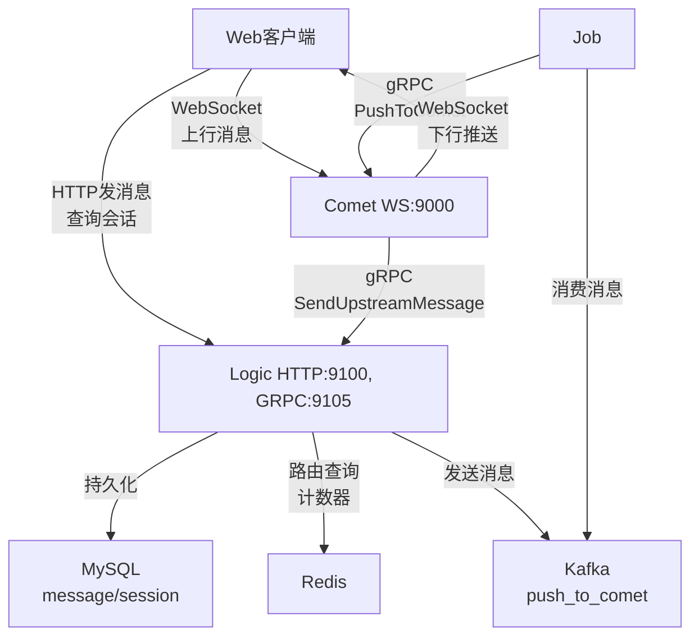
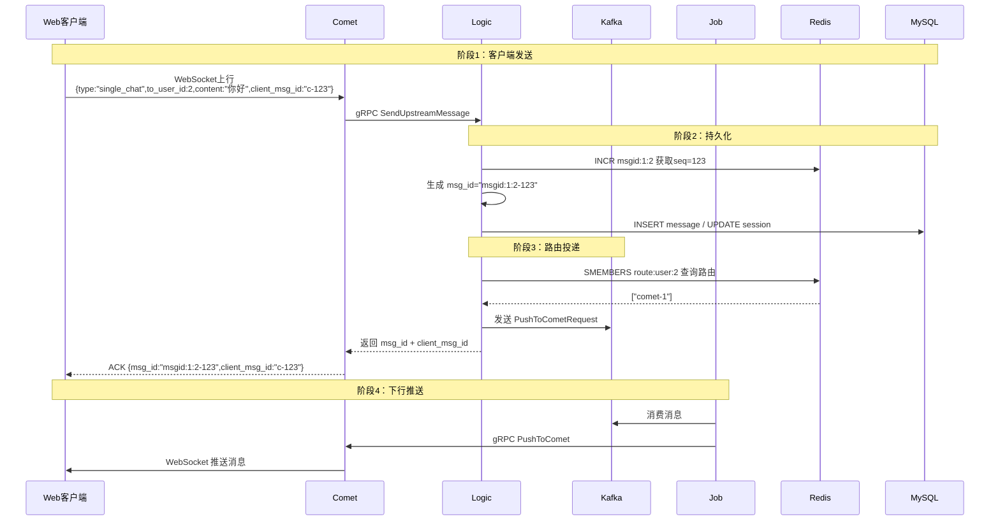
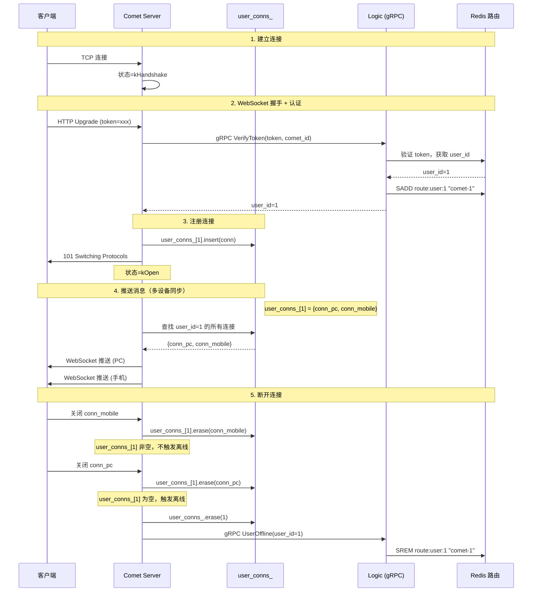

# Spark Push 消息子集实战指南

> 基于 C++ 的实时消息推送系统 - 单聊消息功能完整实现

---

## 目录

- [1. 快速开始](#1-快速开始)
- [2. 核心设计](#2-核心设计)
- [3. 消息 ID 设计原理](#3-消息-id-设计原理)
- [4. 单聊消息完整流程](#4-单聊消息完整流程)
  - [4.5 Kafka Push/Pull 原理](#45-kafka-pushpull-原理)
  - [4.6 gRPC 客户端/服务端设计](#46-grpc-客户端服务端设计)
  - [4.7 Comet 连接管理机制](#47-comet-连接管理机制)
  - [4.8 Comet 下行推送](#48-comet-下行推送)
- [5. Redis 路由设计](#5-redis-路由设计)
- [6. 数据库设计](#6-数据库设计)
- [7. 构建与运行](#7-构建与运行)
- [8. 功能测试](#8-功能测试)
- [9. 常见问题](#9-常见问题)
- [10. 核心要点总结](#10-核心要点总结)

---

# 1. 快速开始

## 1.1 项目概述

**Spark Push 03_msg_subset（消息子集）** 在认证子集基础上，新增**一对一单聊消息**功能。

### 核心功能

- ✅ WebSocket / HTTP 发送单聊消息
- ✅ MySQL 消息持久化
- ✅ 会话管理（自动创建会话）
- ✅ Kafka 消息队列
- ✅ Redis 路由查找
- ✅ 未读计数
- ✅ 消息 ACK 机制

### 服务架构

```
┌─────────┐  WebSocket   ┌────────┐  gRPC   ┌───────┐
│  客户端  │────────────>│ Comet  │──────>│ Logic │
│         │<────────────│        │<──────│       │
└─────────┘   下行推送   └────────┘        └───┬───┘
                           ▲                   │
                           │ gRPC              │ Kafka
                        ┌──┴───┐           ┌───▼───┐
                        │ Job  │<──────────│ Kafka │
                        └──────┘   消费     └───────┘
```

**三个核心服务**：

- **Logic**：业务逻辑（消息路由、持久化、会话管理）
- **Comet**：长连接网关（WebSocket、消息推送）
- **Job**：消息分发（Kafka 消费、推送到 Comet）

---

# 2. 核心设计

## 2.1 服务架构图



## 2.2 消息流转时序



---

# 3. 消息 ID 设计原理

## 3.1 为什么需要两种 ID？

在分布式即时通讯系统中，需要平衡**客户端体验**和**服务端一致性**：

| 需求场景        | 设计选择                        | 理由                                    |
| --------------- | ------------------------------- | --------------------------------------- |
| 全局唯一标识    | **msg_id**（服务端生成）        | Redis INCR 保证原子性、严格递增         |
| 客户端 ACK 匹配 | **client_msg_id**（客户端生成） | 客户端立即显示消息，收到 ACK 后更新状态 |
| 消息排序        | **msg_id** 中的 seq             | 服务端序号是排序的唯一依据              |
| 未读计数        | **msg_id** 中的 seq             | `unread = last_seq - user_read_seq`     |

## 3.2 msg_id：服务端唯一标识

### 格式设计

```
msgid:{user1}:{user2}-{seq}
例如：msgid:1:2-123
```

**组成部分**：

- `msgid`：前缀标识
- `user1`：较小的 user_id（保证 A→B 和 B→A 使用同一计数器）
- `user2`：较大的 user_id
- `seq`：Redis INCR 原子递增的序号（123）

### 生成流程

```cpp
// 1. 确保 user1 < user2
int64_t user1 = std::min(from_user, to_user);
int64_t user2 = std::max(from_user, to_user);

// 2. Redis INCR 获取严格递增序号
int64_t seq = 0;
redis->INCR("msgid:" + std::to_string(user1) + ":" + std::to_string(user2), &seq);
// Redis: INCR msgid:1:2 → 返回 123

// 3. 拼接完整 msg_id
std::string msg_id = "msgid:" + std::to_string(user1) + ":" + 
                     std::to_string(user2) + "-" + std::to_string(seq);
// 结果: msgid:1:2-123
```

### Redis 命令演示

```bash
# 用户1给用户2发第一条消息
127.0.0.1:6379> INCR msgid:1:2
(integer) 1  # 第1条

# 用户1给用户2发第二条消息
127.0.0.1:6379> INCR msgid:1:2
(integer) 2  # 第2条

# 用户2给用户1发消息（同一个key！）
127.0.0.1:6379> INCR msgid:1:2
(integer) 3  # 第3条

# 并发测试：原子性保证
127.0.0.1:6379> INCR msgid:1:2
(integer) 4
127.0.0.1:6379> INCR msgid:1:2
(integer) 5
# 无重复，严格递增 ✅
```

### 为什么不用 UUID？

| 方案           | 优点                                       | 缺点                                       | 是否采用         |
| -------------- | ------------------------------------------ | ------------------------------------------ | ---------------- |
| **Redis INCR** | • 严格递增<br>• 可读性强<br>• 支持未读计数 | • 依赖 Redis                               | ✅ **本项目采用** |
| UUID           | • 全局唯一<br>• 无需中心化                 | • 无序性<br>• 存储开销大<br>• 无法未读计数 | ❌                |
| 雪花算法       | • 趋势递增<br>• 高性能                     | • 需时钟同步<br>• 不适合未读计算           | ❌                |

## 3.3 client_msg_id：客户端匹配标识

### 格式设计

```
c-{timestamp}-{random}
例如：c-1701234567-abc123
```

### 使用场景

**场景1：发送消息时立即显示**

```javascript
// 客户端代码
function sendMessage(content) {
  // 1. 生成 client_msg_id
  const clientMsgId = 'c-' + Date.now() + '-' + Math.random().toString(36);
  
  // 2. 立即在 UI 中显示"发送中"
  displayMessage({
    client_msg_id: clientMsgId,
    content: content,
    status: 'sending'  // 发送中
  });
  
  // 3. 发送到服务端
  ws.send(JSON.stringify({
    type: 'single_chat',
    to_user_id: 2,
    content: content,
    client_msg_id: clientMsgId
  }));
}

// 收到 ACK 时更新状态
ws.onmessage = function(event) {
  const data = JSON.parse(event.data);
  
  if (data.type === 'ack') {
    // 根据 client_msg_id 找到对应消息
    updateMessageStatus(data.client_msg_id, 'sent', data.msg_id);
    // UI 更新：发送中 ⏳ → 已发送 ✓
  }
};
```

**场景2：防止重复发送**

```javascript
const pendingMessages = new Map();

function sendMessage(content) {
  const clientMsgId = 'c-' + Date.now() + '-' + Math.random().toString(36);
  
  // 检查是否已发送
  if (pendingMessages.has(clientMsgId)) {
    console.warn('Message already sent:', clientMsgId);
    return;
  }
  
  pendingMessages.set(clientMsgId, {content, timestamp: Date.now()});
  ws.send(JSON.stringify({...}));
  
  // 设置超时清理
  setTimeout(() => {
    pendingMessages.delete(clientMsgId);
  }, 60000);
}
```

## 3.4 msg_seq：从 msg_id 提取的序号

### 设计原则

**⚠️ 重要：msg_seq 不是客户端生成的，而是从服务端的 msg_id 中提取的序号**

```cpp
// 错误做法（客户端生成）❌
client_msg_seq = 1, 2, 3...  // 客户端自己维护序号
// 问题：无法保证全局顺序，不同客户端可能重复

// 正确做法（从 msg_id 提取）✅
msg_id = "msgid:1:2-123"
msg_seq = 123  // 从 msg_id 提取的序号
// 优点：全局唯一、严格递增、可用于排序和未读计数
```

### 提取方法

```cpp
// 从 msg_id 提取 seq
std::string msg_id = "msgid:1:2-123";
int64_t seq = 0;

size_t pos = msg_id.rfind('-');  // 找到最后一个 '-'
if (pos != std::string::npos) {
    seq = std::stoll(msg_id.substr(pos + 1));  // 提取 "123"
}
// 结果: seq = 123
```

### 用途

1. **消息排序**：

```sql
SELECT * FROM message 
WHERE session_id='s_1_2' 
ORDER BY msg_seq  -- 按序号排序
LIMIT 20;
```

2. **未读计数**：

```cpp
int64_t unread = session.last_msg_seq - user_read_seq;
// 例如: 123 - 118 = 5 条未读
```

3. **增量拉取**：

```sql
SELECT * FROM message 
WHERE session_id='s_1_2' AND msg_seq > 100 
ORDER BY msg_seq 
LIMIT 20;
```

## 3.5 完整对比表

| 维度         | msg_id          | client_msg_id      | msg_seq                  |
| ------------ | --------------- | ------------------ | ------------------------ |
| **生成方**   | 服务端（Logic） | 客户端             | 服务端（从 msg_id 提取） |
| **格式**     | `msgid:1:2-123` | `c-1701234567-abc` | 整数（123）              |
| **唯一性**   | 全局唯一        | 客户端内唯一       | 会话内唯一且递增         |
| **是否必需** | ✅ 必需          | ⚠️ 推荐（ACK匹配）  | ✅ 必需（从msg_id提取）   |
| **用途1**    | 全局标识、防重  | ACK 匹配           | 消息排序                 |
| **用途2**    | 日志追踪        | 客户端去重         | 未读计数                 |
| **用途3**    | 包含递增序号    | 状态管理           | 增量拉取                 |

## 3.6 推荐使用模式

### 生产环境（推荐）

```json
{
  "msg_id": "msgid:1:2-123",       // 服务端生成（必需）
  "msg_seq": 123,                  // 从 msg_id 提取（必需）
  "client_msg_id": "c-1701234567"  // 客户端生成（推荐）
}
```

✅ 功能完整：排序、未读、ACK、去重  
✅ 体验良好：发送消息立即显示  
⚠️ 复杂度适中

### 简化版（教学项目）

```json
{
  "msg_id": "msgid:1:2-123",  // 服务端生成（必需）
  "msg_seq": 123               // 从 msg_id 提取（必需）
}
```

✅ 实现简单  
✅ 核心功能可用  
❌ 无 ACK 匹配（客户端体验稍差）

---

# 4. 单聊消息完整流程

## 4.1 WebSocket 上行流程

### 客户端发送

```javascript
const ws = new WebSocket('ws://localhost:9000/ws?token=xxx');

ws.onopen = function() {
  ws.send(JSON.stringify({
    type: 'single_chat',
    to_user_id: 2,
    content: '你好',
    client_msg_id: 'c-' + Date.now()
  }));
};

ws.onmessage = function(event) {
  const data = JSON.parse(event.data);
  
  if (data.type === 'ack') {
    console.log('消息已确认：msg_id=', data.msg_id, 'client_msg_id=', data.client_msg_id);
    // 根据 client_msg_id 更新 UI 中对应消息的状态
  } else {
    console.log('收到新消息：', data);
  }
};
```

### Comet 转发（comet_server.cpp）

```cpp
void CometServer::OnTextMessage(const TcpConnectionPtr& conn,
                                ConnContext& ctx,
                                const std::string& payload) {
    // 1. 解析上行消息
    UpstreamMessageMeta meta;
    if (!ParseUpstreamMessage(payload, &meta)) {
        SendError(conn, "invalid message format");
        return;
    }

    // 2. 构造 gRPC 请求
    UpstreamMessageRequest req;
    req.set_from_user_id(ctx.user_id);
    req.set_scene("single");
    req.set_client_msg_id(meta.client_msg_id);
    req.set_to_user_id(meta.to_user_id);
    req.set_content_json(payload);

    // 3. 调用 Logic
    UpstreamMessageReply rep;
    grpc::ClientContext rpc_ctx;
    auto status = logic_stub_->SendUpstreamMessage(&rpc_ctx, req, &rep);
    
    if (!status.ok() || rep.error().code() != 0) {
        SendError(conn, "send failed");
        return;
    }

    // 4. 返回 ACK
    SendAck(conn, rep.message().msg_id());
}
```

## 4.2 Logic 处理流程

### SendUpstreamMessage（logic/grpc_service.cpp）

```cpp
::grpc::Status LogicServiceImpl::SendUpstreamMessage(
    ::grpc::ServerContext*, 
    const UpstreamMessageRequest* request,
    UpstreamMessageReply* response) {
    
    // 1. 参数验证
    int64_t from_user = request->from_user_id();
    int64_t to_user = request->to_user_id();
    if (from_user <= 0 || to_user <= 0) {
        return ERROR("invalid user_id");
    }

    // 2. 构造会话信息
    Session session;
    session.type = SessionType::kSingle;
    session.user1_id = std::min(from_user, to_user);
    session.user2_id = std::max(from_user, to_user);
    session.id = "s_" + std::to_string(session.user1_id) + "_" +
                 std::to_string(session.user2_id);

    // 3. 生成消息 ID（Redis INCR）
    int64_t seq = 0;
    if (!redis_store_->NextSingleMsgId(session.user1_id, session.user2_id, &seq)) {
        return ERROR("generate msg_id failed");
    }
    
    std::string msg_id = "msgid:" + std::to_string(session.user1_id) + ":" +
                         std::to_string(session.user2_id) + "-" + std::to_string(seq);
    // 例如: msgid:1:2-123

    // 4. 补充消息内容
    int64_t now_ms = CurrentTimeMillis();
    std::string final_json = request->content_json();
    try {
        auto j = nlohmann::json::parse(final_json);
        j["msg_id"] = msg_id;
        j["msg_seq"] = seq;  // 从 msg_id 提取的序号
        j["create_time"] = now_ms;
        j["from_user_id"] = from_user;
        j["client_msg_id"] = request->client_msg_id();
        
        // 查询发送方信息
        User u;
        if (user_dao_->GetUserById(from_user, &u, nullptr)) {
            j["sender"] = {{"uid", from_user}, {"name", u.name}};
        }
        final_json = j.dump();
    } catch (...) {}

    // 5. 持久化消息
    Message msg;
    std::string err;
    if (!conversation_store_->AppendMessage(
            session, msg_id, seq, from_user, "text", final_json, 
            now_ms, request->client_msg_id(), &msg, &err)) {
        return ERROR("append message failed: " + err);
    }

    // 6. 查询接收方路由
    std::vector<std::string> comets;
    if (!redis_store_->GetUserRoutes(to_user, &comets)) {
        LOG_INFO << "User " << to_user << " offline, skip push";
    }

    // 7. 投递 Kafka
    for (const auto& comet_id : comets) {
        PushToCometRequest req;
        req.set_comet_id(comet_id);
        *req.mutable_message() = BuildChatMessage(msg);
        req.add_targets()->set_user_id(to_user);

        std::string payload;
        req.SerializeToString(&payload);
        producer_->Send(comet_id, payload);
    }

    // 8. 填充响应
    *response->mutable_message() = BuildChatMessage(msg);
    SetError(response->mutable_error(), 0, "ok");
    return ::grpc::Status::OK;
}
```

## 4.3 持久化流程

### ConversationStore::AppendMessage

```cpp
bool ConversationStore::AppendMessage(
    const Session& session,
    const std::string& msg_id,
    int64_t msg_seq,  // 从 msg_id 提取的序号
    int64_t sender_id,
    const std::string& msg_type,
    const std::string& content_json,
    int64_t timestamp_ms,
    const std::string& client_msg_id,
    Message* out_msg,
    std::string* err) {
    
    // 1. 确保会话存在
    session_dao_->GetOrCreateSingleSession(session.user1_id, session.user2_id, nullptr, err);

    // 2. 构造消息对象
    Message msg;
    msg.session_id = session.id;
    msg.msg_id = msg_id;
    msg.msg_seq = msg_seq;  // 从 msg_id 提取的严格递增序号
    msg.sender_id = sender_id;
    msg.msg_type = msg_type;
    msg.content_json = content_json;
    msg.timestamp_ms = timestamp_ms;
    msg.client_msg_id = client_msg_id;

    // 3. 插入消息到 MySQL
    if (!message_dao_->InsertMessage(msg, err)) {
        return false;
    }

    // 4. 更新会话的 last_msg_seq
    session_dao_->UpdateLastMsgSeq(session.id, msg_seq, err);

    // 5. 缓存到 Redis
    redis_store_->SetSessionLastSeq(session.id, msg_seq);

    if (out_msg) *out_msg = msg;
    return true;
}
```

### SQL 操作

```sql
-- 插入消息
INSERT INTO message(
  msg_id, session_id, msg_seq, sender_id, msg_type, 
  content_json, timestamp_ms, client_msg_id
) VALUES(
  'msgid:1:2-123', 's_1_2', 123, 1, 'text', 
  '{"text":"你好"}', 1701234567890, 'c-xxx'
);

-- 更新会话序号
UPDATE `session` 
SET last_msg_seq = 123 
WHERE session_id = 's_1_2' AND last_msg_seq < 123;

-- 创建会话（如果不存在）
INSERT INTO `session`(session_id, type, user1_id, user2_id, last_msg_seq)
VALUES('s_1_2', 0, 1, 2, 0)
ON DUPLICATE KEY UPDATE session_id=session_id;
```

## 4.4 Kafka 投递与消费

### Logic 投递

```cpp
// Topic: push_to_comet
// Key: comet_id (如 "comet-1")
// Value: PushToCometRequest (Protobuf)

bool KafkaProducer::Send(const std::string& key, const std::string& value) {
    return producer_->produce(
        topic_.get(),
        RdKafka::Topic::PARTITION_UA,  // 自动分区
        RdKafka::Producer::RK_MSG_COPY,
        const_cast<char*>(value.data()),
        value.size(),
        &key,
        nullptr
    ) == RdKafka::ERR_NO_ERROR;
}
```

### Job 消费并转发

```cpp
void JobRunner::HandleMessage(const std::string& key, const std::string& value) {
    (void)key;  // key 是 comet_id，已包含在 value 的 PushToCometRequest 中
    
    // 提交到线程池异步处理（避免阻塞 Kafka 消费线程）
    rpc_pool_.Submit([this, payload = value]() {
        PushToCometRequest req;
        if (!req.ParseFromString(payload)) {
            LOG_ERROR << "Failed to parse PushToCometRequest from Kafka";
            return;
        }
        ProcessPushRequest(req);  // 调用内部方法处理
    });
}

void JobRunner::ProcessPushRequest(const PushToCometRequest& req) {
    // 根据 comet_id 获取对应的 gRPC Stub
    CometService::Stub* stub = GetStub(req.comet_id());
    if (!stub) {
        LOG_ERROR << "Unknown comet_id: " << req.comet_id();
        return;
    }

    PushToCometReply reply;
    grpc::ClientContext ctx;
    auto status = stub->PushToComet(&ctx, req, &reply);
    
    if (!status.ok()) {
        LOG_ERROR << "PushToComet RPC failed: " << status.error_message();
    } else if (reply.error().code() != 0) {
        LOG_ERROR << "PushToComet error: " << reply.error().message();
    }
}
```

## 4.5 Kafka Push/Pull 原理

### 4.5.1 Producer：Logic 推送消息（Push）

**核心配置**：

```cpp
// common/kafka_producer.cpp
bool KafkaProducer::Init(const std::string& brokers, const std::string& topic) {
    // 可靠性配置
    conf->set("acks", "all");                    // 等待所有副本确认
    conf->set("enable.idempotence", "true");     // 幂等生产者（防重复）
    conf->set("retries", "5");                   // 失败重试5次
    conf->set("retry.backoff.ms", "500");        // 重试间隔500ms
    
    // 性能优化
    conf->set("linger.ms", "5");                 // 批量等待5ms
    conf->set("batch.num.messages", "1000");     // 批量大小1000条
    conf->set("compression.type", "lz4");        // 压缩算法
    
    // 创建 Producer 和 Topic
    producer_.reset(RdKafka::Producer::create(conf, errstr));
    topic_.reset(RdKafka::Topic::create(producer_.get(), topic_name_, ...));
}
```

**发送消息**：

```cpp
bool KafkaProducer::Send(const std::string& key, const std::string& value) {
    // key = comet_id（用于分区）
    // value = PushToCometRequest 序列化后的 Protobuf 字节流
    RdKafka::ErrorCode err = producer_->produce(
        topic_.get(),
        RdKafka::Topic::PARTITION_UA,  // 根据 key 自动选择分区
        RdKafka::Producer::RK_MSG_COPY,
        const_cast<char*>(value.data()),
        value.size(),
        &key,  // 分区键：相同 comet_id 的消息发到同一分区
        nullptr
    );
    producer_->poll(0);  // 触发内部事件循环
    return err == RdKafka::ERR_NO_ERROR;
}
```

**分区策略**：使用 `comet_id` 作为 key，Kafka 自动通过 hash 将相同 `comet_id` 的消息路由到同一分区，保证消息顺序性。

### 4.5.2 Consumer：Job 拉取消息（Pull）

**核心配置**：

```cpp
// common/kafka_consumer.cpp
bool KafkaConsumer::Init(...) {
    conf->set("group.id", group_id);                    // 消费者组（负载均衡）
    conf->set("auto.offset.reset", "earliest");         // 从最早消息开始消费
    conf->set("enable.auto.commit", "false");           // 手动提交 offset
    conf->set("max.poll.interval.ms", "300000");        // 最大拉取间隔5分钟
    conf->set("session.timeout.ms", "45000");           // 心跳超时45秒
    
    consumer_.reset(RdKafka::KafkaConsumer::create(conf, errstr));
    consumer_->subscribe({topic_});  // 订阅 topic
}
```

**消费循环**：

```cpp
void KafkaConsumer::Loop() {
    while (running_) {
        // 每次拉取等待最多1秒
        std::unique_ptr<RdKafka::Message> msg(consumer_->consume(1000));
        if (msg && msg->err() == RdKafka::ERR_NO_ERROR) {
            std::string key = msg->key() ? *msg->key() : "";
            std::string value(static_cast<const char*>(msg->payload()), 
                             msg->len());
            
            // 回调处理消息
            callback_(key, value);
            
            // 手动提交 offset（确保处理成功后才提交）
            consumer_->commitAsync(msg.get());
        }
    }
}
```

**Job 服务消费流程**：

```cpp
// job/service.cpp
void JobRunner::HandleMessage(const std::string& key, const std::string& value) {
    // 提交到线程池异步处理（避免阻塞 Kafka 消费线程）
    rpc_pool_.Submit([this, payload = value]() {
        PushToCometRequest req;
        req.ParseFromString(payload);  // 反序列化 Protobuf
        ProcessPushRequest(req);       // 调用 Comet gRPC
    });
}
```

**Pull 模型优势**：
- ✅ 消费者控制消费速度（背压控制）
- ✅ 批量拉取，减少网络开销
- ✅ Offset 管理灵活（手动提交防止消息丢失）

---

## 4.6 gRPC 客户端/服务端设计

本项目中，Logic、Comet、Job 三个服务之间通过 gRPC 通信，各服务既是服务端也是客户端。

### 4.6.1 服务角色矩阵

| 服务  | gRPC 服务端角色                                | gRPC 客户端角色                    |
| ----- | ---------------------------------------------- | ---------------------------------- |
| Logic | ✅ 提供 `VerifyToken`、`SendUpstreamMessage` 等 | ❌ 无                               |
| Comet | ✅ 提供 `PushToComet`（接收下行消息）           | ✅ 调用 Logic 的 `SendUpstreamMessage` |
| Job   | ❌ 无                                           | ✅ 调用 Comet 的 `PushToComet`       |

### 4.6.2 Logic gRPC 服务端

**服务启动**：

```cpp
// logic/main.cpp
int RunLogic(const Config& cfg) {
    // 1. 创建服务实现类
    auto service = std::make_unique<LogicServiceImpl>(
        &user_dao, &producer, &redis_store, &conversation_store);
    
    // 2. 配置 gRPC 服务器
    grpc::ServerBuilder builder;
    std::string grpc_addr = "0.0.0.0:" + std::to_string(cfg.listen_port);
    builder.AddListeningPort(grpc_addr, grpc::InsecureServerCredentials());
    builder.RegisterService(service.get());
    
    // 3. 启动服务器（独立线程运行）
    std::unique_ptr<grpc::Server> server(builder.BuildAndStart());
    std::thread grpc_thread([&server]() { server->Wait(); });
    
    // 4. HTTP 服务器在主线程运行
    muduo::net::EventLoop loop;
    HttpApiServer httpServer(&loop, ...);
    loop.loop();  // 阻塞
}
```

**接口实现示例**：

```cpp
// logic/grpc_service.cpp
::grpc::Status LogicServiceImpl::SendUpstreamMessage(
    ::grpc::ServerContext*,
    const UpstreamMessageRequest* request,
    UpstreamMessageReply* response) {
    
    // 1. 生成消息 ID
    int64_t seq = 0;
    redis_store_->NextSingleMsgId(user1_id, user2_id, &seq);
    std::string msg_id = "msgid:1:2-" + std::to_string(seq);
    
    // 2. 持久化到 MySQL
    conversation_store_->AppendMessage(...);
    
    // 3. 查询路由并投递 Kafka
    std::vector<std::string> comets;
    redis_store_->GetUserRoutes(to_user_id, &comets);
    for (const auto& comet_id : comets) {
        PushToCometRequest req;
        req.set_comet_id(comet_id);
        *req.mutable_message() = BuildChatMessage(...);
        req.add_targets()->set_user_id(to_user_id);
        
        std::string payload;
        req.SerializeToString(&payload);
        producer_->Send(comet_id, payload);  // 投递 Kafka
    }
    
    return ::grpc::Status::OK;
}
```

### 4.6.3 Comet 双角色设计

**作为 gRPC 服务端**（接收 Job 的下行推送）：

```cpp
// comet/comet_grpc_service.cpp
::grpc::Status CometServiceImpl::PushToComet(
    ::grpc::ServerContext*,
    const PushToCometRequest* request,
    PushToCometReply* response) {
    
    // 从 gRPC 请求中提取目标用户列表
    std::vector<int64_t> users;
    for (const auto& t : request->targets()) {
        users.push_back(t.user_id());
    }
    
    // 调用 CometServer 内部方法推送到 WebSocket 连接
    server_->PushToUsers(request->message(), users);
    
    response->mutable_error()->set_code(0);
    return ::grpc::Status::OK;
}
```

**作为 gRPC 客户端**（调用 Logic 处理上行消息）：

```cpp
// comet/comet_server.cpp
void CometServer::OnTextMessage(const TcpConnectionPtr& conn,
                                ConnContext& ctx,
                                const std::string& payload) {
    // 1. 解析 WebSocket 上行消息
    UpstreamMessageMeta meta;
    ParseUpstreamMessage(payload, &meta);
    
    // 2. 构造 gRPC 请求
    UpstreamMessageRequest req;
    req.set_from_user_id(ctx.user_id);
    req.set_to_user_id(meta.to_user_id);
    req.set_content_json(payload);
    
    // 3. 调用 Logic 的 gRPC 接口
    UpstreamMessageReply rep;
    grpc::ClientContext rpc_ctx;
    auto status = logic_stub_->SendUpstreamMessage(&rpc_ctx, req, &rep);
    
    // 4. 返回 ACK 给客户端
    if (status.ok()) {
        SendAck(conn, rep.message().msg_id());
    }
}

// Comet 启动时创建 gRPC 客户端 Stub
CometServer::CometServer(EventLoop* loop, const Config& cfg) {
    auto channel = grpc::CreateChannel(cfg.logic_grpc_target,
                                      grpc::InsecureChannelCredentials());
    logic_stub_ = LogicService::NewStub(channel);
}
```

### 4.6.4 Job gRPC 客户端

**动态 Stub 管理**（支持多个 Comet 实例）：

```cpp
// job/service.cpp
CometService::Stub* JobRunner::GetStub(const std::string& comet_id) {
    std::lock_guard<std::mutex> lock(stub_mu_);
    
    // 1. 查找缓存的 Stub
    auto it = comet_stubs_.find(comet_id);
    if (it != comet_stubs_.end()) {
        return it->second.get();
    }
    
    // 2. 根据 comet_id 获取地址（从配置文件解析）
    auto addr_it = comet_addrs_.find(comet_id);
    if (addr_it == comet_addrs_.end()) {
        return nullptr;  // 未配置该 comet_id
    }
    
    // 3. 创建新的 Channel 和 Stub
    auto channel = grpc::CreateChannel(addr_it->second,
                                      grpc::InsecureChannelCredentials());
    auto stub = CometService::NewStub(channel);
    auto* ptr = stub.get();
    comet_stubs_[comet_id] = std::move(stub);
    return ptr;
}

// 调用 Comet 推送消息
void JobRunner::ProcessPushRequest(const PushToCometRequest& req) {
    CometService::Stub* stub = GetStub(req.comet_id());
    if (!stub) {
        LOG_ERROR << "Unknown comet_id " << req.comet_id();
        return;
    }
    
    PushToCometReply reply;
    grpc::ClientContext ctx;
    auto status = stub->PushToComet(&ctx, req, &reply);
    
    if (!status.ok()) {
        LOG_ERROR << "PushToComet RPC failed: " << status.error_message();
    }
}
```

### 4.6.5 gRPC 调用链路总结

```
上行消息流：
客户端 WebSocket → Comet (WebSocket 服务器)
                      ↓
                   gRPC 客户端调用
                      ↓
                 Logic (gRPC 服务端)
                      ↓
                   处理并投递 Kafka

下行消息流：
Kafka → Job (Kafka Consumer)
         ↓
      gRPC 客户端调用
         ↓
    Comet (gRPC 服务端)
         ↓
    WebSocket 推送 → 客户端
```

---

## 4.7 Comet 连接管理机制

### 4.7.1 核心数据结构

Comet 通过 `user_conns_` 管理所有活跃的 WebSocket 连接：

```cpp
// comet/comet_server.h
class CometServer {
private:
    // 核心数据结构：用户ID → 连接集合的映射
    std::unordered_map<int64_t, std::set<TcpConnectionPtr>> user_conns_;
    mutable std::mutex conns_mu_;  // 保护并发访问
};
```

**数据结构可视化**：

```
user_conns_ (std::unordered_map)
┌────────────────────────────────────────────────────┐
│ Key: user_id          Value: std::set<Connection>  │
├────────────────────────────────────────────────────┤
│ 1 (用户A)     →      { conn_1, conn_2 }           │  ← PC + 手机
│ 2 (用户B)     →      { conn_3 }                   │  ← 单设备
│ 3 (用户C)     →      { conn_4, conn_5, conn_6 }   │  ← PC + 手机 + iPad
└────────────────────────────────────────────────────┘

设计要点：
1. 使用 std::set 自动去重，防止同一连接重复添加
2. 支持一个用户同时有多个设备在线（多端登录）
3. 线程安全：所有操作都加锁保护
```

### 4.7.2 连接生命周期

**流程图**：



### 4.7.3 关键代码实现

**添加连接（握手成功后）**：

```cpp
// comet/comet_server.cpp
void CometServer::HandleHandshake(const TcpConnectionPtr& conn, Buffer* buf) {
    // 1. 解析 token
    std::string token = ParseTokenFromHandshake(req);
    
    // 2. 调用 Logic 验证 token
    VerifyTokenRequest vreq;
    vreq.set_token(token);
    vreq.set_comet_id(comet_id_);  // 告诉 Logic 本机 comet_id
    VerifyTokenReply vrep;
    grpc::ClientContext ctx_rpc;
    auto status = logic_stub_->VerifyToken(&ctx_rpc, vreq, &vrep);
    
    if (!status.ok() || vrep.error().code() != 0) {
        conn->shutdown();  // 认证失败，关闭连接
        return;
    }
    int64_t user_id = vrep.user_id();
    
    // 3. 完成 WebSocket 握手
    std::string accept_val = ComputeWebSocketAccept(ws_key);
    conn->send("HTTP/1.1 101 Switching Protocols\r\n...");
    
    // 4. 更新连接状态
    ConnContext ctx = std::any_cast<ConnContext>(conn->getContext());
    ctx.state = ConnContext::kOpen;
    ctx.user_id = user_id;
    conn->setContext(ctx);
    
    // 5. 将连接注册到 user_conns_（关键步骤）
    {
        std::lock_guard<std::mutex> lock(conns_mu_);
        user_conns_[user_id].insert(conn);  // 插入到该用户的连接集合
    }
    LOG_INFO << "WebSocket handshake done, user_id=" << user_id;
}
```

**移除连接（断开时）**：

```cpp
void CometServer::OnConnection(const TcpConnectionPtr& conn) {
    if (conn->connected()) {
        // 新连接建立（初始化状态）
        ConnContext ctx;
        ctx.state = ConnContext::kHandshake;
        conn->setContext(ctx);
    } else {
        // 连接断开（清理逻辑）
        int64_t offline_uid = 0;
        bool need_offline = false;
        
        try {
            auto ctx = std::any_cast<ConnContext>(conn->getContext());
            if (ctx.user_id > 0) {
                std::lock_guard<std::mutex> lock(conns_mu_);
                auto it = user_conns_.find(ctx.user_id);
                if (it != user_conns_.end()) {
                    // 从该用户的连接集合中移除
                    it->second.erase(conn);
                    
                    // 如果该用户没有任何连接了，标记为离线
                    if (it->second.empty()) {
                        user_conns_.erase(it);
                        offline_uid = ctx.user_id;
                        need_offline = true;
                    }
                }
            }
        } catch (const std::bad_any_cast&) {}
        
        // 通知 Logic 用户离线（只有所有连接都断开时才通知）
        if (need_offline && offline_uid > 0) {
            NotifyUserOffline(offline_uid);
        }
    }
}
```

**推送消息（多设备同时推送）**：

```cpp
void CometServer::PushToUsers(
    const ChatMessage& msg,
    const std::vector<int64_t>& user_ids) {
    
    // 1. 构造 WebSocket 文本帧
    std::string payload = msg.content_json();
    std::string frame = BuildWebSocketTextFrame(payload);
    
    // 2. 查找所有目标用户的所有连接
    std::vector<TcpConnectionPtr> conns;
    {
        std::lock_guard<std::mutex> lock(conns_mu_);
        for (int64_t uid : user_ids) {
            auto it = user_conns_.find(uid);
            if (it != user_conns_.end()) {
                // 将该用户的所有连接都加入推送列表
                for (const auto& c : it->second) {
                    conns.push_back(c);
                }
            }
        }
    }
    
    // 3. 批量发送到所有连接
    for (const auto& c : conns) {
        if (c->connected()) {
            c->send(frame);  // 每个设备都会收到消息
        }
    }
}
```

### 4.7.4 多设备场景分析

#### 场景 1：用户 A 在 PC 和手机同时在线

```
初始状态：
user_conns_[1] = {}  (空)

步骤1：PC 连接
user_conns_[1] = { conn_pc }
Redis: route:user:1 = {"comet-1"}

步骤2：手机连接
user_conns_[1] = { conn_pc, conn_mobile }
Redis: route:user:1 = {"comet-1"}  (未变化，同一 comet)

步骤3：收到一条消息
PushToUsers(user_ids=[1])
  → 遍历 user_conns_[1] = { conn_pc, conn_mobile }
  → conn_pc.send(frame)   ✅ PC 收到消息
  → conn_mobile.send(frame)  ✅ 手机收到消息

步骤4：手机断开
user_conns_[1] = { conn_pc }
不触发 UserOffline（PC 还在线）

步骤5：PC 断开
user_conns_[1] = {}  → 删除 key
触发 UserOffline(user_id=1)
Redis: SREM route:user:1 "comet-1"
```

#### 场景 2：用户 A 在不同 Comet 上有多个设备

```
用户A在两台 Comet 上都有连接：
- comet-1: user_conns_[1] = { conn_pc }
- comet-2: user_conns_[1] = { conn_mobile }

Redis 路由：
route:user:1 = {"comet-1", "comet-2"}

消息推送流程：
1. Logic 查询路由 → ["comet-1", "comet-2"]
2. 向 comet-1 发送 Kafka 消息 → PC 收到
3. 向 comet-2 发送 Kafka 消息 → 手机收到
```

#### 场景 3：防止重复推送

**问题**：如果用户在同一 Comet 上有多个连接（如多个浏览器标签页），会收到多条消息吗？

**答案**：是的，每个连接都会收到。这是**设计预期**，原因：

- 每个标签页/设备都是独立的显示界面
- 用户期望在所有打开的界面都看到新消息
- 客户端可根据 `msg_id` 去重（本地缓存已显示的消息）

**客户端去重示例**：

```javascript
const receivedMsgIds = new Set();

ws.onmessage = function(event) {
  const data = JSON.parse(event.data);
  
  // 根据 msg_id 去重
  if (receivedMsgIds.has(data.msg_id)) {
    console.log('重复消息，忽略');
    return;
  }
  
  receivedMsgIds.add(data.msg_id);
  displayMessage(data);  // 显示消息
};
```

### 4.7.5 设计优势与权衡

| 维度           | 设计方案                               | 优势                                       | 劣势                     |
| -------------- | -------------------------------------- | ------------------------------------------ | ------------------------ |
| **数据结构**   | `map<user, set<conn>>`                 | 支持多设备、自动去重、O(1)查找            | 内存占用（需存储所有连接） |
| **离线判断**   | 所有连接断开时才通知 `UserOffline`     | 避免频繁通知、符合多设备语义               | 需要维护连接计数         |
| **推送策略**   | 推送到用户所有连接                     | 多端同步、用户体验好                       | 同一消息多次传输         |
| **路由维度**   | 以 `comet_id` 为维度存储路由           | Job 可并行推送到多个 Comet                | Redis 需维护路由映射     |
| **线程安全**   | 所有操作加 `mutex` 保护                | 避免并发问题                               | 锁竞争（高并发下瓶颈）   |

### 4.7.6 优化方向（扩展思考）

**1. 减少锁竞争**：

```cpp
// 使用读写锁（读多写少场景）
std::shared_mutex conns_mu_;

// 查询时使用共享锁
void PushToUsers(...) {
    std::shared_lock<std::shared_mutex> lock(conns_mu_);
    // 查找连接...
}

// 修改时使用独占锁
void HandleHandshake(...) {
    std::unique_lock<std::shared_mutex> lock(conns_mu_);
    user_conns_[user_id].insert(conn);
}
```

**2. 连接分片**：

```cpp
// 将用户连接分散到多个 map，减少锁粒度
class CometServer {
private:
    static const int SHARD_COUNT = 16;
    std::unordered_map<int64_t, std::set<TcpConnectionPtr>> user_conns_[SHARD_COUNT];
    std::mutex conns_mu_[SHARD_COUNT];
    
    int GetShard(int64_t user_id) {
        return user_id % SHARD_COUNT;
    }
};
```

**3. 客户端去重标识**：

```cpp
// 每个连接分配唯一 ID
struct ConnContext {
    std::string conn_id;  // 如 "comet-1-conn-12345"
    int64_t user_id;
};

// 推送时携带连接 ID，客户端根据自身 conn_id 决定是否处理
```

---

## 4.8 Comet 下行推送

### CometServiceImpl::PushToComet

```cpp
::grpc::Status CometServiceImpl::PushToComet(
    ::grpc::ServerContext*,
    const PushToCometRequest* request,
    PushToCometReply* response) {
    
    LOG_INFO << "PushToComet received for comet_id=" << request->comet_id()
             << " msg_id=" << request->message().msg_id();
    
    // 1. 如果 targets 列表非空，按 user_id 精确推送
    if (request->targets_size() > 0) {
        std::vector<int64_t> users;
        users.reserve(request->targets_size());
        for (const auto& t : request->targets()) {
            users.push_back(t.user_id());
        }
        server_->PushToUsers(request->message(), users);
    } else {
        // 2. targets 为空时，按 session_id 约定处理（如房间广播）
        const std::string& sid = request->message().session_id();
        if (sid.size() > 2 && sid[0] == 'r' && sid[1] == '_') {
            // 房间广播逻辑（可选实现）
            int64_t room_id = std::stoll(sid.substr(2));
            // server_->PushToRoom(request->message(), room_id);
        }
    }
    
    response->mutable_error()->set_code(0);
    response->mutable_error()->set_message("ok");
    return ::grpc::Status::OK;
}
```

---

# 5. Redis 路由设计

## 5.1 核心问题

**如何找到目标用户当前连接在哪个 Comet 服务器？**

```
用户A(uid=1) 连接到 comet-1
用户B(uid=2) 连接到 comet-2

当用户A给用户B发消息时：
Logic 需要知道用户B在 comet-2 上
→ 将消息投递到 comet-2
→ comet-2 推送给用户B
```

## 5.2 路由数据结构

```
Key:   route:user:{user_id}
Type:  SET
Value: {comet_id1, comet_id2, ...}

示例：
route:user:1 = {"comet-1"}
route:user:2 = {"comet-1", "comet-2"}  # 多设备登录
```

**为什么用 SET？**

- ✅ 支持多设备（同一用户可以在多个 Comet 上）
- ✅ 自动去重
- ✅ 原子操作（SADD/SREM/SMEMBERS）

## 5.3 路由操作

### 添加路由（用户上线）

```cpp
bool RedisStore::AddRoute(int64_t user_id, const std::string& comet_id) {
    redisReply* reply = (redisReply*)redisCommand(
        ctx, "SADD route:user:%lld %s", user_id, comet_id.c_str());
    
    bool ok = (reply->type != REDIS_REPLY_ERROR);
    freeReplyObject(reply);
    return ok;
}
```

```bash
# 用户1连接到 comet-1
127.0.0.1:6379> SADD route:user:1 "comet-1"
(integer) 1  # 成功添加

# 用户1又从另一设备连接到 comet-2
127.0.0.1:6379> SADD route:user:1 "comet-2"
(integer) 1  # 新增成功

# 查看路由
127.0.0.1:6379> SMEMBERS route:user:1
1) "comet-1"
2) "comet-2"
```

### 查询路由（发送消息时）

```cpp
bool RedisStore::GetUserRoutes(int64_t user_id,
                               std::vector<std::string>* comets) {
    redisReply* reply = (redisReply*)redisCommand(
        ctx, "SMEMBERS route:user:%lld", user_id);
    
    if (reply->type == REDIS_REPLY_ARRAY) {
        for (size_t i = 0; i < reply->elements; ++i) {
            if (reply->element[i]->type == REDIS_REPLY_STRING) {
                comets->push_back(reply->element[i]->str);
            }
        }
    }
    freeReplyObject(reply);
    return true;
}
```

```bash
# 查询用户2在哪些 comet 上
127.0.0.1:6379> SMEMBERS route:user:2
1) "comet-1"
2) "comet-2"

# 用户离线时返回空集合
127.0.0.1:6379> SMEMBERS route:user:999
(empty array)
```

### 删除路由（用户下线）

```cpp
bool RedisStore::RemoveRoute(int64_t user_id, const std::string& comet_id) {
    redisReply* reply = (redisReply*)redisCommand(
        ctx, "SREM route:user:%lld %s", user_id, comet_id.c_str());
    
    bool ok = (reply->type != REDIS_REPLY_ERROR);
    freeReplyObject(reply);
    return ok;
}
```

**触发时机**：WebSocket 连接断开时，Comet 调用 Logic 的 `UserOffline` gRPC。

```bash
# 用户1断开 comet-1
127.0.0.1:6379> SREM route:user:1 "comet-1"
(integer) 1  # 成功删除

127.0.0.1:6379> SMEMBERS route:user:1
1) "comet-2"  # 仅剩 comet-2
```

---

# 6. 数据库设计

## 6.1 message 表（消息内容）

```sql
CREATE TABLE `message` (
  `id` BIGINT UNSIGNED NOT NULL AUTO_INCREMENT,
  `msg_id` VARCHAR(128) NOT NULL COMMENT '消息ID（msgid:1:2-123）',
  `session_id` VARCHAR(64) NOT NULL COMMENT '会话ID',
  `msg_seq` BIGINT NOT NULL DEFAULT 0 COMMENT '消息序号（从msg_id提取）',
  `sender_id` BIGINT NOT NULL COMMENT '发送方用户ID',
  `msg_type` VARCHAR(32) NOT NULL DEFAULT 'text',
  `content_json` TEXT NOT NULL COMMENT '消息内容JSON',
  `timestamp_ms` BIGINT NOT NULL COMMENT '时间戳（毫秒）',
  `client_msg_id` VARCHAR(128) DEFAULT NULL COMMENT '客户端消息ID',
  `created_at` TIMESTAMP NOT NULL DEFAULT CURRENT_TIMESTAMP,
  
  PRIMARY KEY (`id`),
  UNIQUE KEY `uk_msg_id` (`msg_id`),  -- 防重复
  KEY `idx_session_seq` (`session_id`, `msg_seq`),  -- 按序号查询
  KEY `idx_session_time` (`session_id`, `timestamp_ms`)
) ENGINE=InnoDB DEFAULT CHARSET=utf8mb4;
```

**关键索引说明**：

- `uk_msg_id`：防止重复插入（幂等性）
- `idx_session_seq`：支持按序号分页查询（`WHERE session_id=? AND msg_seq > ? ORDER BY msg_seq LIMIT 20`）

## 6.2 session 表（会话信息）

```sql
CREATE TABLE `session` (
  `id` BIGINT UNSIGNED NOT NULL AUTO_INCREMENT,
  `session_id` VARCHAR(64) NOT NULL COMMENT '会话ID（s_1_2）',
  `type` TINYINT NOT NULL DEFAULT 0 COMMENT '0=单聊，1=群聊',
  `user1_id` BIGINT NOT NULL DEFAULT 0 COMMENT '单聊用户1（user1 < user2）',
  `user2_id` BIGINT NOT NULL DEFAULT 0 COMMENT '单聊用户2',
  `group_id` BIGINT NOT NULL DEFAULT 0,
  `last_msg_seq` BIGINT NOT NULL DEFAULT 0 COMMENT '最后消息序号（用于未读计数）',
  `created_at` TIMESTAMP NOT NULL DEFAULT CURRENT_TIMESTAMP,
  `updated_at` TIMESTAMP NOT NULL DEFAULT CURRENT_TIMESTAMP ON UPDATE CURRENT_TIMESTAMP,
  
  PRIMARY KEY (`id`),
  UNIQUE KEY `uk_session_id` (`session_id`),
  KEY `idx_user1` (`user1_id`),
  KEY `idx_user2` (`user2_id`)
) ENGINE=InnoDB DEFAULT CHARSET=utf8mb4;
```

**last_msg_seq 的作用**：

```
未读计数公式：unread_count = session.last_msg_seq - user_read_seq

示例：
- session.last_msg_seq = 123（最新消息序号）
- user_read_seq = 118（用户已读到的序号）
- unread_count = 123 - 118 = 5（未读5条消息）
```

## 6.3 user_read_seq 存储位置

**user_read_seq（用户已读位置）** 用于计算未读消息数，存储在以下位置：

### 方案1：Redis 缓存（快速读取）

```bash
Key:   read:{session_id}:{user_id}
Type:  STRING (整数)
Value: 已读序号

示例：
read:s_1_2:2 = "118"  # 用户2在会话s_1_2中已读到序号118
```

**操作示例**：
```cpp
// 标记已读
bool RedisStore::SetUserReadSeq(int64_t user_id, const std::string& session_id, int64_t read_seq) {
    std::string key = "read:" + session_id + ":" + std::to_string(user_id);
    redisReply* reply = (redisReply*)redisCommand(ctx, "SET %s %lld", key.c_str(), read_seq);
    // ...
}

// 查询已读位置
bool RedisStore::GetUserReadSeq(int64_t user_id, const std::string& session_id, int64_t* read_seq) {
    std::string key = "read:" + session_id + ":" + std::to_string(user_id);
    redisReply* reply = (redisReply*)redisCommand(ctx, "GET %s", key.c_str());
    // ...
}
```

### 方案2：MySQL 持久化（防止 Redis 数据丢失）

```sql
CREATE TABLE `user_session_state` (
  `id` BIGINT UNSIGNED NOT NULL AUTO_INCREMENT,
  `user_id` BIGINT NOT NULL,
  `session_id` VARCHAR(64) NOT NULL,
  `read_seq` BIGINT NOT NULL DEFAULT 0,
  `updated_at` TIMESTAMP NOT NULL DEFAULT CURRENT_TIMESTAMP ON UPDATE CURRENT_TIMESTAMP,
  
  PRIMARY KEY (`id`),
  UNIQUE KEY `uk_user_session` (`user_id`, `session_id`),
  KEY `idx_session` (`session_id`)
) ENGINE=InnoDB DEFAULT CHARSET=utf8mb4;
```

### 方案3：双写策略（推荐）

```cpp
bool ConversationStore::MarkRead(int64_t user_id, const std::string& session_id,
                                 int64_t read_seq, std::string* err_msg) {
    // 1. 写入 MySQL（持久化）
    if (!state_dao_->UpsertReadSeq(user_id, session_id, read_seq, err_msg)) {
        return false;
    }
    
    // 2. 写入 Redis（缓存，加速查询）
    if (redis_store_) {
        redis_store_->SetUserReadSeq(user_id, session_id, read_seq);
    }
    
    return true;
}

// 查询时优先读 Redis，未命中时回源 MySQL
bool ConversationStore::GetUnread(int64_t user_id, const std::string& session_id,
                                  int64_t* unread, std::string* err_msg) {
    int64_t read_seq = 0;
    
    // 优先读 Redis
    if (redis_store_ && redis_store_->GetUserReadSeq(user_id, session_id, &read_seq)) {
        // 命中缓存
    } else {
        // 回源 MySQL
        state_dao_->GetReadSeq(user_id, session_id, &read_seq, err_msg);
        // 回写 Redis
        if (redis_store_) {
            redis_store_->SetUserReadSeq(user_id, session_id, read_seq);
        }
    }
    
    // 获取会话最新消息序号
    int64_t last_seq = 0;
    // ... 从 Redis 或 MySQL 获取 session.last_msg_seq
    
    *unread = last_seq > read_seq ? (last_seq - read_seq) : 0;
    return true;
}
```

**未读计数完整示例**：
```
用户2在会话 s_1_2 中：
- session.last_msg_seq = 123（最新消息序号，存储在 session 表）
- user_read_seq = 118（用户已读位置，存储在 Redis/MySQL）
- unread_count = 123 - 118 = 5（未读5条消息）
```

---

# 7. 构建与运行

## 7.1 编译

```bash
cd /home/alientek/0voice/spark_push/03_msg_subset
mkdir build && cd build
cmake ..
make -j$(nproc)
```

## 7.2 数据库初始化

```sql
CREATE DATABASE spark_push DEFAULT CHARSET=utf8mb4;
USE spark_push;
SOURCE /path/to/sql/schema.sql;
```

## 7.3 启动 Kafka

```bash
# 启动 Zookeeper
cd /path/to/kafka
bin/zookeeper-server-start.sh config/zookeeper.properties &

# 启动 Kafka
bin/kafka-server-start.sh config/server.properties &

# 创建 Topic
bin/kafka-topics.sh --create --topic push_to_comet \
  --bootstrap-server localhost:9092 --partitions 3 --replication-factor 1
```

## 7.4 启动服务

```bash
# 终端1：Logic 服务
./logic_server ../conf/logic.conf

# 终端2：Comet 服务
./comet_server ../conf/comet.conf

# 终端3：Job 服务
./job_server ../conf/job.conf
```

---

# 8. 功能测试

## 8.1 注册用户

```bash
# 注册用户1
curl -X POST http://localhost:9100/api/user/register \
  -H "Content-Type: application/json" \
  -d '{"account":"user1","password":"123456","name":"用户A"}'

# 注册用户2
curl -X POST http://localhost:9100/api/user/register \
  -H "Content-Type: application/json" \
  -d '{"account":"user2","password":"123456","name":"用户B"}'
```

## 8.2 登录获取 Token

```bash
curl -X POST http://localhost:9100/api/user/login \
  -H "Content-Type: application/json" \
  -d '{"account":"user1","password":"123456"}'
```

**响应**：

```json
{"code":0,"message":"ok","data":{"token":"tk-1-xxxxx","user_id":1}}
```

## 8.3 WebSocket 连接

```bash
# 用户1连接
websocat "ws://localhost:9000/ws?token=tk-1-xxxxx"

# 用户2连接（另一终端）
websocat "ws://localhost:9000/ws?token=tk-2-yyyyy"
```

## 8.4 发送消息

在用户1的终端输入：

```json
{"type":"single_chat","to_user_id":2,"content":"你好","client_msg_id":"c-123"}
```

**预期结果**：

1. 用户1收到 ACK：

```json
{"type":"ack","msg_id":"msgid:1:2-1","client_msg_id":"c-123"}
```

2. 用户2收到消息：

```json
{
  "msg_id":"msgid:1:2-1",
  "msg_seq":1,
  "session_id":"s_1_2",
  "from_user_id":1,
  "to_user_id":2,
  "content":"你好",
  "create_time":1701234567890,
  "sender":{"uid":1,"name":"用户A"},
  "client_msg_id":"c-123"
}
```

## 8.5 HTTP 发送消息

```bash
curl -X POST http://localhost:9100/api/message/send \
  -H "Content-Type: application/json" \
  -d '{
    "from_user_id":1,
    "to_user_id":2,
    "content":"HTTP消息",
    "client_msg_id":"c-456"
  }'
```

## 8.6 查询会话列表

```bash
curl -X POST http://localhost:9100/api/session/list_single \
  -H "Content-Type: application/json" \
  -d '{"user_id":1}'
```

**响应**：

```json
{
  "code":0,
  "message":"ok",
  "data":{
    "sessions":[
      {
        "session_id":"s_1_2",
        "user1_id":1,
        "user2_id":2,
        "last_msg_seq":2
      }
    ]
  }
}
```

## 8.7 查询未读数

```bash
curl -X POST http://localhost:9100/api/session/unread \
  -H "Content-Type: application/json" \
  -d '{"user_id":2,"session_id":"s_1_2"}'
```

---

# 9. 常见问题

**Q1: 为什么 msg_seq 要从 msg_id 提取？**

A: 因为消息排序必须依赖服务端的严格递增序号，客户端传入的序号无法保证全局顺序。

**Q2: client_msg_id 是必需的吗？**

A: 不是必需的，但强烈推荐。没有 client_msg_id，客户端无法精确匹配 ACK，用户体验会下降。

**Q3: 如果不使用 Redis，如何生成 msg_id？**

A: 可以使用数据库自增 ID 或雪花算法，但需要注意：

- 数据库自增：性能瓶颈
- 雪花算法：实现复杂，且需要保证序号严格递增

**Q4: Kafka 消息丢失怎么办？**

A: 

1. 配置 `acks=all`（生产者等待所有副本确认）
2. 启用持久化（`log.retention.hours`）
3. Job 服务可以重启后继续消费（Kafka 保留消费位置）

**Q5: Comet 崩溃后路由残留怎么办？**

A: 实现路由 TTL + 心跳机制：

- 每个路由设置 30 秒 TTL
- Comet 每 10 秒刷新一次
- Comet 崩溃后，30 秒自动清理

---

# 10. 核心要点总结

## 10.1 消息 ID 设计（最重要）

```
msg_id（服务端生成）：msgid:1:2-123
                      ↓
                    严格递增序号（用于排序）
                      ↓
              msg_seq = 123（从 msg_id 提取）

client_msg_id（客户端生成）：c-1701234567-abc
                            ↓
                          用于 ACK 匹配
```

## 10.2 消息流转路径

```
客户端 → Comet (WebSocket) → Logic (gRPC)
                              ↓
                         生成 msg_id (Redis INCR)
                              ↓
                         持久化 (MySQL)
                              ↓
                         投递 Kafka
                              ↓
Job (消费 Kafka) → Comet (gRPC) → 客户端 (WebSocket)
```

## 10.3 路由查询逻辑

```
Logic 收到消息 → Redis SMEMBERS route:user:{to_user_id}
                ↓
            返回 ["comet-1", "comet-2"]
                ↓
          按 comet_id 分组投递 Kafka
                ↓
    Job 消费后调用对应 Comet 的 gRPC
```

## 10.4 未读计数公式

```
unread_count = session.last_msg_seq - user_read_seq

示例：
- 会话最新消息序号：123
- 用户已读序号：118
- 未读数：123 - 118 = 5
```

## 10.5 Kafka 核心机制

**Producer（Logic → Kafka）**：

```
配置关键点：
- acks=all：等待所有副本确认（可靠性）
- enable.idempotence=true：幂等生产者（防重复）
- linger.ms=5：批量发送延迟5ms（性能优化）
- compression.type=lz4：LZ4压缩（降低带宽）

分区策略：
- Key = comet_id
- 相同 comet_id 的消息发到同一分区
- 保证消息顺序性
```

**Consumer（Kafka → Job）**：

```
配置关键点：
- enable.auto.commit=false：手动提交 offset（防丢失）
- max.poll.interval.ms=300000：最大拉取间隔5分钟
- auto.offset.reset=earliest：从最早消息开始消费

Pull 模型优势：
- 消费者控制消费速度（背压控制）
- 批量拉取，减少网络开销
- 处理成功后再提交 offset（at least once 语义）
```

## 10.6 gRPC 服务矩阵

| 服务  | 作为 gRPC 服务端             | 作为 gRPC 客户端                 |
| ----- | ---------------------------- | -------------------------------- |
| Logic | ✅ 提供认证、上行消息处理     | ❌ 无                             |
| Comet | ✅ 提供下行消息推送接口       | ✅ 调用 Logic 处理上行消息        |
| Job   | ❌ 无                         | ✅ 调用 Comet 推送下行消息        |

**调用链路**：

```
上行：客户端 WebSocket → Comet gRPC客户端 → Logic gRPC服务端
下行：Kafka → Job gRPC客户端 → Comet gRPC服务端 → WebSocket
```

**关键设计**：

- Stub 缓存：Job 动态管理多个 Comet 的 gRPC Stub
- 线程模型：Logic 在独立线程运行 gRPC，主线程运行 HTTP
- 异步处理：Job 使用线程池处理 Kafka 消息，避免阻塞消费线程

## 10.7 Comet 连接管理

**核心数据结构**：

```cpp
std::unordered_map<int64_t, std::set<TcpConnectionPtr>> user_conns_;
// user_id → 连接集合（支持多设备）
```

**多设备设计**：

```
用户A在 PC + 手机登录：
user_conns_[1] = { conn_pc, conn_mobile }

推送消息时：
- 遍历该用户的所有连接
- 每个设备都收到相同的消息
- 客户端根据 msg_id 去重

离线判断：
- 只有所有连接都断开时才触发 UserOffline
- 避免频繁通知 Logic
```

**生命周期**：

```
1. 握手 → VerifyToken → 获取 user_id
2. 注册 → user_conns_[user_id].insert(conn)
3. 推送 → 遍历 user_conns_[user_id]，批量发送
4. 断开 → user_conns_[user_id].erase(conn)
5. 离线 → 当 set 为空时，触发 UserOffline
```

**线程安全**：
- 所有操作加 `mutex` 保护
- 优化方向：读写锁（读多写少）、连接分片（减少锁粒度）

---

**文档完成！** 🎉

**本次补充内容**：

1. ✅ Kafka Producer 的可靠性配置与分区策略
2. ✅ Kafka Consumer 的 Pull 模型与 offset 管理
3. ✅ gRPC 服务端实现（Logic、Comet 双角色）
4. ✅ gRPC 客户端动态 Stub 管理（Job、Comet）
5. ✅ 完整的调用链路和服务角色矩阵
6. ✅ Comet 连接管理机制（user_conns_ 数据结构）
7. ✅ 多设备/多连接场景设计与实现
8. ✅ 连接生命周期与线程安全分析

**核心改进**：

1. ✅ 明确了 msg_seq 从 msg_id 提取（服务端控制）
2. ✅ 强调了 client_msg_id 的作用（ACK 匹配）
3. ✅ 补充了 Kafka 和 gRPC 的架构设计
4. ✅ 提供了关键代码实现和配置参数
5. ✅ 详解了 Comet 多设备推送机制
6. ✅ 可视化展示了 user_conns_ 数据结构
7. ✅ 突出了实战要点和常见问题