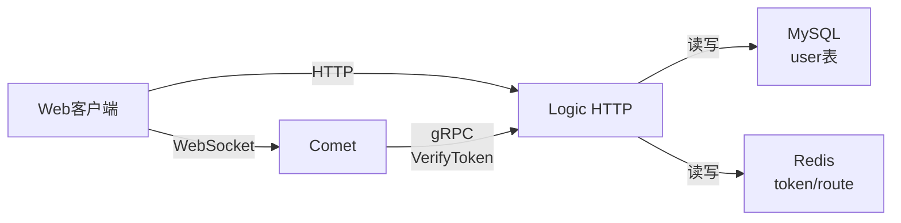
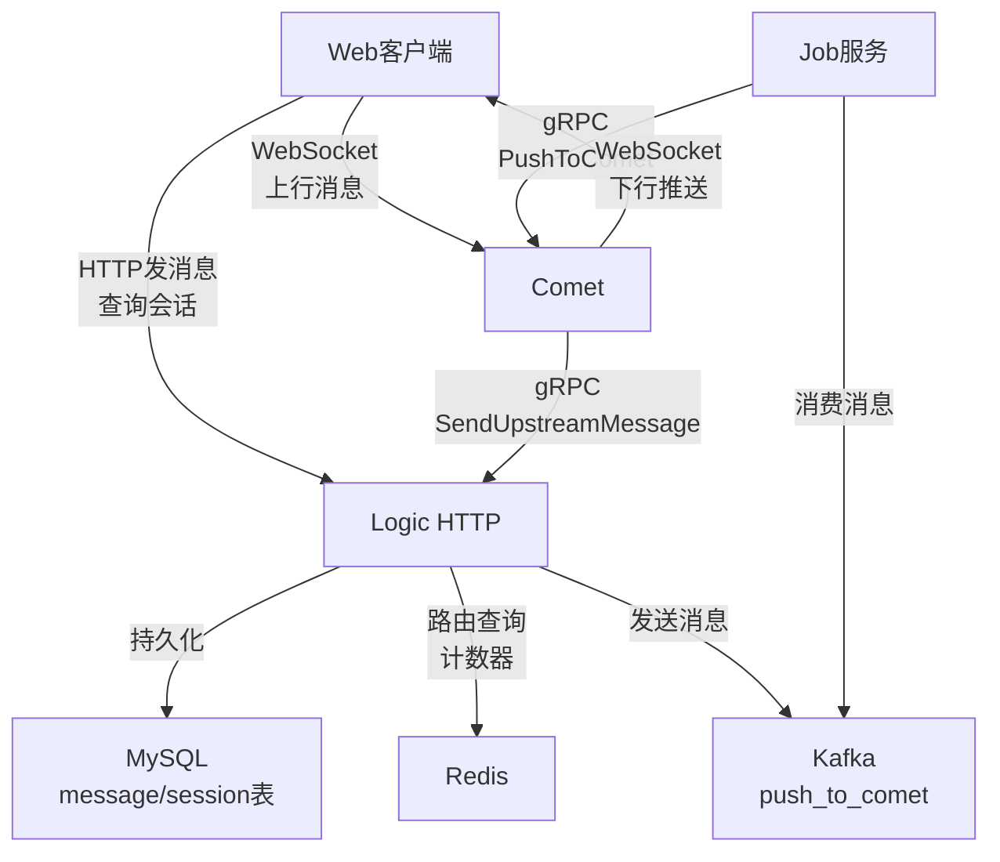
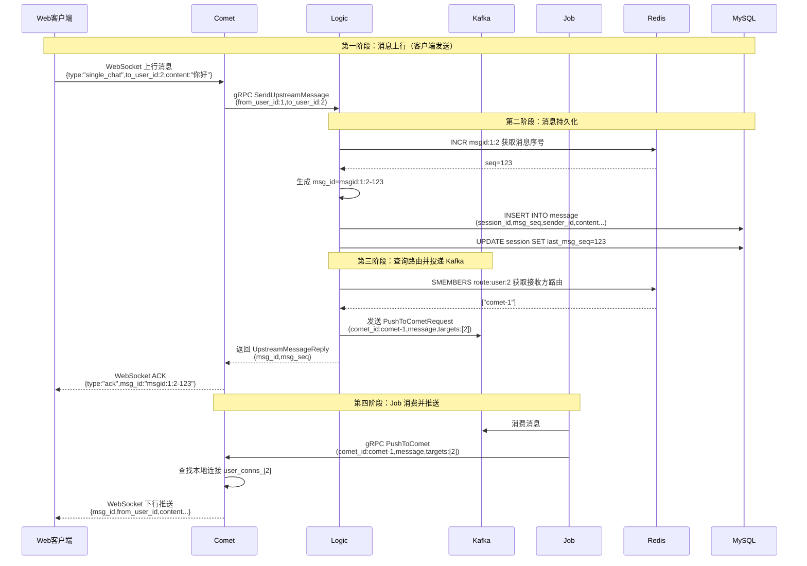
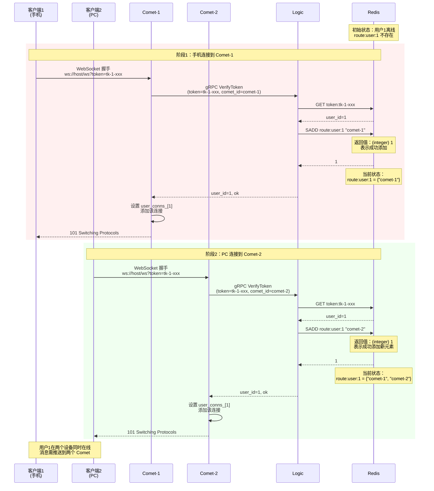
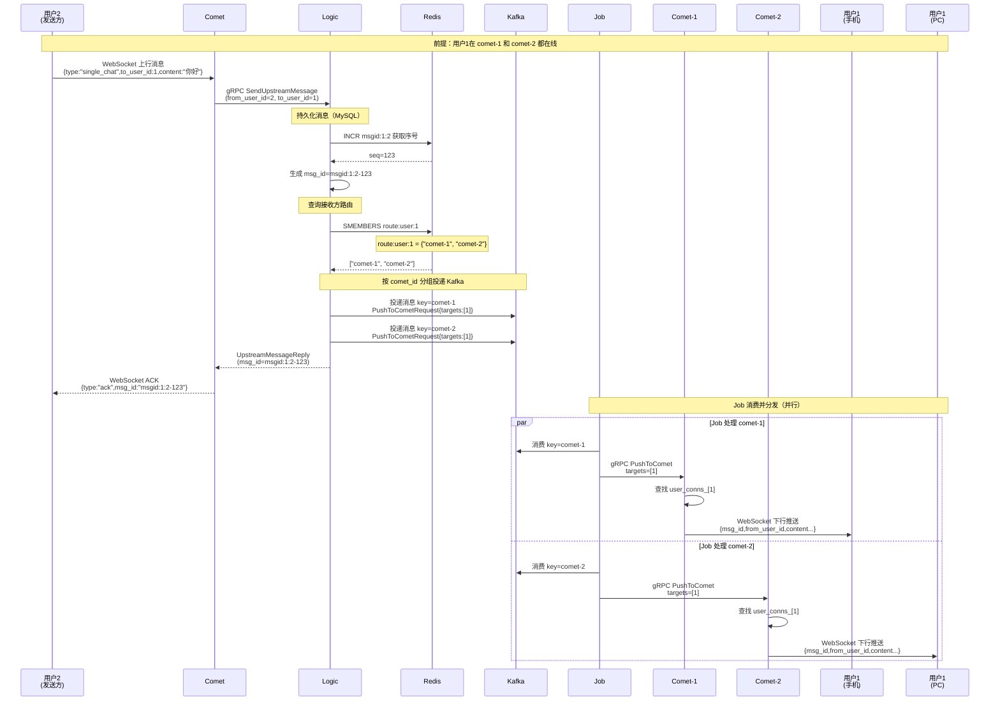
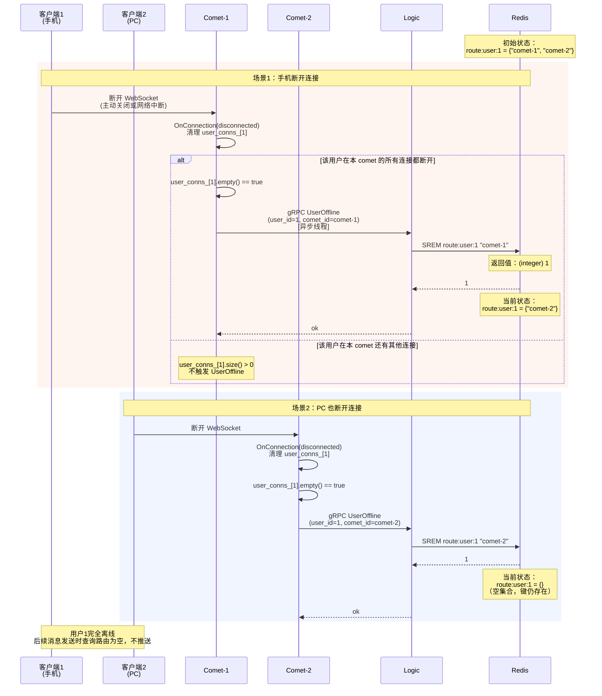

# Spark Push 消息子集详细教学文档

本文档是基于 C++ 的实时消息推送系统的**消息子集**教学材料，在认证子集的基础上新增单聊消息功能。

---

## 文档目录

- [0. 目标与范围](#0-目标与范围)
- [1. 新增功能概览](#1-新增功能概览)
- [2. 协议设计](#2-协议设计)
- [3. 单聊消息完整流程](#3-单聊消息完整流程)
- [4. Redis 路由设计详解](#4-redis-路由设计详解)
- [5. 数据库设计](#5-数据库设计)
- [6. Kafka 消息队列设计](#6-kafka-消息队列设计)
- [7. 关键代码实现](#7-关键代码实现)
- [8. 构建与运行](#8-构建与运行)
- [9. 功能测试](#9-功能测试)
- [10. 常见问题](#10-常见问题)

---

# 0. 目标与范围

## 0.1 项目概述

本项目是 **Spark Push 03_msg_subset（消息子集）**，在 02_auth_subset（认证子集）的基础上，新增了**一对一单聊消息**功能。系统采用微服务架构，包含三个核心服务：

- **Logic 服务**：负责业务逻辑（消息路由、消息持久化、会话管理）
- **Comet 服务**：负责长连接管理（WebSocket 网关，消息推送）
- **Job 服务**：负责消息分发（从 Kafka 消费消息并推送到 Comet）

## 0.2 新增功能范围

相比认证子集（02_auth_subset），本项目新增：

1. **单聊消息发送**
   - 通过 WebSocket 上行发送消息
   - 通过 HTTP API 发送消息

2. **消息持久化**
   - MySQL 存储消息内容（message 表）
   - MySQL 存储会话信息（session 表）

3. **会话管理**
   - 自动创建单聊会话（格式：`s_{user1}_{user2}`）
   - 会话序号管理（last_msg_seq）

4. **消息路由与推送**
   - 基于 Redis 的用户路由查找
   - Kafka 异步消息队列
   - Job 服务多线程分发

5. **消息 ID 生成**
   - Redis INCR 原子递增
   - 格式：`msgid:{user1}:{user2}-{seq}`

6. **未读计数**
   - 基于 session.last_msg_seq 计算
   - Redis 缓存用户已读位置

7. **HTTP 查询接口**
   - 会话列表查询
   - 未读消息数查询

## 0.3 技术栈

- **网络库**：muduo (Reactor 模式)
- **RPC 框架**：gRPC + Protobuf
- **消息队列**：Kafka (librdkafka)
- **数据存储**：
  - MySQL（用户、会话、消息）
  - Redis（token、路由、计数器）
- **构建工具**：CMake 3.14+
- **编程语言**：C++17

## 0.4 代码路径

```
03_msg_subset/
├── CMakeLists.txt          # 顶层构建配置
├── proto/                  # Protobuf 定义
│   └── spark_push.proto    # gRPC 服务与消息定义
├── common/                 # 公共组件
│   ├── config.*            # 配置加载
│   ├── logging.*           # 日志
│   ├── mysql_pool.*        # MySQL 连接池
│   ├── redis_pool.*        # Redis 连接池
│   ├── thread_pool.*       # 线程池
│   ├── kafka_producer.*    # Kafka 生产者
│   └── kafka_consumer.*    # Kafka 消费者
├── logic/                  # Logic 服务
│   ├── main.cpp            # 启动入口
│   ├── http_server.*       # HTTP API（发送消息、查询接口）
│   ├── grpc_service.*      # gRPC 接口（鉴权、上行消息）
│   ├── user_dao.*          # 用户数据访问
│   ├── session_dao.*       # 会话数据访问
│   ├── message_dao.*       # 消息数据访问
│   ├── conversation_store.* # 会话存储抽象层
│   └── redis_store.*       # Redis 操作封装
├── comet/                  # Comet 服务
│   ├── main.cpp            # 启动入口
│   ├── comet_server.*      # WebSocket 服务器
│   ├── comet_grpc_service.* # gRPC 服务（接收下行推送）
│   └── websocket_utils.*   # WebSocket 帧构造
├── job/                    # Job 服务
│   ├── main.cpp            # 启动入口
│   └── service.*           # Kafka 消费与消息分发
├── conf/                   # 配置文件
│   ├── logic.conf
│   ├── comet.conf
│   └── job.conf
└── sql/                    # 数据库脚本
    └── schema.sql          # 表结构（需手动添加 message/session 表）
```

---

# 1. 新增功能概览

## 1.1 功能对比表

| 功能模块 | 02_auth_subset | 03_msg_subset |
|---------|---------------|--------------|
| 用户注册/登录 | ✅ | ✅ |
| Token 鉴权 | ✅ | ✅ |
| WebSocket 握手 | ✅ | ✅ |
| 路由管理 | ✅ | ✅ |
| **单聊消息发送** | ❌ | ✅ |
| **消息持久化** | ❌ | ✅ |
| **会话管理** | ❌ | ✅ |
| **Kafka 消息队列** | ❌ | ✅ |
| **Job 服务** | ❌ | ✅ |
| **未读计数** | ❌ | ✅ |
| **HTTP 发送消息** | ❌ | ✅ |
| **会话列表查询** | ❌ | ✅ |

## 1.2 核心服务架构对比

**02_auth_subset**：


**03_msg_subset（新增）**：


---

# 2. 协议设计

## 2.1 Protobuf 消息定义

### 2.1.1 ChatMessage（核心消息结构）

```protobuf
message ChatMessage {
  string msg_id = 1;          // 服务端生成的消息 ID（唯一）
  string session_id = 2;      // 会话 ID（如 s_1_2）
  int64 msg_seq = 3;          // 消息序号（用于排序和未读计算）
  int64 sender_id = 4;        // 发送方用户 ID
  int64 timestamp_ms = 5;     // 消息时间戳（毫秒）
  string msg_type = 6;        // 消息类型（text/image/system...）
  string content_json = 7;    // 消息内容（JSON 格式）
  string client_msg_id = 8;   // 客户端消息 ID（用于去重、ACK）
}
```

**字段说明**：
- `msg_id`：由服务端生成，格式为 `msgid:{user1}:{user2}-{seq}`（如 `msgid:1:2-123`）
- `session_id`：单聊格式为 `s_{较小user_id}_{较大user_id}`（如 `s_1_2`）
- `msg_seq`：由客户端提供（可选），用于客户端消息排序
- `content_json`：包含实际消息内容，如 `{"text":"你好","type":"single_chat"}`

### 2.1.2 上行消息请求（Comet -> Logic）

```protobuf
message UpstreamMessageRequest {
  int64 from_user_id = 1;      // 发送方用户 ID
  string client_msg_id = 2;    // 客户端消息 ID
  string scene = 3;            // 场景类型（single=单聊）
  int64 to_user_id = 4;        // 单聊接收方用户 ID
  string content_json = 5;     // 消息内容 JSON
}
```

### 2.1.3 下行推送请求（Logic -> Job -> Comet）

```protobuf
message FanoutTarget {
  int64 user_id = 1;           // 目标用户 ID
}

message PushToCometRequest {
  string comet_id = 1;         // 目标 Comet 服务器 ID
  ChatMessage message = 2;     // 要推送的消息
  repeated FanoutTarget targets = 3;  // 目标用户列表
}
```

## 2.2 WebSocket 协议

### 2.2.1 上行消息格式（客户端 -> Comet）

```json
{
  "type": "single_chat",
  "to_user_id": 2,
  "content": "你好",
  "client_msg_id": "c-123456789",
  "msg_seq": 1
}
```

**字段说明**：
- `type`：固定为 `"single_chat"`
- `to_user_id`：接收方用户 ID
- `content`：消息内容（文本）
- `client_msg_id`：客户端生成的唯一 ID（用于去重和 ACK）
- `msg_seq`：客户端消息序号（可选）

### 2.2.2 下行消息格式（Comet -> 客户端）

```json
{
  "msg_id": "msgid:1:2-123",
  "session_id": "s_1_2",
  "msg_seq": 1,
  "from_user_id": 1,
  "to_user_id": 2,
  "create_time": 1701234567890,
  "content": "你好",
  "client_msg_id": "c-123456789",
  "sender": {
    "uid": 1,
    "name": "用户A"
  }
}
```

### 2.2.3 ACK 响应格式（Comet -> 客户端）

```json
{
  "type": "ack",
  "msg_id": "msgid:1:2-123"
}
```

## 2.3 HTTP API 接口

### 2.3.1 发送消息接口

**请求**：
```
POST /api/message/send
Content-Type: application/json

{
  "from_user_id": 1,
  "to_user_id": 2,
  "content": "你好",
  "msg_seq": 1
}
```

**响应**：
```json
{
  "code": 0,
  "message": "ok",
  "data": {
    "session_id": "s_1_2",
    "msg_id": "msgid:1:2-123",
    "msg_seq": 1
  }
}
```

### 2.3.2 查询会话列表接口

**请求**：
```
POST /api/session/list_single
Content-Type: application/json

{
  "user_id": 1
}
```

**响应**：
```json
{
  "code": 0,
  "message": "ok",
  "data": {
    "sessions": [
      {
        "session_id": "s_1_2",
        "user1_id": 1,
        "user2_id": 2,
        "last_msg_seq": 123
      }
    ]
  }
}
```

### 2.3.3 查询未读消息数接口

**请求**：
```
POST /api/session/unread
Content-Type: application/json

{
  "user_id": 1,
  "session_id": "s_1_2"
}
```

**响应**：
```json
{
  "code": 0,
  "message": "ok",
  "data": {
    "session_id": "s_1_2",
    "unread_count": 5
  }
}
```

---

# 3. 单聊消息完整流程

## 3.1 整体架构图



## 3.2 WebSocket 上行流程详解

### 3.2.1 客户端发送消息

**WebSocket 帧格式（客户端 -> Comet）**：
```javascript
// 前端代码示例
const ws = new WebSocket('ws://localhost:9000/ws?token=xxx');

ws.onopen = function() {
  const message = {
    type: 'single_chat',
    to_user_id: 2,
    content: '你好',
    client_msg_id: 'c-' + Date.now(),
    msg_seq: 1
  };
  ws.send(JSON.stringify(message));
};

ws.onmessage = function(event) {
  const data = JSON.parse(event.data);
  if (data.type === 'ack') {
    console.log('消息已确认：', data.msg_id);
  } else {
    console.log('收到新消息：', data);
  }
};
```

### 3.2.2 Comet 解析并转发（comet_server.cpp）

```cpp
void CometServer::OnTextMessage(const TcpConnectionPtr& conn,
                                ConnContext& ctx,
                                const std::string& payload) {
    LOG_INFO << "Recv text from user " << ctx.user_id << ": " << payload;

    // 1. 解析上行消息（提取 type、to_user_id 等字段）
    UpstreamMessageMeta meta;
    if (!ParseUpstreamMessage(payload, &meta)) {
        std::string frame = BuildWebSocketTextFrame(
            "{\"type\":\"error\",\"message\":\"invalid message format\"}");
        conn->send(frame);
        return;
    }

    // 2. 验证消息类型
    const std::string& type = meta.type;
    std::string scene;
    if (type == "single_chat") {
        if (meta.to_user_id <= 0) {
            std::string frame = BuildWebSocketTextFrame(
                "{\"type\":\"error\",\"message\":\"to_user_id must be positive\"}");
            conn->send(frame);
            return;
        }
        scene = "single";
    } else {
        std::string frame = BuildWebSocketTextFrame(
            "{\"type\":\"error\",\"message\":\"unsupported type\"}");
        conn->send(frame);
        return;
    }

    // 3. 构造 gRPC 请求并调用 Logic
    UpstreamMessageRequest req;
    req.set_from_user_id(ctx.user_id);          // 发送方（从连接上下文获取）
    req.set_scene(scene);                       // 场景（单聊）
    req.set_client_msg_id(meta.client_msg_id);  // 客户端消息 ID
    req.set_to_user_id(meta.to_user_id);        // 接收方
    req.set_content_json(payload);              // 原始 JSON

    UpstreamMessageReply rep;
    grpc::ClientContext rpc_ctx;
    auto status = logic_stub_->SendUpstreamMessage(&rpc_ctx, req, &rep);
    
    if (!status.ok() || rep.error().code() != 0) {
        std::string msg = status.ok() ? rep.error().message()
                                      : status.error_message();
        LOG_ERROR << "SendUpstreamMessage failed: " << msg;
        std::string frame = BuildWebSocketTextFrame(
            "{\"type\":\"error\",\"message\":\"send failed\"}");
        conn->send(frame);
        return;
    }

    // 4. 返回 ACK 给客户端
    std::string frame = BuildWebSocketTextFrame(
        "{\"type\":\"ack\",\"msg_id\":\"" + rep.message().msg_id() + "\"}");
    conn->send(frame);
}
```

## 3.3 Logic 处理流程详解

### 3.3.1 接收上行消息（grpc_service.cpp）

```cpp
::grpc::Status LogicServiceImpl::SendUpstreamMessage(
    ::grpc::ServerContext*, 
    const ::sparkpush::UpstreamMessageRequest* request,
    ::sparkpush::UpstreamMessageReply* response) {
    
    const std::string& scene = request->scene();
    int64_t from_user = request->from_user_id();
    
    // 1. 参数验证
    if (from_user <= 0) {
        SetError(response->mutable_error(), 400, "from_user_id must be positive");
        return ::grpc::Status::OK;
    }
    if (scene != "single") {
        SetError(response->mutable_error(), 400, "only single scene supported");
        return ::grpc::Status::OK;
    }
    
    int64_t to_user = request->to_user_id();
    if (to_user <= 0) {
        SetError(response->mutable_error(), 400, "to_user_id must be positive");
        return ::grpc::Status::OK;
    }

    // 2. 构造会话信息（单聊会话 ID 格式：s_{min}_{max}）
    Session session;
    session.type = SessionType::kSingle;
    session.user1_id = std::min(from_user, to_user);
    session.user2_id = std::max(from_user, to_user);
    session.id = "s_" + std::to_string(session.user1_id) + "_" +
                 std::to_string(session.user2_id);

    // 3. 生成消息 ID（Redis INCR 原子递增）
    std::string msg_id;
    int64_t msgid_seq = 0;
    if (redis_store_->NextSingleMsgId(session.user1_id, session.user2_id, &msgid_seq)) {
        msg_id = "msgid:" + std::to_string(session.user1_id) + ":" +
                 std::to_string(session.user2_id) + "-" + std::to_string(msgid_seq);
    } else {
        SetError(response->mutable_error(), 500, "generate msg_id failed");
        return ::grpc::Status::OK;
    }

    // 4. 解析客户端 msg_seq（可选字段）
    int64_t client_msg_seq = 0;
    bool has_client_msg_seq = false;
    try {
        auto j = nlohmann::json::parse(request->content_json());
        if (j.contains("msg_seq")) {
            client_msg_seq = j.at("msg_seq").get<int64_t>();
            has_client_msg_seq = true;
        }
    } catch (...) {}

    // 5. 获取当前时间戳
    int64_t now_ms = std::chrono::duration_cast<std::chrono::milliseconds>(
                         std::chrono::system_clock::now().time_since_epoch())
                         .count();

    // 6. 构造完整消息 JSON（补充 msg_id、create_time、sender 信息）
    std::string final_json = request->content_json();
    try {
        auto j = nlohmann::json::parse(final_json);
        j["msg_id"] = msg_id;
        j["create_time"] = now_ms;
        j["from_user_id"] = from_user;
        if (!j.contains("client_msg_id")) {
            j["client_msg_id"] = request->client_msg_id();
        }
        // 查询发送方用户信息
        if (user_dao_) {
            User u;
            std::string ue;
            if (user_dao_->GetUserById(from_user, &u, &ue)) {
                j["sender"] = {
                    {"uid", from_user},
                    {"name", u.name.empty() ? u.account : u.name}
                };
            }
        }
        final_json = j.dump();
    } catch (...) {}

    // 7. 持久化消息到 MySQL
    Message msg;
    std::string err;
    bool append_ok = conversation_store_->AppendMessage(
        session, msg_id, 
        has_client_msg_seq ? client_msg_seq : 0, 
        from_user,
        "text", final_json, now_ms, 
        request->client_msg_id(), 
        &msg, &err);
    
    if (!append_ok) {
        SetError(response->mutable_error(), 500, "append message failed: " + err);
        return ::grpc::Status::OK;
    }

    // 8. 更新消息内容（补充实际的 msg_seq）
    try {
        auto j = nlohmann::json::parse(final_json);
        j["msg_id"] = msg.msg_id;
        j["msg_seq"] = msg.msg_seq;
        msg.content_json = j.dump();
    } catch (...) {}

    // 9. 填充响应
    ChatMessage* cm = response->mutable_message();
    cm->set_msg_id(msg.msg_id);
    cm->set_session_id(msg.session_id);
    cm->set_msg_seq(msg.msg_seq);
    cm->set_sender_id(msg.sender_id);
    cm->set_timestamp_ms(msg.timestamp_ms);
    cm->set_msg_type(msg.msg_type);
    cm->set_content_json(msg.content_json);
    cm->set_client_msg_id(msg.client_msg_id);
    SetError(response->mutable_error(), 0, "ok");

    // 10. 查询接收方路由并投递 Kafka
    std::unordered_map<std::string, std::vector<int64_t>> comet_to_users;
    std::vector<std::string> comets;
    if (redis_store_->GetUserRoutes(to_user, &comets)) {
        for (const auto& cid : comets) {
            comet_to_users[cid].push_back(to_user);
        }
    }

    if (!producer_) {
        LOG_ERROR << "Kafka producer not ready";
        return ::grpc::Status::OK;
    }

    if (comet_to_users.empty()) {
        LOG_INFO << "no online targets, skip push";
        return ::grpc::Status::OK;
    }

    for (const auto& kv : comet_to_users) {
        const std::string& comet_id = kv.first;
        const auto& users = kv.second;

        PushToCometRequest req;
        req.set_comet_id(comet_id);
        *req.mutable_message() = *cm;
        for (int64_t uid : users) {
            auto* target = req.add_targets();
            target->set_user_id(uid);
        }

        std::string payload;
        if (!req.SerializeToString(&payload)) {
            LOG_ERROR << "Serialize PushToCometRequest failed";
            continue;
        }
        
        LOG_INFO << "Sending push to comet " << comet_id
                 << " for " << users.size() << " users";
        if (!producer_->Send(comet_id, payload)) {
            LOG_ERROR << "Kafka send failed for comet " << comet_id;
        }
    }

    return ::grpc::Status::OK;
}
```

## 3.4 消息持久化流程

### 3.4.1 ConversationStore::AppendMessage

```cpp
bool ConversationStore::AppendMessage(
    const Session& session,
    const std::string& msg_id,
    int64_t msg_seq,
    int64_t sender_id,
    const std::string& msg_type,
    const std::string& content_json,
    int64_t timestamp_ms,
    const std::string& client_msg_id,
    Message* out_msg,
    std::string* err) {
    
    // 1. 确保会话存在（若不存在则创建）
    if (session.type == SessionType::kSingle) {
        std::string session_err;
        if (!session_dao_->GetOrCreateSingleSession(
                session.user1_id, session.user2_id, nullptr, &session_err)) {
            LOG_ERROR << "GetOrCreateSingleSession failed: " << session_err;
        }
    }

    // 2. 构造消息对象
    Message msg;
    msg.session_id = session.id;
    msg.msg_id = msg_id;
    msg.msg_seq = msg_seq;
    msg.sender_id = sender_id;
    msg.msg_type = msg_type;
    msg.content_json = content_json;
    msg.timestamp_ms = timestamp_ms;
    msg.client_msg_id = client_msg_id;

    // 3. 插入消息到 MySQL
    if (!message_dao_->InsertMessage(msg, err)) {
        return false;
    }

    // 4. 更新会话的 last_msg_seq（用于未读计数）
    // 从 msg_id 中解析出序号（格式：msgid:1:2-123）
    int64_t seq_from_msgid = 0;
    auto pos = msg_id.rfind('-');
    if (pos != std::string::npos) {
        try {
            seq_from_msgid = std::stoll(msg_id.substr(pos + 1));
        } catch (...) {}
    }
    if (seq_from_msgid > 0) {
        std::string update_err;
        if (!session_dao_->UpdateLastMsgSeq(session.id, seq_from_msgid, &update_err)) {
            LOG_ERROR << "UpdateLastMsgSeq failed: " << update_err;
        }
    }

    // 5. 返回消息
    if (out_msg) {
        *out_msg = msg;
    }
    return true;
}
```

### 3.4.2 SQL 操作细节

**插入消息（MessageDao::InsertMessage）**：
```sql
INSERT INTO message(
  session_id, msg_seq, sender_id, msg_type, 
  content_json, timestamp_ms, client_msg_id
) VALUES(?, ?, ?, ?, ?, ?, ?)
```

**更新会话序号（SessionDao::UpdateLastMsgSeq）**：
```sql
UPDATE `session` 
SET last_msg_seq = ? 
WHERE session_id = ? 
  AND last_msg_seq < ?  -- 只有当新序号更大时才更新
```

**创建会话（SessionDao::EnsureSingleSession）**：
```sql
INSERT INTO `session`(
  session_id, type, user1_id, user2_id, group_id, last_msg_seq
) VALUES(?, 0, ?, ?, 0, 0)
-- 若主键冲突（1062错误），则忽略（说明会话已存在）
```

## 3.5 Kafka 投递与消费

### 3.5.1 Logic 投递消息到 Kafka

**KafkaProducer::Send**：
```cpp
bool KafkaProducer::Send(const std::string& key, const std::string& value) {
    if (!producer_ || !topic_) {
        return false;
    }

    // 使用 key 作为分区键（相同 comet_id 的消息会发送到同一分区）
    RdKafka::ErrorCode err = producer_->produce(
        topic_.get(),
        RdKafka::Topic::PARTITION_UA,  // 自动选择分区
        RdKafka::Producer::RK_MSG_COPY,
        const_cast<char*>(value.data()),
        value.size(),
        key.empty() ? nullptr : &key,
        nullptr);
    
    if (err != RdKafka::ERR_NO_ERROR) {
        LOG_ERROR << "Kafka produce failed: " << RdKafka::err2str(err);
        return false;
    }

    producer_->poll(0);  // 触发内部回调
    return true;
}
```

**Kafka 消息格式**：
- **Topic**: `push_to_comet`
- **Key**: `comet_id`（如 `comet-1`）
- **Value**: `PushToCometRequest` 的 Protobuf 序列化字节流

### 3.5.2 Job 消费并转发

**JobRunner::HandleMessage**：
```cpp
void JobRunner::HandleMessage(const std::string& key, const std::string& value) {
    // 提交到线程池处理（避免阻塞消费线程）
    rpc_pool_.Submit([this, payload = value]() {
        PushToCometRequest req;
        if (!req.ParseFromString(payload)) {
            LOG_ERROR << "Failed to parse PushToCometRequest from Kafka";
            return;
        }
        ProcessPushRequest(req);
    });
}

void JobRunner::ProcessPushRequest(const PushToCometRequest& req) {
    const std::string& comet_id = req.comet_id();
    
    // 1. 获取 Comet gRPC Stub（支持多 Comet 节点）
    CometService::Stub* stub = GetStub(comet_id);
    if (!stub) {
        LOG_ERROR << "Unknown comet_id " << comet_id;
        return;
    }

    // 2. 调用 Comet 的 PushToComet gRPC 接口
    PushToCometReply reply;
    grpc::ClientContext ctx;
    LOG_INFO << "Processing PushToComet for comet_id=" << comet_id
             << ", msg_id=" << req.message().msg_id();

    auto status = stub->PushToComet(&ctx, req, &reply);
    if (!status.ok()) {
        LOG_ERROR << "PushToComet RPC failed: " << status.error_message();
        return;
    }
    if (reply.error().code() != 0) {
        LOG_ERROR << "Comet response error: " << reply.error().message();
    }
}
```

## 3.6 Comet 下行推送

### 3.6.1 CometServiceImpl::PushToComet

```cpp
::grpc::Status CometServiceImpl::PushToComet(
    ::grpc::ServerContext*,
    const ::sparkpush::PushToCometRequest* request,
    ::sparkpush::PushToCometReply* response) {
    
    LOG_INFO << "PushToComet received for comet_id=" << request->comet_id()
             << " msg_id=" << request->message().msg_id();
    
    // 1. 提取目标用户列表
    if (request->targets_size() > 0) {
        std::vector<int64_t> users;
        users.reserve(request->targets_size());
        for (const auto& t : request->targets()) {
            users.push_back(t.user_id());
        }
        
        // 2. 调用 CometServer 推送到 WebSocket 连接
        server_->PushToUsers(request->message(), users);
    }
    
    response->mutable_error()->set_code(0);
    response->mutable_error()->set_message("ok");
    return ::grpc::Status::OK;
}
```

### 3.6.2 CometServer::PushToUsers

```cpp
void CometServer::PushToUsers(
    const ChatMessage& msg,
    const std::vector<int64_t>& user_ids) {
    
    // 1. 使用消息内容或 msg_id 构造 payload
    std::string payload = msg.content_json().empty()
                        ? ("{\"msg_id\":\"" + msg.msg_id() + "\"}")
                        : msg.content_json();
    
    // 2. 构造 WebSocket 文本帧
    std::string frame = BuildWebSocketTextFrame(payload);
    
    // 3. 查找所有目标用户的连接
    std::vector<TcpConnectionPtr> conns;
    {
        std::lock_guard<std::mutex> lock(conns_mu_);
        for (int64_t uid : user_ids) {
            auto it = user_conns_.find(uid);
            if (it == user_conns_.end()) continue;
            for (const auto& c : it->second) {
                conns.push_back(c);
            }
        }
    }
    
    // 4. 批量发送（避免在锁内执行耗时操作）
    for (const auto& c : conns) {
        if (c->connected()) {
            c->send(frame);
        }
    }
}
```

---

# 4. Redis 路由设计详解

## 4.1 一对一聊天路由架构

### 4.1.1 核心问题

在分布式即时通讯系统中，需要解决的核心问题是：**如何找到目标用户当前连接在哪个 Comet 服务器上？**

**问题场景**：
```
用户A(user_id=1) 连接到 comet-1
用户B(user_id=2) 连接到 comet-2
用户C(user_id=3) 连接到 comet-1

当用户A给用户B发消息时：
1. 消息先到达 Logic 服务
2. Logic 需要知道用户B在哪个 Comet 上
3. Logic 将消息投递到 comet-2
4. comet-2 推送给用户B
```

**解决方案**：使用 Redis SET 结构存储用户到 Comet 的映射关系。

### 4.1.2 路由数据结构设计

**Redis Key-Value 设计**：
```
Key:   route:user:{user_id}
Type:  SET
Value: {comet_id1, comet_id2, ...}

示例：
route:user:1 = {"comet-1"}
route:user:2 = {"comet-1", "comet-2"}  # 用户在多个设备登录
```

**为什么使用 SET 而不是 String？**

| 数据结构 | 优点 | 缺点 | 适用场景 |
|---------|------|------|----------|
| **SET** | • 多设备支持<br>• 自动去重<br>• 原子操作 | • 查询稍复杂 | **本项目采用** |
| **String** | • 查询简单 | • 仅支持单设备<br>• 多设备需覆盖 | 单设备场景 |
| **Hash** | • 可存储额外信息 | • 操作复杂 | 需要元数据时 |

## 4.2 路由操作详解

### 4.2.1 添加路由（用户上线）

**时机**：WebSocket 握手鉴权成功后

**调用链路**：
```
Comet::HandleHandshake() 
  -> Logic::VerifyToken() [gRPC]
    -> RedisStore::AddRoute()
      -> Redis: SADD route:user:{uid} {comet_id}
```

**代码实现**（redis_store.cpp）：
```cpp
bool RedisStore::AddRoute(int64_t user_id, const std::string& comet_id) {
    if (!pool_) return false;
    auto guard = pool_->Acquire();
    redisContext* ctx = guard.get();
    if (!ctx) return false;
    
    // 使用 SADD 添加路由
    redisReply* reply = (redisReply*)redisCommand(
        ctx, "SADD route:user:%lld %s", 
        static_cast<long long>(user_id),
        comet_id.c_str());
    
    if (!reply) {
        LOG_ERROR << "Redis SADD route failed";
        return false;
    }
    
    // reply->integer 返回值说明：
    // 1 = 成功添加（新元素）
    // 0 = 已存在（重复添加，SET 自动去重）
    bool ok = (reply->type != REDIS_REPLY_ERROR);
    freeReplyObject(reply);
    return ok;
}
```

**Redis 命令演示**：
```bash
# 场景1：用户1首次连接到 comet-1
127.0.0.1:6379> SADD route:user:1 "comet-1"
(integer) 1  # 返回1表示成功添加

# 场景2：用户1又从另一个标签页连接到 comet-1（重复）
127.0.0.1:6379> SADD route:user:1 "comet-1"
(integer) 0  # 返回0表示已存在（SET自动去重）

# 场景3：用户1从平板连接到 comet-2
127.0.0.1:6379> SADD route:user:1 "comet-2"
(integer) 1  # 返回1表示新增

# 查看用户1的所有路由
127.0.0.1:6379> SMEMBERS route:user:1
1) "comet-1"
2) "comet-2"

# 查看路由数量
127.0.0.1:6379> SCARD route:user:1
(integer) 2
```

### 4.2.2 查询路由（发送消息时）

**时机**：Logic 收到上行消息后，需要找到接收方所在的 Comet

**调用链路**：
```
Logic::SendUpstreamMessage() [gRPC]
  -> RedisStore::GetUserRoutes(to_user_id)
    -> Redis: SMEMBERS route:user:{to_user_id}
  -> KafkaProducer::Send() [按 comet_id 分组投递]
```

**代码实现**（redis_store.cpp）：
```cpp
bool RedisStore::GetUserRoutes(int64_t user_id,
                               std::vector<std::string>* comets) {
    if (!pool_) return false;
    auto guard = pool_->Acquire();
    redisContext* ctx = guard.get();
    if (!ctx) return false;
    
    // 使用 SMEMBERS 查询所有 comet_id
    redisReply* reply = (redisReply*)redisCommand(
        ctx, "SMEMBERS route:user:%lld", 
        static_cast<long long>(user_id));
    
    if (!reply) {
        LOG_ERROR << "Redis SMEMBERS route failed";
        return false;
    }
    
    bool ok = false;
    if (reply->type == REDIS_REPLY_ARRAY) {
        ok = true;
        for (size_t i = 0; i < reply->elements; ++i) {
            redisReply* e = reply->element[i];
            if (e->type == REDIS_REPLY_STRING && e->str) {
                comets->push_back(e->str);
            }
        }
    }
    freeReplyObject(reply);
    return ok;
}
```

**Redis 命令演示**：
```bash
# 查询用户2在哪些 comet 上
127.0.0.1:6379> SMEMBERS route:user:2
1) "comet-1"
2) "comet-2"

# 查询不存在的用户
127.0.0.1:6379> SMEMBERS route:user:999
(empty array)

# 检查用户是否在特定 comet 上
127.0.0.1:6379> SISMEMBER route:user:2 "comet-1"
(integer) 1  # 存在

127.0.0.1:6379> SISMEMBER route:user:2 "comet-3"
(integer) 0  # 不存在
```

### 4.2.3 删除路由（用户下线）

**时机**：WebSocket 连接断开后，Comet 调用 Logic 的 UserOffline

**调用链路**：
```
Comet::OnConnection(disconnected)
  -> CometServer::NotifyUserOffline() [异步线程]
    -> Logic::UserOffline() [gRPC]
      -> RedisStore::RemoveRoute()
        -> Redis: SREM route:user:{uid} {comet_id}
```

**代码实现**（redis_store.cpp）：
```cpp
bool RedisStore::RemoveRoute(int64_t user_id, const std::string& comet_id) {
    if (!pool_) return false;
    auto guard = pool_->Acquire();
    redisContext* ctx = guard.get();
    if (!ctx) return false;
    
    // 使用 SREM 删除指定的 comet_id
    redisReply* reply = (redisReply*)redisCommand(
        ctx, "SREM route:user:%lld %s", 
        static_cast<long long>(user_id),
        comet_id.c_str());
    
    if (!reply) {
        LOG_ERROR << "Redis SREM route failed";
        return false;
    }
    
    // reply->integer 返回值说明：
    // 1 = 成功删除
    // 0 = 元素不存在
    bool ok = (reply->type != REDIS_REPLY_ERROR);
    freeReplyObject(reply);
    return ok;
}
```

**Comet 端触发删除**（comet_server.cpp）：
```cpp
void CometServer::OnConnection(const TcpConnectionPtr& conn) {
    if (!conn->connected()) {
        // 连接断开
        int64_t offline_uid = 0;
        bool need_offline = false;
        
        try {
            auto ctx = std::any_cast<ConnContext>(conn->getContext());
            if (ctx.user_id > 0) {
                std::lock_guard<std::mutex> lock(conns_mu_);
                auto it = user_conns_.find(ctx.user_id);
                if (it != user_conns_.end()) {
                    it->second.erase(conn);  // 移除该连接
                    
                    if (it->second.empty()) {
                        // 该用户在本 comet 上的所有连接都断开
                        user_conns_.erase(it);
                        offline_uid = ctx.user_id;
                        need_offline = true;
                    }
                }
            }
        } catch (const std::bad_any_cast&) {}
        
        // 异步通知 Logic 删除路由（避免阻塞 IO 线程）
        if (need_offline && offline_uid > 0) {
            NotifyUserOffline(offline_uid);
        }
        
        LOG_INFO << "Connection closed";
    }
}

void CometServer::NotifyUserOffline(int64_t user_id) {
    if (!logic_stub_) return;
    auto* stub = logic_stub_.get();
    std::string comet_id = comet_id_;

    // 使用独立线程异步调用（避免阻塞 IO 线程）
    std::thread([stub, user_id, comet_id]() {
        UserOfflineRequest req;
        req.set_user_id(user_id);
        req.set_comet_id(comet_id);
        
        SimpleReply rep;
        grpc::ClientContext ctx;
        auto status = stub->UserOffline(&ctx, req, &rep);
        
        if (!status.ok()) {
            LOG_ERROR << "UserOffline RPC failed for user " << user_id
                      << ": " << status.error_message();
        } else if (rep.error().code() != 0) {
            LOG_ERROR << "UserOffline logic error: " << rep.error().message();
        } else {
            LOG_INFO << "UserOffline reported for user " << user_id;
        }
    }).detach();
}
```

**Redis 命令演示**：
```bash
# 用户1断开 comet-1 上的所有连接
127.0.0.1:6379> SREM route:user:1 "comet-1"
(integer) 1  # 成功删除

127.0.0.1:6379> SMEMBERS route:user:1
1) "comet-2"  # 仅剩 comet-2

# 用户1断开所有连接
127.0.0.1:6379> SREM route:user:1 "comet-2"
(integer) 1

127.0.0.1:6379> SMEMBERS route:user:1
(empty array)
```

## 4.3 完整路由流程图

### 4.3.1 用户上线流程



### 4.3.2 消息发送与路由查询流程



### 4.3.3 用户下线流程



## 4.4 路由一致性问题与解决方案

### 4.4.1 问题：Comet 崩溃导致僵尸路由

**核心问题**：当 Comet 服务异常崩溃（kill -9、OOM、宕机）时，来不及执行 `OnConnection` 回调，无法调用 `UserOffline` 删除路由。

**问题场景**：
```
时间线：
T0: 用户1连接到 comet-1
    Redis: route:user:1 = {"comet-1"}
    Comet-1: user_conns_[1] = {conn1}

T1: comet-1 进程崩溃（kill -9 或 OOM）
    - 无法执行 OnConnection(disconnected) 回调
    - 无法调用 UserOffline gRPC
    - Redis 路由残留

T2: Redis 状态（错误）
    Redis: route:user:1 = {"comet-1"}  ← 僵尸路由！
    实际情况：用户1已离线

T3: 用户2给用户1发消息
    Logic 查询路由：route:user:1 = {"comet-1"}
    Logic 投递 Kafka：key=comet-1
    Job 调用 comet-1 gRPC：失败（进程已崩溃）
    结果：消息推送失败

T4: 用户1重新连接到 comet-2
    Redis: route:user:1 = {"comet-1", "comet-2"}
    - comet-1 是僵尸路由（无效）
    - comet-2 是有效路由
    结果：消息会尝试推送到两个 comet，浪费资源
```

**影响范围**：
- ❌ 消息推送失败率上升（尝试推送到已崩溃的 Comet）
- ❌ 资源浪费（无效的 Kafka 消息、gRPC 调用）
- ❌ 用户状态不准确（误判为在线）
- ❌ 运维成本增加（需要手动清理僵尸路由）

### 4.4.2 解决方案：路由 TTL + 心跳机制

**设计思路**：
1. **为每个路由设置 TTL**（如 30 秒）
2. **Comet 定期刷新 TTL**（如每 10 秒）
3. **Comet 崩溃后，TTL 到期自动删除路由**

**Redis 数据结构改进对比**：

| 方案 | Key 格式 | 类型 | TTL | 优缺点 |
|------|---------|------|-----|--------|
| **旧方案** | `route:user:{uid}` | SET | 无 | ❌ 崩溃后永久残留 |
| **新方案** | `route:user:{uid}:{comet}` | STRING | 30秒 | ✅ 自动清理僵尸路由 |

**新方案示例**：
```bash
# 旧方案（SET 结构，无 TTL）
route:user:1 = {"comet-1", "comet-2"}  # 永不过期

# 新方案（独立键 + TTL）
route:user:1:comet-1 = "1701234567" (TTL: 30s)
route:user:1:comet-2 = "1701234568" (TTL: 30s)
```

**心跳机制架构图**：
```
┌─────────────────────────────────────────────────────────┐
│                   Comet 服务器                           │
│                                                         │
│  ┌──────────────────────────────────────────────────┐  │
│  │  用户连接管理 (user_conns_)                       │  │
│  │  user_id -> set<TcpConnectionPtr>                │  │
│  └────────────────────┬─────────────────────────────┘  │
│                       │                                 │
│  ┌────────────────────▼─────────────────────────────┐  │
│  │  心跳守护线程 (HeartbeatDaemon)                   │  │
│  │                                                   │  │
│  │  while (running) {                               │  │
│  │    for (user_id in user_conns_) {                │  │
│  │      RefreshRoute(user_id, comet_id, TTL=30s)    │  │
│  │    }                                             │  │
│  │    sleep(10s)  // 每10秒刷新一次                 │  │
│  │  }                                               │  │
│  └────────────────────┬─────────────────────────────┘  │
│                       │                                 │
└───────────────────────┼─────────────────────────────────┘
                        │
                        │ SETEX route:user:{uid}:{cid} 30 {ts}
                        ▼
┌─────────────────────────────────────────────────────────┐
│                      Redis                              │
│                                                         │
│  route:user:1:comet-1 = "1701234567" (TTL: 30s) ⏰     │
│  route:user:2:comet-1 = "1701234568" (TTL: 30s) ⏰     │
│  route:user:3:comet-2 = "1701234569" (TTL: 30s) ⏰     │
│                                                         │
│  ✅ Comet 正常运行：每10秒刷新 TTL 为 30秒              │
│  ❌ Comet 崩溃后：30秒后这些键自动过期删除               │
└─────────────────────────────────────────────────────────┘
```

**代码实现示例**（comet_server.cpp）：
```cpp
// comet_server.h 添加成员
class CometServer {
private:
    std::thread heartbeat_thread_;
    std::atomic<bool> running_{false};
    
    void HeartbeatLoop();  // 心跳线程主循环
    void RefreshAllRoutes();  // 刷新所有在线用户的路由
};

// comet_server.cpp 实现
void CometServer::Start() {
    // ... 原有启动代码 ...
    
    // 启动心跳守护线程
    running_ = true;
    heartbeat_thread_ = std::thread([this]() {
        HeartbeatLoop();
    });
}

void CometServer::Stop() {
    running_ = false;
    if (heartbeat_thread_.joinable()) {
        heartbeat_thread_.join();
    }
    // ... 原有停止代码 ...
}

void CometServer::HeartbeatLoop() {
    while (running_) {
        RefreshAllRoutes();
        // 每 10 秒刷新一次（TTL 为 30 秒，留有 3 倍容错时间）
        std::this_thread::sleep_for(std::chrono::seconds(10));
    }
}

void CometServer::RefreshAllRoutes() {
    std::lock_guard<std::mutex> lock(conns_mu_);
    
    auto guard = redis_pool_->Acquire();
    redisContext* ctx = guard.get();
    if (!ctx) return;
    
    int refreshed = 0;
    for (const auto& [user_id, conn_set] : user_conns_) {
        if (!conn_set.empty()) {
            // 构造 key：route:user:{uid}:{comet_id}
            std::string key = "route:user:" + std::to_string(user_id) 
                            + ":" + comet_id_;
            std::string value = std::to_string(::time(nullptr));
            
            // 使用 SETEX 设置值并刷新 TTL 为 30 秒
            redisReply* reply = (redisReply*)redisCommand(
                ctx, "SETEX %s 30 %s", key.c_str(), value.c_str());
            
            if (reply) {
                if (reply->type == REDIS_REPLY_ERROR) {
                    LOG_ERROR << "Failed to refresh route for user " 
                              << user_id << ": " << reply->str;
                } else {
                    refreshed++;
                }
                freeReplyObject(reply);
            }
        }
    }
    
    LOG_DEBUG << "Refreshed routes for " << refreshed << " users";
}
```

**RedisStore 适配新方案**（查询操作需改用 SCAN）：
```cpp
bool RedisStore::GetUserRoutes(int64_t user_id,
                               std::vector<std::string>* comets) {
    if (!pool_) return false;
    auto guard = pool_->Acquire();
    redisContext* ctx = guard.get();
    if (!ctx) return false;
    
    // 使用 SCAN 查找所有匹配的 key
    // 模式：route:user:{uid}:*
    std::string pattern = "route:user:" + std::to_string(user_id) + ":*";
    
    // SCAN 0 MATCH pattern COUNT 100
    redisReply* reply = (redisReply*)redisCommand(
        ctx, "SCAN 0 MATCH %s COUNT 100", pattern.c_str());
    
    if (!reply) return false;
    
    bool ok = false;
    if (reply->type == REDIS_REPLY_ARRAY && reply->elements >= 2) {
        // reply->element[0] 是下一次游标（这里简化为单次扫描）
        // reply->element[1] 是匹配的 key 列表
        redisReply* keys = reply->element[1];
        if (keys->type == REDIS_REPLY_ARRAY) {
            ok = true;
            for (size_t i = 0; i < keys->elements; ++i) {
                redisReply* key = keys->element[i];
                if (key->type == REDIS_REPLY_STRING && key->str) {
                    // 从 key 中提取 comet_id
                    // route:user:1:comet-1 -> comet-1
                    std::string key_str(key->str);
                    auto pos = key_str.rfind(':');
                    if (pos != std::string::npos) {
                        comets->push_back(key_str.substr(pos + 1));
                    }
                }
            }
        }
    }
    freeReplyObject(reply);
    return ok;
}
```

**测试验证流程**：
```bash
# === 测试场景：验证 TTL 自动清理 ===

# 步骤1：启动 Comet 并建立连接
websocat "ws://localhost:9000/ws?token=tk-1-xxx" &
WS_PID=$!

# 步骤2：观察 Redis 中的路由（带 TTL）
redis-cli
127.0.0.1:6379> KEYS route:user:1:*
1) "route:user:1:comet-1"

127.0.0.1:6379> TTL route:user:1:comet-1
(integer) 28  # 还剩 28 秒

127.0.0.1:6379> GET route:user:1:comet-1
"1701234567"  # 时间戳

# 步骤3：等待 10 秒，观察 TTL 自动刷新
sleep 10
127.0.0.1:6379> TTL route:user:1:comet-1
(integer) 30  # 刷新回 30 秒 ✅

# 步骤4：模拟 Comet 崩溃（kill -9）
kill -9 $(pgrep comet_server)

# 步骤5：观察 Redis，路由倒计时
127.0.0.1:6379> TTL route:user:1:comet-1
(integer) 25
... 等待 5 秒 ...
127.0.0.1:6379> TTL route:user:1:comet-1
(integer) 20
... 等待 20 秒 ...

# 步骤6：验证自动清理
127.0.0.1:6379> TTL route:user:1:comet-1
(integer) -2  # -2 表示键已不存在 ✅

127.0.0.1:6379> EXISTS route:user:1:comet-1
(integer) 0  # 已自动清理 ✅
```

**对比总结**：

| 维度 | 旧方案（SET 无 TTL） | 新方案（独立键 + TTL） |
|------|---------------------|----------------------|
| **崩溃后路由** | 永久残留 ❌ | 30秒自动清理 ✅ |
| **查询复杂度** | O(1) SMEMBERS | O(N) SCAN（N=用户连接数） |
| **存储开销** | 1 个 KEY | M 个 KEY（M=comet数） |
| **推荐场景** | 可靠重启环境 | 生产环境 |

## 4.5 消息 ID 生成器设计

### 4.5.1 三种 ID 的设计原因与用途

在即时通讯系统中，有三种不同的消息标识符，它们各有用途：

| ID 类型 | 生成方 | 格式 | 用途 | 是否必需 |
|---------|-------|------|------|----------|
| **msg_id** | 服务端（Logic） | `msgid:1:2-123` | 全局唯一标识<br/>去重、追踪 | ✅ 必需 |
| **msg_seq** | 客户端 | 整数（如 `1, 2, 3...`） | 客户端本地排序<br/>乱序检测 | ⚠️ 可选 |
| **client_msg_id** | 客户端 | 字符串（如 `c-123456`） | 客户端去重<br/>ACK 匹配 | ⚠️ 可选 |

#### 4.5.1.1 msg_id（服务端消息 ID）

**为什么需要 msg_id？**

1. **全局唯一性**：跨用户、跨会话、跨时间都唯一
2. **消息去重**：防止网络重传导致重复入库
3. **消息追踪**：日志中可追踪消息的完整生命周期
4. **未读计算**：基于 msg_id 中的序号计算未读数

**msg_id 格式设计**：
```
格式：msgid:{user1}:{user2}-{seq}
示例：msgid:1:2-123

组成部分：
- 前缀：msgid（标识消息 ID 类型）
- user1：较小的 user_id（规范化）
- user2：较大的 user_id
- seq：Redis INCR 原子递增的序号

为什么要 user1 < user2？
- 保证相同两人的聊天使用同一个计数器
- 避免 A->B 和 B->A 使用不同的序号
```

**代码实现**：
```cpp
// Logic 收到上行消息后生成 msg_id
int64_t user1 = std::min(from_user, to_user);
int64_t user2 = std::max(from_user, to_user);

int64_t seq = 0;
if (redis_store_->NextSingleMsgId(user1, user2, &seq)) {
    std::string msg_id = "msgid:" + std::to_string(user1) + ":" +
                         std::to_string(user2) + "-" + std::to_string(seq);
    // 输出：msgid:1:2-123
}
```

#### 4.5.1.2 msg_seq（客户端消息序号）

**为什么需要 msg_seq？**

1. **客户端本地排序**：客户端按 msg_seq 排序展示消息
2. **乱序检测**：检测网络导致的消息乱序
3. **丢包检测**：发现序号不连续时可以请求补发
4. **离线消息拉取**：`获取 msg_seq > 100 的消息`

**msg_seq 使用场景**：
```javascript
// 客户端示例：发送消息时带上 msg_seq
let localSeq = 1;

function sendMessage(content) {
  const message = {
    type: 'single_chat',
    to_user_id: 2,
    content: content,
    client_msg_id: 'c-' + Date.now(),
    msg_seq: localSeq++  // 客户端维护的序号
  };
  ws.send(JSON.stringify(message));
}

// 接收消息时检测乱序
let lastReceivedSeq = 0;

ws.onmessage = function(event) {
  const msg = JSON.parse(event.data);
  if (msg.msg_seq) {
    if (msg.msg_seq != lastReceivedSeq + 1) {
      console.warn('消息乱序或丢失！', 
                   'expected:', lastReceivedSeq + 1, 
                   'got:', msg.msg_seq);
      // 可以请求补发丢失的消息
    }
    lastReceivedSeq = msg.msg_seq;
  }
};
```

**注意事项**：
- msg_seq 由客户端生成，服务端**不验证其唯一性**
- 服务端会原样存储并转发 msg_seq
- 不同客户端的 msg_seq 可能重复（这是正常的）

#### 4.5.1.3 client_msg_id（客户端消息 ID）

**为什么需要 client_msg_id？**

1. **客户端去重**：防止网络抖动导致重复发送
2. **ACK 匹配**：客户端收到 ACK 时，根据 client_msg_id 更新 UI
3. **消息状态管理**：`发送中 -> 发送成功 -> 已送达`

**client_msg_id 使用场景**：
```javascript
// 客户端示例：管理消息状态
const pendingMessages = new Map();

function sendMessage(content) {
  const clientMsgId = 'c-' + Date.now() + '-' + Math.random();
  const message = {
    type: 'single_chat',
    to_user_id: 2,
    content: content,
    client_msg_id: clientMsgId
  };
  
  // 记录为"发送中"
  pendingMessages.set(clientMsgId, {
    status: 'sending',
    content: content,
    timestamp: Date.now()
  });
  
  // 显示"发送中"的消息
  displayMessage(content, 'sending');
  
  ws.send(JSON.stringify(message));
}

// 收到 ACK 时更新状态
ws.onmessage = function(event) {
  const data = JSON.parse(event.data);
  
  if (data.type === 'ack') {
    const pending = pendingMessages.get(data.client_msg_id);
    if (pending) {
      // 更新为"发送成功"
      pending.status = 'sent';
      pending.msg_id = data.msg_id;
      updateMessageStatus(data.client_msg_id, 'sent');
      
      // 可以在一段时间后移除
      setTimeout(() => {
        pendingMessages.delete(data.client_msg_id);
      }, 60000);
    }
  }
};
```

**注意事项**：
- client_msg_id 由客户端生成，建议格式：`c-{timestamp}-{random}`
- 服务端会原样存储并在 ACK 中返回
- 同一个 client_msg_id 重复发送时，服务端应该去重（本项目简化版未实现）

### 4.5.2 Redis INCR 原子递增

**数据结构**：
```
Key:   msgid:{user1}:{user2}  (user1 < user2，保证顺序)
Type:  STRING (存储整数)
Value: 当前序号

示例：
msgid:1:2 = "123"  # 用户1和用户2的聊天已有123条消息
msgid:1:3 = "45"   # 用户1和用户3的聊天已有45条消息
```

**代码实现**（redis_store.cpp）：
```cpp
bool RedisStore::NextSingleMsgId(int64_t user1, int64_t user2, int64_t* seq) {
    if (!seq


**代码实现**（redis_store.cpp）：
```cpp
bool RedisStore::NextSingleMsgId(int64_t user1, int64_t user2, int64_t* seq) {
    if (!pool_ || !seq) return false;
    auto guard = pool_->Acquire();
    redisContext* ctx = guard.get();
    if (!ctx) return false;
    
    // 确保 user1 < user2（规范化）
    if (user1 > user2) {
        std::swap(user1, user2);
    }
    
    // 构造 key：msgid:{user1}:{user2}
    std::string key = "msgid:" + std::to_string(user1) + ":" + 
                      std::to_string(user2);
    
    // 使用 INCR 原子递增
    redisReply* reply = (redisReply*)redisCommand(ctx, "INCR %s", key.c_str());
    
    if (!reply) {
        LOG_ERROR << "Redis INCR msgid failed";
        return false;
    }
    
    bool ok = false;
    if (reply->type == REDIS_REPLY_INTEGER) {
        *seq = reply->integer;  // 返回递增后的值
        ok = true;
    }
    freeReplyObject(reply);
    return ok;
}
```

**Redis 命令演示**：
```bash
# 场景1：用户1给用户2发第一条消息
127.0.0.1:6379> INCR msgid:1:2
(integer) 1  # 返回1，这是第一条消息

# 场景2：用户1给用户2发第二条消息
127.0.0.1:6379> INCR msgid:1:2
(integer) 2  # 返回2

# 场景3：用户2给用户1发消息（注意：使用相同的 key）
# 代码中会自动规范化为 msgid:1:2
127.0.0.1:6379> INCR msgid:1:2
(integer) 3  # 返回3

# 查看当前序号
127.0.0.1:6379> GET msgid:1:2
"3"

# 并发测试：同时执行多个 INCR（Redis 单线程保证原子性）
127.0.0.1:6379> INCR msgid:1:2
(integer) 4
127.0.0.1:6379> INCR msgid:1:2
(integer) 5
127.0.0.1:6379> INCR msgid:1:2
(integer) 6
# 结果：序号严格递增，无重复 ✅
```

**INCR 命令的原子性保证**：

```
┌─────────────────────────────────────────────────────────┐
│              并发场景：3个请求同时到达                    │
└─────────────────────────────────────────────────────────┘

时间线（Redis 单线程执行）：
    
Thread A          Thread B          Thread C          Redis
   │                 │                 │                 │
   │ INCR msgid:1:2  │                 │                 │
   ├────────────────────────────────────────────────────>│
   │                 │                 │            [执行A]
   │                 │                 │          GET=100
   │                 │                 │          SET=101
   │<────────────────────────────────────────────────────┤
   │    返回101      │                 │                 │
   │                 │                 │                 │
   │                 │ INCR msgid:1:2  │                 │
   │                 ├────────────────────────────────────>│
   │                 │                 │            [执行B]
   │                 │                 │          GET=101
   │                 │                 │          SET=102
   │                 │<────────────────────────────────────┤
   │                 │    返回102      │                 │
   │                 │                 │                 │
   │                 │                 │ INCR msgid:1:2  │
   │                 │                 ├──────────────────>│
   │                 │                 │            [执行C]
   │                 │                 │          GET=102
   │                 │                 │          SET=103
   │                 │                 │<──────────────────┤
   │                 │                 │    返回103        │

结果：A=101, B=102, C=103（无重复，严格递增）✅
```

**为什么不使用 UUID 或雪花算法？**

| 方案 | 优点 | 缺点 | 是否采用 |
|------|------|------|----------|
| **Redis INCR** | • 严格递增<br>• 可读性强<br>• 易于调试<br>• 支持未读计数 | • 依赖 Redis<br>• 跨会话不唯一 | ✅ **本项目采用** |
| **UUID** | • 全局唯一<br>• 无需中心化 | • 无序性<br>• 存储开销大（36字节）<br>• 不利于索引 | ❌ |
| **雪花算法** | • 全局唯一<br>• 趋势递增<br>• 高性能 | • 需要时钟同步<br>• 实现复杂<br>• 不适合未读计算 | ❌ |
| **数据库自增** | • 简单可靠 | • 性能瓶颈<br>• 分库分表困难 | ❌ |

**本项目选择 Redis INCR 的原因**：

1. **未读计数需求**：需要严格递增的序号来计算 `unread_count = last_msg_seq - user_read_seq`
2. **可读性**：`msgid:1:2-123` 比 UUID 更易于调试和日志追踪
3. **性能**：Redis INCR 比数据库自增性能高，比雪花算法实现简单
4. **会话隔离**：不同会话使用不同的计数器（`msgid:1:2` vs `msgid:1:3`），避免全局竞争

### 4.5.3 三种 ID 的完整对比与使用建议

#### 4.5.3.1 设计原因深度解析

**核心问题**：为什么需要三种不同的 ID？

```
客户端视角 vs 服务端视角：

客户端需求：
1. 发送消息时立即显示（无需等待服务端响应）
   → 需要 client_msg_id 标识"发送中"的消息
   
2. 消息按时间顺序展示（即使网络乱序）
   → 需要 msg_seq 客户端本地排序
   
3. 收到 ACK 后更新状态（发送中 → 已发送）
   → 需要 client_msg_id 匹配

服务端需求：
1. 全局唯一标识（跨用户、跨会话、跨时间）
   → 需要 msg_id 服务端生成
   
2. 消息去重（防止网络重传导致重复入库）
   → 需要 msg_id 数据库主键或唯一索引
   
3. 未读计数（基于序号计算）
   → 需要 msg_id 中包含严格递增的 seq
   
4. 消息追踪（日志中追踪消息生命周期）
   → 需要 msg_id 可读性强
```

#### 4.5.3.2 典型场景分析

**场景1：客户端发送消息（乐观更新）**

```javascript
// === 客户端代码示例 ===
let localSeq = 1;

function sendMessage(content) {
  // 1. 生成客户端 ID
  const clientMsgId = 'c-' + Date.now() + '-' + Math.random().toString(36);
  const msgSeq = localSeq++;
  
  // 2. 立即在 UI 中显示"发送中"
  const tempMessage = {
    client_msg_id: clientMsgId,
    msg_seq: msgSeq,
    content: content,
    status: 'sending',  // 状态：发送中
    timestamp: Date.now()
  };
  displayMessage(tempMessage);
  
  // 3. 发送到服务端
  ws.send(JSON.stringify({
    type: 'single_chat',
    to_user_id: 2,
    content: content,
    client_msg_id: clientMsgId,
    msg_seq: msgSeq
  }));
  
  // 4. 设置超时处理
  setTimeout(() => {
    const msg = pendingMessages.get(clientMsgId);
    if (msg && msg.status === 'sending') {
      // 超过 10 秒未收到 ACK，标记为失败
      updateMessageStatus(clientMsgId, 'failed');
    }
  }, 10000);
}

// === 收到 ACK ===
ws.onmessage = function(event) {
  const data = JSON.parse(event.data);
  
  if (data.type === 'ack') {
    // 根据 client_msg_id 找到对应的消息
    updateMessageStatus(data.client_msg_id, 'sent', data.msg_id);
    // UI 更新：发送中 ✓ → 已发送 ✓✓
  }
};
```

**为什么需要 client_msg_id？**
- ✅ 客户端立即显示消息（无需等待服务端）
- ✅ 收到 ACK 时能精确匹配到对应的消息
- ✅ 网络重传时可以去重（同一个 client_msg_id 只处理一次）

**为什么需要 msg_seq？**
- ✅ 客户端本地按序号排序（即使服务端响应乱序）
- ✅ 检测消息丢失（发现序号不连续）

**场景2：服务端处理消息（持久化与路由）**

```cpp
// === Logic 服务端代码示例 ===
::grpc::Status LogicServiceImpl::SendUpstreamMessage(
    ::grpc::ServerContext*, 
    const UpstreamMessageRequest* request,
    UpstreamMessageReply* response) {
    
    int64_t from_user = request->from_user_id();
    int64_t to_user = request->to_user_id();
    
    // 1. 生成服务端消息 ID（全局唯一）
    int64_t user1 = std::min(from_user, to_user);
    int64_t user2 = std::max(from_user, to_user);
    
    int64_t seq = 0;
    if (!redis_store_->NextSingleMsgId(user1, user2, &seq)) {
        return ERROR("generate msg_id failed");
    }
    
    std::string msg_id = "msgid:" + std::to_string(user1) + ":" +
                         std::to_string(user2) + "-" + std::to_string(seq);
    // 输出：msgid:1:2-123
    
    // 2. 解析客户端 msg_seq（可选）
    int64_t client_msg_seq = 0;
    try {
        auto j = nlohmann::json::parse(request->content_json());
        if (j.contains("msg_seq")) {
            client_msg_seq = j["msg_seq"];
        }
    } catch (...) {}
    
    // 3. 持久化到数据库
    Message msg;
    msg.msg_id = msg_id;  // 服务端 ID（主键或唯一索引）
    msg.msg_seq = seq;    // 用于未读计数
    msg.client_msg_id = request->client_msg_id();  // 客户端 ID（原样存储）
    msg.content_json = request->content_json();
    
    if (!message_dao_->InsertMessage(msg, &err)) {
        // 如果 msg_id 重复（UNIQUE KEY 冲突），说明消息已存在
        // 这里简化处理，实际应返回已有的消息
        return ERROR("insert message failed");
    }
    
    // 4. 返回服务端 ID 给客户端
    response->mutable_message()->set_msg_id(msg_id);
    response->mutable_message()->set_msg_seq(seq);
    response->mutable_message()->set_client_msg_id(request->client_msg_id());
    
    return ::grpc::Status::OK;
}
```

**为什么需要 msg_id？**
- ✅ 全局唯一（防止并发时 ID 冲突）
- ✅ 可追溯（日志中可以追踪消息的完整生命周期）
- ✅ 可读性强（`msgid:1:2-123` 比 UUID 易于调试）

**为什么 msg_id 中包含 seq？**
- ✅ 支持未读计数：`unread_count = session.last_msg_seq - user_read_seq`
- ✅ 支持分页查询：`SELECT * FROM message WHERE session_id=? AND msg_seq > ? LIMIT 20`

**场景3：未读消息计数（基于 seq）**

```cpp
// === 计算未读数示例 ===
int64_t CalculateUnreadCount(const std::string& session_id, int64_t user_id) {
    // 1. 查询会话的最新消息序号
    Session session;
    if (!session_dao_->GetSession(session_id, &session, nullptr)) {
        return 0;
    }
    int64_t last_msg_seq = session.last_msg_seq;  // 例如：123
    
    // 2. 查询用户的已读位置（Redis 缓存）
    int64_t user_read_seq = 0;
    std::string key = "read:" + session_id + ":" + std::to_string(user_id);
    redis_store_->GetInt64(key, &user_read_seq);  // 例如：118
    
    // 3. 计算未读数
    int64_t unread_count = last_msg_seq - user_read_seq;  // 123 - 118 = 5
    return unread_count > 0 ? unread_count : 0;
}
```

**为什么需要严格递增的 seq？**
- ✅ 未读计数简单高效（O(1) 时间复杂度）
- ✅ 无需查询数据库统计未读消息（避免 `COUNT(*)`）
- ✅ 支持增量拉取（`msg_seq > last_read_seq`）

#### 4.5.3.3 完整对比表

| 维度 | msg_id | msg_seq | client_msg_id |
|------|--------|---------|---------------|
| **生成方** | 服务端（Logic） | 客户端 | 客户端 |
| **生成时机** | 收到上行消息后 | 发送消息前 | 发送消息前 |
| **唯一性** | 全局唯一 | 客户端内唯一 | 客户端内唯一 |
| **格式** | `msgid:1:2-123` | 整数（1, 2, 3...） | 字符串（`c-xxx`） |
| **存储位置** | MySQL message 表（主键或唯一索引） | MySQL message 表（普通字段） | MySQL message 表（普通字段） |
| **是否必需** | ✅ 必需 | ⚠️ 可选（客户端需要排序时必需） | ⚠️ 可选（客户端需要 ACK 匹配时必需） |
| **用途1** | 全局唯一标识 | 客户端本地排序 | 客户端去重 |
| **用途2** | 消息去重（服务端） | 乱序检测 | ACK 匹配 |
| **用途3** | 消息追踪 | 离线消息拉取 | 状态管理（发送中/已发送） |
| **用途4** | 未读计数（seq 部分） | 丢包检测 | 重传去重 |

#### 4.5.3.4 推荐使用模式

**模式1：完整版（推荐用于生产环境）**
```json
{
  "msg_id": "msgid:1:2-123",      // 服务端生成（必需）
  "msg_seq": 1,                   // 客户端生成（推荐）
  "client_msg_id": "c-1701234567" // 客户端生成（推荐）
}
```
- ✅ 支持完整功能（去重、ACK、排序、未读计数）
- ✅ 用户体验好（发送消息立即显示）
- ⚠️ 实现复杂度高

**模式2：简化版（适合 MVP 或教学项目）**
```json
{
  "msg_id": "msgid:1:2-123"  // 仅服务端生成（必需）
}
```
- ✅ 实现简单
- ❌ 客户端无法立即显示消息（需等待服务端响应）
- ❌ 无法处理消息乱序

**模式3：混合版（本项目采用）**
```json
{
  "msg_id": "msgid:1:2-123",      // 服务端生成（必需）
  "client_msg_id": "c-1701234567" // 客户端生成（可选）
}
```
- ✅ 支持 ACK 匹配
- ✅ 实现适中
- ⚠️ 无客户端排序能力（依赖时间戳）

#### 4.5.3.5 常见问题 FAQ

**Q1: 为什么不用一个 ID 搞定所有事情？**

A: 因为客户端和服务端的需求不同：
- 客户端需要**立即**生成 ID（发送消息时不能等待服务端响应）
- 服务端需要**全局唯一**的 ID（避免并发冲突）
- 用一个 ID 无法同时满足这两个需求

**Q2: 如果客户端不传 msg_seq，会怎样？**

A: 
- ✅ 消息依然能正常发送和存储
- ❌ 客户端无法检测消息乱序
- ❌ 客户端只能按时间戳排序（时间戳可能不准确）

**Q3: 如果客户端不传 client_msg_id，会怎样？**

A:
- ✅ 消息依然能正常发送和存储
- ❌ 客户端无法精确匹配 ACK（只能按时间推测）
- ❌ 网络重传时无法去重（可能重复发送）

**Q4: 服务端会验证 msg_seq 和 client_msg_id 的唯一性吗？**

A: **不会**。
- `msg_seq` 和 `client_msg_id` 由客户端生成，服务端**原样存储**
- 服务端只保证 `msg_id` 的全局唯一性
- 不同客户端的 `msg_seq` 可能重复（这是正常的）

**Q5: 为什么 msg_id 格式是 `msgid:1:2-123` 而不是 `UUID`？**

A: 
- ✅ **可读性**：`msgid:1:2-123` 一眼能看出是用户1和用户2的第123条消息
- ✅ **未读计数**：直接提取 `-123` 部分用于计算未读数
- ✅ **调试友好**：日志中易于追踪
- ✅ **存储优化**：字符串长度比 UUID（36字节）短

---

# 5. 数据库设计

## 5.1 核心表结构

### 5.1.1 message 表（消息内容表）

**作用**：存储所有聊天消息的完整内容。

**表结构**：
```sql
CREATE TABLE `message` (
  `id` BIGINT UNSIGNED NOT NULL AUTO_INCREMENT COMMENT '自增主键',
  `msg_id` VARCHAR(128) NOT NULL COMMENT '消息ID（格式：msgid:1:2-123）',
  `session_id` VARCHAR(64) NOT NULL COMMENT '会话ID（格式：s_1_2）',
  `msg_seq` BIGINT NOT NULL DEFAULT 0 COMMENT '消息序号（客户端提供，可选）',
  `sender_id` BIGINT NOT NULL COMMENT '发送方用户ID',
  `msg_type` VARCHAR(32) NOT NULL DEFAULT 'text' COMMENT '消息类型（text/image/video/system）',
  `content_json` TEXT NOT NULL COMMENT '消息内容（JSON格式）',
  `timestamp_ms` BIGINT NOT NULL COMMENT '消息时间戳（毫秒）',
  `client_msg_id` VARCHAR(128) DEFAULT NULL COMMENT '客户端消息ID（用于去重和ACK）',
  `created_at` TIMESTAMP NOT NULL DEFAULT CURRENT_TIMESTAMP COMMENT '创建时间',
  `updated_at` TIMESTAMP NOT NULL DEFAULT CURRENT_TIMESTAMP ON UPDATE CURRENT_TIMESTAMP COMMENT '更新时间',
  
  PRIMARY KEY (`id`),
  UNIQUE KEY `uk_msg_id` (`msg_id`),  -- 消息ID唯一索引（防重复）
  KEY `idx_session_seq` (`session_id`, `msg_seq`),  -- 会话消息查询索引
  KEY `idx_session_time` (`session_id`, `timestamp_ms`),  -- 按时间查询索引
  KEY `idx_sender` (`sender_id`, `timestamp_ms`)  -- 用户消息查询索引
) ENGINE=InnoDB DEFAULT CHARSET=utf8mb4 COMMENT='消息内容表';
```

**字段说明**：

| 字段 | 类型 | 说明 | 示例 |
|------|------|------|------|
| `id` | BIGINT | 自增主键（内部使用） | `12345` |
| `msg_id` | VARCHAR(128) | **服务端生成的唯一消息ID** | `msgid:1:2-123` |
| `session_id` | VARCHAR(64) | 会话ID（单聊：`s_{user1}_{user2}`） | `s_1_2` |
| `msg_seq` | BIGINT | 客户端消息序号（可选） | `1` |
| `sender_id` | BIGINT | 发送方用户ID | `1` |
| `msg_type` | VARCHAR(32) | 消息类型 | `text`, `image`, `system` |
| `content_json` | TEXT | 消息内容（JSON格式，包含所有字段） | `{"text":"你好","type":"single_chat"}` |
| `timestamp_ms` | BIGINT | 消息时间戳（毫秒） | `1701234567890` |
| `client_msg_id` | VARCHAR(128) | 客户端消息ID（可选） | `c-1701234567-abc` |

**索引设计说明**：

1. **PRIMARY KEY (`id`)**：自增主键（InnoDB 聚簇索引）
   - 用途：内部存储优化，按插入顺序物理排序
   
2. **UNIQUE KEY `uk_msg_id` (`msg_id`)**：唯一索引
   - 用途：防止重复插入（网络重传时幂等性保证）
   - 查询场景：`SELECT * FROM message WHERE msg_id = 'msgid:1:2-123'`
   
3. **KEY `idx_session_seq` (`session_id`, `msg_seq`)**：联合索引
   - 用途：查询会话的消息列表（按序号排序）
   - 查询场景：`SELECT * FROM message WHERE session_id='s_1_2' AND msg_seq > 100 ORDER BY msg_seq LIMIT 20`
   
4. **KEY `idx_session_time` (`session_id`, `timestamp_ms`)**：联合索引
   - 用途：查询会话的消息列表（按时间排序）
   - 查询场景：`SELECT * FROM message WHERE session_id='s_1_2' ORDER BY timestamp_ms DESC LIMIT 20`
   
5. **KEY `idx_sender` (`sender_id`, `timestamp_ms`)**：联合索引
   - 用途：查询用户发送的所有消息
   - 查询场景：`SELECT * FROM message WHERE sender_id=1 ORDER BY timestamp_ms DESC LIMIT 20`

**数据示例**：
```sql
INSERT INTO message(msg_id, session_id, msg_seq, sender_id, msg_type, content_json, timestamp_ms, client_msg_id)
VALUES(
  'msgid:1:2-123',
  's_1_2',
  1,
  1,
  'text',
  '{"text":"你好","type":"single_chat","from_user_id":1,"to_user_id":2,"sender":{"uid":1,"name":"用户A"}}',
  1701234567890,
  'c-1701234567-abc'
);
```

### 5.1.2 session 表（会话表）

**作用**：存储单聊和群聊的会话信息，记录最后一条消息的序号（用于未读计数）。

**表结构**：
```sql
CREATE TABLE `session` (
  `id` BIGINT UNSIGNED NOT NULL AUTO_INCREMENT COMMENT '自增主键',
  `session_id` VARCHAR(64) NOT NULL COMMENT '会话ID（单聊：s_user1_user2，群聊：g_groupid）',
  `type` TINYINT NOT NULL DEFAULT 0 COMMENT '会话类型（0=单聊，1=群聊）',
  `user1_id` BIGINT NOT NULL DEFAULT 0 COMMENT '单聊用户1（user1 < user2）',
  `user2_id` BIGINT NOT NULL DEFAULT 0 COMMENT '单聊用户2',
  `group_id` BIGINT NOT NULL DEFAULT 0 COMMENT '群聊ID（单聊时为0）',
  `last_msg_seq` BIGINT NOT NULL DEFAULT 0 COMMENT '最后一条消息的序号（用于未读计数）',
  `created_at` TIMESTAMP NOT NULL DEFAULT CURRENT_TIMESTAMP COMMENT '创建时间',
  `updated_at` TIMESTAMP NOT NULL DEFAULT CURRENT_TIMESTAMP ON UPDATE CURRENT_TIMESTAMP COMMENT '更新时间',
  
  PRIMARY KEY (`id`),
  UNIQUE KEY `uk_session_id` (`session_id`),
  KEY `idx_user1` (`user1_id`),
  KEY `idx_user2` (`user2_id`)
) ENGINE=InnoDB DEFAULT CHARSET=utf8mb4 COMMENT='会话表';
```

**字段说明**：

| 字段 | 类型 | 说明 | 示例 |
|------|------|------|------|
| `session_id` | VARCHAR(64) | 会话唯一ID | `s_1_2` |
| `type` | TINYINT | 0=单聊，1=群聊 | `0` |
| `user1_id` | BIGINT | 单聊较小用户ID | `1` |
| `user2_id` | BIGINT | 单聊较大用户ID | `2` |
| `last_msg_seq` | BIGINT | 最新消息序号（从msg_id提取） | `123` |

**索引说明**：
- `uk_session_id`：保证会话ID唯一
- `idx_user1`/`idx_user2`：快速查询用户的所有会话

**数据示例**：
```sql
INSERT INTO session(session_id, type, user1_id, user2_id, last_msg_seq)
VALUES('s_1_2', 0, 1, 2, 123);
```

### 5.1.3 user 表（用户表，继承自认证子集）

```sql
CREATE TABLE `user` (
  `id` BIGINT UNSIGNED NOT NULL AUTO_INCREMENT,
  `account` VARCHAR(64) NOT NULL,
  `password_hash` VARCHAR(128) NOT NULL,
  `name` VARCHAR(64) DEFAULT '',
  `created_at` TIMESTAMP NOT NULL DEFAULT CURRENT_TIMESTAMP,
  PRIMARY KEY (`id`),
  UNIQUE KEY `uk_account` (`account`)
) ENGINE=InnoDB DEFAULT CHARSET=utf8mb4 COMMENT='用户表';
```

## 5.2 完整 Schema SQL

在 `sql/schema.sql` 中添加以下表结构：

```sql
-- ===========================
-- 消息子集新增表
-- ===========================

-- 会话表
CREATE TABLE IF NOT EXISTS `session` (
  `id` BIGINT UNSIGNED NOT NULL AUTO_INCREMENT,
  `session_id` VARCHAR(64) NOT NULL COMMENT '会话ID',
  `type` TINYINT NOT NULL DEFAULT 0 COMMENT '0=单聊，1=群聊',
  `user1_id` BIGINT NOT NULL DEFAULT 0,
  `user2_id` BIGINT NOT NULL DEFAULT 0,
  `group_id` BIGINT NOT NULL DEFAULT 0,
  `last_msg_seq` BIGINT NOT NULL DEFAULT 0 COMMENT '最后消息序号',
  `created_at` TIMESTAMP NOT NULL DEFAULT CURRENT_TIMESTAMP,
  `updated_at` TIMESTAMP NOT NULL DEFAULT CURRENT_TIMESTAMP ON UPDATE CURRENT_TIMESTAMP,
  PRIMARY KEY (`id`),
  UNIQUE KEY `uk_session_id` (`session_id`),
  KEY `idx_user1` (`user1_id`),
  KEY `idx_user2` (`user2_id`)
) ENGINE=InnoDB DEFAULT CHARSET=utf8mb4;

-- 消息表
CREATE TABLE IF NOT EXISTS `message` (
  `id` BIGINT UNSIGNED NOT NULL AUTO_INCREMENT,
  `msg_id` VARCHAR(128) NOT NULL COMMENT '消息ID',
  `session_id` VARCHAR(64) NOT NULL,
  `msg_seq` BIGINT NOT NULL DEFAULT 0 COMMENT '消息序号（客户端可选）',
  `sender_id` BIGINT NOT NULL,
  `msg_type` VARCHAR(32) NOT NULL DEFAULT 'text',
  `content_json` TEXT NOT NULL,
  `timestamp_ms` BIGINT NOT NULL,
  `client_msg_id` VARCHAR(128) DEFAULT NULL,
  `created_at` TIMESTAMP NOT NULL DEFAULT CURRENT_TIMESTAMP,
  `updated_at` TIMESTAMP NOT NULL DEFAULT CURRENT_TIMESTAMP ON UPDATE CURRENT_TIMESTAMP,
  PRIMARY KEY (`id`),
  UNIQUE KEY `uk_msg_id` (`msg_id`),
  KEY `idx_session_seq` (`session_id`, `msg_seq`),
  KEY `idx_session_time` (`session_id`, `timestamp_ms`),
  KEY `idx_sender` (`sender_id`, `timestamp_ms`)
) ENGINE=InnoDB DEFAULT CHARSET=utf8mb4;
```

---

# 6. Kafka 消息队列设计

（已在第3章详细覆盖，这里总结要点）

**Topic**: `push_to_comet`

**消息格式**: `PushToCometRequest` (Protobuf)
```protobuf
message PushToCometRequest {
  string comet_id = 1;           // 目标Comet服务器ID
  ChatMessage message = 2;       // 消息内容
  repeated FanoutTarget targets = 3;  // 目标用户列表
}
```

**分区策略**: 以 `comet_id` 作为 key，相同 Comet 的消息发送到同一分区。

**消费者**: Job 服务多线程消费，调用对应 Comet 的 gRPC 接口推送。

---

# 7. 构建与运行

## 7.1 环境依赖

确保已安装以下组件：
- MySQL 5.7+
- Redis 5.0+
- Kafka 2.8+（含 Zookeeper）
- C++ 编译器（GCC 9+ 或 Clang 10+）
- CMake 3.14+
- gRPC 1.40+
- Protobuf 3.15+
- muduo 网络库
- hiredis
- librdkafka

## 7.2 编译步骤

```bash
cd /home/alientek/0voice/spark_push/03_msg_subset

# 1. 创建构建目录
mkdir -p build && cd build

# 2. CMake 配置
cmake ..

# 3. 编译（多核并行）
make -j$(nproc)

# 4. 检查生成的可执行文件
ls -lh logic_server comet_server job_server
```

**预期输出**：
```
-rwxr-xr-x 1 user user 2.3M logic_server
-rwxr-xr-x 1 user user 1.8M comet_server
-rwxr-xr-x 1 user user 1.5M job_server
```

## 7.3 数据库初始化

```bash
# 1. 登录 MySQL
mysql -u root -p

# 2. 创建数据库
CREATE DATABASE spark_push DEFAULT CHARSET=utf8mb4;
USE spark_push;

# 3. 导入表结构
SOURCE /home/alientek/0voice/spark_push/03_msg_subset/sql/schema.sql;

# 4. 验证表创建
SHOW TABLES;
```

**预期输出**：
```
+----------------------+
| Tables_in_spark_push |
+----------------------+
| message              |
| session              |
| user                 |
+----------------------+
```

## 7.4 配置文件修改

### Logic 配置（conf/logic.conf）
```ini
server.http_port=8080
server.grpc_port=50051

mysql.host=127.0.0.1
mysql.port=3306
mysql.user=root
mysql.password=your_password
mysql.database=spark_push

redis.host=127.0.0.1
redis.port=6379
redis.password=

kafka.brokers=127.0.0.1:9092
kafka.topic=push_to_comet
```

### Comet 配置（conf/comet.conf）
```ini
server.ws_port=9000
server.grpc_port=50052
server.comet_id=comet-1

logic.grpc_addr=127.0.0.1:50051

redis.host=127.0.0.1
redis.port=6379
```

### Job 配置（conf/job.conf）
```ini
kafka.brokers=127.0.0.1:9092
kafka.topic=push_to_comet
kafka.group_id=job_group

comet.comet-1.grpc_addr=127.0.0.1:50052
```

## 7.5 启动服务

### 启动 Kafka 和 Zookeeper

```bash
# 1. 启动 Zookeeper（终端1）
cd /path/to/kafka
bin/zookeeper-server-start.sh config/zookeeper.properties

# 2. 启动 Kafka（终端2）
bin/kafka-server-start.sh config/server.properties

# 3. 创建 Topic
bin/kafka-topics.sh --create --topic push_to_comet \
  --bootstrap-server localhost:9092 --partitions 3 --replication-factor 1
```

### 启动三个服务

```bash
# 终端1：启动 Logic 服务
cd /home/alientek/0voice/spark_push/03_msg_subset/build
./logic_server ../conf/logic.conf

# 终端2：启动 Comet 服务
./comet_server ../conf/comet.conf

# 终端3：启动 Job 服务
./job_server ../conf/job.conf
```

**启动成功标志**：
```
[Logic] HTTP server listening on 0.0.0.0:8080
[Logic] gRPC server listening on 0.0.0.0:50051
[Comet] WebSocket server listening on 0.0.0.0:9000
[Comet] gRPC server listening on 0.0.0.0:50052
[Job] Kafka consumer started, topic: push_to_comet
```

---

# 8. 功能测试

## 8.1 注册用户

```bash
# 注册用户1
curl -X POST http://localhost:8080/api/user/register \
  -H "Content-Type: application/json" \
  -d '{"account":"user1","password":"123456","name":"用户A"}'

# 注册用户2
curl -X POST http://localhost:8080/api/user/register \
  -H "Content-Type: application/json" \
  -d '{"account":"user2","password":"123456","name":"用户B"}'
```

**预期响应**：
```json
{"code":0,"message":"ok","data":{"user_id":1}}
{"code":0,"message":"ok","data":{"user_id":2}}
```

## 8.2 登录获取 Token

```bash
# 用户1登录
curl -X POST http://localhost:8080/api/user/login \
  -H "Content-Type: application/json" \
  -d '{"account":"user1","password":"123456"}'

# 用户2登录
curl -X POST http://localhost:8080/api/user/login \
  -H "Content-Type: application/json" \
  -d '{"account":"user2","password":"123456"}'
```

**预期响应**：
```json
{"code":0,"message":"ok","data":{"token":"tk-1-xxxxx","user_id":1}}
{"code":0,"message":"ok","data":{"token":"tk-2-yyyyy","user_id":2}}
```

保存 token 供后续使用。

## 8.3 WebSocket 连接测试

### 使用 websocat 工具

```bash
# 安装 websocat
cargo install websocat
# 或
apt install websocat

# 用户1连接（终端1）
websocat "ws://localhost:9000/ws?token=tk-1-xxxxx"

# 用户2连接（终端2）
websocat "ws://localhost:9000/ws?token=tk-2-yyyyy"
```

**预期输出**：连接成功，无错误信息。

### 发送消息测试

在用户1的终端输入：
```json
{"type":"single_chat","to_user_id":2,"content":"你好","client_msg_id":"c-123"}
```

**预期结果**：
1. 用户1收到 ACK：
```json
{"type":"ack","msg_id":"msgid:1:2-1"}
```

2. 用户2收到消息：
```json
{
  "msg_id":"msgid:1:2-1",
  "session_id":"s_1_2",
  "from_user_id":1,
  "to_user_id":2,
  "content":"你好",
  "create_time":1701234567890,
  "sender":{"uid":1,"name":"用户A"}
}
```

## 8.4 HTTP 发送消息测试

```bash
curl -X POST http://localhost:8080/api/message/send \
  -H "Content-Type: application/json" \
  -d '{
    "from_user_id":1,
    "to_user_id":2,
    "content":"HTTP发送的消息",
    "client_msg_id":"c-456"
  }'
```

**预期响应**：
```json
{
  "code":0,
  "message":"ok",
  "data":{
    "session_id":"s_1_2",
    "msg_id":"msgid:1:2-2",
    "msg_seq":2
  }
}
```

同时用户2的 WebSocket 应该收到该消息。

## 8.5 查询会话列表

```bash
curl -X POST http://localhost:8080/api/session/list_single \
  -H "Content-Type: application/json" \
  -d '{"user_id":1}'
```

**预期响应**：
```json
{
  "code":0,
  "message":"ok",
  "data":{
    "sessions":[
      {
        "session_id":"s_1_2",
        "user1_id":1,
        "user2_id":2,
        "last_msg_seq":2
      }
    ]
  }
}
```

## 8.6 查询未读消息数

```bash
curl -X POST http://localhost:8080/api/session/unread \
  -H "Content-Type: application/json" \
  -d '{"user_id":2,"session_id":"s_1_2"}'
```

**预期响应**：
```json
{
  "code":0,
  "message":"ok",
  "data":{
    "session_id":"s_1_2",
    "unread_count":2
  }
}
```

---

# 9. 三种 ID 的设计总结与澄清

## 9.1 设计原则修正

经过分析，**消息排序应完全依赖服务端生成的序号**，因此三种 ID 的正确定位是：

### msg_id（必需，服务端生成）

**格式**：`msgid:1:2-123`

**作用**：
- ✅ 全局唯一标识
- ✅ **消息排序的唯一依据**（使用其中的 seq 部分）
- ✅ 未读计数：`unread = last_msg_seq - user_read_seq`
- ✅ 防重复（数据库 UNIQUE KEY）

**生成方式**：
```cpp
// 1. Redis INCR 获取严格递增序号
int64_t seq = redis_incr("msgid:1:2");  // 返回 123

// 2. 拼接完整 msg_id
string msg_id = "msgid:1:2-123";
```

**排序查询**：
```sql
-- 按 msg_id 中的 seq 排序（从 msg_id 提取 seq）
SELECT * FROM message 
WHERE session_id='s_1_2' 
ORDER BY CAST(SUBSTRING_INDEX(msg_id, '-', -1) AS UNSIGNED);

-- 或者直接用 timestamp_ms 排序（简化方案）
SELECT * FROM message 
WHERE session_id='s_1_2' 
ORDER BY timestamp_ms;
```

### client_msg_id（推荐，客户端生成）

**格式**：`c-{timestamp}-{random}`（例如：`c-1701234567-abc123`）

**作用**：
- ✅ ACK 匹配（客户端收到 ACK 时更新消息状态）
- ✅ 客户端去重（防止网络抖动重复发送）
- ✅ 消息状态管理（发送中 → 已发送 → 已送达）

**使用示例**：
```javascript
// 客户端发送
const clientMsgId = 'c-' + Date.now() + '-' + Math.random().toString(36);
ws.send(JSON.stringify({
  type: 'single_chat',
  to_user_id: 2,
  content: '你好',
  client_msg_id: clientMsgId
}));

// 收到 ACK 时匹配
ws.onmessage = (event) => {
  const data = JSON.parse(event.data);
  if (data.type === 'ack') {
    updateMessageStatus(data.client_msg_id, 'sent');  // 更新UI
  }
};
```

### msg_seq（不推荐，可移除）

**问题**：
- ❌ 客户端生成的序号无法保证全局顺序
- ❌ 与服务端的 seq（msg_id 中的）冲突
- ❌ 在服务端排序的架构下没有实际意义

**保留的唯一理由**（可选）：
- 客户端需要在**发送前**就在 UI 中临时排序
- 但这种场景应该用 `timestamp` 而不是 `msg_seq`

## 9.2 推荐的最佳实践

### 方案1：完整版（生产环境）
```json
{
  "msg_id": "msgid:1:2-123",      // 服务端生成（必需）
  "client_msg_id": "c-1701234567" // 客户端生成（推荐）
}
```

### 方案2：简化版（教学项目）
```json
{
  "msg_id": "msgid:1:2-123"  // 仅服务端生成
}
```

**不推荐的方案**：
```json
{
  "msg_id": "msgid:1:2-123",
  "msg_seq": 1,  // ❌ 冗余字段，应该移除
  "client_msg_id": "c-xxx"
}
```

## 9.3 常见误区

| 误区 | 正确理解 |
|------|----------|
| ❌ msg_seq 用于服务端排序 | ✅ 服务端排序用 msg_id 中的 seq 部分 |
| ❌ 需要三种 ID 才能工作 | ✅ 只需要 msg_id（必需）+ client_msg_id（可选）|
| ❌ 客户端可以自己排序消息 | ✅ 客户端应该信任服务端的排序（msg_id 中的 seq）|

---

# 10. 常见问题

**Q1: 为什么不用 UUID 作为 msg_id？**

A: Redis INCR 生成的序号支持未读计数（`unread = last_seq - read_seq`），UUID 无法实现。

**Q2: Comet 崩溃后路由残留怎么办？**

A: 实现路由 TTL + 心跳机制（见 4.4.2 节）。

**Q3: Kafka 消息丢失怎么办？**

A: 配置 `acks=all`、启用持久化，Job 服务可以重启后继续消费。

**Q4: 消息顺序会乱吗？**

A: 不会。同一会话的消息使用同一个 Redis 计数器（msgid:1:2），严格递增。

**Q5: 如何实现消息撤回？**

A: 在 message 表添加 `status` 字段（0=正常，1=已撤回），查询时过滤。

---

**文档完成！** 🎉    