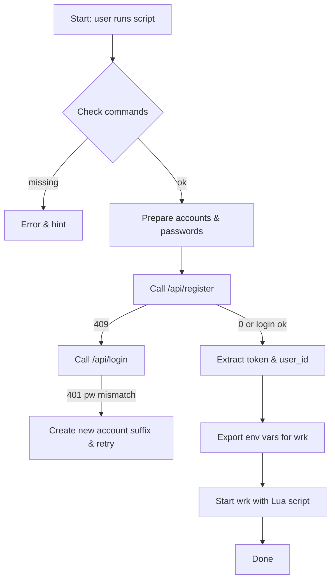
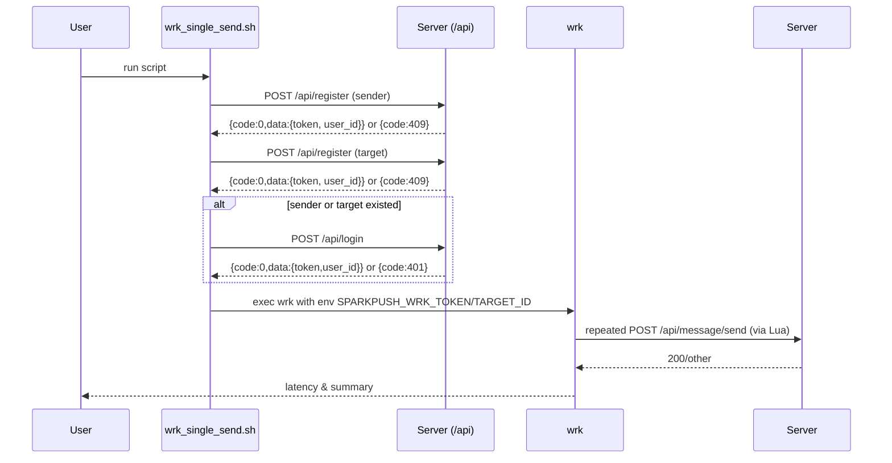

# wrk_single_send.sh 设计文档

## 概述

此文档描述 `scripts/wrk_single_send.sh` 与配套的 `scripts/lua_single_send.lua` 的设计与实现细节，包含使用流程、参数、环境变量、异常处理策略、内部数据流与 mermaid 图示（流程图、时序图、组件图）。该脚本用于一键准备并对 `/api/message/send`（single_chat）接口进行 wrk 压测。

源文件： [scripts/wrk_single_send.sh](scripts/wrk_single_send.sh)
辅助 Lua： [scripts/lua_single_send.lua](scripts/lua_single_send.lua)

## 目标

- 自动注册或登录两个用户（sender 与 target），避免人工准备账号。
- 将 sender 的 token 与 target 的 user_id 注入到 wrk Lua 脚本的环境中。
- 启动 wrk 进行压测并支持自定义并发、连接数、时长等参数。
- 提供健壮的失败处理（账号冲突、密码不匹配、服务异常等）。

## 使用方式

在项目根目录运行：

```bash
BASE_URL=http://127.0.0.1:9101 THREADS=8 CONNS=200 DURATION=10s bash scripts/wrk_single_send.sh
```

也可以通过环境变量调整：

- `BASE_URL`：被测服务基础地址。默认 `http://127.0.0.1:9101`。
- `THREADS`：wrk 线程数（`-t`）。默认 `8`。
- `CONNS`：wrk 连接数（`-c`）。默认 `200`。
- `DURATION`：测试持续时间（`-d`）。默认 `10s`。
- `WRK_BIN`：可执行 wrk 的路径，若默认 `wrk` 不可用，可指定本地编译后的二进制。
- `WRK_PATH`：压测路径，默认 `/api/message/send`（传递给 Lua）。

## 高层流程（文字描述）

1. 校验依赖命令（`curl`, `python3`, `wrk` 或自定义 `WRK_BIN`）。
2. 为 sender/target 生成账号与密码（包含随机 SEED，支持重放）。
3. 调用 `/api/register` 尝试注册；若返回 409（已存在），尝试 `/api/login`。
4. 若登录失败且原因是密码不匹配（401），自动切换账号后重试一次，避免历史脏数据影响压测。
5. 从登录/注册响应提取 `token` 与 `user_id`，导出为环境变量 `SPARKPUSH_WRK_TOKEN` 和 `SPARKPUSH_WRK_TARGET_ID`。
6. 启动 wrk，传入 Lua 脚本与基础 URL，执行压测。

## 错误与异常处理策略

- 缺少命令：脚本会检测必需的命令并给出建议（对于 `wrk` 提供源码编译建议）。
- 注册/登录失败：当返回非 0 的 code，脚本会输出错误并退出；若是账号已存在但密码不匹配，会尝试切换新账号一次。
- 注册后缺少 `token` 或 `user_id`：视为致命错误并退出。

## 环境变量与接口契约

- `SPARKPUSH_WRK_TOKEN`（由脚本导出）: Bearer token，Lua 会将其放到 `Authorization` 头。
- `SPARKPUSH_WRK_TARGET_ID`（由脚本导出）: 整数，Lua 会将其放入请求体 `target_id`。
- `SPARKPUSH_WRK_PATH`（可选）: 请求路径。

接口 `/api/register` 与 `/api/login` 的期望 JSON/返回约定（脚本依赖）：

- 请求：`Content-Type: application/json`，body 示例：

  - register: {"account":"...","password":"<md5hex>","name":"..."}
  - login: {"account":"...","password":"<md5hex>"}

- 响应：包含 `code` 字段，`0` 表示成功；成功返回 `data.token` 与 `data.user_id`。

## 数据流图（Mermaid - 流程图）



## 时序图（Mermaid - sequence）



## 组件图（Mermaid - graph TD）

```mermaid
graph TD
  subgraph Local
    S[scripts/wrk_single_send.sh]
    L[scripts/lua_single_send.lua]
    W[wrk binary]
  end
  subgraph Remote
    API[/api endpoints\n(register, login, message/send)]
  end
  S --> API
  S --> W
  W --> L
  L --> API
```

## Lua 脚本设计要点

- 在每个线程中维护局部统计（`app_ok`, `app_err`, `http_err`），并通过 `setup(thread)` 注册线程到主表用于 `done()` 聚合。
- `request()` 生成带 `client_msg_id` 的 JSON body，避免服务端做去重或幂等处理影响压测。
- `response()` 判断 HTTP 状态并基于 body 的 `"code":0` 字样来判定应用级成功，以兼容不同 JSON 序列化风格。

## 测试计划（Smoke Test）

1. 本地服务启动（`BASE_URL` 指向本地实例），手工运行脚本并观察注册/登录输出是否正常。
2. 确认 `SPARKPUSH_WRK_TOKEN` 与 `SPARKPUSH_WRK_TARGET_ID` 已被导出（脚本在导出后会启动 wrk）。
3. 运行短时压测（`DURATION=5s`）并验证 wrk 输出、Lua 聚合统计（`app_ok/app_err/http_err`）。
4. 模拟注册已存在但密码不匹配场景：先创建一个冲突账号（不同 password），再运行脚本，验证脚本会生成新账号并继续压测。

## 安全与隐私考虑

- 脚本在本地临时创建账号和密码，仅用于压测，不应在生产账号上运行。
- 密码以 MD5 hex 提交（脚本用来与服务既定接口兼容），注意网络传输安全，建议在安全内网或通过 HTTPS。

## 可扩展性与改进建议

- 支持更多并发账号（批量注册/登录）以模拟分布式发送场景。
- 增加 TLS/HTTPS 配置与验证选项。
- 增加对不同消息类型与负载的参数化（图片、长文、群聊等）。
- 将注册/登录逻辑抽象为可复用的测试库（Python/Go），便于在 CI 中复用。

## 附：常见问题与排查建议

- 若脚本提示缺少 `wrk`，可以运行 `bash scripts/build_wrk.sh` 编译并设置 `WRK_BIN` 指向编译产物。
- 若注册返回 `409` 且 login 返回 `401`，脚本会自动生成新账号后重试一次；仍失败则检查服务数据库或接口实现。

## 下一步

- （可选）将该文档加入仓库 README 或 perf 文档目录，并在 CI 中添加一个轻量压测任务。
