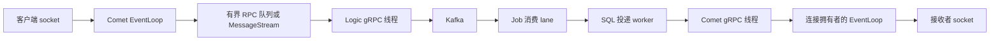

# 01：从字节缓冲区到连接层——真实数据结构与并发实现

本章对应根目录正式运行代码。阅读时打开函数本身，先看字段，再看谁修改它，最后看失败与退出路径。
`02_auth_subset` 到 `06` 是教学历史快照，不是本次测试使用的服务。

## 1. 一条消息先经过哪些线程



这个图里的箭头通常意味着跨线程或跨进程。一个请求不是从头到尾占着同一个线程。
Comet 的网络线程负责解析字节和操作连接；数据库调用与远端 RPC 交给工作线程。
Job 的持久化消费者和投递 worker 分离，所以某个 Comet 暂时不可达不应拖住历史落库。

源码入口：[CometServer](../../comet/comet_server.cpp)、[线程池](../../common/thread_pool.cpp)、
[JobRunner](../../job/service.cpp)、[LogicServiceImpl](../../logic/grpc_service.cpp)。

## 2. 项目里的“链表”到底在哪里

当前正式 IM 路径没有项目自己写的 `Node { prev, next }` 链表，也没有手写 `LinkedList`。
要区分**队列这种访问规则**和**链表这种节点组织方式**。FIFO 并不等于链表。

| 位置 | 真实类型 | 访问方式 |
|---|---|---|
| `ThreadPool::tasks_` | `std::queue<std::function<void()>>` | 尾部入队、头部取出 |
| `MySqlConnectionPool::idle_` | `std::deque<ConnEntry>` | 最旧空闲连接先借出、归还到末尾 |
| `RedisConnectionPool::idle_` | `std::deque<ConnEntry>` | 依空闲时间从头回收 |
| Muduo `Buffer::buffer_` | `std::vector<char>` | 连续字节与两个下标 |
| EventLoop 待执行回调 | `std::vector<Functor>` | 批量交换后遍历 |
| Comet 用户查找 | `unordered_map<uid, UserConnectionsState>` | 按 uid 哈希定位 |
| 某用户连接集合 | `std::set<TcpConnectionPtr>` | 去重、增删、遍历 |
| Job 已写出待回复 | `unordered_map<request_id, PendingRequest>` | 按回复 ID 找等待者 |
| 定时器 | `std::set<pair<Timestamp, Timer*>>` | 找最早到期时间 |
| Android 增量乱序缓存 | `TreeMap<Int, PendingStreamDelta>` | 按整数序号补缺口 |

`std::queue<T>` 默认底层容器是 `std::deque<T>`；本项目没有为它另指定链表。
deque 的接口支持两端操作和随机访问；常见 C++ 实现用多个连续块加一张块指针表。
这属于标准库实现，仓库没有复制或修改这些内部节点。不能把标准库的内部实现说成项目手写算法。

同样，C++ 的 `std::set` 是有序关联容器；常见实现用红黑树。项目依赖其有序查找性质，
没有自己实现红黑树旋转。下文重点解释项目实际维护的容器、索引和不变量。

## 3. Buffer：为什么两个下标能代替频繁删除数组前缀

源码：[Buffer.h](../../muduo/net/Buffer.h)，字段是：

```cpp
std::vector<char> buffer_;
size_t readerIndex_;
size_t writerIndex_;
```

逻辑布局如下：

```text
下标 0              readerIndex              writerIndex          size
      [可前置空间]      [尚未消费的可读数据]       [可写空间]
```

始终满足 `0 <= readerIndex <= writerIndex <= buffer.size()`。
可读长度等于 `writerIndex - readerIndex`，可写长度等于 `size - writerIndex`。
`peek()` 返回 `begin() + readerIndex`，因此读取开头不需要移动字符。

`retrieve(len)` 的真实核心：

```cpp
if (len < readableBytes()) {
  readerIndex_ += len;
} else {
  retrieveAll();
}
```

第一行只移动下标，时间 O(1)。全部读完时，两个下标一起归位到 `kCheapPrepend=8`，
以后复用已有内存。它没有对 vector 执行 `erase(begin, begin+len)`；后者会移动剩余字节。

具体例子：初始 `reader=8, writer=8`，收到 100 字节后 `writer=108`。
解析器消费 30 字节，`reader=38`，剩下 70 字节仍留在原位置。
再收到 40 字节，只要尾部够用便追加，`writer=148`，可读长度为 110。

### 3.1 尾部不够时，是压缩还是扩容

`Buffer::makeSpace(len)` 有两个分支：

```cpp
if (writableBytes() + prependableBytes() < len + kCheapPrepend) {
  buffer_.resize(writerIndex_ + len);
} else {
  size_t readable = readableBytes();
  std::copy(begin()+readerIndex_, begin()+writerIndex_,
            begin()+kCheapPrepend);
  readerIndex_ = kCheapPrepend;
  writerIndex_ = readerIndex_ + readable;
}
```

如果头部已经消费的空间与尾部空间合起来足够，就把**剩余可读部分**搬回下标 8。
若总空闲空间仍不足，就扩大 vector。压缩成本是 O(剩余可读字节数)，不是每消费一个字节都搬动。
扩容可能分配新内存和复制旧元素，不能把每次追加都宣传成严格 O(1)。

这里的 8 字节前置区便于给既有正文前面补长度字段；它不是链表头节点，也不是 TCP 协议头。

### 3.2 readv 如何兼顾短包和突然的大包

[Buffer.cc](../../muduo/net/Buffer.cc) 的 `readFd()` 在栈上准备 `extrabuf[65536]`，
再给 `readv` 两个目标区域：vector 尾部可写区、额外栈缓冲区。

1. 小包直接进 vector，移动 `writerIndex` 即可。
2. 包比尾部空间大时，尾部先装满，超出部分进栈缓冲区。
3. 函数只将实际超出部分 `append` 到 Buffer；必要时才扩容。

这样不必先调用 `FIONREAD` 查询长度，也不必让每条连接一开始就持有很大的永久数组。
`readv` 是一次系统调用的分散读取；它不负责区分 WebSocket 消息边界。

## 4. TCP 字节流为什么必须支持半包与粘包

TCP 只给有序字节流。一次回调收到两个完整帧，或者只收到一个帧的前半段，都是正常行为。
真正的帧状态由 `CometServer::HandleWebSocketFrame()` 判断。

算法依次执行：

1. 少于两个字节，连基础头都不完整，返回等待。
2. 从首字节取 FIN 与 opcode，从第二字节取 MASK 与 7 位长度。
3. 长度标记为 126 时再读 2 字节；为 127 时再读 8 字节，按网络字节序解释。
4. 校验分片策略、mask 和最大负载；非法帧关闭连接。
5. 尚未拿到完整的头、mask、正文，不能消费这帧的前缀。
6. 完整后取 4 字节 mask，对正文第 i 字节执行 `byte ^ mask[i % 4]`。
7. 按 opcode 处理 text/ping/close，并从 Buffer 消费完整帧。
8. while 循环继续尝试下一帧，处理粘包。

mask 的周期是 4。它是 WebSocket 客户端帧要求的掩码，不是加密算法。
握手里的 `Sec-WebSocket-Accept` 由 key 加固定 GUID、SHA-1、Base64 得到；它也不是登录凭证。
身份鉴权由 Logic 的 token 校验完成。

现实现拒绝分片文本。学习时不能把“支持半个 TCP 包到达”混淆成“支持 WebSocket 分片帧”。

## 5. EventLoop：一个连接为什么要有明确的线程拥有者

源码：[EventLoop.cc](../../muduo/net/EventLoop.cc)。主循环的核心结构：

```cpp
while (!quit_) {
  activeChannels_.clear();
  pollReturnTime_ = poller_->poll(timeoutMs, &activeChannels_);
  for (Channel* channel : activeChannels_) {
    currentActiveChannel_ = channel;
    currentActiveChannel_->handleEvent(pollReturnTime_);
  }
  doPendingFunctors();
}
```

Poller 等待 fd 事件，Channel 将读/写/关闭事件转换为回调。
EventLoop 依次处理本次就绪连接，然后执行其他线程递交来的回调。
它没有为每个 socket 创建一个线程，也没有每次扫描所有客户端 socket。

连接拥有者线程操作它的 Buffer、上下文和读写状态。gRPC 工作线程不得直接读取可变的
`conn->getContext()` 再与网络线程同时修改；本项目在网络线程复制 `ConnContext`，
跨线程用这份快照与明确共享的预算/同步标志。

### 5.1 runInLoop 与 queueInLoop

`runInLoop(cb)`：如果调用者已经是拥有者线程，立即调用；否则交给 `queueInLoop`。

`queueInLoop` 先在 mutex 内把回调放进 `pendingFunctors_`，再视情况唤醒 EventLoop。
唤醒使用 Linux `eventfd`，写入整数 1 让 Poller 从等待中返回。
它不是向聊天客户端发一条唤醒消息。

`doPendingFunctors()` 将共享 vector 与局部 vector 交换，然后在锁外执行回调。
这有两个意义：

- mutex 只保护回调容器，不包住业务函数执行。
- 回调继续递交的新工作进入下一批；不会因为遍历共享容器时修改它而失效。

`shared_ptr<TcpConnection>` 让跨线程回调持有连接对象的生命周期；它不证明连接仍在线。
执行回调时仍然要检查 `connected()`。

## 6. 定时器：有序树，而不是手写链表

源码：[TimerQueue.h](../../muduo/net/TimerQueue.h)、[TimerQueue.cc](../../muduo/net/TimerQueue.cc)。
TimerQueue 同时维护两套索引：

```cpp
typedef std::pair<Timestamp, Timer*> Entry;
typedef std::set<Entry> TimerList;
typedef std::pair<Timer*, int64_t> ActiveTimer;
typedef std::set<ActiveTimer> ActiveTimerSet;
```

`timers_` 按到期时间排序，最早定时器在 `begin()`；`activeTimers_` 用指针和 sequence 定位取消对象。
sequence 区分“内存地址相同但已经是新对象”的情况，避免陈旧 TimerId 误取消后来分配的定时器。

Linux `timerfd` 只需被设置到当前最早到期时刻。到期回调取出所有已到期元素、执行回调，
重复定时器计算新到期时间后重新插入。新增/取消树元素通常 O(log n)；取 k 个过期定时器
还要遍历、执行这 k 个回调，不能只写成 O(log n)。

Comet 的 `RecoverDevices()` 每三秒补偿设备，`RefreshRoutes()` 每十秒续租路由，
使用这套调度。服务销毁时取消定时器并停止工作线程，避免回调继续访问已销毁的 `this`。

## 7. ThreadPool：FIFO、条件变量和锁的边界

源码：[thread_pool.h](../../common/thread_pool.h)、[thread_pool.cpp](../../common/thread_pool.cpp)。
主要字段：任务 queue、mutex、condition_variable、工作线程 vector、stopping 标志。
`Submit` 的入队在锁内；成功后 `notify_one()` 唤醒一个等待者。

`WorkerLoop` 的关键动作是：

```cpp
cv_.wait(lock, [this]() { return stopping_ || !tasks_.empty(); });
if (stopping_ && tasks_.empty()) return;
task = std::move(tasks_.front());
tasks_.pop();
```

然后离开锁作用域，再执行 `task()`。移动 `std::function` 避免不必要的函数对象复制。
任务执行可以非常慢；如果持着 queue mutex 执行，其他 producer 与所有 worker 都会被堵住。

条件变量的 predicate 解决两类问题：虚假唤醒，以及通知发生在真正开始等待之前。
正确性来自“锁内检查状态”，不是来自每次 notify 必须刚好对应一次 wait。

`Stop()` 先设 stopping，唤醒所有 worker，再 join。当前 worker 会继续排空已入队任务；
因此任务自己也要有 deadline 或可取消机制。只 join 一个永远不返回的 RPC，不能实现优雅退出。

通用 ThreadPool 的 queue 本身没有统一容量限制。Comet 在其外层用 `SubmitRpc()` 准入预算，
不能因此说仓库所有线程池都是有界队列。

## 8. MySQL/Redis 连接池：双端队列与 RAII

源码：[mysql_pool.h](../../common/mysql_pool.h)、[mysql_pool.cpp](../../common/mysql_pool.cpp)、
[redis_pool.cpp](../../common/redis_pool.cpp)。空闲队列的元素包括连接指针和最后使用时间。

借出逻辑：锁内检查池状态，清理过期空闲连接，从 front 弹一个，必要时在上限内创建新连接。
没有连接时等待归还或超时。借出后的健康检查与业务命令不能长期占着容器锁。

归还的真实队列方向：

```cpp
idle_.push_back({ctx, std::chrono::steady_clock::now()});
cv_.notify_one();
```

按归还时间从旧到新排列，所以清理时只需检查 front：

- 头元素未过期，后面更年轻，不必再逐个扫描。
- 池大小达到 min 时停止回收，保留暖连接。
- 已经发生 I/O 错误的 Redis context 会丢弃，不能重新进入空闲队列反复失败。

一次 pop/push 通常 O(1)；回收 k 条连接是 O(k)。创建连接和网络健康检查另外计算。

`MySqlConnGuard`/`RedisConnGuard` 是 RAII 包装：析构时归还连接，异常或提前 return 也会执行。
它们禁止复制、支持移动，防止两个 guard 同时认为自己拥有同一个连接并双重归还。

**连接池 guard 不自动提交事务。** SQL 事务需要显式 COMMIT/ROLLBACK；本项目预留和投递 DAO
另有事务 guard，在失败离开作用域时回滚。连接归还前留下未完成事务，会污染下一次借用。

## 9. Comet 的 64 个桶如何降低锁竞争

源码：`CometServer::ConnectionBucket`、`Bucket(uid)`、`UserConnections()`。

```cpp
std::array<ConnectionBucket, 64> buckets_;
ConnectionBucket& Bucket(int64_t uid) {
  return buckets_[static_cast<uint64_t>(uid) % buckets_.size()];
}
```

每个桶内是 `unordered_map<uid, UserConnectionsState>`，拥有自己的 mutex。
uid=65 与 uid=129 都落到桶 1；它们仍会竞争同一把锁。分片减轻冲突，不保证每个用户独占锁。
同一 uid 必须稳定落到同一个桶，这样插入、断开、查找用同一把锁保护同一条记录。

`UserConnectionsState` 内的 set 维护一个用户的多个连接，devices map 保存其中启用设备回执的连接快照，
generation 保存本机最近路由代次。connection 的预算登记使用连接指针计算另一个稳定桶。

推送先在短锁内复制连接指针集合，释放锁，再发送。网络操作不在用户 registry 的 mutex 下执行。
房间成员 map 有独立 `rooms_mu_`，也不会把所有单聊、房间和连接操作绑在一把全局锁上。

哈希查找平均 O(1)，极端碰撞下可以退化；set 插入/删除 O(log c)，其中 c 为该用户连接数。
群消息的连接快照和发送仍要遍历命中的所有连接 O(c_total)，哈希表不会消除实际 fan-out 成本。

## 10. 有界预算到底数什么

源码：[ConnectionBudget](../../common/connection_budget.h)、`CometServer::SendFrame()`。
字段是 `queued_`、`buffered_`、`frames_`、`closed_` 和两项上限。

- queued：已准入、尚在 EventLoop 待执行的帧字节。
- buffered：拥有者 EventLoop 最近发布的 socket outputBuffer 字节。
- frames：尚未执行完的帧数量。

`Reserve(bytes)` 在 mutex 内检查三个量能否容纳本次帧，再加 queued 和 frames。
默认 8 MiB、1024 帧；现有上行帧上限为 4 MiB，因此合法单帧不会因默认预算更小而永远无法投递。

实现采用减法式检查：先判断 `bytes > max`，再判断 `queued > max-bytes`，最后判断
`buffered > max-bytes-queued`。这种顺序避免 unsigned 加法溢出，把极大的输入误判为很小。

`SendFrame` 成功准入后，把发送安排到连接 EventLoop。实际执行时再次检查 outputBuffer，
发送后 `Complete` 扣减 queued/frame，并发布新的 buffered 大小。
write-complete 与 high-water 回调也只能由拥有者网络线程读取实际 Buffer。

如果拒绝，连接会关闭，Comet push RPC 返回 503，让可靠投递任务重试。
一次部分 fan-out 可以有些设备收到了、有些被拒绝；重试可能重复到达前者，所以客户端必须按身份去重。

这个预算约束的是应用层排队与 socket 输出缓存。它不是进程 RSS 的精确上限：
连接对象、输入缓存、库开销、临时 string 和内核 socket 缓冲区仍另外占内存。

## 11. RPC 队列：先预留再递交

`SubmitRpc()` 用两个 atomic 计数：任务数和估算字节数，默认上限 256 与 16 MiB。
`fetch_add` 返回增加前的数值；越界时立即减回并拒绝。
工作任务包装一个局部 Release guard，即使回调异常退出也减回预算。

三个关键退出分支都要对应归还：准入失败、ThreadPool 拒绝、任务执行结束。
漏一个分支会让计数永久越来越大，服务最终拒绝所有任务。

原子计数保证数值更新不丢失，但没有替代其他锁；例如 stream queue 的 push/pop 与字节数
仍需同时在 queue mutex 内更新，保证“一条消息”和“它的占用”属于同一个状态变化。

## 12. Stream：FIFO 写出，哈希匹配回复

Comet→Logic 和 Job→Comet 的 gRPC stream 都有一个 writer 顺序执行 Write。
业务 producer 先把 PendingRequest 放入 queue，writer 取出后在 pending map 登记 request_id。

```text
queue:    [r1, r2, r3]      保证写出顺序
pending:  {r1 -> callback, r2 -> callback}   保证乱序回复也能找对人
reply:    r2                只完成 r2，不误唤醒 r1
```

请求超时会从 pending 移除并失败 callback；流断开会失败当前所有未完成等待者，通知调用者重试。
新连接的 accepted ACK 必须与同一 client_msg_id 相关，不能拿“下一条回复”当作“上一条请求的回复”。

重连采用指数退避并设上限，避免远端故障时每个线程持续紧密重连。
重放要求稳定 request_id 与客户端消息 ID；可靠性不来自 queue 本身，来自 SQL/Kafka 的可恢复身份。

## 13. 令牌桶：按时间补充，而不是每秒清零

源码：[rate_limiter.cpp](../../common/rate_limiter.cpp)。bucket map 的 key 为 `scene + ':' + key`，
区分单聊、群聊和广播。每个 bucket 保存 tokens 与 last_refill。

```cpp
const double elapsed = std::chrono::duration<double>(now - bucket.last_refill).count();
bucket.tokens = std::min(rule.burst, bucket.tokens + elapsed * rule.rate_per_sec);
bucket.last_refill = now;
if (bucket.tokens < 1.0) return false;
bucket.tokens -= 1.0;
```

假设 rate=10/s、burst=20。空闲 0.5 秒补 5 枚，但最多保留 20；连续 21 个请求里至少一个会被拒绝。
系统时钟被调回不会产生负时间问题，因为 refill 使用 steady_clock。
整个读—补—减在一把 mutex 里；否则两个请求都看见一枚令牌，会同时通过造成超发。

当前实现是进程内限流，多实例没有共享一个全局桶；桶 map 也没有定期淘汰 key 的算法。
要理解实际边界，不能仅凭名称说它已实现分布式全局限流。

## 14. 如何通过源码验证自己的理解

1. 在 Buffer 的半包路径找出哪里没有调用 retrieve；若提前消费头部，下一次解析会发生什么？
2. 在 WorkerLoop 标出锁作用域；把 task() 移到锁内，预测吞吐和死锁风险。
3. 给用户 65 和 129 计算桶编号，说明为什么哈希分片仍可能竞争。
4. 给 ConnectionBudget 输入 `SIZE_MAX`，解释每一项减法为何安全。
5. 给两条 stream 请求打乱 reply 顺序，说明 pending 哈希与 FIFO queue 各自解决什么。
6. 阅读 connection budget 测试的 32 个 producer，找出哪条断言证明上限没有被并发穿透。

对应验证：[comet_budget_test.cpp](../../tests/comet_budget_test.cpp)、
[websocket_utils_test.cpp](../../tests/websocket_utils_test.cpp)、
[rate_limiter_test.cpp](../../tests/rate_limiter_test.cpp)、
[Kafka failure 测试](../../tests/kafka_failure_integration_test.cpp)。
网络缓冲实现来自仓库内 Muduo；本次改动没有修改其 vendor 源码。
