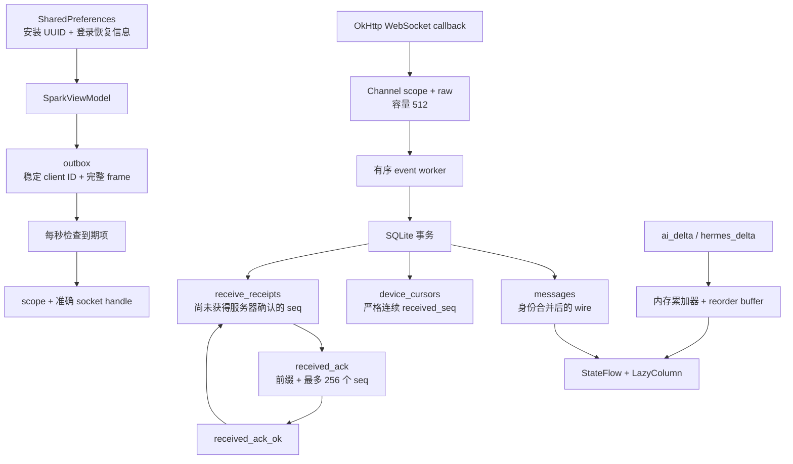

# Android 本地可靠性：从 SQLite 事务到设备回执

本文讲解封板后的真实 Android 实现，阅读顺序是「身份 → 表 → 事务 → 游标 → 回执 → 发送 → 并发 → 验证」。
适合已经会 Kotlin 基本语法、希望理解 IM 重启和断线恢复的人。
文中行号按本次源码核对；后续编辑代码时应重新核对，函数名是更稳定的导航。
这里没有仓库手写的 SQLite B+ 树、链表或磁盘页管理器；这些由 Android SQLite 和标准集合实现。
仓库自己实现的是身份合并、连续前缀扫描、回执队列、outbox 状态机及连接隔离。

## 1. 先找到入口，不从界面推测持久化语义

| 文件和准确入口 | 阅读目的 |
|---|---|
| [`SparkMessageStore.kt:16`](../../android-app/app/src/main/java/com/peco/sparkim/SparkMessageStore.kt#L16) | SQLiteOpenHelper、四张表及事务 |
| [`SparkViewModel.kt:80`](../../android-app/app/src/main/java/com/peco/sparkim/SparkViewModel.kt#L80) | 设备 ID、scope、事件 worker |
| [`SparkViewModel.kt:1043`](../../android-app/app/src/main/java/com/peco/sparkim/SparkViewModel.kt#L1043) | 发送入口及先落库后呈现 |
| [`SparkViewModel.kt:1104`](../../android-app/app/src/main/java/com/peco/sparkim/SparkViewModel.kt#L1104) | outbox 重试、离线图片上传 |
| [`SparkViewModel.kt:1239`](../../android-app/app/src/main/java/com/peco/sparkim/SparkViewModel.kt#L1239) | WebSocket 类型分派 |
| [`SparkClient.kt:95`](../../android-app/app/src/main/java/com/peco/sparkim/SparkClient.kt#L95) | 握手、连接代数、socket 与 scope 配对 |
| [`SparkClient.kt:146`](../../android-app/app/src/main/java/com/peco/sparkim/SparkClient.kt#L146) | 捕获准确连接再发送 |
| [`SparkMessageStoreTest.kt:39`](../../android-app/app/src/test/java/com/peco/sparkim/SparkMessageStoreTest.kt#L39) | 八项真实 SQLite 测试 |

这里有**四张表**，不是五张：`messages`、`device_cursors`、`receive_receipts`、`outbox`。
第五类状态「设备身份」保存在 `spark_native` SharedPreferences；它不是 SQLite 表。
先区分这点，才能正确回答清理数据库和重装应用对设备身份有什么影响。

## 2. 数据结构关系图



`messages` 是最终消息的本地事实，`outbox` 是发送意图的本地事实。
`device_cursors` 表示已经保存在本地的连续前缀，`receive_receipts` 表示还需要通知服务端的具体序号。
UI 是这些事实和临时流式输出的投影，不能反过来用 UI 显示过的最大序号证明历史完整。
每个表中的 `scope` 都是 `${logicBase}|${userId}`。
同一个服务器的两名用户使用不同 scope，同一名用户连接两个服务器也使用不同 scope。
`session` 是会话 ID；它在 scope 内进一步区分消息流。

## 3. 表、主键、索引到底保存什么

下面是 `onCreate` 中 SQL 的逐字摘录，每段都少于 30 行。
来源：[`SparkMessageStore.kt:19`](../../android-app/app/src/main/java/com/peco/sparkim/SparkMessageStore.kt#L19)。

```sql
CREATE TABLE messages(scope TEXT NOT NULL, session TEXT NOT NULL, identity TEXT NOT NULL, msg_id TEXT NOT NULL, client_id TEXT NOT NULL, seq INTEGER NOT NULL, wire TEXT NOT NULL, state TEXT, PRIMARY KEY(scope,session,identity))
CREATE INDEX message_sequences ON messages(scope,session,seq)
CREATE INDEX message_ids ON messages(scope,session,msg_id)
CREATE INDEX message_clients ON messages(scope,client_id)
CREATE TABLE device_cursors(scope TEXT NOT NULL,session TEXT NOT NULL,received_seq INTEGER NOT NULL,PRIMARY KEY(scope,session))
CREATE TABLE receive_receipts(scope TEXT NOT NULL,session TEXT NOT NULL,seq INTEGER NOT NULL,PRIMARY KEY(scope,session,seq))
CREATE TABLE outbox(scope TEXT NOT NULL,client_id TEXT NOT NULL,session TEXT NOT NULL,frame TEXT NOT NULL,attempts INTEGER NOT NULL DEFAULT 0,next_at INTEGER NOT NULL DEFAULT 0,status TEXT NOT NULL DEFAULT 'PENDING',PRIMARY KEY(scope,client_id))
```

逐行理解：

1. `messages` 的逻辑主键是 scope、session、identity；`wire` 保存规范化后的 JSON，`state` 保存发送阶段。
2. `message_sequences` 支持按会话查连续序号和按序读取后续记录。
3. `message_ids` 支持服务端身份等值查找，避免只按会话扫描。
4. `message_clients` 支持客户端稳定 ID 查找，服务端 ACK 可以找到对应乐观消息。
5. `device_cursors` 每个 scope/session 一行；缺失行按 0 处理。
6. `receive_receipts` 每个具体 seq 一行；重复插入用 `CONFLICT_IGNORE`，天然去重。
7. `outbox` 每个 scope/client_id 一行；重发不是创建新消息，而是再次发送这一行的 frame。

`identity` 取值优先级为 `m:$msgId`、`c:$clientId`、`s:$seq`。
乐观消息没有服务端 msg_id 和 seq，所以初始 identity 通常是 `c:UUID`。
accepted ACK 到达后，同一消息转成 `m:服务端ID`；旧 alias 行在同一事务删除。
这些字段不是三个必须相同的字符串，而是同一条业务消息在不同阶段可用的三个索引入口。
表里没有数据库外键；关联约束由 `transaction` 内的程序操作维护。
表也没有自动过期或清理历史策略；messages 的磁盘规模会随保留历史增长。
数据库版本目前为 1，`onUpgrade` 是空实现，未来改表必须新增明确迁移。

SQLite 的表和索引底层是 SQLite 的 B-tree 家族结构；这里可借用「有序键 → 页 → 行」帮助理解查找成本。
不要把教学 B+ 树的叶子链表算法写成仓库已实现的内容。
Android 的 `Cursor` 是结果集遍历器，不是应用手写链表节点。
本仓库没有 `Node.next` 维护磁盘页，也没有自己实现页分裂或崩溃恢复日志。

## 4. WAL、事务和同步锁分别解决什么

[`onConfigure:17`](../../android-app/app/src/main/java/com/peco/sparkim/SparkMessageStore.kt#L17) 调用 `enableWriteAheadLogging()`。
WAL 让数据库使用写前日志；提交和恢复由 SQLite 负责。
这不是每条消息都另写一个应用日志文件，也不是 Kafka 的本地替代品。
WAL 的真实磁盘行为、checkpoint 和掉电保证受 SQLite/Android 与文件系统设置影响。
代码没有自己设置 `PRAGMA synchronous`，不能凭 WAL 一词承诺任意硬件掉电都不会丢最后提交。
这里验证的事务保证是：应用可见的 messages、cursor、receipts 或 outbox 修改一起提交或一起回滚。

完整事务包装器来自 [`SparkMessageStore.kt:29`](../../android-app/app/src/main/java/com/peco/sparkim/SparkMessageStore.kt#L29)：

```kotlin
    private fun <T> transaction(block: (SQLiteDatabase) -> T): T {
        val db = writableDatabase
        db.beginTransaction()
        try { val result = block(db); db.setTransactionSuccessful(); return result }
        finally { db.endTransaction() }
    }
```

第 1 行使用泛型，调用者可以返回 cursor、Pair 或 Unit。
第 2 行打开可写数据库，SQLiteOpenHelper 管理实例与初始化。
第 3 行开始事务，后续写操作不能单独对外宣布成功。
第 4 行先执行 block；只有没有异常才设置成功并返回结果。
第 5 行总会结束事务；没有设置成功时 SQLite 回滚之前的写操作。
`getLong` 缺字段抛异常和 SQLite 写失败都能走这个回滚路径。

公开数据库方法带 `@Synchronized`，让同一个 store 的调用通过对象监视器串行进入。
它与 SQLite transaction 的作用不同：监视器管应用线程互斥，事务管多条 SQL 的原子性。
内部 `advance` 调用同一对象的 `cursor` 不会因为再次取同一个监视器死锁；Java 监视器可以重入。
主要调用者使用有序后台 dispatcher，因此 SQLite 工作不直接在 Compose 主线程执行。
HTTP 上传会挂起到 IO dispatcher；挂起期间其他 worker 可以运行，不能把 limitedParallelism(1) 当成跨挂起互斥锁。

## 5. 三种身份如何合成一行

`upsert` 不是 SQL 的单条 UPSERT：它先删除同一消息已有 alias，再插入规范身份。
调用者 `save`、`enqueue`、`accepted` 和 `replaceFrame` 都把它放在事务内。
因此「删除了乐观行，却没插入正式行」不会成为成功提交后的中间状态。

关键真实摘录来自 [`SparkMessageStore.kt:43`](../../android-app/app/src/main/java/com/peco/sparkim/SparkMessageStore.kt#L43)：

```kotlin
        val aliases = buildList<Pair<String, Array<String>>> {
            if (msgId.isNotBlank()) add("scope=? AND session=? AND msg_id=?" to arrayOf(scope, session, msgId))
            if (clientId.isNotBlank()) add("scope=? AND session=? AND client_id=?" to arrayOf(scope, session, clientId))
            if (seq > 0) add("scope=? AND session=? AND seq=?" to arrayOf(scope, session, seq.toString()))
        }
        val effectiveState = if (state == DeliveryState.ACCEPTED && aliases.any { (where, args) ->
            db.rawQuery("SELECT 1 FROM messages WHERE ($where) AND state='DELIVERED' LIMIT 1", args).use { it.moveToFirst() }
        }) DeliveryState.DELIVERED else state
```

第 1 行构造最多三个元素的列表，每个元素是一条 SQL 条件和绑定参数数组。
第 2 行只加入非空服务端 ID，防止空 ID 匹配很多乐观行。
第 3 行只加入非空客户端 ID，保留跨重发的身份。
第 4 行只加入正序号，seq=0 是尚未被服务端赋序的占位值。
第 5 行结束构建；三个条件共享 scope/session，不会删除别的账号或会话。
第 6 行只在要写 ACCEPTED 时检查已有 DELIVERED，避免 ACK 乱序使成功状态回退。
第 7 行每个 alias 使用独立等值查询，并通过 `use` 关闭 Cursor。
第 8 行决定新行状态；如果任一 alias 已投递，写回仍保持 DELIVERED。

[`SparkMessageStore.kt:54`](../../android-app/app/src/main/java/com/peco/sparkim/SparkMessageStore.kt#L54) 对每个 alias 分别执行 `db.delete`。
SQL `?` 参数由数据库绑定，客户端 ID 不通过字符串拼接进入 SQL。
然后按 identity 优先级插入行；seq>0 时再插入稀疏 receipt。
因此同一实时消息收到两次，会得到一个 canonical messages 行和一个 receipt 行。
receipt 已确认后又收到重复帧，会重新入 receipt，安全地再确认一次。

为什么要把 OR 拆开？
原本合并三个 alias 的 OR 条件看起来简洁，但本机 SQLite 的 `EXPLAIN QUERY PLAN` 选择了按 scope/session 扫描。
只有一条新消息时，查询也可能检查该会话已有的全部消息，库越大越慢。
只新增 msg_id 索引，优化器仍可能选择会话扫描；「存在索引」不等于「本条 SQL 用了它」。
拆成三个独立等值条件后，每条 SQL 有明确的索引前缀与等值目标。
这增加少量 SQL 调用，却减少随会话长度增长的扫描工作。
实际身份冲突存在多行时，删除成本还与命中行数有关；不能把任意损坏数据库都描述成常数成本。

## 6. 连续 cursor：1、3、2 为什么最终是 3

完整算法来自 [`SparkMessageStore.kt:66`](../../android-app/app/src/main/java/com/peco/sparkim/SparkMessageStore.kt#L66)：

```kotlin
    private fun advance(db: SQLiteDatabase, scope: String, session: String): Long {
        var cursor = cursor(scope, session)
        db.rawQuery("SELECT DISTINCT seq FROM messages WHERE scope=? AND session=? AND seq>? ORDER BY seq", arrayOf(scope, session, cursor.toString())).use { rows ->
            while (rows.moveToNext()) {
                val seq = rows.getLong(0)
                if (seq != cursor + 1) break
                cursor = seq
            }
        }
        db.insertWithOnConflict("device_cursors", null, ContentValues().apply {
            put("scope", scope); put("session", session); put("received_seq", cursor)
        }, SQLiteDatabase.CONFLICT_REPLACE)
        return cursor
    }
```

第 1 行使用当前事务传入的数据库，避免另开一套写链路。
第 2 行读取旧前缀；没有记录时是 0。
第 3 行只查旧前缀之后的序号，排序并去重；消息身份 alias 不应制造重复进度。
第 4 行按结果集逐行前进，不把所有序号复制进内存集合。
第 5 行取当前 seq。
第 6 行验证「紧邻下一条」；看到 3 而期待 2，就停止。
第 7 行确认下一条确实存在，才推进局部变量。
第 10—12 行把结果写入 cursor 表，这一写与消息落库处于同一事务。
第 13 行返回前缀，调用者事务成功结束以后才允许对外发 ACK。

| 本次保存 | messages 已有正序号 | 原 cursor | 查询实际读到 | 新 cursor |
|---|---|---:|---|---:|
| 1 | 1 | 0 | 1 | 1 |
| 3 | 1、3 | 1 | 3，期待 2，立即 break | 1 |
| 2 | 1、2、3 | 1 | 2，然后 3 | 3 |

保存第 3 条时 UI 可以展示它，但 cursor 仍是 1；这是正常乱序，不是故障。
最后 50 条历史是 51—100 时，cursor 从 0 出发期待 1，见 51 就停止。
只有补到 1—50，才能证明连续前缀到 100。
如果服务端取号后写入失败留下永久洞，不能凭「很久没来」跳过洞。
这种场景由稀疏 receipt 解决重复投递，而不是伪造连续前缀。

## 7. sparse receipts：告诉服务端实际已经保存哪些序号

`upsert` 为正 seq 插入 `receive_receipts`，与消息写入处于同一事务。
它表达的是「需要发送/重试的接收确认」，不是所有历史的永久序号集合。
每秒 worker 调用 `flushReceiveReceipts`，按每个 session 最多 256 个 seq 发一帧。
[`receipts:93`](../../android-app/app/src/main/java/com/peco/sparkim/SparkMessageStore.kt#L93) 先枚举不同 session，再独立查每个会话的 256 条。
大历史会话因此不会耗尽全局 LIMIT，使另一个会话永远得不到 ACK。
[`flushReceiveReceipts:1093`](../../android-app/app/src/main/java/com/peco/sparkim/SparkViewModel.kt#L1093) 使用 elapsedRealtime 限频一秒。
每条消息先进入持久化 receipt；限频只延迟发送，不丢接收确认。
连接建立时使用 `force=true`，让重连立即补发。

例如 cursor=1、已收到 seq=3 时，ACK 中前缀是 1，稀疏集合可以含 3。
服务端可以记住设备实际有第 3 条，同时以后补投迟到的第 2 条。
`received_ack_ok` 是服务端确认已记录这些 receipt；WebSocket send 返回 true 不是这一确认。

完整清理事务来自 [`SparkMessageStore.kt:103`](../../android-app/app/src/main/java/com/peco/sparkim/SparkMessageStore.kt#L103)：

```kotlin
    @Synchronized fun confirmReceipts(scope: String, session: String, prefix: Long, sequences: List<Long>) = transaction { db ->
        db.delete("receive_receipts", "scope=? AND session=? AND seq<=?", arrayOf(scope, session, prefix.toString()))
        sequences.forEach { db.delete("receive_receipts", "scope=? AND session=? AND seq=?", arrayOf(scope, session, it.toString())) }
    }
```

第 1 行同时获得对象互斥和 SQLite 事务。
第 2 行删除服务器确认的整个连续前缀中的待确认项。
第 3 行删除服务器明确确认的稀疏项，未出现的序号继续保留。
第 4 行完成事务；任一 SQL 失败时两类删除一起回滚。
这不会删除 messages，也不会人为推进本地 cursor。
如果发送 ACK 后立即崩溃，重启还会读到 receipt；重复确认由服务端幂等处理。

## 8. outbox 不是内存发送列表

[`enqueue:113`](../../android-app/app/src/main/java/com/peco/sparkim/SparkMessageStore.kt#L113) 在事务里检查容量并保存两类数据。
容量只统计当前 scope 中 PENDING 行：最多 200 条，frame UTF-8 字节总量加新 frame 不超过 32 MiB。
SQL 使用 `LENGTH(CAST(frame AS BLOB))`，避免汉字字符数被误当字节数。
随后保存 SENDING 乐观消息，再插入完整 frame。
任一步失败都会回滚；界面不会先清草稿再发现数据库未保存。
FAILED 行不参与待发容量限制；当前实现没有自动删除 FAILED 或清空历史的后台策略。

[`sendMessage:1058`](../../android-app/app/src/main/java/com/peco/sparkim/SparkViewModel.kt#L1058) 为一次用户发送生成 UUID。
后续重试读取同一 outbox frame，永远不在重试时重新生成 client_msg_id。
稳定 ID 的价值是：服务端已经接受、ACK 丢失时，重试可以命中服务端幂等结果。
客户端稳定 ID 不能代替服务端持久化幂等；两侧合同必须一起成立。

`due(scope, now, limit=8)` 每次最多取 8 条 PENDING 且 `next_at<=now` 的行。
它按 rowid 排序，保留队列扫描中的插入顺序，但不承诺不同消息被网络和服务端处理后的绝对顺序。
`recordAttempt` 在网络操作之前保存下次到期时间；即使进程在 send 后死掉，也不会立即无间隔狂重发。
attempts 上限 1000 防止无界计数；重试次数本身没有达到 N 次即删除的策略。

退避函数原文，来源 [`SparkMessageStore.kt:169`](../../android-app/app/src/main/java/com/peco/sparkim/SparkMessageStore.kt#L169)：

```kotlin
fun outboxRetryDelay(attempts: Int): Long = minOf(60_000L, 2_000L shl attempts.coerceIn(0, 5))
```

`coerceIn(0,5)` 限制移位范围；`shl` 每多一个 attempt 把基数乘 2。
等待序列是 2、4、8、16、32、60 秒；到 64 秒时由 minOf 截成 60 秒。
定时 loop 每秒检查，因此真正发起时间还会包含调度延迟和网络操作耗时。
它没有随机 jitter；多设备同时恢复仍可能有同步重试峰值。
数据库 next_at 使用 wall clock，receipt 限频使用 elapsedRealtime；学习时不要混淆两个时钟。

HTTP 网络失败、408、429、5xx 保留待发项；明确业务拒绝把消息和 outbox 标成 FAILED。
WebSocket error code=0 被保守处理为继续重试，不能把缺 code 的错误都断言为永久业务失败。
socket send 失败也保留队列；即使 send 成功，未等到 accepted ACK 仍会在到期时重试。

## 9. accepted ACK 的原子性和状态单调

完整函数来源 [`SparkMessageStore.kt:145`](../../android-app/app/src/main/java/com/peco/sparkim/SparkMessageStore.kt#L145)：

```kotlin
    @Synchronized fun accepted(scope: String, ack: JSONObject): Pair<String, Long>? = transaction { db ->
        val clientId = ack.optString("client_msg_id")
        val stored = db.rawQuery("SELECT session,wire FROM messages WHERE scope=? AND client_id=? LIMIT 1", arrayOf(scope, clientId)).use {
            if (it.moveToFirst()) it.getString(0) to JSONObject(it.getString(1)) else null
        } ?: return@transaction null
        // Save the accepted identity before removing the replayable send, in one transaction.
        val wire = stored.second.put("msg_id", ack.getString("msg_id")).put("msg_seq", ack.getLong("msg_seq"))
        upsert(db, scope, wire, DeliveryState.ACCEPTED)
        db.delete("outbox", "scope=? AND client_id=?", arrayOf(scope, clientId))
        stored.first to advance(db, scope, stored.first)
    }
```

第 1 行声明整个 ACK 处理是一个事务，而非三个独立可成功的操作。
第 2 行获取稳定客户端 ID，用它寻找重启后仍存在的消息。
第 3—5 行恢复消息内容；找不到时返回 null，不凭空生成只有序号的空气泡。
第 7 行使用 getString/getLong，关键字段缺失会失败并回滚。
第 8 行合并服务端身份，内部检查既有 DELIVERED 后保留更高阶段。
第 9 行只在消息保存完成以后删除 outbox，但二者仍在同一事务内。
第 10 行计算新的接收前缀，包含自己已本地保存的正式消息。
第 11 行返回；transaction 包装器结束提交以后 ViewModel 才更新 UI 和补 receipt。

`accepted_ack` 表示持久化事件已被服务端接受；`delivered_ack` 仍是服务端投递阶段。
收到 sender_sync 或自己的 history，只能把本地自身消息提升至 ACCEPTED。
接收端可能仍离线，不能因为发送者自己看到了正式消息就标 DELIVERED。
`save(..., ownUserId)` 区分本地用户消息和远端 incoming；远端已收到的消息可以显示 DELIVERED。
如果 delivered ACK 先到、accepted ACK 后到，upsert 与 UI 更新都保留 DELIVERED。
这种「单调」针对 ACCEPTED 与 DELIVERED 合并；不是任意错误码都被定义成有数学全序的状态格。

## 10. Coroutine、Channel 和 UI 虚拟列表怎样配合

[`SparkViewModel.kt:95`](../../android-app/app/src/main/java/com/peco/sparkim/SparkViewModel.kt#L95) 的 dispatcher 只允许一段后台任务同时执行。
Channel 元素是 `Pair<scope, raw>`；原始 JSON 与入队时的账号范围一起保存。
容量 512 在 [`SparkReliability.kt:7`](../../android-app/app/src/main/java/com/peco/sparkim/SparkReliability.kt#L7) 定义。
一个事件 worker `for ((scope, raw) in eventQueue)` 按入队顺序解析 WebSocket 帧。
它检查 scope 是否仍等于 activeScope，旧账号积压事件不会写入新账号数据库。
数据库异常时不发 ACK，关闭 socket 后安排重连，确保最后一条 live 消息也有重放机会。
队列满时停止流式预览并重连，未获得接收确认的 durable 消息由服务端再次恢复。

[`MainActivity.kt:317`](../../android-app/app/src/main/java/com/peco/sparkim/MainActivity.kt#L317) 用 LazyColumn 展示 timeline。
LazyColumn 虚拟化的是可见 Compose 项，不是 SQLite 的数据保留范围。
timeline 查询默认最多 200 条；更早历史由独立分页入口读取。
UI `sameMessage` 在 session 相同的前提下匹配 msg_id、client_id 或正 seq。
实时、历史和乐观消息因此复用一个气泡；AI 最终消息还替换 `stream:requestId` 临时气泡。
`mergeIncoming` 只更新当前选中会话的 UI，但 `handleEvent` 在此前已持久化非选中会话并排入 receipt。
所以不打开某个会话，并不意味着它没有本地接收确认。

这里有几种集合，各自职责不同：

| 集合 | 当前用途 | 典型成本与边界 |
|---|---|---|
| Channel<Pair<String,String>> | WebSocket 输入顺序和容量控制 | 应用容量 512；不是数据库队列 |
| LinkedHashMap<String,StreamAccumulator> | 按请求检索流式累加器，保留插入次序淘汰最旧项 | 平均键查找 O(1)，最多 32 个 stream |
| TreeMap<Int,StreamDelta> | 暂存未按顺序到达的 delta | 插入/移除 O(log d)，使用标准有序树 |
| LinkedHashSet<String> | 终态 request/event ID 去重与插入顺序 | 平均 O(1)；具体上限由代码设置 |
| ConcurrentHashMap | client ID/request ID 两套 timing 索引 | 避免计时查询与事件处理竞争 |
| ArrayDeque<Long> | 有限延迟样本，尾入头出 | 两端操作通常摊销 O(1)，不是手写链表 |

TreeMap/reorder 算法在 [`SparkReliability.kt:108`](../../android-app/app/src/main/java/com/peco/sparkim/SparkReliability.kt#L108)。
它服务于临时 delta 的顺序，和数据库消息 seq 的 advance 是两套算法。
不要用 delta_index 推进 device cursor，也不要把 request_id 当消息持久化序号。

为了具体理解「数据结构支持算法」，再看 [`SparkReliability.kt:146`](../../android-app/app/src/main/java/com/peco/sparkim/SparkReliability.kt#L146) 的真实摘录：

```kotlin
        pending[index] = delta
        pendingBytes += incomingBytes
        val applied = ArrayList<StreamDelta>()
        var cursor = expected
        while (true) {
            val next = pending.remove(cursor) ?: break
            pendingBytes = (pendingBytes - utf8Len(next.text)).coerceAtLeast(0)
            applied += next
            cursor++
        }
        nextIndex = cursor
        return if (applied.isEmpty()) ReorderResult(ReorderStatus.BUFFERED)
        else ReorderResult(ReorderStatus.APPLIED, applied)
```

第 1 行把 index 当 TreeMap 的键，delta 当值；同 index 在之前已被重复检查拒绝。
第 2 行维护待缓冲的 UTF-8 总字节，不通过字符数判断空间。
第 3 行创建本次可以顺序应用的列表，而不是立即把新 delta 显示出来。
第 4 行从 nextIndex 的期望值开始；初始期望为 0。
第 5—6 行不断移除恰好等于 cursor 的节点，缺少下一条就停止，后续较大 index 留在树中。
第 7 行扣减刚移除文本的字节，避免队列消费后仍错误地算满。
第 8—9 行积累输出并推进期望；多条曾乱序到达的 delta 可以一次连着输出。
第 11 行记住下一次要等的 index；第 12—13 行区分「仅缓存」与「实际应用」。
例如到达顺序 0、2、1：先显示 0，收到 2 时仅缓存，收到 1 时一次输出 1 和 2。
算法调用 TreeMap 的查找/插入/删除，仓库没有重写红黑树的旋转和染色。
超过 256 帧或 512 KiB 的默认限制会 markOverflow、清 pending 并转为等待最终消息。
这避免缺少第 1 个 delta 时无限积累第 2、3、4……个 delta。

LinkedHashSet 的「链式顺序」也有实际用途：
[`BoundedEventIdSet.addIfNew:165`](../../android-app/app/src/main/java/com/peco/sparkim/SparkReliability.kt#L165) 先 add，重复则 false。
超出 4096 个 ID 时，取得迭代器，next 指向最早插入项，再 iterator.remove 删除它。
它同时利用集合去重和插入次序；不是按最近访问重新排序的完整 LRU。
底层链接和哈希桶由 Java 集合维护；应用只使用公共 API，不直接改前驱/后继指针。
延迟样本 ArrayDeque 则使用 addLast、removeFirst，保存最多 64 个样本后排序计算百分位。
这些有限内存结构在进程结束后消失，所以不能用它们代替 SQLite receipt 或 outbox。

## 11. scope 与 socket 竞态：检查完再发送仍可能有问题

只写 `if (scope == activeScope) client.send(frame)` 不够。
检查之后用户可能切换账号，client.socket 已换成新账号连接。
因此 `SparkClient` 保存一个不可变 Pair：scope 和**那个具体 WebSocket 对象**。
`@Volatile` 保证其他线程看到更新；连接代数同时丢弃旧 socket 的迟到回调。

完整发送函数来源 [`SparkClient.kt:146`](../../android-app/app/src/main/java/com/peco/sparkim/SparkClient.kt#L146)：

```kotlin
    fun send(payload: JSONObject, expectedScope: String? = null): Boolean {
        // Capture endpoint/account together with the exact socket. A concurrent account switch
        // cannot send an old account's outbox frame through the replacement connection.
        val handle = socketHandle ?: return false
        if (expectedScope != null && expectedScope != handle.first) return false
        return handle.second.send(payload.toString())
    }
```

第 1 行允许需要隔离的调用传 expectedScope。
第 4 行一次性捕获 Pair；后续读取不再转向全局 mutable socket。
第 5 行比对捕获 Pair 内的 scope；不匹配立即拒绝。
第 6 行发送到捕获的旧对象，即使切换发生，也不会借用新账号 socket。
旧对象可能已 cancel 并返回 false；此时 outbox 仍在数据库，等待原账号恢复。
`received` 和 outbox send 都传 scope；显式 sync 当前仍走不带 expectedScope 的便捷方法。
连接 URL 包含 token、device_id 和 `receive_ack=1`，服务端据此选择设备恢复语义。

## 12. 图片、设备 ID 和临时 AI 输出

离线图片不是只存在 UI 的 bitmap：发送时将 Base64 bytes 放进 frame 的 `_local_images` 并一起入 outbox。
重连后 `flushOutbox` 逐张调用附件 HTTP 上传，得到附件 ID 后立刻 `replaceFrame` 落库。
本地标 `uploaded=true` 并去掉该张 data，避免后面一张上传失败导致已保存的前几张重复上传。
所有图片完成后删除 `_local_images`，真实 WebSocket 帧只带附件引用。
上传成功但还没持久化 ID 时崩溃，仍可能重新上传；当前没有声明上传接口具有稳定客户端上传 ID 幂等。
这是可恢复发送与绝对无重复附件对象之间的边界。

device_id 在 [`SparkViewModel.kt:83`](../../android-app/app/src/main/java/com/peco/sparkim/SparkViewModel.kt#L83) 首次创建 UUID，并同步 commit。
退出账号只移除 user_id/token/name，不移除 device_id，也不删 SQLite 数据。
同安装多账号共享设备 UUID，但后端还按用户隔离；客户端 scope 也包含账号。
重装或清除应用数据通常会产生新 ID，成为新设备，从服务端重新恢复。
如果平台备份/恢复复制 SharedPreferences，ID 也可能被复制；代码没有实现硬件绑定或备份排除策略。

`handleEvent` 为 `ai_delta`/`hermes_delta` 单独分派，`durableWire` 明确拒绝这两种类型。
store.upsert 再次 require 拒绝 delta，形成两层边界。
最终消息只有正 msg_seq 才进入 received cursor；seq=0 乐观消息不证明服务端已接受。
没有可见正文的 durable 控制消息仍保存并确认，否则不可见 seq 会阻断前缀。
SQLite 中不保存 StringBuilder 的中间文本；进程重启可以丢临时流，而最终消息靠普通恢复链路回来。

## 13. 崩溃点逐个推演

| 崩溃点 | 本地持久状态 | 恢复行为 |
|---|---|---|
| enqueue 提交前 | 消息/outbox 都回滚 | 尚未宣布已排队，草稿保留 |
| enqueue 提交后、发送前 | SENDING＋完整 outbox | 重启读同一 frame 和 client ID |
| recordAttempt 后、send 前 | next_at 已保存 | 等到期再尝试，避免紧密重发 |
| send 后、accepted ACK 前 | outbox 还在 | 稳定 client ID 重发，依赖服务端幂等 |
| accepted 事务中途 | formal message/outbox/cursor 一起回滚 | 保留可重试意图 |
| accepted 提交后、UI 更新前 | 正式身份已保存，outbox 已删 | 重启从本地 timeline 重建 UI |
| durable 保存后、received ACK 前 | messages＋cursor＋receipts | 重启补发 receipt |
| ACK 已发、ack_ok 尚未收到 | receipts 还在 | 重发接收确认 |
| ack_ok 清理事务中途 | 所有删除回滚 | 重复确认仍安全 |
| 图片上传成功、replaceFrame 前 | 本地仍有原 bytes | 可能重复上传，消息意图不丢 |
| 切换账号时上传正在挂起 | scope 检查阻止后续新账号发送 | 原账号队列保留 |

退出或销毁 ViewModel 时，先取消 worker，再 join 后关闭 SQLite，避免事务未结束时关库。
这不把正常生命周期清理当成崩溃必执行的 finally；真正进程终止仍依靠数据库事务和重启恢复。

## 14. 复杂度和真实测量边界

设会话消息数 n、本次批消息数 b、连续补齐的消息数 k、待确认序号 r、会话数 s、待发送数 q。
每条 upsert 最多三次 alias 查找/删除和一次插入，正常唯一身份下约 O(log n)，另有 JSON 字节处理。
整个 save 批次约 O(b log n + k)，查询 cursor 前缀的索引定位还要计入查找成本。
advance 流式遍历结果，应用层只保留一个 Long；不需要 O(n) 的 HashSet。
receipt 读取最多每会话 256 条，返回结构空间 O(256s)，数据库持久空间 O(r)。
confirm 的前缀删除与实际删除条数有关；稀疏确认最多逐个索引删除。
outbox due 默认返回 8 条，但当前没有专门的 status/next_at 索引，数据库扫描/排序成本与保留行数有关。
PENDING 入队限制 200 条不等于 outbox 总行数永远 200；FAILED 行会保留。
timeline 的 CASE 排序可能使用临时排序结构，不能单凭 seq 索引宣称严格 O(log n + 200)。
UI mergeIncoming 使用 indexOfFirst 是 O(m)，applyHistory 的交叉比较约 O(hm)，m 是当前 UI 消息数。
这些边界解释了为何本地数据库写吞吐和 UI 持续滚动帧率必须分别测量。

最终测试环境：WSL、JDK 17、Robolectric 4.16.1、Android 28 native SQLite；APK compileSdk 36。
5000 条消息，每条正文恰好 1024 UTF-8 bytes，100 个事务，每批 50 条，再读 200 条 timeline 100 次。
原始样本在 [`android-sqlite-benchmark.json`](../../android-app/test-results/android-sqlite-benchmark.json)。
最终约 12,212.73 条/秒，批事务 p50 2.334 ms、p95 9.294 ms，200 条读取均值 12.495 ms。
相同负载原 OR 条件约 973.40 条/秒；只加索引约 932.55 条/秒，证明必须检查实际查询计划。
初始短文本数据不能直接与 1 KiB 数据比较；不同轮次冷热缓存和宿主机负载也会影响结果。
这些数字不是手机电量/闪存/UI 性能，不是 IM 服务端吞吐，也不是生产容量承诺。

## 15. 八个测试对应什么合同

| 真实测试及源码行 | 验证内容 |
|---|---|
| `recentHistoryCannotSkipMissingPrefixAndLateMessagesFillGap`:39 | 最近 50 条不跳 cursor，迟到缺口补齐 |
| `sparseReceiptsSurviveRestartAndOnlyServerConfirmationRemovesThem`:50 | 重启保留稀疏 receipt，确认才删除，重复帧只一行 |
| `processRestartReplaysSameIdAndAcceptedAckReconcilesOptimisticIdentity`:63 | outbox 稳定 ID，accepted 合并身份并移除队列 |
| `malformedAckRollsBackAndTransientFailureKeepsStableRetryFrame`:78 | malformed ACK 回滚、重试期限、FAILED 停止自动重试 |
| `endpointAndAccountIsolationAndNonSelectedSessionPersistence`:96 | 服务器/账号隔离，非当前会话也保存 |
| `selfSyncOnlyMeansAcceptedAndDeliveredAckSurvivesAckReordering`:111 | receiver 离线时自身同步只 ACCEPTED，ACK 乱序不回退 |
| `ephemeralDeltaCannotEnterDurableStoreAndBatchFailureRollsBackCursor`:124 | delta 被拒绝，整个批次/cursor/receipt 回滚 |
| `benchmarkDurableTransactionsAndTimelineReads`:134 | 固定负载、cursor 最终 5000、原始性能样本 |

测试源码：[SparkMessageStoreTest.kt](../../android-app/app/src/test/java/com/peco/sparkim/SparkMessageStoreTest.kt)。
结果：[最终 JUnit XML](../../android-app/test-results/android-final-junit.xml)，8/8、0 failures、0 errors、0 skipped。
构建命令：`./gradlew assembleDebug testDebugUnitTest --no-daemon --console=plain`。
证据摘要：[android-build-summary.json](../../android-app/test-results/android-build-summary.json)，含源码与 APK SHA-256。
最终 XML 开始于 2026-10-02 22:54:32（Asia/Shanghai），benchmark 生成于同轮 22:54:49。
没有附带真机或 Emulator UI 测试；SQLite 测试也没有覆盖每个 HTTP 图片上传崩溃点。

## 16. 学习练习：先写预期，再运行

1. 在隔离测试库依次保存 1、3、2，逐步记录 messages、cursor、receipts；解释为什么第二步 cursor 不能到 3。
2. 先只保存 51—100，再保存 1—49，最后保存 50；预测三次前缀分别为 0、49、100。
3. 构造同 client ID 的乐观消息、accepted ACK、history 消息，观察 identity 从 c: 变成 m:，最终只有一行。
4. 在 accepted ACK 去掉 msg_seq，断言 outbox 没删且正式身份未部分保存；不要只检查抛了异常。
5. 将 delivered ACK 放在 accepted ACK 之前，随后再重放 sender_sync；解释为什么 receiver 离线测试也需要区分 ACCEPTED。
6. 为同 endpoint 的 user 42/user 99 和另一 endpoint 的 user 42 各排一条相同 ID；说明复合主键为什么必须包含 scope。
7. 用 EXPLAIN QUERY PLAN 比较一个三 alias OR 和三个等值条件；看计划使用的是完整身份索引还是只有会话前缀。
8. 给一次 receipt ACK 回包只确认 seq=8，不确认 seq=2；解释为什么本地不能清空该会话全部 pending receipt。
9. 在单独实验分支增加 10 万条 FAILED outbox，测 due 的扫描；提出清理或索引方案，再证明不会删 PENDING。
10. 模拟上传第 1 张成功、第 2 张失败，检查已上传 ID 是否持久化，再指出哪一个崩溃窗口仍可能重复生成附件对象。

完成练习后，应能从真实代码说明「已发送、已接受、已投递、已本地接收、已读」分别由谁证明。
尤其不要把 Compose 气泡、WebSocket send(true)、accepted ACK 和 received ACK 混成一个成功标志。
