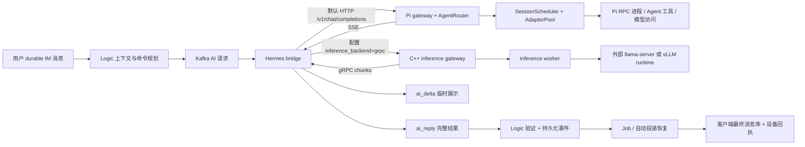

# AI 链路：上下文、事件账本、会话调度与推理网关

本文按当前源码讲解一次 Agent 回答怎样从 IM 消息变成最终可恢复消息。
行号已按本次工作区核对；阅读时同时认准函数名，后续源码变动会使行号移动。
这里的 Hermes 是历史命名：默认 HTTP 路径连接本地 Pi gateway，不能仅凭类名判断运行的是哪种 Agent。
本章不把「模型生成」「Agent 工具执行」「IM 持久投递」混成一个成功状态。
AI 主链路、SQLite Agent 账本和 inference 子系统是已有实现；本次 IM 可靠性工作使最终回答复用持久投递恢复。
本次学习审查另外修复了 `SessionScheduler` 超时等待者误释放运行者的问题；第 7 节解释这项小修复。

## 1. 从真实入口读链路

| 入口及当前行号 | 要回答的问题 |
|---|---|
| [`logic/grpc_service.cpp:313`](../../logic/grpc_service.cpp#L313) `BuildHermesRequest` | IM 历史如何变成上下文？ |
| [`hermes_bridge/main.cpp:184`](../../hermes_bridge/main.cpp#L184) `HandleRequest` | 选择 HTTP 还是 gRPC，怎样投影流事件？ |
| [`hermes_bridge/sse_parser.cpp:40`](../../hermes_bridge/sse_parser.cpp#L40) `Feed` | HTTP 分块怎样组成 SSE 事件？ |
| [`cannbot/scripts/pi_gateway.py:1023`](../../cannbot/scripts/pi_gateway.py#L1023) `do_POST` | Agent 请求、事件流、最终结果怎样返回？ |
| [`cannbot/scripts/agent_router.py:580`](../../cannbot/scripts/agent_router.py#L580) `AgentRouter.chat` | 路由、幂等和执行所有权在哪里？ |
| [`cannbot/scripts/agent_scheduler.py:81`](../../cannbot/scripts/agent_scheduler.py#L81) `SessionScheduler.run` | 同会话串行怎样实现？ |
| [`inference/gateway/gateway_service.cpp:30`](../../inference/gateway/gateway_service.cpp#L30) `Generate` | 下游 worker 怎样排队、预留、取消？ |
| [`logic/grpc_service.cpp:729`](../../logic/grpc_service.cpp#L729) `HandleHermesReply` | 最终回答何时进入持久消息链？ |



这是两个可配置的模型访问分支，不表示每次 Pi 调用都必经 C++ inference gateway。
分支选择入口在 [`hermes_bridge/main.cpp:97`](../../hermes_bridge/main.cpp#L97)。
`ai_delta` 即使丢失，也由完整最终回答补齐；它不能推进 IM 的接收游标。
Python 的 Agent event ledger 能保存预览事件，这不等于把 delta 放入 IM 历史表。

## 2. Logic：数据库历史与进程 deque 合并

[`RememberHermesMessage:253`](../../logic/grpc_service.cpp#L253) 使用 `unordered_map<session_id, deque<Message>>`。
锁 `hermes_cache_mu_` 保护 map 和 deque；先检查 session/message ID，再查找会话。
会话不存在且 map 已有 1024 项时，删除 `begin()` 对应的一项。
这是 unordered map 的任意迭代项淘汰，不能称为 LRU，也不保证删除最旧会话。
每个 deque 最多 100 条；相同 `msg_id` 覆盖旧值，新消息追加尾部，过量时弹出头部。
它填补「上一轮已发布持久事件、Job 尚未写入 MySQL」的短暂窗口；重启后数据库仍是事实来源。

下面是源码 265–272 行的完整连续摘录：

```cpp
    for (auto& cached : it->second) {
        if (cached.msg_id == message.msg_id) {
            cached = message;
            return;
        }
    }
    it->second.push_back(message);
    while (it->second.size() > 100) it->second.pop_front();
```

第 1 行逐项扫描当前会话，成本 O(c)，其中 c≤100。
第 2 行按服务端消息 ID 匹配；第 3–4 行原位覆盖后返回，不改变该项的 deque 位置。
第 5–6 行结束匹配分支和循环；第 7 行追加新消息。
第 8 行弹出头部维持容量；deque 的两端操作由 C++ 标准库实现，仓库没有手写链表节点。
deque 通常是分段存储容器，不应把它画成 `prev/next` 双向链表来解释当前代码。

`BuildHermesRequest` 的步骤按源码顺序如下：

1. 验证 `s_minUser_maxUser` 会话确实属于已配置 Agent bot。
2. 调用 `GetHistory(session, 0, 50)` 获取最近历史；失败写警告，当前请求仍可能继续。
3. 排除当前消息：`msg_id` 相同或非空 `client_msg_id` 相同都算同一消息。
4. 加锁遍历进程缓存，排除当前消息，使用 `any_of` 检查数据库列表中是否已有相同身份。
5. 按 `msg_seq` 升序，再按 `msg_id` 排序；多于 50 条时只保留尾部 50 条。
6. 提取文本、图片引用及历史元数据，交给 `BuildHermesPromptPlan`。

合并实现入口为 [`grpc_service.cpp:344`](../../logic/grpc_service.cpp#L344)，排序在 [`:373`](../../logic/grpc_service.cpp#L373)。
最多合并数据库 50 条和缓存 100 条；朴素身份去重 O(hc+c²)，排序 O(n log n)。
因为 c、h 都有小上限，这里优先选择可读的线性扫描，没有额外维护第二套身份哈希索引。
例如数据库有 seq 1、2，缓存有 seq 2、3，当前是 seq 4：合并保留 1、2、3，当前由规划器显式补入。
如果当前已被 Job 写入历史，提前排除可以避免用户输入在 Prompt 中出现两次。
排序不会验证序号无洞；这是上下文排序，与 IM 连续接收游标算法的职责不同。

[`grpc_service.cpp:384`](../../logic/grpc_service.cpp#L384) 同时无文本和图片才拒绝；仅图片使用「请查看这张图片。」。
历史项的 assistant 身份由 `sender_id == bot_user_id` 判定，不能依靠文本前缀猜测角色。
规划器处理本地命令、`/new` 边界及 `/retry` 上下文，源码注释的预算约 12 KiB。
最终请求的 `request_id` 是当前 `msg_id`，另携带 `message_seq/session_id/client_msg_id/context_start_seq`。
这些字段关系见 [`grpc_service.cpp:412`](../../logic/grpc_service.cpp#L412)；不要把 `request_id` 误写成随机的模型流 ID。

## 3. bridge：SSE 解析状态与通道投影

[`HermesSseParser::Feed:40`](../../hermes_bridge/sse_parser.cpp#L40) 累积任意 HTTP chunk，按 LF 取完整行并去掉 CR。
`event:` 保存名称，多个 `data:` 行合成一个事件；空行触发 `ProcessEvent`。
网络 chunk、SSE event、模型 token 三者没有一一对应关系。
待解析数据、事件内容、累积回答分别受 16 MiB 上限保护。
[`Fail:25`](../../hermes_bridge/sse_parser.cpp#L25) 清除结果文本、终止原因、chunk 数、事件、引用及元数据。
这让部分答案不能因后续解析失败被误判为完整成功。

真正的流完成规则见源码 74–84 行：

```cpp
  if (!failure_.empty()) return Fail(failure_, result, error);
  if (!result) return Fail("missing gateway stream result", result, error);
  if (!pending_.empty() && !Feed("\n", result, on_delta, error)) return false;
  if (!ProcessEvent(result, on_delta, error)) return false;
  if (!done_ || (!final_ && !stopped_)) {
    return Fail("gateway stream ended without a successful terminal event", result, error);
  }
  if (!result || result->text.empty()) {
    return Fail("gateway returned an empty answer", result, error);
  }
  return true;
```

第 1–2 行先拒绝已失败状态和缺少结果对象；第 3 行为最后的残行补换行。
第 4 行处理最后事件；第 5–7 行要求 `[DONE]` 且有 final 或有效 stop。
第 8–10 行拒绝空回答；第 11 行才返回成功。
`[DONE]` 自身不能替代成功 final，done 后继续 data、final 后继续 delta 都会失败。
`agent.event` 先经过公共 `NormalizeAgentEvent`；error 事件终止流，progress 作为进度而非答案拼接。
传统 OpenAI choices 格式只接受受支持的 stop 终止，重复 final 的文本或 metadata 冲突会被拒绝。
final 会替换累计预览文本；代码没有要求它与逐个 delta 的字符串完全相等。

Python gateway 的原始事件序号与 bridge 发往 IM 的 delta 序号可以不同。
[`main.cpp:302`](../../hermes_bridge/main.cpp#L302) `projected_event` 复制 envelope，并重写 sequence/event_id/terminal。
原因是 bridge 会再次合并多个模型 chunk；最终序号必须对应它实际发出的通道事件。
[`main.cpp:348`](../../hermes_bridge/main.cpp#L348) 首个 delta 立即 flush，后续达 48 字节或 50 ms 才 flush。
这里的阈值是 **50 ms**；Python gateway 的批次阈值在第 5 节是 **40 ms**，两层不能混写。
progress 先 flush 已有 delta，再占用下一个 delta_index；发布失败记录指标，完整最终回答仍是恢复依据。
最终事件也按 bridge 的 delta_count 投影，避免客户端拿原始 gateway 序号检查错误的流。

[`common/agent_event.h:21`](../../common/agent_event.h#L21) 验证 envelope 的 schema、ID 格式、身份字段、序号、时间与布尔值。
`event_id` 为 `evt_` 加 32 个小写十六进制字符，`route_key` 为 `rt_` 加 32 字符。
request ID 上限 121 字节，sequence 必须在 [0, 2³¹)；格式合法还不能证明事件属于当前请求。
[`HandleHermesDelta:852`](../../logic/grpc_service.cpp#L852) 再绑定 request_id、conversation_id、sequence==delta_index、terminal==false。
事件类型和文本必须与外层 delta/progress 一致，跨请求的合法 envelope 也会被丢弃。

Logic 用 `unordered_set + deque` 记录已完成 request（100000）和已见 delta（200000）。
集合做平均 O(1) 成员检查，deque 记插入顺序并弹出最早登记项；这也是 FIFO 淘汰，不是 LRU。
入口分别为 [`MarkHermesStreamCompleted:282`](../../logic/grpc_service.cpp#L282)、[`MarkHermesDeltaSeen:296`](../../logic/grpc_service.cpp#L296)。
最终完成后丢弃迟到 delta；这些集合只在内存中，重启不会保留预览去重状态。
本次 IM 工作没有把这些预览转成可靠消息，也没有要求每个 token 都必达。

## 4. 图片与引用：允许的数据必须再次验证

bridge 在 [`main.cpp:235`](../../hermes_bridge/main.cpp#L235) 把 opaque attachment 引用交给 `LoadPiImagesFromDir`。
[`common/image_attachment.cpp:171`](../../common/image_attachment.cpp#L171) 限制最多 4 张、每张原始字节最多 4 MiB。
attachment ID 经格式检查后拼接 storage_dir；读取字节并检测真实 MIME，拒绝非法文件，再 Base64 编码。
声明的 MIME 不作为事实来源；真实 magic bytes 的结果决定发给 Pi 的 `mimeType`。
此函数是受控附件目录读取，不是任意 URL 下载器；目录可信及写入路径校验仍是存储层的职责。
[`pi_gateway.py:88`](../../cannbot/scripts/pi_gateway.py#L88) 再限制数量、jpeg/png/gif/webp 和 Base64 字符串长度≤6 MiB。
该函数检查字符串形状，没有执行 Base64 解码验证；不能声称这一层验证了全部图像内容。
Pi prompt 在 [`pi_gateway.py:802`](../../cannbot/scripts/pi_gateway.py#L802) 接收 images，视觉能力仍取决于实际 provider/model。
Android 的离线图片 bytes/outbox 生命周期见 [上一章](03-android-local-store.md)，它与 Agent 端附件读取是不同边界。

[`TurnCitationState:82`](../../cannbot/scripts/pi_citations.py#L82) 每轮新建 refs 字典、tools 列表、evidence 和 read_coverage。
只观察白名单 CANN knowledge 工具；从嵌套工具结果递归收集 citation，不把模型自编引用当作来源。
token 正则是 `[[CANN_REF:ref_16hex]]`；transform 按正文第一次出现顺序分配 [1]、[2]。
未知 ref 被替换为「引用无效」；重复 ref 复用编号；末尾列出真实来源。
证据不足、引用未读全或没有可验证引用时追加提示，并提供结构化 metadata。

分页阅读完整性算法的真实代码为 [`pi_citations.py:123`](../../cannbot/scripts/pi_citations.py#L123)：

```python
        reached = 0
        for start, end in sorted(coverage["ranges"]):
            if start > reached:
                return False
            reached = max(reached, end)
        return reached >= coverage["total"]
```

第 1 行从左端 0 开始；第 2 行按区间起点排序。
第 3–4 行遇到未覆盖空洞就返回 false；第 5 行合并相交或首尾相接区间，末行要求覆盖 total。
例如 [0,10)、[8,20) 覆盖前 20；[0,10)、[11,20) 在 10–11 留洞，不能算读完。
时间 O(r log r)，空间依赖 r 个覆盖区间；没有手写区间树。
观察新 source_hash 或 total 会重置此前覆盖；preview_only 不计入完整正文阅读。
没有 coverage 的旧工具合同保留兼容 true，只有摘要 coverage 而无 total 则为 false。

Logic 还会在 [`ValidateHermesCitations:81`](../../logic/citation_validation.cpp#L81) 限制最多 20 个合法唯一 citation。
schema/ID/标题/哈希/locator 都有验证；URI 必须等于由 doc_id/chunk_id 拼出的 cannkb URI。
无效项被过滤并统计 warning，不会让 arbitrary URI 靠一个 Markdown 链接获得可信身份。
校验的是结构和来源关联合同，不是再次运行模型证明答案内容正确。

## 5. Python：SQLite 是执行账本，不是模型 KV cache

[`AgentStore:24`](../../cannbot/scripts/agent_router.py#L24) 在私有目录存放 `routing.sqlite3`，目录 0700、文件 0600，拒绝 symlink。
SQLite 使用 WAL、10 秒 busy_timeout、foreign_keys=ON、synchronous=NORMAL；每次 connect 用上下文提交或回滚并关闭连接。
NORMAL 的事务恢复和机器突然断电后每一笔最近提交都不丢是不同承诺；不能仅引用代码注释夸大耐久性。
下面列的是建表 SQL 的真实约束，完整 SQL 见 [`agent_router.py:37`](../../cannbot/scripts/agent_router.py#L37)。

| 表 | 主键/唯一约束 | 持有的数据 |
|---|---|---|
| states | PRIMARY KEY(namespace,key) | 偏好、选择、上下文投影等 JSON |
| agent_routes | route_key PK；UNIQUE(tenant,channel,conversation,thread) | canonical 路由、Agent、backend_session_ref、revision |
| agent_turns | request_id PK | input_hash、running/completed/failed/unknown、完整文本和 metadata |
| agent_events | PK(request_id,sequence)；UNIQUE(event_id) | JSON event、terminal、时间；另有请求序号索引 |

这是 Agent 状态四表，与 Android 的四表既不同库，也不同身份作用域。
SQLite 的页、B-tree、WAL 写入由 SQLite 实现；仓库自己写的是事务边界和状态转换。
[`update:81`](../../cannbot/scripts/agent_router.py#L81) `BEGIN IMMEDIATE` 包围读取、mutate、写回，防止并发 read-modify-write 丢更新。
[`append_context:95`](../../cannbot/scripts/agent_router.py#L95) 默认只保留 24 条、每条 text 最多 12000 字符，并增加 revision。
`compact_context` 存显式 summary 并保留尾部；它没有调用隐藏的自动摘要模型来压缩历史。

`begin_turn` 在事务中检查 request_id/input_hash，已有 completed 返回结果，首次插入 running。
Router 对 running、unknown、failed 拒绝用相同 request_id 再执行工具；completed 直接重放完整结果。
[`complete_turn:224`](../../cannbot/scripts/agent_router.py#L224) 的 UPDATE 限制 status='running'，必须恰好修改一行。
[`reclaim_running_turns:211`](../../cannbot/scripts/agent_router.py#L211) 将进程遗留 running 标记 unknown，不自动重跑可能有副作用的工具。
unknown 表示「不知道工具是否已经做完」，不是「肯定没执行」，不能通过删账本来假装安全重试。
当前 input_hash 包含 route/agent/message/retry/context_start_seq 和图片数量，未包含每张图片的内容摘要。
因此不要把它描述为覆盖全部图片 bytes 的内容寻址；稳定 request_id 与上游身份合同仍很重要。

[`append_event:242`](../../cannbot/scripts/agent_router.py#L242) 事务查询同 request+sequence：payload 相同则幂等，冲突则报错。
terminal 或序号为正的 256 倍数时，剪掉超过 4096 个的旧非终态事件；最终事件含完整答案。
这个上限在剪枝点落实，中间可能暂时多于 4096；整库没有统一 TTL 清理。
[`replay_events:270`](../../cannbot/scripts/agent_router.py#L270) 按 sequence>after 查询 4097 条，返回前 4096 和 more 标志。
重放的索引访问近似 O(log n+k)，JSON 解析 O(返回 payload 总长度)。

[`pi_gateway.py:1172`](../../cannbot/scripts/pi_gateway.py#L1172) emit_event 按本响应 event_sequence++ 发 AgentEvent。
event_id 为 request_id + NUL + sequence 的 SHA256 前 32 hex，生成入口 [`agent_events.py:73`](../../cannbot/scripts/agent_events.py#L73)。
event ledger 写失败会记录日志并继续 SSE，因为 IM 的 durable final 才是最终恢复依据。
首个 delta 立即发，后续达到 256 UTF-8 字节或 40 ms flush；progress 前先 flush。
completed turn 已落账本但 terminal event 未落账本时，可以重建 final，不再次调用 Agent。
这个崩溃点恢复分支见 [`pi_gateway.py:1269`](../../cannbot/scripts/pi_gateway.py#L1269)。

## 6. 会话调度：集合、计数器、Condition

[`SessionScheduler:54`](../../cannbot/scripts/agent_scheduler.py#L54) 的核心结构不是任务 deque。
文件虽然导入 deque，当前调度实现并未用它建立严格 FIFO；Condition 唤醒顺序不保证公平。
默认 global inflight=2、同 Agent inflight=2、运行加等待总容量=16、queue timeout=30 秒。
`from_env` 可配置对应范围；max_queue 是总接纳额，不能误读为额外 16 个纯等待位置。

```text
Condition cv（同一把锁保护下面的状态）
├─ session_running: set[session]       当前拥有运行许可的会话
├─ session_waiters: dict[session,n]    仍在 run 生命周期内的参与者计数
├─ agent_inflight: dict[agent,n]       Agent 运行额度
├─ inflight: int                      全局运行额度
└─ metrics.queued: int                已接纳但尚未取得许可者

每次 run 的私有状态：acquired=False，queued=True
拿到 slot：acquired=True，queued=False，queued计数减1
finally：只释放本次实际持有的 slot
```

每个请求有 monotonic deadline=min(请求剩余超时,queue_timeout)。
接纳前在 cv 锁下检查 inflight+queued+1≤max_queue，再登记参与者和 queued。
运行条件同时要求会话不在 running、global 有空额、Agent 有空额。
若不能运行，`cv.wait(min(0.25,remaining))` 释放锁等待，醒来后重新检查条件，不能只检查一次。
执行 `fn()` 在锁外进行，否则所有不同会话都会被长时间模型调用串行化。
`session_waiters` 当前直到 run 最终结束才减少，包含运行者；它不是纯等待长度。
UI「前面有 N」来自全局 queued 近似值，也不是严格 FIFO 的排位号码。

## 7. 本次小修复：所有权不能由集合 membership 推断

旧 finally 用 `session_id in session_running` 判断是否该释放。
A 正在运行同会话，B 排队超时，B 看见集合里有该会话便错误删掉 A，并扣掉 A 的额度。
结果 C 可能取得同会话许可，计数也失真；不能用「集合里有我的 session」等同「我取得过 slot」。
修复引入每次调用私有 acquired/queued 标记，只有 acquired=True 的调用释放。
关键新代码见 [`agent_scheduler.py:111`](../../cannbot/scripts/agent_scheduler.py#L111)：

```python
                    if can_run:
                        acquired = True
                        queued = False
                        self.metrics.queued -= 1
                        self.session_running.add(session_id)
                        self.inflight += 1
                        self.agent_inflight[agent_id] = self.agent_inflight.get(agent_id, 0) + 1
```

第 1 行是三重条件的入口；第 2 行登记本调用所有权，第 3 行退出本调用等待状态。
第 4 行减少纯 queued，第 5 行占用会话，第 6–7 行占用全局和 Agent 额度。
这些修改同在 cv 锁里；没有「计数减少但会话未登记」对其他线程可见的中间状态。
finally 中 `if queued` 只减少仍在等待者，`if acquired` 才释放运行者；见 [`:136`](../../cannbot/scripts/agent_scheduler.py#L136)。
因此运行者不再同时被计入 queued 和 inflight，修复总容量检查的重复计数。
即使 on_progress 抛异常，finally 仍按本调用已经取得的所有权清理。

Router 内层还有 [`SessionLocks.hold:348`](../../cannbot/scripts/agent_router.py#L348)。
registry 上限 1024，值为 `[threading.Lock, 引用计数]`；最后一个参与者退出才删除该会话锁。
其 acquired 标记同样只释放自己持有的 lock，保护路由选择、上下文修改及具体 turn 生命周期。
外层 scheduler 管并发容量，内层 session lock 管会话状态互斥，两层目的不同。

[`AdapterPool:150`](../../cannbot/scripts/agent_scheduler.py#L150) 用 workers 列表、last 字典、busy 集合和另一个 Condition。
已见 session 固定优先使用 last[session]，该 worker 忙就等，即使其他 worker 闲置。
新 session 选择列表中第一个空闲 worker，记录 affinity；chat/control 的 finally 释放 busy。
这是为复用 Pi 会话状态保留进程亲和性，不是随机轮转，也不是最小负载评分。
last 当前没有 TTL 或容量淘汰，不能宣称它有 C++ 网关的 10 分钟/10000 项策略。
Python 平均 set/dict 查询 O(1)，首次选空闲 worker 扫描 O(w)；每个 adapter 内部也维护 RPC/session 串行边界。

## 8. C++ inference：全局 FIFO 与负载评分

[`gateway_service.h:43`](../../inference/gateway/gateway_service.h#L43) 定义 RequestState、waiting deque、active unordered_map、affinity map。
waiting 只存 request ID，active 持 shared RequestState；Cancel 用 ID 找到取消位与下游 ClientContext。
默认纯等待队列上限 64、排队超时 30 秒；这与 Python 的「运行+等待总额」合同不同。
入队先拒绝 active 中的重复 ID、没有健康 model worker、waiting 已满，再 active.emplace/push_back。
只有 waiting.front 等于自己才能选 worker；已运行 RPC 独立继续，因此等待 FIFO 不等于全链串行。
全局 FIFO 可能跨模型头部阻塞：队首模型 A 无空额时，后面的模型 B 即使有空额也等待。

[`LeastLoadedScheduler:7`](../../inference/gateway/scheduler.cpp#L7) 实际连续源码为：

```cpp
    const double pressure = worker.total_memory_bytes() == 0 ? 0.0 :
        1.0 - std::min(1.0, static_cast<double>(worker.free_memory_bytes()) /
                            worker.total_memory_bytes());
    const double score = worker.running_requests() * weights_.running +
        worker.waiting_requests() * weights_.waiting +
        pressure * weights_.memory_pressure;
    if (!best || score < best_score ||
        (score == best_score && worker.worker_id() < best->worker_id())) {
      best = worker;
      best_score = score;
    }
```

第 1–3 行计算内存压力，未知 total=0 时压力计 0；第 4–6 行计算加权分数。
第 7–8 行取低分，完全相同按 worker_id 字典序；第 9–11 行保存候选。
默认 weights 在 [`scheduler.h:18`](../../inference/gateway/scheduler.h#L18)：running=1、waiting=2、memory_pressure=1。
所以 score=running+2×waiting+pressure；先过滤不健康、model 不符、已达 capacity 的 worker。
例如 A=(running1,waiting0,pressure0.8) 得 1.8；B=(0,1,0.1) 得 2.1，选择 A。
算法遍历候选 O(w)，没有优先队列维护动态分数；registry 建快照还会按 ID 排序 O(w log w)。

[`Generate:78`](../../inference/gateway/gateway_service.cpp#L78) 选 worker 和 ChangeRunning(+1) 在同一 gateway mutex 下完成。
这样两个入队请求不会同时根据相同空容量快照各自占用最后一个位置。
预留成功才 pop_front、创建 downstream context、继承 deadline，再解锁调用网络。
这是网关本地的 capacity reservation；worker 也在 [`inference_worker_service.cpp:25`](../../inference/worker/inference_worker_service.cpp#L25) 独立检查 active 容量。
单个网关锁不能自动协调多个独立 gateway 副本的所有预留，worker 侧拒绝仍是必要边界。

session affinity 的 key 是 model + 换行 + session_id。
最近 touched 距今小于 10 分钟、preferred 健康有空额、running≤最低分候选.running+1 时，才允许偏向 preferred。
若 affinity 已有 10000 项，插入前 clear 整张 map；并非逐项淘汰最旧，也不是 LRU。
过期项只是不再命中，当前没有定时 sweep；位置见 [`Generate:92`](../../inference/gateway/gateway_service.cpp#L92)。

## 9. 心跳、取消与流顺序

[`WorkerRegistry::Snapshot:40`](../../inference/gateway/worker_registry.cpp#L40) 超过默认 5 秒无 heartbeat 将健康置 false。
快照 running=max(worker 上报运行数,本 gateway active 预留数)，避免滞后心跳冲掉本地占用。
不是相加：同一任务通常既在 worker 上报又在 gateway 预留，相加会重复计数。
worker 主循环请求 deadline=1 秒，Register/Heartbeat 之后分 10 次 sleep100 ms，约每秒更新状态。
具体入口 [`worker/main.cpp:73`](../../inference/worker/main.cpp#L73)；RPC 本身耗时会延长周期，不能写成精确 1 Hz。

[`Cancel:202`](../../inference/gateway/gateway_service.cpp#L202) 加锁找 active，设 cancelled，并对已存在 downstream 调 TryCancel。
排队者醒来检查 cancelled；运行者通过 ClientContext 取消传到 worker，worker monitor 再设原子 cancelled。
gateway monitor 每 10 ms 检查客户端取消，ScopeExit 确保 join；它不是另一个生成线程。
stream 要求 request_id 匹配、sequence 从 0 严格逐个递增、terminal 之后不能再有 chunk。
源码 [`Generate:161`](../../inference/gateway/gateway_service.cpp#L161) 发现错序即 DATA_LOSS，并 TryCancel 下游。
流结束还必须有 terminal，读到 EOF 或 worker 返回 OK 本身不足以证明回答完整。

ScopeExit 是本文件定义的简单析构回调，见 [`gateway_service.cpp:21`](../../inference/gateway/gateway_service.cpp#L21)。
已创建的 guard 按逆序析构：停 monitor/join → 释放 worker 预留 → 移除 active/残留 waiting → 收尾 metrics。
不同提前返回点只运行已构造的 guard；排队超时没有 worker 预留，因此不会错误扣容量。
remove_request 对 deque 中间删除采用 remove+erase，O(q)；头部正常 pop_front 是 O(1)。
这一点与 Python acquired 所有权修复相通：清理必须与本次实际取得的资源对应。
bridge 的 gRPC client 也检查 request/sequence 和 terminal，入口 [`grpc_inference_client.cpp:69`](../../hermes_bridge/grpc_inference_client.cpp#L69)。

## 10. 外部 runtime 边界、验证证据与练习

[`LlamaCppBackend:9`](../../inference/worker/llama_cpp_backend.h#L9) 明确适配独立 llama-server，模型执行和 batching 留在 runtime。
worker main 支持 mock/llamacpp/vllm；llamacpp、vllm 复用 HTTP 适配器并选择 runtime 标识。
仓库没有在这里手写 attention、RoPE、KV 分页分配器、FlashAttention 或 continuous batching 算法。
上报的 KV/运行时计数来源于适配读取，不能把 gateway 的 affinity map 称作模型 KV cache。
接近同 worker 可以提高 runtime 复用机会，但实际缓存命中需要外部 runtime 的实现与指标验证。

最终回答经 [`PrepareHermesReply:20`](../../logic/hermes_reply.cpp#L20) 验证身份/会话/引用，建立正常 Message。
[`HandleHermesReply:773`](../../logic/grpc_service.cpp#L773) 确认持久化发布后才 MarkCompleted/Remember。
本次恢复保证覆盖的是这个最终消息的持久投递；Agent 工具副作用不能由 IM ACK 自动回滚或自动再执行。
bridge 进程 reply_cache 达 10000 清空，不能代替持久 turn ledger，也不能把失败 POST 全部盲重试。

本次新 scheduler 回归的实际执行为 `python3 cannbot/scripts/test_agent_router.py`：33 项、11.167 秒、OK。
新增测试 [`test_agent_router.py:36`](../../cannbot/scripts/test_agent_router.py#L36) 用 Event 控制 A 占用、B 同会话超时、C 等待，证明 B 不释放 A。
新增测试 [`:80`](../../cannbot/scripts/test_agent_router.py#L80) 证明运行者与等待者各计一次，满容量拒绝，结束后计数归零。
已有同文件测试覆盖 completed 重放、event 序号/terminal、unknown 不重跑、跨会话并发、pool affinity、遗漏 terminal 重建。
SSE/Citation/inference 另有源码测试：[`hermes_sse_parser_test.cpp`](../../tests/hermes_sse_parser_test.cpp)、[`citation_validation_test.cpp`](../../tests/citation_validation_test.cpp)、[`inference_tests.cpp`](../../inference/tests/inference_tests.cpp)。
这些链接说明测试意图，不能仅凭存在测试源码宣称本次真实 llama/vLLM 全矩阵压测已执行。
根目录历史推理 benchmark 是既有实验，本次 IM 性能数据与 Android SQLite benchmark 要分别阅读各自报告。
mock 或 fake adapter 的调度测试不代表真实 GPU 吞吐、模型质量、工具生产副作用或多副本网关协调已验证。

建议按源码完成以下练习：

1. 在纸上模拟 history/cache/current 三路同身份，说明为什么当前消息必须先排除再补入。
2. 把 Condition 唤醒与 FIFO 对比：两个同会话 waiter 谁先运行，当前 Python 代码能否保证？
3. 重放 A 运行/B 超时/C 到来，逐步写出 acquired、queued、inflight、session_running。
4. 手算两组 running/waiting/memory 分数，加入 affinity 条件后重新判断 worker。
5. 对 [0,10)、[5,15)、[16,20) 求 read coverage，指出第一处空洞。
6. 模拟 completed 已提交、terminal ledger 未写的崩溃，指出恢复时为何不再调用工具。
7. 找到三个不同序号域：IM msg_seq、gateway event sequence、bridge delta_index；列出谁重写谁。
8. 在 external runtime 文档与本仓库之间划出 KV 实现边界，避免把路由缓存当生成缓存。

读完应能以具体事务、集合和 guard 回答失败时谁保有事实、谁可以重试、谁只能报告 unknown。
