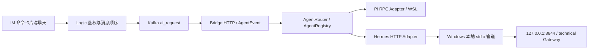

# 多 Agent 接入与独立工作区

每个 Agent 是独立联系人、独立对话框：Pi Agent 为 `900000000001`，Hermes · technical 为
`900000000101`。点击左侧“打开其他 Agent 对话”，或在 Agent 会话中发送 `/agent`，然后
点击卡片打开对应窗口。`/agent hermes-technical` 只返回打开该联系人的按钮，不改变当前
对话绑定的运行时。原 Pi 历史保持原位，Hermes 使用全新会话。

两边的历史、消息序号、未读数、模型偏好、流式进度和上下文独立。打开另一窗口不会复制消息；
`/new` 和 `/retry` 只作用于所在对话。发送过消息后，两个 Agent 分别出现在最近会话列表。
草稿按会话保存在当前页面内存中，切换窗口可恢复；页面刷新不会持久恢复未发送草稿。

## 运行链路



Pi 使用现有 WSL 项目工作区和 `~/.pi-spark-agent` 配置；Hermes 使用已经运行的 Windows
`F:\hermes\profiles\technical` profile，其模型、技能、记忆与工作区保持原设置。不会新开一个
Hermes Agent 进程共同写同一 profile。短暂的 Windows HTTP 管道进程只转发本机请求，不加载
Agent 或修改 profile 状态。API 仅监听 Windows loopback，不新增局域网监听或端口转发。

这提供独立配置、运行时、会话及默认工作目录；**不是操作系统权限沙箱**。两端现有本地工具仍有
原来的文件权限。共享同一 Hermes profile 的渠道仍可使用它的长期记忆，`/new` 不清空记忆。
个人 technical 仅向其所有者开放，不能作为所有用户共用的公共 Agent。

## 配置与扩展

服务读取 `~/.pi-spark-agent/agents.json`，可用 `SPARK_PUSH_AGENT_REGISTRY` 指向其他注册表。
示例见 `cannbot/pi/agents.json.example`。每个条目包含：

| 字段 | 作用 |
|---|---|
| `id` | 稳定 Agent 标识 |
| `bot_user_id` | 独立联系人 ID；打开卡片只携带公开的联系人 ID，不执行斜杠命令 |
| `name` | IM 显示名称 |
| `runtime` | 当前实现 `pi_rpc`、`hermes_http` |
| `owner_user_ids` | 可访问用户；空数组为管理员配置的公共 Agent |
| `base_url` | Hermes Agent 服务入口，不是直接的模型服务地址 |
| `credential_env_file/key` | 服务端凭据引用，不发送给 IM |
| `expected_model` | 校验目标 Agent 公开的入口身份，technical 必须明确匹配 |
| `transport` | 普通 HTTP 或 Windows 本机 `windows_stdio` |
| `routing_keywords` | 可选的首次消息路由词，仅用于没有独立联系人 ID 的聚合入口；命中后即持久粘滞 |

首次接入脚本默认只展示计划：

```bash
python3 cannbot/scripts/configure_hermes_technical.py --owner-user-id 3
# 部署：增加 --apply；先备份，只更新 API 项和 Agent 注册表。
```

technical 使用自己的 API 密钥与 `API_SERVER_MODEL_NAME=technical`，WSL 通过本地管道
访问 `127.0.0.1:8644`。脚本不覆盖已有模型、凭据、技能、工作目录或 Telegram 设置。
Windows `.env` 和备份含凭据，应沿用该 profile 的 Windows 访问控制；WSL chmod 不替代 NTFS ACL。

注册表为后续用户自配置保留所有权和独立实例字段。**当前尚无用户自助配置表单**，注册由管理员
完成。新增 Agent 运行时需要实现 `agent_events.AgentAdapter`，在 `load_router` 注册工厂；
支持其他 Hermes profile 时，可增加独立端点与所有者的条目。Pi 暂只支持现有 `pi` 运行实例。
联系人同时在 `conf/logic.conf` 的 `agent_bot_users=ID:名称;ID:名称` 注册；Logic 启动时安全
创建没有登录密码的机器人账号，ID 已被普通账号占用时拒绝启动，不覆盖账号。
自助配置上线时应通过已鉴权的 Logic API 分配 owner，服务端配置凭据和实例；不能让聊天文本
直接提交任意命令、URL、profile 路径或拥有者 ID。

## 会话、持久化与命令

- 入口只接受可信 Bridge 的当前单聊 `s_<min(userId,botId)>_<max(userId,botId)>`；当前租户为本机部署，未虚构额外
  tenant/thread 鉴权。机器人 ID 与注册表配置一致，用户 ID 来自已鉴权会话。
- 独立对话由 bot ID 固定路由到 Agent；不能通过旧的 `/agent` 选择状态将 Pi 对话改绑 Hermes。
  Router 的 SQLite 持久化路由绑定、turn 幂等结果、可回放事件、Hermes 上下文和模型状态，路径在
  `~/.pi-spark-agent/im-router/routing.sqlite3`。文件权限 0600，禁止 symlink；同一部署仅允许
  一个 Gateway 写该库，暂不支持多 Gateway 集群共享写入。
- 同一会话的聊天和控制持有同一锁。打开卡片只导航，不发送模型请求，不改变路由。每次
  使用都会重新检查用户权限；用户不能通过手动输入私人机器人 ID 绕过所有者检查。
- Pi 保留原 session 文件和偏好。Router 不把 IM 历史投影的模型与 `/new` 边界跨 Agent 传入；
  各 Adapter 自己保存的实际状态为准，防止切换时清空另一侧会话。
- Hermes 使用包含 Agent ID 和 IM session 的 SHA-256 命名空间，通过
  `X-Hermes-Session-Id` 延续对话，通过 `X-Hermes-Session-Key` 标识稳定会话范围。
  `/new` 更换 transcript ID；`/retry` 仅重新发送该上下文记录的最后一条输入，不撤销工具副作用。
- 框架可同时处理不同会话，但原 Pi worker 仍使用全局锁，Bridge Kafka 消费仍有原有顺序瓶颈；
  本批没有宣称实现了完整多 session worker pool 或 IM 端全面并行。
- 现有 accepted/delivered ACK、消息游标、最终答复幂等和历史持久化保持原链路。进度仍为
  临时 ai_delta；断流、非 stop 终态、缺失 DONE 不当作成功最终答复。没有自动重放模型请求。

### PC Agent 路由与事件合同（2026-09-14）

PC 链路现已加入三项可组合的基础能力；Android 原生客户端复用同一 envelope/序号/最终消息合同，并通过 201/211 专用联系人保持 session、模型和上下文隔离：

1. **规范会话身份**：Router 从已鉴权的 `tenant + channel + conversation + thread` 生成稳定
   `route_key`，并以 `agent + channel + route_key` 生成 `session_key`。当前部署使用
   `tenant_id=local`、`channel_id=spark_pc`、`thread_id=_`。`route_key` 在手动切换 Agent 时保持
   不变，`session_key` 随 Agent 改变；底层 Adapter 仍使用原 Spark session 作为
   `backend_session_ref`，因此不迁移也不合并现有 Pi/Hermes 上下文。
2. **统一事件信封**：Gateway 的 `sparkpush.agent_event.v1` 增加
   `sparkpush.agent_envelope.v1`，携带 `event_id/request_id/route_key/session_key/sequence`、渠道身份和
   `terminal/replayed` 标志。流式事件按 request 严格递增；Gateway 提供内部
   `/v1/agent/events/replay`，重复 request 会读取已完成 turn 和事件账本，不再次调用模型或工具。
   若进程恰好在 turn 完成后、终态事件落账前中断，Gateway 会从已完成结果补建终态事件。
3. **首次路由、粘滞与手动切换**：当前 PC 的 Pi/Hermes 是独立联系人，联系人本身就是明确的首次
   路由决策，随后以 `contact` 模式固定绑定。对于不配置独立 `bot_user_id` 的聚合入口，Router 可按
   管理员设置的 `routing_keywords` 对第一条消息做确定性选择，保存后保持 `sticky`；用户通过
   `/agent` 手动切换时提高 revision，并覆盖后续路由。聊天正文不能提交 Agent ID、URL 或运行命令。

Gateway 先把细碎 token 合并成不超过约 40 ms 的事件批次，Bridge 再投影到现有
`ai_delta/hermes_delta`；Web 客户端按事件 sequence 缓冲乱序批次并按 event ID 去重。最终完整
`ai_reply` 仍是历史和游标的唯一权威消息。旧 Gateway 没有 envelope 时，Bridge 和 Logic 继续接受
原有字段；本批没有修改 protobuf、Kafka topic、MySQL 表或 accepted/delivered ACK 含义。

Pi 原有 `/model`、`/reasoning` 卡片保留。Hermes 常用命令现在也走通用 AgentEvent 卡片：

| 命令 | 行为 |
| --- | --- |
| `/model` | 从 technical 的 `/api/model/options` 获取真实模型目录，过滤未认证条目，支持搜索、分页和刷新 |
| `/model provider:model` | 校验目录并等待 Hermes 会话模型接口确认；每轮显式发送 provider/model，只影响当前对话 |
| `/model default` | 采用 technical 当前默认模型并保存为当前会话选择；不修改 profile 配置 |
| `/new`、`/reset`、`/clear` | 确认后新建上下文；保留模型选择、IM 历史和长期记忆 |
| `/retry` | 有上一条输入时显示确认卡片；重发输入，不撤销工具副作用 |
| `/restart` | 确认后调用 Windows 官方 CLI 重启整个 technical 服务，检查 PID 变化和 API 恢复 |
| `/status` | 显示服务连接状态、会话模型和上下文编号 |
| `/help`、`/commands` | 打开命令菜单 |
| `/agent` | 打开其他 Agent 的独立对话 |

卡片操作在 IM 中显示“选择模型…”或“确认重启…”等操作名称，并等待服务端反馈。
模型点击后原位收起列表并显示“正在切换模型”；Logic 在最终回复中保存
`agent_command_result`（原始 client_msg_id、命令、确认状态和实际模型），前端与用户消息的
`agent_action.source_card` 关联。只有对应 Bot 的成功结果且模型匹配才显示“模型修改成功”；
ACK 不代表切换成功。失败恢复选择列表，成功提供“重新选择模型”，历史重载和乱序消息可重建
同一结果。关联信息只用于展示，不作为执行命令或越过权限检查的依据。
模型目录最多 512 项、卡片 JSON 最多 96,000 字节；超出时明确标记截断，当前服务商优先。
自定义服务商 `custom:*` 使用稳定的安全命令 token 映射，凭据、URL 和原始 runtime 对象不进入卡片。
目录缓存 60 秒；普通 `/model` 优先命中缓存，刷新按钮发送 `/model refresh` 重新读取 Hermes 的目录接口（Hermes 自身仍管理服务商目录缓存）。

安装的 Hermes Browser session stream 对 `custom:*` 别名与内部 `custom` 名称存在模型锁比较
不一致问题。因此当前执行继续采用官方兼容 `/v1/chat/completions`，每轮显式传 provider/model；
安装源码的显式 provider 解析失败会报错，避免回退全局凭据。`/api/sessions/{id}/model` 用于
持久化并确认选择，IM 的独立 session key 不与其他渠道共享。适配未修改 Windows Hermes 源码。

`/restart now`（也支持 `--yes`、`-y`）会影响 technical profile 的其他渠道和正在运行的任务，
确认卡片会说明范围。重启意图先落 SQLite，同一 command_seq 重放不再次执行。恢复未确认时
显示结果未知并引导 `/status`，不自动重启第二次。该能力只接受固定的 technical 本机路径和
CLI 参数；保持原有 owner ACL，不接受聊天输入提供命令、profile 或路径。Pi 不提供此重启操作。

Hermes technical 已支持会话级 `/reasoning`：`low/high/xhigh/max` 四档通过兼容接口的
`reasoning_effort` 传递，状态保存在独立 Hermes session 中，不修改 Windows profile 文件。
Stop、steering、附件等仍不属于本批实现。

## 验证

`test_agent_router.py` 覆盖所有者过滤、跨用户拒绝、独立联系人固定路由、旧选择状态不改绑
对话、不同 Agent 参数隔离、会话互斥、Hermes 会话头、工具进度、失败终态、新建与重试、
管道阻塞时的超时回收。C++ 测试覆盖联系人配置、卡片历史保存与 action 注入拒绝；Chromium
覆盖打开独立窗口、指令发送至正确机器人以及迟到 Pi 进度不能进入 Hermes 窗口，并复测
原有模型和思考卡片。真实 Windows 已验证 technical 入口、只读工作目录工具和多轮上下文。

2026-09-14 的 PC 合同验证：实际运行目录 `build/` 完整重编成功；CTest 13 项执行通过，
Redis 外部集成项因未启用测试条件跳过；Router/Gateway 27 项 Python 测试通过。真实 Gateway
短回复产生 5 个连续 AgentEvent，终态与兼容 final 文本一致；相同 request ID 回放耗时约
0.01 秒，全部事件标记 `replayed`，Pi 日志仅出现一次 turn 执行。隔离测试账号经 WebSocket
收到 accepted ACK 和最终 Agent 卡片，历史重载得到连续序号；发送后立即断开时，最终卡片仍
落库，重新连接后补推用户消息和 Agent 最终消息。Bridge 序列投影的短模型 E2E 收到
`delta_index=0,1,2,3`，持久最终 envelope 为下一号 4 且 `terminal=true`，历史重载保持相同值。
测试未使用个人账号或 Hermes 私人会话。

部署验收（2026-09-06）：完整构建与 CTest 通过（13 通过、1 Redis 集成跳过），包含 37 个
Pi Gateway 用例与 11 个路由/Adapter 用例。真实 IM 独立账号验证目录权限、不同联系人回复
身份、历史保存、重载和切回 Pi 后不混入 Hermes 消息；用户 3 的两个联系人目录及 technical
专属路由也已只读核验。真实 Hermes 自检执行了只读工作目录工具，第二轮正确记住上一轮
标记。新 API 实际仅监听 `127.0.0.1:8644`；IM 应用已重启，15 项健康检查通过。

Hermes 最终联系人 ID 为 `900000000101`。初选 ID 已被历史测试账号占用，启动保护拒绝覆盖；
经只读确认空闲后改用新 ID，已有账号与 Pi 历史均未替换或迁移。

参考当前 Hermes 官方 [API Server 文档](https://hermes-agent.nousresearch.com/docs/user-guide/features/api-server)
和本机 `gateway/platforms/api_server.py`；不是向默认实例附加一个 profile 字符串后假定完成隔离。

## 2026-09-07 延迟优化与 WSL 评估

Windows stdio 中继改为每个 Adapter 最多 4 个 worker 的进程池。每个 worker 同时仅处理一个
请求，只有明确消费了 EOF 帧才复用；超时、半截流和异常会销毁该 worker，不自动重放 POST。
Gateway 关闭时回收池中的进程。它复用的是 HTTP 中继，不是新建多个 Hermes Agent 服务。
单会话顺序执行及 owner ACL 保持不变，正文与检索内容不截断。

普通模型菜单使用 60 秒缓存；主动刷新仍调用上游目录。连接阶段增加进度提示，
`hermes_timing` 记录连接、首段正文和完整回复耗时，以区分接入成本与模型执行时间。

本机只读测试：简单请求复用后约 2～3 ms（原约 1.2 s），缓存模型菜单约 1 ms；
首次/主动刷新约 2.5～3.2 s。该结果不代表模型生成速度。
WSL 移植的依赖审计、收益边界和切换方案见 [Hermes WSL 迁移评估](hermes-wsl-migration.md)。

## Android 端落地

Android 客户端的 HTTP/WS 适配、会话游标、流式增量排序、Agent 卡片和输出长度计时已经在同一仓库实现，详细到函数级的说明见 ../docs/spark-push-implementation.md。Android 使用 900000000201 和 900000000211，不会复用 PC/Telegram 的 001/101 联系人；最终 ai_reply 仍走普通消息落库和离线补推链路。
