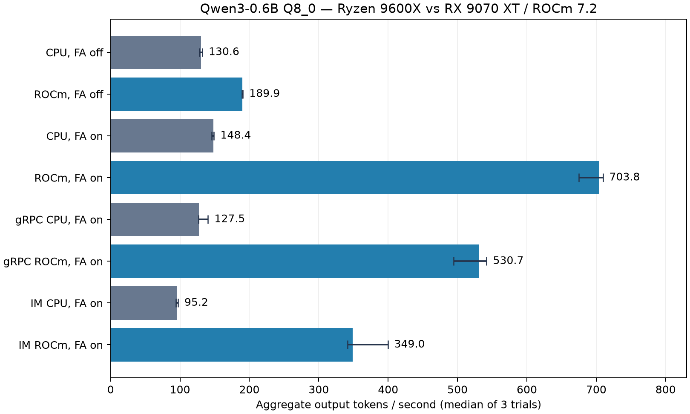

# Qwen3-0.6B：RX 9070 XT / ROCm 真实实验

验证日期：2026-09-30。范围：单机 WSL、固定模型的服务吞吐和延迟，以及真实 IM 链路。
这是带环境的性能快照，不代表生产容量或其他模型性能。

## 1. 实施内容与责任边界

- C++ gRPC Gateway：容量过滤、原子预留、有界 FIFO、排队超时、排队/运行取消、会话亲和提示。
- Worker：独立并发上限、OpenAI HTTP/SSE 的 llama.cpp/vLLM 适配、usage-only 事件、健康/负载采集。
- HIP：实际加载 ROCm，使用 `hipMemGetInfo` 采集设备显存；CPU 编译不依赖 ROCm。
- Bridge：有界 Kafka 并行批次；相同 session key 串行、不同会话并行；整批完成后按读取顺序提交位点。
- 运行时：CPU/ROCm/CUDA/CANN 构建入口；通过真实 llama.cpp 集成 continuous batching、prefix cache、Flash Attention、KV 精度配置。
- 测量：HTTP、gRPC、完整 IM 的逐请求真实 token 用量、TTFT、E2E、TPOT、吞吐和失败记录。

GPU 内核、tokenizer、Flash Attention 和 KV 管理来自 llama.cpp；这里的工程工作是服务集成、
调度、并发、可观测性和实测。没有自行实现 PagedAttention、CUDA/HIP 自定义算子、PD 分离、
RDMA 或分布式 KV。vLLM 只通过协议 fixture 测试，没有声称在本机真实部署 vLLM。

## 2. 实际环境

| 项目 | 记录 |
|---|---|
| CPU | AMD Ryzen 5 9600X，6 核 / 12 线程，推理固定 6 线程 |
| GPU | AMD Radeon RX 9070 XT，gfx1201，单卡 16 GB |
| 系统 | Windows + WSL Ubuntu 24.04，WSL 约 15 GiB RAM / 4 GiB swap |
| Windows 显卡驱动 | 32.0.31021.5001（实际检测值） |
| ROCm / HIP | ROCm 7.2.0 / HIP 7.2.26015-fc0010cf6a |
| llama.cpp | `6c7a87f7e5e5cd75b8a641c3471f2dee84a6ed17`，CPU 与 HIP 相同源码提交 |
| 模型 | 官方 Qwen3-0.6B-GGUF Q8_0，约 610 MiB，模型权重量化固定不变 |
| 模型 SHA-256 | `9465e63a22add5354d9bb4b99e90117043c7124007664907259bd16d043bb031` |
| 模型位置 | `/home/peco/models/Qwen3-0.6B-Q8_0.gguf`，不入 Git |
| CPU / HIP 二进制 | `/home/peco/tools/llama.cpp/build/bin/llama-server` / `build-rocm/bin/llama-server` |
| 应用依赖 | Kafka 3.7.0 KRaft、MySQL 8.0.46、Redis 7.0.15；精确包版本见 environment.json |

`rocminfo` 实际识别 gfx1201。HIP 日志明确记录 `found 1 ROCm devices`、
`ROCm0 (AMD Radeon RX 9070 XT)` 和 **offloaded 29/29 layers to GPU**。
GPU 模型 buffer 604.15 MiB。引擎内部共享源码函数名 `ggml_cuda_init` 同样用于 HIP；
判断依据是 ROCm 设备、HIP 构建配置和实际卸载，不能凭函数名把它当成 NVIDIA CUDA。

证据：[环境](benchmarks/2026-09-30-rx9070xt/environment.json)、
[Windows 硬件](benchmarks/2026-09-30-rx9070xt/windows-hardware.json)、
[rocminfo](benchmarks/2026-09-30-rx9070xt/rocminfo.txt)、
[运行时日志摘录](benchmarks/2026-09-30-rx9070xt/runtime-evidence.txt)。

## 3. 方法与指标

每个成功配置测 **3 轮 × 12 请求**，启动后先进行 2 次不计入统计的预热。
每组吞吐取三轮中位数，不挑最快的一轮；范围见[完整表](benchmarks/2026-09-30-rx9070xt/tables.md)。
表中 TTFT/E2E p50/p95 对该组全部 36 请求计算。样本较少，尾延迟仅为描述统计。
存档结果共 936 个计时请求，失败 0 个；另记录了双独立 HIP 启动失败和一次单进程
HSA 断言启动失败。启动失败不混入成功吞吐，也不以成功重试抹去失败记录。

- **吞吐 token/s**：整个计时批次的实际输出 token 总数 / 墙钟时间，包含排队和流式开销。
- **TTFT**：客户端提交到第一段非空文本，包含相应传输/队列。IM 的第一段是合并后的 WS delta，不是纯模型首 token。
- **E2E**：提交到终态。IM 终态是客户端收到最终持久化消息，ACK 不算生成完成。
- **TPOT**：`(流式完成时间 − 首段时间)/(实际输出 token 数 − 1)`；包含尾部传输/终态开销，不是裸 kernel 时间。
- **单请求输出速度**：`1000 / TPOT p50`。它与多请求总吞吐不同，不能把总吞吐写成单人 token 输出速度。
- token 来自引擎 usage，经 gRPC、Bridge 传至最终聊天消息；不使用字符数、字节数或 chunk 数替代。

基础 prompt 固定，问题编号 0–11；temperature=0，seed=42，thinking off，cache off。
HTTP/gRPC 强制 ignore_eos，固定生成 128 token，避免不同提前停止导致不公平负载。
完整 IM 使用自然停止、上限 128；本次实际请求均达到 128（原始记录可核查）。
IM 每次使用新用户/会话保持上下文一致；注册、连接、预热在计时外。
基础参数：batch 512、microbatch 128、每 slot context 2048、CPU threads 6。
CPU 明确 `-ngl 0 --device none --no-kv-offload --no-op-offload`；HIP `-ngl 99`。
CPU 基础组重跑以排除最初编译/依赖启动的交叉负载；保留最终三轮记录。
Windows 桌面和后台服务仍可能引入噪声，未控制功耗/频率；结论限定于此环境。

应用与 gRPC 服务使用 **CMake Release** 构建；引擎也为 Release。最初 Debug 试跑仅作
开发检查，正式归档前全部 gRPC/IM 组已重跑为 Release，报告采用重跑结果。



输出并非逐字一致：相同输入的 CPU/ROCm FA-on 输出哈希仅 1/36 相同，f16/q8 KV 为
5/36 相同（[原始核对](benchmarks/2026-09-30-rx9070xt/output-validation.json)）。
本实验固定 token 工作量并验证真实完成，用来证明性能变化；没有证明输出质量等价或量化无损。

## 4. 模型服务：CPU 与 ROCm

| 配置（并发 / 槽位） | 总输出 token/s | TTFT p50 / p95（ms） | E2E p50（ms） |
|---|---:|---:|---:|
| CPU，FA off，1 / 1 | 60.16 | 143.7 / 149.8 | 2103.7 |
| ROCm，FA off，1 / 1 | 96.30 | 819.8 / 865.5 | 1323.3 |
| ROCm，FA on，1 / 1 | 260.35 | 22.2 / 23.3 | 491.1 |
| CPU，FA off，4 / 4 | 130.57 | 547.1 / 608.3 | 3908.9 |
| ROCm，FA off，4 / 4 | 189.91 | 1670.4 / 2492.1 | 2451.6 |
| CPU，FA on，4 / 4 | 148.35 | 494.1 / 521.2 | 3461.4 |
| ROCm，FA on，4 / 4 | 703.82 | 79.7 / 95.3 | 732.0 |

同为 4 槽位、FA off，ROCm / CPU 吞吐 **1.45×**，但 TTFT 更差。
同为 FA on，ROCm / CPU 为 **4.74×**。
ROCm FA on 相对 ROCm FA off 为 **3.71×**。
“GPU 卸载 + Flash Attention”对原 CPU FA off 的整体提升为
**5.39×**，这个倍数包含运行时优化。

单并发：CPU FA off 的客户端解码速度约 **64.7 token/s**，ROCm FA on 约
**271.0 token/s**。这里比较的是 GPU + FA 的组合，不能写成单独硬件加速倍数。
仅卸载 GPU 的收益有限；针对这个小模型，FA 是显著影响吞吐和首 token 延迟的选项。

## 5. 优化消融

### Continuous batching 和容量

ROCm、混合输出长度 32/64/128/256、4 并发、4 slots、FA off：
batch on **130.67 token/s**，batch off
**124.02 token/s**，提升 **1.05×**。
TTFT p50 从 2590.4 降到
829.0 ms。三轮区间存在重叠，吞吐小幅收益不能外推为普遍规律。

单 slot 下并发 4 仍是排队；ROCm FA off 的总吞吐约 96.90，
4 slots 后为 189.91。并发升到 8 时只有
188.21，TTFT 增大，超过容量主要增加排队。

### Prefix cache

独立长 prompt（约 936 input token，逐请求见原始记录）、1 并发、输出 32、FA off。
cache off 为 7.16，on 为 32.88 token/s，
**4.59×**。TTFT p50
4307.5 → 829.4 ms。
三轮累计 cached prompt tokens=32979，
prompt tokens=33630。
收益来自重复长前缀；与短 prompt 基础吞吐不可直接比较。会话亲和只是路由提示，未测跨设备 KV 迁移。

### KV 精度

固定 **Q8_0 模型权重**，仅 KV 从 f16 改为 q8_0，均 FA on / 4 slots / 4 并发。
f16：703.82，q8_0：627.39 token/s。
KV buffer **896 → 476 MiB**（减少 46.875%），速度下降
10.9%。本机选 f16 作为速度默认。
这不是模型权重量化对比，也未进行困惑度/任务准确率评估。不能声明 KV 量化无质量损失。

## 6. gRPC 服务与多 Worker

| 配置（并发 / 槽位） | 总输出 token/s | TTFT p50 / p95（ms） | E2E p50（ms） |
|---|---:|---:|---:|
| gRPC CPU，FA off，4 / 4 | 127.95 | 632.2 / 925.4 | 3982.2 |
| gRPC ROCm，FA off，4 / 4 | 151.90 | 2086.0 / 3324.7 | 3203.9 |
| gRPC CPU，FA on，4 / 4 | 127.51 | 977.8 / 1089.7 | 3977.2 |
| gRPC ROCm，FA on，4 / 4 | 530.74 | 103.0 / 455.9 | 860.0 |
| 2 Workers 共享一个 ROCm 运行时，FA on，4 / 4 | 513.16 | 101.3 / 603.7 | 845.0 |

同为 FA on，gRPC ROCm / CPU **4.16×**。
gRPC 实际吞吐低于直接 HTTP，需要承担适配、序列化、线程监控和资源探测开销；未声称零开销，
也未通过分离实验把损耗全部归因于网络。两个 Worker 各声明容量 2，共享一个 4-slot 运行时，
两者实际都有请求。吞吐差异在波动区间内，不能写成扩容收益或双 GPU 加速。

**失败实验**：两个独立 HIP llama-server 进程共享本卡时，第二个进程启动退出 **-11**。
[失败 manifest](benchmarks/2026-09-30-rx9070xt/grpc_rocm_replicas2-manifest.json)
保留了命令和错误。未定位根因，可能涉及当前 ROCm/WSL/引擎组合；不声称所有 AMD 设备都有此限制。
没有用模拟结果补齐双独立运行时的吞吐。

Release 应用矩阵的 `app_rocm_bridge1` 首次启动还触发了
`hsaKmtWaitOnMultipleEvents_Ext` 的 Assertion false，退出 **-6**。
[原始失败](benchmarks/2026-09-30-rx9070xt/app_rocm_bridge1-startup-failure.txt) 与
[失败参数](benchmarks/2026-09-30-rx9070xt/app_rocm_bridge1-startup-failure.json) 单独存档；
该组随后独立重试，正式三轮来自成功重试。未定位 HSA 断言根因，不能把当前演示环境视为
已经完成长期稳定性验证。

## 7. 完整应用：WS / Kafka / Bridge / gRPC / 持久化

真实 Kafka KRaft 监听 29092，4 partitions；MySQL 使用独立
`spark_push_benchmark`、用户 `serving_bench`；Redis DB 11。实验每组生成新 topic/group。
配置/随机密码保存在仓库外 `~/.cache/serving-stack/`，文件权限 0600；原始结果不含凭证。
应用二进制均来自本次 WSL 构建。每组 36 请求、并发 4、自然输出上限 128、缓存关闭。

| 配置（并发 / 槽位） | 总输出 token/s | TTFT p50 / p95（ms） | E2E p50（ms） |
|---|---:|---:|---:|
| CPU，Bridge 1，FA off，4 / 4 | 60.92 | 6402.8 / 6481.2 | 8378.4 |
| ROCm，Bridge 1，FA off，4 / 4 | 87.72 | 5232.7 / 5333.2 | 5786.4 |
| ROCm，Bridge 4，FA off，4 / 4 | 119.46 | 3140.2 / 4450.8 | 4082.5 |
| CPU，Bridge 4，FA on，4 / 4 | 95.19 | 1930.5 / 3454.2 | 4369.3 |
| ROCm，Bridge 4，FA on，4 / 4 | 349.05 | 713.5 / 1593.8 | 1316.0 |

最终优化配置相对原始 CPU 串行 Bridge 为 **5.73×**，
这个倍数同时包含 GPU、Flash Attention 和 Bridge 并发收益。
同为 Bridge 4、FA on 时，ROCm 对 CPU 为 **3.67×**。
同为 ROCm、FA off 时，Bridge 4 对 Bridge 1 为
**1.36×**。


每组额外进行了：收到首 delta 后断开 WS → 等待完成 → 认证历史读取最终消息 → 重连并重发
同一 `client_msg_id` → 再查询历史。成功条件：历史仅一条用户消息、一条机器人最终消息。
结果见各 `app_*-manifest.json` 的 recovery；临时 delta 不进入历史。
这里验证最终历史恢复与重复发送，不代表完成断电、分区、全部跨服务崩溃的故障矩阵。
ACK 独立测量，不能拿 ACK 耗时当成模型 E2E。

## 8. 复现与验证

[运行入口与参数](inference-serving.md)。脚本：`inference/benchmarks/run_matrix.py`、
`run_app_matrix.py`、`bench_serving.py`、`summarize.py`。
逐请求 JSON、三轮统计、命令 manifests、原始指标均在
[数据目录](benchmarks/2026-09-30-rx9070xt/README.md)。完整运行日志保留本地但由 Git 忽略；
关键 GPU 证据有可提交摘录。所有数字可由 raw JSON 重新计算。

```bash
python inference/benchmarks/run_matrix.py --out /path/to/results
python inference/benchmarks/run_app_matrix.py --out /path/to/results \
  --secret-file /path/to/external-secrets.json
python inference/benchmarks/summarize.py /path/to/results --plot
SPARK_PUSH_RUN_REDIS_TESTS=1 ctest --test-dir build-wsl --output-on-failure
python3 cannbot/scripts/validate_knowledge.py --strict
python3 cannbot/scripts/test_pi_citations.py
python3 cannbot/scripts/sync_pi_agent.py --check
```

完整 CTest 20 项：20 通过，含真实 Redis 序号测试。Kafka 并行 correctness 用 librdkafka mock broker
验证同 key 串行、不同 key 并行、未完成不提交和失败重放；完整应用实验用真实 broker。
HTTP fixture 验证 usage-only SSE、坏字段失败、取消及 llama.cpp/vLLM 适配。
知识严格校验通过（41 sources），Pi 引用测试通过。`sync_pi_agent.py --check` 报告
WSL 的 `/home/peco/.pi-spark-agent` 下 Skills、扩展、settings/models 尚未安装。
本次可选 gRPC 链路不依赖该目录；没有把它写成已通过的 Pi 实际部署验证。
CTest 原始日志见数据目录 `verification-ctest.txt`。

## 9. 简历可以写什么

建议用具体环境、接口和实测边界描述：

> 在 C++ gRPC 推理链路中实现有界准入、Worker 容量调度、会话亲和、流式取消与 Prometheus 观测；
> 基于 ROCm/HIP 在 RX 9070 XT 上部署 Qwen3-0.6B，集成批处理、前缀缓存与 Flash Attention，
> 完成 CPU/GPU 消融实验；4 并发模型服务实测 704 token/s，
> 同 FA 配置 CPU 对照提升 4.74 倍；
> Kafka Bridge 按会话保序并发，验证最终回复持久化、断线历史恢复和重复请求幂等。

CUDA/CANN 目前只能写“提供真实 SDK 构建接入入口，等待对应硬件验证”，不能写实测或算子开发。
ROCm 已实际安装、编译、GPU 卸载、显存查询与 benchmark；项目并不因此证明掌握了所有 HIP 内核优化。
没有 NVIDIA/昇腾硬件数据，不编造跨平台结论。

参考：
[AMD ROCm 7.2 WSL 安装](https://rocm.docs.amd.com/projects/radeon-ryzen/en/docs-7.2/docs/install/installrad/wsl/install-radeon.html)、
[llama.cpp server](https://github.com/ggml-org/llama.cpp/blob/master/tools/server/README.md)、
[官方模型](https://huggingface.co/Qwen/Qwen3-0.6B-GGUF)。课件提供优化主题，是否有效以以上实测为准。
