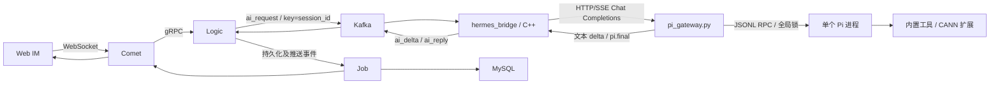
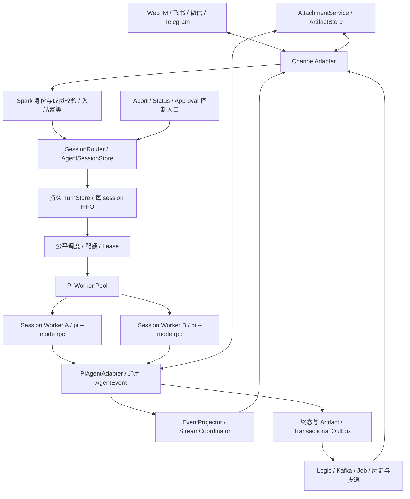

# Pi Agent ↔ IM 架构审查与实施方案

审查日期：2026-09-06。范围：项目根目录当前实现，不包含教学快照。本文件是第一步架构交付，以下新增接口、表和模块均为设计，尚未实施。既有未提交改动保持原样。

实施进展另见 [Pi 接入文档第 5 节](pi-agent-integration.md#5-im-完整适配进度第一批运行正确性修复)。本审查保留实施前的缺陷与探针结果，不能据此判断修复后的代码仍有同样行为。

结论：保留 Spark Push 的消息可靠性底座；当前优先采用 **Python 编排 + 有界 Pi RPC Session Worker Pool**，逐步引入 ChannelAdapter、AgentAdapter、SessionRouter。主服务是 C++，现有 gateway 是 Python，没有理由为了直接嵌入 SDK 重写 IM 后端。需要先修复会话串用、错误终态、自动批准和最终回复持久化问题，随后再开放多用户并发与工具能力。

## 1. 当前架构分析

### 1.1 实际运行链路



主要代码证据：

| 层 | 已实现行为 | 证据 |
|---|---|---|
| 消息模型 | `ChatMessage` 含 `msg_id/session_id/msg_seq/sender_id/msg_type/content_json/client_msg_id`；AI 输出最终作为普通 text 消息 | `proto/spark_push.proto`、`logic/model.h`、`logic/grpc_service.cpp::HandleHermesReply` |
| IM 会话 | 单聊为排序后的 `s_<uid1>_<uid2>`，聊天室为 `r_<room_id>`；AI 目前仅从与固定 Bot 的单聊触发 | `logic/grpc_service.cpp::HandleUpstreamMessage`、`logic/session_dao.cpp` |
| 输入转换 | Logic 读取最近 50 条历史、合并进程缓存、解析命令、按约 12 KiB 选择上下文；请求带 `context_start_seq` | `logic/grpc_service.cpp::BuildHermesRequest`、`logic/hermes_command.cpp` |
| Pi 接入 | gateway 仅取最后一个 user 的文本；持久上下文来自 Pi JSONL；`switch_session` 后 `prompt`，等 `agent_settled`，再取最后 assistant 文本 | `cannbot/scripts/pi_gateway.py::latest_user_text/bind_session/chat` |
| 流式 | Pi text delta → OpenAI 风格 SSE → Bridge 合并 → Kafka → Logic → Job → Comet；工具开始被拼成正文中的 `⚙` 行 | `pi_gateway.py::chat`、`hermes_bridge/main.cpp::HandleRequest` |
| 持久化与 ACK | Redis 原子分配序号及短期去重，Kafka 持久化事件驱动 Job 落 MySQL；accepted 与 delivered 是不同阶段 | `logic/conversation_store.cpp`、`logic/redis_store.cpp`、`common/kafka_consumer.cpp`、`job/service.cpp` |
| UI 与恢复 | `hermes_delta` 临时气泡；最终回复覆盖预览；WS 指数退避重连、离线补推和 cursor sync | `web_demo/static/index.html`、`comet/comet_server.cpp` |
| 附件 | 没有通用上传、附件元数据、授权下载或产物发布链路；`content_json` 可扩展不代表附件能力已实现 | `proto/`、`sql/schema.sql`、`logic/`、`web_demo/` 中当前实现 |
| CANN | 只读检索工具、每轮引用收集与改写、Logic 引用校验、知识原文页 | `cannbot/pi/extensions/cann-advisor.ts`、`pi_citations.py`、`logic/citation_validation.cpp` |

必须保持的项目语义：`accepted_ack` 只确认持久化事件进入 Kafka，不能当作 Agent 开始或完成；`delivered_ack` 确认目标连接被交付，不等于人已读。`ai_delta` 不落消息历史且 `msg_seq=0`；最终 `ai_reply` 才进入普通消息的历史和游标链路。下面指出的失败窗口说明实现仍需完善，不能把这些目标语义当作所有故障下都已满足。

### 1.2 两个串行瓶颈与两套上下文

`KafkaConsumer::Loop` 同步执行 `HandleRequest`，后者等待完整 HTTP/SSE 响应，因此一个 Bridge 实例一次仅处理一个请求，即便消费多个分区也如此。gateway 的所有 HTTP 线程又共享一个 `PiRpcClient` 和覆盖完整 chat 的 `threading.Lock`。加 HTTP 线程、只增加 Kafka 分区或只移除锁，都不能正确实现多 session 并发。

Logic 的 `messages[]` 与 Pi 文件内的上下文不是同一份事实：gateway 丢弃了前面的历史/system 消息。Pi 文件丢失时不会从这些历史恢复；`/retry` 也不会撤销 Pi 历史中的旧答案，而是再次追加原用户问题。`/new` 的边界从最近 50 条 IM 历史中的命令推导，命令滚出窗口后 `context_start_seq` 可能回到 0，重新绑定旧文件。12 KiB 是 Logic 发送内容的预算，不能视为 Pi 实际上下文预算。

### 1.3 Pi 版本与 API 基线

本机包：`/home/peco/.local/node/lib/node_modules/@earendil-works/pi-coding-agent/package.json`，版本 **0.84.4**。已检查同包 `docs/{sdk,rpc,extensions}.md`、`dist/index.d.ts`、`dist/core/{agent-session,agent-session-runtime,session-manager}` 和 RPC 实现。在线 main 的 package.json 在本次读取时为 **0.85.1**；这不是对 npm latest 或运行中进程版本的推断，也未升级依赖。

已核实的 0.84.4 API：

- SDK 导出 `createAgentSession`、`ModelRuntime`、`SessionManager`、`createAgentSessionRuntime`。`AgentSession` 提供 prompt、subscribe、steer、followUp、abort、compact、模型和 thinking 控制。
- new/resume/fork 等替换操作属于 **AgentSessionRuntime**。替换后 session 对象会改变，SDK 使用者需要重新订阅和绑定扩展，不能套用旧 `session.newSession()` 示例。
- RPC `prompt` 成功响应表示接受/入队，不是整轮成功；`agent_end` 可能后接 retry、compact 或 follow-up，`agent_settled` 才表示无自动续跑。当前 gateway 等 settled 这一点应保留。
- RPC `prompt` 可带 `images: [{type:"image", data:"...", mimeType:"image/png"}]`，忙时可用 `streamingBehavior:"steer"|"followUp"`；也有 `steer`、`follow_up`、`clear_queue`、`abort`。
- `switch_session` 可返回 `success:true` 且 `data.cancelled:true`，不能仅判断 success。本机 `SessionManager.open` 对不存在的显式文件可以建立新会话，所以不能误报“首次 switch 必然失败”。
- `--approve` 的准确含义是**信任项目本地资源**，不是通用的工具自动批准开关。gateway 自己的 `auto_ui_response` 才是 confirm 自动批准的直接来源。

官方入口：[SDK](https://github.com/earendil-works/pi/blob/main/packages/coding-agent/docs/sdk.md)、[RPC](https://github.com/earendil-works/pi/blob/main/packages/coding-agent/docs/rpc.md)、[Extensions](https://github.com/earendil-works/pi/blob/main/packages/coding-agent/docs/extensions.md)。落地时以锁定版本的安装包声明和契约测试裁决示例差异，尤其是 image 类型、导出路径、session replacement 和事件终态。

## 2. 与两个 pi-telegram 实现的差异

| 方面 | badlogic/pi-telegram | Qusic/pi-telegram | 当前 Spark Push |
|---|---|---|---|
| 定位 | 连接当前 Pi session 的单用户 DM 扩展 | 同样是单用户 DM 扩展，拆成 manager 模块 | 已有多用户 IM，Pi 运行时仍全局单实例 |
| 输入 | 文本前缀 + 图片块 + 文件路径 | 文本/媒体块；输入期间支持 steer | 只取最新 user 文本 |
| 忙时输入 | 扩展内存 FIFO，结束后发送下一条 | `deliverAs:"steer"` 注入当前运行 | Kafka/全局锁等待，没有可观测业务队列 |
| 输出 | draft 探测及 send/edit 回退、分段最终文本 | 串行化 preview flush/promote/finalize，长内容边生成边分段 | WS 临时 delta + 一条完整最终回复 |
| thinking/tool | 过滤 thinking，无独立工具卡片 | thinking 与回答分隔；工具 start/end 卡片 | 无真实 thinking 流；工具开始混入文本，无 update/end 卡片 |
| 控制 | stop、status、compact | 增加 new/resume/skills | new/status/model/retry 主要为本地命令规划 |
| 文件输出 | `telegram_attach` | `telegram_attach` | 无通用输出工具 |
| 可靠性 | 轮询游标 + 内存 turn 状态 | 轮询游标 + HTTP retry + 内存状态 | Kafka、MySQL、序号、离线补偿已有基础 |
| 隔离 | 单个获准用户 | 单个获准用户 | IM 用户鉴权存在，Agent/租户/工作区隔离不足 |

可借鉴的是输入归一化、附件显式发布、状态与回答分离、可串行收敛的预览状态机，以及 queue/steer 的产品语义；不应引入 Telegram 前缀、token 配对方式或 channel-specific tool 到 Agent 核心。[badlogic 源码](https://github.com/badlogic/pi-telegram/blob/main/index.ts)、[Qusic turn](https://github.com/Qusic/pi-telegram/blob/main/turn.ts)、[Qusic preview](https://github.com/Qusic/pi-telegram/blob/main/preview.ts)。

参考实现也有明确边界：

- Qusic `dispatch.ts` 的 trampoline 使用 `expandSkills:true as any`，注释说明依赖本地补丁；不能视为 0.84.4 官方 API。采用官方 RPC new/switch 或 SDK runtime API。[dispatch.ts](https://github.com/Qusic/pi-telegram/blob/main/dispatch.ts)
- 两个实现均在 `agent_end` 收尾，不能照搬到本项目的完整运行终态判断；Qusic 的 tool UI 注册 start/end，并没有因此自动具备 tool progress 流。
- Qusic 的串行 preview 写入链值得借鉴；其代码里的 Rich Message 方法、长度常量及 1500 ms 节流属于该 channel 实现，不能变成平台通用协议。badlogic 的 750 ms 和普通消息限制同理。
- 两者不是持久化任务队列或多租户方案。所读轮询代码在业务处理前推进 update 游标，内存 turn/媒体组无法在崩溃后可靠恢复；HTTP 发送重试也不代表外部消息恰好发送一次。[Qusic polling](https://github.com/Qusic/pi-telegram/blob/main/polling.ts)、[API](https://github.com/Qusic/pi-telegram/blob/main/api.ts)
- 两者附件工具都接受本地路径并检查文件存在，没有建立平台级 workspace containment、租户所有权和审计边界。

## 3. 当前缺失能力与缺陷优先级

### 3.1 优先修复的可定位问题

| ID / 优先级 | 触发、影响 | 代码位置与处理方向 |
|---|---|---|
| F01 / P0 | bind_session 异常只记日志，仍向旧活动 session 发 prompt；cancelled 也被缓存为成功 | `pi_gateway.py:231–269`；失败即中止，核对实际 session，禁止降级到旧会话 |
| F02 / P0 | Pi 重启后保留 `current_session_path`，同一路由下一次跳过 rebind；超时后未等终止就可切换 | `pi_gateway.py::_spawn/_ensure/chat`；进程 epoch 隔离、清缓存、确认 settled 或销毁 worker |
| F03 / P0 | confirm 无条件 true，select 自动取首项；默认工作区是可写实时仓库，子进程继承父环境 | `pi_gateway.py::auto_ui_response/main`、`cannbot/pi/settings.json`、system prompt；建立执行策略及隔离，禁止默认同意 |
| F04 / P0 | 收到 partial 文本再收到 SSE error，C++ 忽略 error，非空 partial 可被当成功 final；gateway 不校验本轮 assistant stopReason | `hermes_client.cpp::SseParser/ChatStream`、`pi_gateway.py::chat`；要求明确终态、区分 failed/aborted/completed |
| F05 / P0 | final 先取得 Redis 去重状态，再发持久化事件；若发 Kafka 失败，重试命中 `!is_new` 直接 return true，可能没有历史记录 | `logic/grpc_service.cpp::HandleHermesReply` 约 781–819 行；去重与“已完成持久化”分离，恢复未完成副作用 |
| F06 / P0 | 消费业务失败重试耗尽后仅打印 `[DLQ]` 仍提交 offset，没有真实死信存储 | `common/kafka_consumer.cpp::HandleMessage`；AI 链路先引入可恢复失败记录/真实 DLQ，不能把日志当 durable handoff |
| F07 / P1 | `_dispatch` 将不匹配 response 分配给任意 waiter；请求 ID/pending/write 无控制并发协议 | `pi_gateway.py::_dispatch/rpc/_write`；严格 request ID 匹配，reader 不阻塞，串行写及 waiter 生命周期管理 |
| F08 / P1 | 多用户共享锁；Bridge 长调用阻塞 poll；配置 request timeout=600 s，consumer 默认 max.poll.interval=300 s | `hermes_bridge/main.cpp`、`conf/hermes_bridge.conf`、`common/kafka_consumer.h`；可能再平衡和重复执行，需独立入队与执行 |
| F09 / P1 | `/new` 边界滚出 50 条历史可丢失；retry 的 IM 语义与 Pi 历史不一致 | `BuildHermesRequest`、`ApplyPersistedEntry`、`latest_user_text`；会话控制状态持久化，不从聊天窗口反推 |
| F10 / P1 | bare model 无 provider 时 gateway 不 set_model；default 跳过恢复；set_model 失败被吞掉，UI 仍报成功 | `pi_gateway.py::chat`、`BuildLocalCommandReply`；解析真实 model、验证可用性，成功后保存实际状态 |
| F11 / P1 | HTTP 断开使 on_delta 抛异常，chat 无 finally 终止/接管；队列无界；health 即使 Pi 未就绪仍报 ok | `pi_gateway.py::chat/make_handler/main`；将执行与订阅解绑，加 deadline、readiness、队列上限 |
| F12 / P1 | request_id 在 Bridge 缓存但不随 HTTP 请求传给 gateway；进程缓存丢失后 Kafka 重投可重复工具副作用 | `HermesChatOptions`、`hermes_bridge/main.cpp::reply_cache_`；端到端 turn 幂等与持久化执行状态 |
| F13 / P1 | final/delta 信任 payload 中 user/session，未查询它们与原 request 的绑定 | `HandleHermesReply/HandleHermesDelta`；内部认证加基于已登记 turn 的路由校验 |

F05 是代码可达的持久化失败窗口，尚未进行真实 Kafka 故障注入；F08 是配置与同步调用共同导致的风险，未声称现场已经发生再平衡。F02 的重启缓存问题有隔离探针复现，真实 Pi 进程恢复路径仍须端到端测试。

### 3.2 能力清单

| 用户要求 | 当前状态 | 需要补齐 |
|---|---|---|
| message → turn | 部分 | 结构化输入、身份、附件、accepted/consumed/terminal 语义 |
| Pi → IM streaming | 部分 | 通用事件、终态、事件去重、修订与错误处理 |
| 单 session 队列 | 无业务队列 | 持久 FIFO、队列位置/取消/配额；锁不是 FIFO 契约 |
| 多 session 并发 | 不具备端到端能力 | 有界 Worker Pool、session lease、独立调度 |
| abort/stop | 仅内部超时 abort | 独立控制通道、按 active turn 取消、确认终态 |
| steering/queue | 无用户策略 | 默认 FIFO，显式 steering，消费关联与审计 |
| 图片/文件输入 | 无 | AttachmentService、归一化文本/图片/文件引用 |
| 文件输出 | 无 | `publish_artifact`、授权下载、channel 文件发送 |
| tool start/progress/result | 仅 start 文本 | 独立 toolCallId 状态卡片、progress snapshot 与终态 |
| thinking/final | 仅“正在思考”占位与文本 | thinking 展示策略、真实 running/tool/queued 状态 |
| create/resume/compact/status | 部分/本地模拟 | durable routing、原生 Pi 命令及实际状态 |
| model/thinking 切换 | model 部分，thinking 无 IM 控制 | 模型 allowlist、真实应用结果、session 级设置 |
| long message splitting | 无完整方案 | channel 字节/字符预算、Markdown 分段、全文产物 |
| throttle/debounce | 部分 | Bridge 首块立即，随后 48 bytes/50 ms；当前只有后续 delta 到达才检查时间；增加 timer、背压与最终 flush |
| retry/reconnect/error | 部分 | WS 重连已有；执行恢复、终态重投、RPC 故障分代缺失 |
| 用户/conversation/thread 映射 | 仅单聊用户对 | channel identity、tenant/thread/agent profile 维度 |
| 多租户 | 无 | 认证、DB、Redis、Kafka、文件、凭据的完整租户边界 |
| 权限/tool authorization | IM 鉴权存在 | Agent tool 策略与独立审批；不能由登录权限推导 shell 权限 |
| workspace/path 安全 | 单个运行目录 | 隔离挂载、受控资源加载、路径/符号链接/文件类型校验 |
| rate limit | 部分 | Logic 进程内场景 token bucket；需跨实例、tenant/模型费用/并发/文件配额 |
| idempotency | 部分 | Redis 去重 TTL=24 h、message 唯一键为 session+seq；缺持久 request/turn/tool/outbox 去重 |
| observability | 部分 | 已有 request_id、TTFT/总延迟/Kafka 指标；缺跨进程 trace、租约/队列/审批/附件审计与脱敏 |

浏览器目前不使用 `delta_index` 去重或补缺，靠 Logic 的进程内 seen 集合挡重复；Logic 重启、多实例或重投时预览仍可能重复/缺段。final 覆盖可以修正最终显示，但不能替代 streaming 状态协议。

## 4. 推荐目标架构



这是职责图，不要求第一阶段把每个框部署成微服务。

**ChannelAdapter** 负责 `receiveMessage/sendMessage/editMessage/sendAttachment/typing/progress/formatting` 和 channel capabilities。Spark adapter 的 durable send 必须进入 Logic 的持久化链路；临时 edit/progress 走无游标预览，不能直接绕过 Logic 写 WebSocket。外部 channel 返回的 message ID 只保存在 delivery mapping，不进入 Agent 提示词或内部控制逻辑。

**AgentAdapter** 负责 `createSession/resumeSession/sendTurn/streamEvents/abort/compact/getStatus`，增补可选 `steer/setModel/setThinkingLevel/listModels` 能力声明。实现可为 Pi RPC、后续 Pi SDK 或其他 agent。Pi 类型、`assistantMessageEvent`、RPC 命令和会话路径全部止于此边界。

**SessionRouter** 基于可信身份构造路由并查询持久映射；**SessionScheduler** 决定串行顺序和并发配额；**EventProjector** 把通用事件归并为 IM 表现；**AttachmentService** 管理文件生命周期；**ToolPolicy/ApprovalBroker** 管理实际工具授权。平台状态存储属于 Spark，不能交给 Pi session 文件承担。

### SDK / RPC 取舍

| 方案 | 适用条件 | 本项目结论 |
|---|---|---|
| 在现有服务进程直接嵌入 SDK | 后端本身是 Node.js/TS，且运行代码/扩展处于同一可信边界 | 本项目不满足；不建议把 C++ IM 改写为 Node |
| 新增 Node.js SDK Agent Service | 需要 TS 类型工具、深度 runtime 控制，团队愿意维护新服务 | 中期可选；每个隔离 worker 内嵌 AgentSession/Runtime，而不是所有租户共用一个 Node 环境 |
| Python + `pi --mode rpc` | 非 Node 主服务，需要进程生命周期与故障隔离 | **当前推荐**；已有正确的官方 RPC 入口，问题主要在编排、可靠性和安全 |

RPC 是结构化双向协议，不是解析 CLI 人类输出。SDK 也不是安全沙箱；共享进程中的环境、扩展全局变量、同步工具和凭据会破坏隔离。当前 CANN 工具用 `spawnSync` 最长阻塞 30 秒，在同一个 Node 进程承载多个 session 时还会阻塞其他 session 的事件与取消。将其改成可取消异步工具是后续优化，进程池也仍需取消超时后的兜底终止。

## 5. 需要新增/修改的模块

以下是建议文件名，可按阶段创建；不一次搬迁目录或改掉所有 Hermes 历史命名。

| 模块/位置 | 职责与修改范围 |
|---|---|
| `cannbot/scripts/pi_gateway.py` | 先修错误与会话生命周期；之后保留旧 HTTP API 的 facade |
| `cannbot/scripts/pi_bridge/contracts.py` + `proto/agent_event.schema.json` | 语言无关 AgentInput/AgentEvent schema、版本与验证；Python/C++ 不共享 Pi types |
| `pi_bridge/pi_rpc_client.py` | JSONL framing、command ID、单 writer、reader、pending、进程 epoch、EOF/timeout |
| `pi_bridge/pi_agent_adapter.py` | RPC → AgentEvent、session 状态、stopReason、retry/compact、图片与工具结果 |
| `pi_bridge/session_worker.py`、`worker_pool.py` | 一个 worker 绑定一个活动 session，租约、启动检查、容量、清理与硬取消 |
| `logic/agent_session_dao.*`、`agent_turn_dao.*`、`session_router.*` | 平台会话与 turn 状态的持久事实；提供经过内部鉴权的 worker claim/status/terminal 接口 |
| `logic/agent_control.*` | stop/status/new/resume/compact/model/thinking，控制权限与顺序屏障 |
| `hermes_bridge/{main,hermes_client}.*` | 先修 SSE；再作为兼容 transport/投影层消费通用事件，带完整 turn 身份；移除长执行阻塞消费循环 |
| `common/kafka_consumer.*` | 为 AI 链路提供 durable handoff、真实失败存储及安全提交策略；避免未经验证改变所有场景 |
| `logic/grpc_service.*` | 校验 turn 与收件人；修复 final 去重后恢复副作用；保留 accepted/delivered 与 cursor 契约 |
| `agent_channels/spark_adapter.*`、stream projector | Spark channel 的 send/edit/file/typing 和旧 ai_delta/ai_reply 映射；可先在现有 Bridge/Logic 内实现 |
| `logic/attachment_service.*` + ArtifactStore | 上传、所有权、受控下载、扫描、发布、TTL、文件配额 |
| `cannbot/pi/extensions/publish-artifact.ts`、`tool-policy.ts` | 通用产物工具与实际执行前的策略 gate，不调用任何 channel API |
| `web_demo/static/agent_stream.js` | 通用事件 reducer、工具卡片、终态/重连快照、Stop/队列 UI；逐步从 index.html 提取 |
| `sql/migrations/`、`tests/`、gateway 单元测试 | 增量迁移、RPC fake process、故障注入、跨用户和消息可靠性回归 |

初期兼容 `ai_request/ai_delta/ai_reply`；新版通用事件以版本化 envelope 传输，旧客户端由 projector 适配。新增元数据使用 `agent_*`，旧持久消息的 `hermes:*` 幂等键保持可读，不能为重命名改变历史消息身份。

## 6. 数据模型调整

新增平台控制表，不把 Pi JSONL 当数据库，不在 IM message 行里猜执行状态：

| 模型 | 关键字段与约束 |
|---|---|
| `channel_identity` | tenant_id, channel_instance_id, external_user_id → internal_user_id；外部 ID 按不透明字符串存储，组合唯一 |
| `agent_session` | id, tenant_id, owner_user_id, conversation_id, thread_id, agent_profile_id, adapter_kind, workspace_id, backend_session_ref, generation, state, desired/effective model/thinking, policy_version |
| `agent_route` | tenant_id, user_id, channel_instance_id, conversation_id, thread_id, agent_profile_id → active_agent_session_id；规范化非 NULL thread，组合唯一；route_version 用于切换 CAS |
| `agent_turn` | id, tenant_id, agent_session_id, input_message_id, request_id, turn_seq, input_json, input_hash, strategy, status, attempt, deadline, created/started/settled_at, error_code；请求幂等键唯一，session+turn_seq 唯一 |
| `agent_turn_input` | turn_id, input_message_id, kind(prompt/steer), accepted_at, consumed_at, disposition；用来追踪多个 IM 输入被一轮消费 |
| `session_lease` | agent_session_id, worker_id, fencing_token, expires_at；每个 session 一个有效 owner；终态写入校验 token |
| `agent_turn_result` / `agent_outbox` | turn_id, immutable result, terminal_status, terminal_version；结果与 outbox 同事务；outbox.event_id 唯一，记录投递 attempts/next_retry_at |
| `attachment` | id, tenant_id, owner_user_id, conversation_id, workspace_id, storage_key, display_name, detected_mime, bytes, sha256, status, expires_at |
| `agent_artifact` | id, tenant_id, turn_id, tool_call_id, attachment_id, publish_state；产物是有所有权的 attachment，而不是模型返回的裸路径 |
| `channel_delivery` | event_id, channel_instance_id, recipient_ref, part_index, external_message_id, status；组合唯一，支持 edit 和分段重试 |
| `tool_approval` | tenant_id, turn_id, tool_call_id, args_hash, policy_version, approver_id, decision, expires_at, audit_ref |

消息内容逐步升级为版本化内容块，例如：

```json
{
  "schema": "im.content.v2",
  "blocks": [
    {"type": "text", "text": "分析这张图片"},
    {"type": "attachment", "attachment_id": "att_opaque", "display_name": "diagram.png"}
  ],
  "agent": {"turn_id": "turn_opaque", "status": "completed"}
}
```

兼容读取旧 `content.text`。上传必须先完成并取得 attachment ID，再把消息与附件引用一起送入 IM；不在 WebSocket/Kafka 中携带大文件或 base64。所有下载再次验证请求者权限。

`message.content_json` 当前是 MySQL `TEXT`，约 64 KiB 字节上限，不能容纳任意长度 Agent 输出。全量消息超限时应先存全文 artifact，再持久化摘要与附件引用，或评估迁移为受预算限制的 MEDIUMTEXT。外部 channel 分段是显示层行为，不应自动制造多个 IM 业务 turn。

现有 Redis 去重只覆盖 24 小时，DB 只对 session+seq 唯一。新增 turn 幂等索引是首要补充；若增加历史 `client_msg_id` 唯一约束，应先处理空 ID、既有重复、大小写排序规则和历史数据，不直接全表加 UNIQUE。

迁移期服务端给旧数据绑定固定 legacy tenant，维持现有 session_id/游标。真正启用多租户前，user/session/membership/token 查询、Redis key、Kafka ACL/消费者授权、消息查询和存储对象都要覆盖 tenant；不能只给 agent_session 加一列就宣称多租户完成。

## 7. AgentEvent 定义

下面是平台协议草案，用 TypeScript 仅表达判别联合，并不要求后端改用 TS。落地时由 JSON Schema 或 Protobuf 生成/验证各语言类型。

```ts
type Id = string;
type ArtifactRef = {
  artifactId: Id;
  attachmentId: Id;
  name: string;
  mimeType: string;
  bytes: number;
};

type AgentPayload =
  | { type: "user_message"; inputMessageId: Id;
      disposition: "accepted" | "queued" | "consumed";
      strategy: "queue" | "steer" }
  | { type: "assistant_start"; messageId: Id }
  | { type: "assistant_delta"; messageId: Id; segmentId: Id;
      revision: number; op: "append" | "replace"; text: string }
  | { type: "thinking_delta"; segmentId: Id; revision: number;
      text: string; display: "summary" | "provider_allowed" }
  | { type: "tool_start"; toolCallId: Id; name: string;
      summary: string; executionState: "pending" | "running" }
  | { type: "tool_update"; toolCallId: Id; revision: number;
      mode: "snapshot"; text: string; progress?: number }
  | { type: "tool_end"; toolCallId: Id;
      status: "completed" | "failed" | "cancelled" | "denied";
      summary: string; artifacts?: ArtifactRef[] }
  | { type: "attachment"; artifact: ArtifactRef }
  | { type: "assistant_final"; messageId: Id; text: string;
      format: "plain_text" | "markdown"; artifacts: ArtifactRef[];
      consumedInputIds: Id[]; citations?: unknown[];
      usage?: { inputTokens: number; outputTokens: number; cost?: number } }
  | { type: "abort"; reason: "user" | "deadline" | "shutdown";
      partialText?: string }
  | { type: "error"; code: string; message: string;
      terminal: boolean; retryable: boolean; retryAfterMs?: number }
  | { type: "turn_status";
      status: "queued" | "running" | "waiting_approval" |
              "retrying" | "compacting" | "interrupted";
      queuePosition?: number }
  | { type: "permission_request"; approvalId: Id;
      toolCallId: Id; summary: string; expiresAt: string };

type AgentEvent = {
  schemaVersion: 1;
  eventId: Id;
  tenantId: Id;
  agentSessionId: Id;
  turnId: Id;
  attemptId: Id;
  eventSeq: number;
  occurredAt: string;
  traceId: Id;
  visibility: "user" | "operator";
} & AgentPayload;
```

协议约束：

1. 这里的 turn 是平台的一次请求执行单元，不等于 Pi 的一次低层 `turn_end`。一次执行可包含多次 LLM/tool/retry；同一 turn 的 steering 用 consumedInputIds 关联。
2. 每个执行只有一个获准写入的终态：assistant_final、abort 或 terminal error。用存储 CAS 和 outbox 唯一键保证；`agent_settled` 只触发结算检查，不能无条件映射为成功。
3. `eventSeq` 在 `(turnId, attemptId)` 内单调；attempt 切换由可信状态快照确认。消费者不跨 attempt 直接比较序号。eventId 用于重复投递去重，worker fencing token 只在内部控制信封，不暴露给客户端。
4. 一个工具循环可能产生多个 assistant message，segmentId 区分文本段；retry 或最终重写通过 revision/replace，防止新输出粘到旧失败文本上。final 是当前 turn 的权威全文，覆盖预览。
5. Pi `tool_execution_update.partialResult` 是累计结果，适配为 snapshot，不能再当 delta 追加。工具结果可并行到达，必须按 toolCallId 关联。
6. `tool_execution_start` 在执行前的 preflight 阶段触发，甚至早于可阻止的 `tool_call` hook；不得把 start UI 当作已授权执行的证据。
7. 默认不转发原始 thinking，不落历史、不写日志；展示“处理中/正在调用工具”和可公开的摘要。开启 thinking 展示需满足 provider 可展示语义及租户策略；接口存在不表示所有模型都提供它。
8. 工具参数/输出仅传脱敏、限长 summary，详情使用授权读取。`permission_request` 只能由可信策略层创建，审批答复是经过鉴权的控制命令，不能从聊天正文自动解析成批准。
9. attachments、citations 和错误信息均经独立校验。AgentEvent 不含 Pi import、session 文件路径、Telegram chat ID、bot token 或 provider 凭据。

## 8. Session routing 方案

基础路由采用用户要求的 `tenantId + userId + conversationId + threadId`。实际再加入 channel instance 和 agent profile，避免两个 channel 的同名 conversation 或不同 agent 混用：

```text
authenticated external identity
  → internal tenantId / userId
  → check conversation membership + thread scope + agent access
  → (tenantId, userId, channelInstanceId, conversationId,
     normalizedThreadId, agentProfileId)
  → agent_route.activeAgentSessionId
  → AgentSessionRecord.backendSessionRef (Pi path 仅 adapter 内部可见)
```

不得信任前端给出的 tenantId/owner、任意 piSessionId 或路径。用结构化数据库唯一键，或规范化结构的加密哈希作为索引；不要把字符串拼接后替换非法字符当作唯一性保障。当前 `session_filename('a/b',0)` 与 `session_filename('a?b',0)` 会碰撞；正常 Spark 单聊 ID 不触发该例，但通用接入后会成为边界问题。文件名使用服务端随机 ID，并检查实际父目录。

默认每用户每 thread 独立 AgentSession，即使 IM conversation 是群聊。共享群组 agent 必须作为显式产品模式，另用共享 scope 与成员 ACL；不能偶然去掉 userId。跨 channel 恢复同一个 AgentSession 必须通过已验证的账户绑定/显式授权，默认隔离。

- **create/new**：为当前 route 创建新 AgentSession/generation，原 IM conversation 和历史不变。busy 时排入会话控制屏障，或返回需要先 stop 的结构化状态；成功绑定后才回复成功。
- **resume**：仅列出/恢复用户有权访问且 workspace/profile 匹配的会话。返回 opaque ID，不返回路径。路由切换使用 CAS，在有在途输入时明确这些输入属于哪个 generation。
- **compact**：排入 session actor，调用原生 compact，显示进行中/失败/完成；不修改 IM 历史游标，不伪装为 `/new`。
- **status**：返回实际 agent model/thinking/context/usage、active turn、队列长度、worker 健康及采样时间；worker 未加载时区分 persisted config 与 live state。
- **model/thinking**：校验租户可用模型及能力，按 session 顺序应用，返回 Pi 实际应用结果后再持久化 effective 值。改变默认设置不意味着其他 session 会随之变更。

Pi JSONL 保存推理/工具上下文；平台 AgentSessionStore 保存归属与路由，IM message 保存聊天事实。文件丢失时标记 recovery_required，按显式恢复方案导入有限 IM 文本或新建上下文；不得声称已恢复缺失的工具结果。

## 9. Streaming / Queue / Worker 方案

### 9.1 持久队列与并发

1. Logic 验证身份和入站 ID，持久登记 turn/input_hash。相同幂等键同 payload 返回既有 turn；同键不同 payload 拒绝。`accepted_ack` 保持原含义，Agent 的 queued/accepted 状态单独发送。
2. 每 AgentSession 分配连续的 `turn_seq` 并存入有界 FIFO。它不是 IM `msg_seq`：后者包含 Bot 回复和非执行命令，不能把所有缺号当成待执行输入。
3. Kafka 按 AgentSession 分区可以减少重排，但不能单独证明入站有序：并发 Logic 在取得序号之后可能反向发布。顺序以持久 turn_seq 为准，入队与发布采用 outbox；不靠 `std::mutex` 的抢占顺序定义 FIFO。
4. Kafka consumer 只在 durable turn inbox 接管成功后提交 offset。执行失败由 TurnStore 重试/人工恢复，不让 consumer 一直等待模型。不能把“投入内存线程池”当作完成并提前提交。
5. Scheduler 按 session 串行、不同 session 并行；从租户公平队列领取任务。总 workers、每租户活动数、每用户/session pending 数、token/费用预算都有上限。
6. Worker 以 lease + fencing token 独占 session。租约过期时新 worker 不能与旧 worker 同时写 session 文件或执行任意工具：必须由 supervisor 确认旧进程/容器退出或撤销访问后再交接；fencing 仅拒绝结果不足以阻止旧 shell 副作用。
7. 会话空闲后可释放容量，session 文件持久保留。不得在活动状态切换。跨租户复用槽位时销毁旧进程及临时状态，再建立受隔离新 worker；不要仅 `switch_session` 后继续共享环境。

推荐控制状态：`queued → starting → running ↔ waiting_approval/retrying/compacting → completed/failed/aborted/interrupted`。终态先持久化结果与 outbox，随后释放 session，慢 channel 的发送重试不占用 Pi worker。

### 9.2 mid-turn 与 Stop

默认 **queue**：每条普通 IM 消息等待前一 turn 结算后独立执行，最容易保证请求与回复关联。由用户显式选择“补充当前任务”时才 steer，同一 session 的 actor 顺序发送控制消息。steer 在官方定义的工具轮次边界消费，不是即时打断正在执行的 shell。

平台记录 steering 的 accepted 与 consumed，使用本轮输入消费事件关联。0.84.4 的 RPC command ID 不是后续每个 Pi 事件的 turn ID，不能直接当成端到端关联；如果适配器无法对某类输入无歧义追踪消费，就保持 queue 并声明该场景不支持 steer。已接受但尚未消费的输入在 settle/abort 时必须转回平台队列或显式取消，不能丢失或伪造为历史。

Stop 是独立控制请求，携带 activeTurnId，授权校验后绕过普通 turn FIFO 到同一 worker；不可排在阻塞中的 ai_request 后面。默认停止当前 turn，保留平台未开始队列，并向用户说明；另提供 cancel-pending。若已使用 Pi 内置 steer/follow-up 队列，需要先处理 `clear_queue` 返回输入再 abort，防止 abort 后 Pi 自动续跑队列。重复 stop 幂等，过期 activeTurnId 不得取消新的 turn。

abort RPC accepted 不是工作已经停止。等待 settled 与实际终态，在宽限期后杀 worker 进程组/容器并回收子进程。同步扩展或不响应信号的工具可能需要硬终止，UI 显示 stopping，不提前标 stopped。

### 9.3 流式投影与长消息

- Pi reader 持续解码、归一化事件，不能直接阻塞在慢浏览器/文件上传/审批 UI；正文预览可合并，终态不可丢弃。RPC 行、SSE buffer、tool output、HTTP body 都设置字节上限。
- StreamCoordinator 按 turn/message 保持单 writer，send/edit/finalize 顺序串行。定时器 flush、显式大小预算和 final flush 共同工作，避免持续输入下纯 debounce 永远不刷新。
- 自研 WS 可先采用 50–100 ms 合并并保留首个 delta 的低延迟；这些是建议起点，不是压测结论。外部 channel 根据其 capabilities 和 rate limit 设置更慢刷新、typing 心跳、draft/edit/final-only 降级。
- 预览使用纯文本或安全增量渲染；最终 Markdown 经现有安全渲染器处理。工具卡片独立于最终正文，不把 shell 输出当 assistant answer。
- 分段按 channel 的实际字节/字符限制计算，为代码围栏、格式和文件链接预留空间；保留 Unicode 字符边界和 Markdown 围栏。完整答案保存在平台，part_index + delivery_key 管理 channel 分片，不复制 Telegram 的固定长度。
- 客户端按 eventId 去重，按 turn/attempt/eventSeq/revision 应用；final 后忽略该 turn 的迟到 delta。重连先恢复 IM 历史，再查询 active turn 的临时快照和状态；快照属于短期缓存，不推进 msg_seq，不要求逐 token 历史回放。

### 9.4 Retry 与错误恢复

区分四层：provider 的可重试错误由 Pi 处理并发出 retry 状态；worker/RPC 崩溃由 supervisor 隔离；Kafka/turn 重投由持久请求去重；channel 网络错误只重试同一 outbox delivery。用指数退避、抖动、重试上限和可配置 deadline，避免四层同时重试放大请求。

RPC EOF、无效 JSON、失配 response、pending 超时均关联进程 epoch。旧 reader、旧事件、旧 command 不能流入新进程。RPC/SSE 都要求本轮成功终态，不能用“有部分文字”判断成功；不支持 tool/image 等能力时返回结构化错误，不静默转成字符串。

**消息去重不等于工具恰好执行一次。** 崩溃可能发生在 shell/外部写操作完成后、结果持久化前，此时标 interrupted/unknown，默认不自动重跑整轮。具有幂等接口的外部工具使用 operation key；任意 bash 不能靠 retry 获得 exactly-once。重新生成作为新 turn，引用原 turn，并明确是否带原上下文，不能暗中重放工具。

### 9.5 通用附件输入与输出

输入流程：channel 上传/下载 → AttachmentService 校验身份、大小、类型及配额 → immutable attachment ID → worker 的隔离 input 目录。图片经格式/像素限制和解码验证后转为当前 Pi RPC 的 images；其他文件提供受控路径及元数据，由授权工具读取。传文件不自动授予执行文件内容的权限。

输出流程：Agent 调用 `publish_artifact({path, displayName?, mimeType?})` → worker 内的发布服务验证该路径属于本轮 workspace export 范围 → 复制/上传为不可变对象、生成摘要和 ID → 返回通用 tool result/attachment event → ChannelAdapter.sendAttachment。没有 `telegram_attach`，也不从回答里的 Markdown 路径自动发送文件。

相对路径以 workspace 为基准；拒绝越界、符号链接逃逸、设备/FIFO/socket、超额文件，并在打开文件时防 TOCTOU。tool 成功表示产物已保存可供平台投递，不代表 IM 收件人已收到。默认随终态 outbox 发布；若以后支持运行中主动发布，也使用独立 durable 产物事件，并明确取消后已发文件不撤回。文件发送失败只重试投递，不重跑生成任务。

## 10. 安全风险与控制

| 风险 | 当前证据 / 必要措施 |
|---|---|
| 跨用户上下文和错误收件人 | F01/F02/F13；平台绑定校验、fail-closed、session lease、事件按已登记 turn 路由 |
| 任意系统工具执行 | 默认实时项目 cwd、write/edit/bash、`defaultProjectTrust:always`；区分研发私有部署与多用户服务，工具 allowlist，独立 OS 用户/容器，代码只读挂载和独立可写 workspace |
| 审批被绕过 | auto_ui_response 确认 true；未知审批默认拒绝/取消，可信 approval broker 校验租户、操作者、tool、参数摘要、一次性有效期 |
| 项目资源执行 | `--approve` 信任本地 settings/extensions/packages；服务侧锁定可信 extensions/skills，用户 workspace 不自动发现可执行扩展；prompt 规则不能代替执行边界 |
| 环境/凭据泄漏 | 子进程继承 `os.environ.copy()` 并加载 agent env；worker 采用最小环境，provider 凭据按授权注入，禁止挂载宿主凭据、Docker socket 等权限入口 |
| 文件逃逸/泄漏 | 当前无 artifact boundary；真实打开时校验根目录与文件类型，匿名存储键、短期授权下载、默认 attachment disposition；名字只用于显示 |
| SSRF/恶意文件 | 不允许任意 URL 由宿主代下载；确有远程附件需求时限制来源与重定向，阻断 loopback/link-local/私网及 DNS 重绑定；限制压缩展开、文件数、像素、扫描和存储期限 |
| 内部通道伪造 | 当前 gateway 单共享 Bearer，HTTP 仅本机设计；扩展部署时使用受认证内部通道、最小 Kafka ACL、短期 worker 身份，不能让普通 IM 用户直连 RPC |
| 资源耗尽 | 无界 pending/events、HTTP body 和线程；全局/租户/session 配额、bounded queue、deadline、存储限制，429/503 携带明确重试策略；Stop 预留容量 |
| 敏感日志与输出 | tool command/path 摘要及 Pi stderr 原样记录，错误可流到用户；结构化脱敏日志，默认不记 prompt、thinking、密钥、完整工具参数；用户错误只给安全 code/message/traceId |
| 多租户虚假隔离 | `cwd` 或单独 `.pi` 目录只决定相对路径/配置，不限制 read/bash 访问其他位置；隔离必须覆盖文件、进程、网络、凭据、数据查询与缓存 |

权限层至少区分“可以聊天”“可以使用某 agent/model”“可以读某 workspace”“可以执行某工具”“可以发布某 artifact”。扩展 `tool_call` hook 是执行前 gate，IM 的 tool_start 状态通知不能承担授权；扩展本身拥有进程系统权限，因此 gate 之外仍需要 OS 隔离。

Observability 建议贯穿 `traceId → inputMessageId → turnId → attemptId → workerId/epoch → toolCallId → eventId → msg_id/delivery_id`。增加 queue wait、active/pending、TTFT、总耗时、取消延迟、retry、RPC mismatch/EOF、lease 冲突、outbox 延迟、附件大小/拒绝、approval 等指标。request/user/session ID 放受控日志与 tracing，不作为无限基数的 metrics label；提供队列积压、终态未投递、worker 不健康告警。

## 11. 分阶段实施计划与验收

| 阶段 | 最小完整交付 | 验收与回滚边界 |
|---|---|---|
| P0-A：运行正确性 | gateway 会话绑定 fail-closed、cancelled 检查、进程重启重绑、严格 response ID；本轮 stopReason 与 SSE error/EOF 终态；断开清理和 readiness | fake Pi 故障测试；A/B 会话不串用；partial+error 不成功；重启和超时后下一轮干净。保持旧 HTTP 协议 |
| P0-B：权限与可靠结果 | 移除自动批准，提供最小受控 tool policy；修 final 的去重/持久化窗口，AI 消费引入真实失败存储；worker 最小环境 | confirm 默认拒绝；未获授权工具不执行；persist publish 失败后重试仍落库；重复 final 仅一条。独立提交，避免广泛更改通用 Kafka 语义 |
| P1-A：协议解耦 | AgentInput/AgentEvent schema、PiAgentAdapter、legacy projector；tool/status/error 分离；保存 durable session 配置替代历史反推 | fake agent 能驱动 Spark 展示，不暴露 Pi 事件；原 ai_delta/ai_reply 与 CANN 引用回归通过 |
| P1-B：会话路由与调度 | 持久 TurnStore/FIFO、端到端 request ID、session lease、有限 Worker Pool；consumer durable handoff | A1/A2 严格顺序，A/B 可同时运行；队列上限、租约抢占、再平衡/重启均不跨会话；无重复非幂等工具自动重跑 |
| P1-C：控制与恢复 | Stop 独立通道，new/resume/compact/status/model/thinking 真正进入 Pi；WS active-turn 快照；UI 显示 queued/running/stopping | Stop 不等模型/普通队列；旧 turn stop 不影响新 turn；/new 超过 50 条后仍不回旧 session；模型失败不报成功 |
| P2-A：附件 | 通用 AttachmentService + publish_artifact + Spark 文件 UI + channel delivery mapping | 文本/图片/文件/仅附件输入，生成文件可授权下载；超大文件、同名、符号链接、跨租户和取消/重试边界 |
| P2-B：完整 streaming 策略 | 单 writer、timer throttle、长消息分段、tool progress、可选 thinking 摘要、显式 steering | 并行工具不串卡片，slow channel 不阻塞 worker，乱序/重复/重连可收敛；steering accepted/consumed 可追踪 |
| P3：平台化 | 多租户全链路隔离与配额、生产沙箱、审核 UI、告警；第二个真实 channel 与第二个 agent adapter；必要时试验 Node SDK worker | 隔离渗透/故障/负载测试；同一 AgentEvent 可供两个 channel；同一 channel 可切换 agent；迁移可灰度且不改变历史游标 |

P0 的工具限制会收紧现有“Web 用户可操作实时仓库”的能力，应在发布说明中明确以授权 profile 恢复哪些能力；不能为了 UI 功能兼容继续默认批准。跨租户安全边界未完成前，只能按受信单租户研发环境交付，不标注为多租户生产就绪。

每阶段都检查四条可靠性路径：在线实时投递、断线重连、重复处理、历史持久化。增加以下关键故障矩阵：

- switch 被拒绝/取消、Pi 启动失败、相同 route 重启、旧 reader 迟到事件、命令 ID 失配。
- text → tool → text、多工具并行、provider retry/compact 后继续、aborted/failed 且有 partial、仅 artifact 无正文。
- ai_reply 在 Redis 分配后 Kafka 失败、final 发布成功但 offset 提交失败、DB 写失败、真实 DLQ 不可用。
- 两个 Logic 并发入站发布顺序反转；两 session 竞争容量；进程在工具执行后、结果持久化前退出。
- 原消息 accepted、Agent queued、终态持久化和 channel delivered 四个阶段分别重启，检查状态不被混淆。
- 中文/emoji/长代码块、超大工具输出、慢客户端、无后续 delta 的尾部 timer flush、final 与 delta 跨 topic 乱序。
- tenant/user/thread 越权、伪造 artifact/session ID、symbolic-link race、model/provider 越权、审批参数变更及过期。

### 本轮验证与证据边界

已完成代码静态审查，并在不启动真实 Pi、不调用模型、不访问生产数据的条件下运行 **9 个 Python 隔离探针**，复现：confirm 自动批准、session filename 碰撞、cancelled 被缓存、response 误分配、切换失败后继续 prompt、bare model 被忽略、未验证的旧 assistant 文本可作为 final、重启后跳过 rebind、下游断开未 abort。

另编译运行直接包含当前 `hermes_client.cpp` 的 C++ SSE 探针，输入 partial chunk 后接 error，输出 `accepted=1 finished=1 text=partial error=`，证实解析器忽略该错误。临时源文件位于 `/tmp/spark-pi-review/sse_probe.cpp`，没有改产品源码。

这些探针说明缺陷路径可复现，不是修复通过证明。未跑全栈/真实模型/真实 Kafka 故障测试，未修改数据库、已安装 Pi、服务配置或现有产品代码；本轮新增本审查文档，并在 `cannbot/knowledge-sources.json` 和知识导航中登记为审查快照。后续实施应把探针转为正式回归测试，按阶段运行相关 C++/Python 测试，以及项目要求的知识校验、同步检查和适当构建/CTest。

文档登记后 `validate_knowledge.py --strict` 通过（19 个来源）。只读 `sync_pi_agent.py --check` 退出 1：已安装 `spark-push-knowledge` 与仓库快照不同，`spark-push-agent` 和 `cann-advisor` 为 current；另报告运行 settings 与模板不同。本轮未安装知识包或覆盖运行设置，安装快照尚未包含这份新增审查。

参考源码快照读取于本轮，下载到 `/tmp/spark-pi-review`；GitHub commit API 未取得 commit SHA，因此不伪造固定 commit。关键文件 SHA-256 可用于核对本次阅读版本：

| 来源文件 | SHA-256 |
|---|---|
| badlogic `index.ts` | `fdda827fc3210f05792ede144a04f9cc7a8d627b0df62fbec73d92d858ef70ff` |
| Qusic `dispatch.ts` | `5ca1a27773d51022d1d389c480f8e0a59e7f8bbe8d8e566d9bb55cb09a3a62ff` |
| Qusic `turn.ts` | `931b0883b725e7b1f23856438cc3f2ceab07dbb3872590e1be88dae622456178` |
| Qusic `preview.ts` | `e8d74da423117b2a47651b7080758113600dcebd8329fae77d4af9c286c21c65` |
| 官方 main `docs/sdk.md` | `3c575c006043769bdb85d01fdbd9e86468f45160deedc2519db3464387eaffbf` |
| 官方 main `docs/rpc.md` | `15fcd26bee72777b373fd5f2edd77091a01cadd4de95e48b08422ced0552a28d` |
| 官方 main `docs/extensions.md` | `39c54b91faabd76a17ab07f7ae85b274e941f36aacfaa6fe304281f697671faf` |

建议下一笔产品改动从 **P0-A 的会话绑定、严格 RPC 响应关联和错误终态** 开始，单独交付可回归的修复；不先搬目录，也不先接 Telegram。
