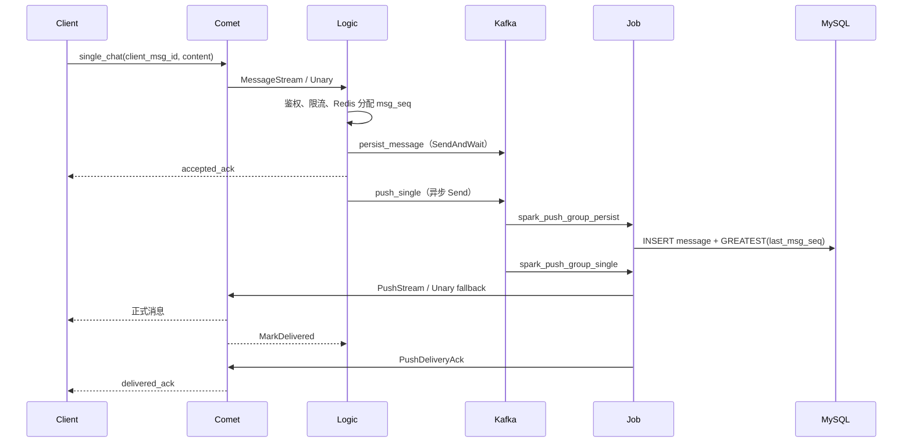
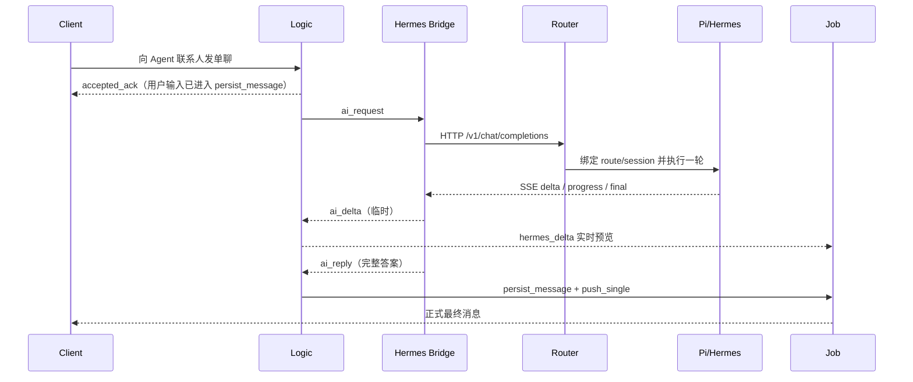

# Spark Push 大框架：模块职责与功能实现

这份文档只讲**系统怎么拆、每个模块负责什么、模块之间怎样协作**。
具体容器、Lua 脚本、握手字节、重连退避和流式合并算法见
[`spark-push-internals.md`](spark-push-internals.md)。

内容以当前根目录源码为准。`02_auth_subset`～`06`、`5.1_room_subset` 是教学快照，不作为运行实现依据。

阅读顺序：

1. 本文：模块地图和完整链路；
2. [`spark-push-internals.md`](spark-push-internals.md)：小模块逐步算法；
3. [`reliability-optimization.md`](reliability-optimization.md)：ACK / 游标 / 指标语义；
4. `proto/spark_push.proto`：线协议。

---

## 1. 系统拆分

Spark Push 把实时 IM 拆成三个 C++ 进程，再用可选的 Agent Bridge 接 Pi/Hermes：

```text
Client ──WebSocket──► Comet ──MessageStream──► Logic
  ▲                     ▲                       │
  │                     │                       ├── Redis：token / 路由 / seq / dedup
  │                     │                       ├── persist_message：持久化事件
  │                     │                       ├── push_single / push_group / broadcast_task
  │                     │                       └── ai_request（仅 Agent 联系人）
  │                     │                                  │
  │                     └──── PushStream ◄──── Job ◄────────┘
  └──────────────────── WebSocket delivery + delivered cursor

Agent 路径（可选）：

Logic ── ai_request ──► hermes_bridge ──HTTP/SSE──► Pi gateway
  ▲                         │
  │                         ├─ ai_delta ──► Logic 临时推送（不落库、不占 msg_seq）
  └──── ai_reply ◄──────────┴── persist_message + push_single（最终事实）
```

| 进程 / 模块 | 默认端口 | 职责边界 |
| --- | ---: | --- |
| Logic | gRPC 9100 / HTTP 9101 | 鉴权、序号、幂等、Kafka 生产、历史/游标、管理员 HTTP、`/metrics` |
| Comet | WS 9000 / gRPC 9105 / metrics 9203 | 长连接接入、上行解析、本机下推、离线补推 |
| Job | metrics 9202 | 消费四类 Kafka topic；写 MySQL；经 PushStream 投递 Comet |
| Hermes Bridge | 无监听端口 | 消费 `ai_request`，调用本机 Pi gateway，发布 `ai_delta` / `ai_reply` |
| Agent Router / Pi gateway | 本机 HTTP/SSE | 路由绑定、turn 幂等、事件账本、模型执行 |
| WebDemo | HTTP 9010 | 浏览器历史、乐观气泡、流式预览、管理员页 |
| Android | 独立 APK | 原生 Compose 客户端，复用同一套 HTTP/WS 合同 |
| 数据层 | Redis / Kafka / MySQL / SQLite | 热状态、阶段解耦、最终消息、Agent 账本 |

可靠性合同：

- `accepted_ack`：Logic 已把 `persist_message` 交给 Kafka，并收到 delivery report。它**不是**目标客户端已经看到消息。
- `delivered_ack`：Job/Comet 已把消息交给目标在线 WebSocket 连接。它**不是**已读回执。
- `ai_delta` 只改变在线预览，不分配 `msg_seq`，不进历史。最终 `ai_reply` 才走普通单聊持久化。
- 当前是“至少一次事件 + 幂等落库”，不是分布式 exactly-once。

---

## 2. 完整消息链路

### 2.1 普通单聊



热路径上 Logic **不写 MySQL**。序号在 Redis Lua 中分配；MySQL 由独立 persist consumer 异步写入。因此实时 ACK 完成不等于历史已经落库。

### 2.2 聊天室 / 广播

- 聊天室 session_id 为 `r_{room_id}`。Logic 优先按 Redis `room:comets` 做 comet 级 fanout，集合为空时回退到成员表再查用户路由。
- 聊天室走 `push_group` / `spark_push_group_group`；广播走 `broadcast_task` / `spark_push_group_broadcast`。
- 三套 topic、三套 consumer group、三套令牌桶互相隔离，避免广播挤占单聊。

### 2.3 Agent 单聊



用户输入的 accepted 边界不依赖模型耗时。Bridge 超时或重启时，未确认的 `ai_request` 由 Kafka 重试；已经生成的回答按 `request_id` 回放，不再调模型。

### 2.4 断线、缺口、离线

| 场景 | 谁发起 | 权威数据 | 结果 |
| --- | --- | --- | --- |
| 客户端发现 `msg_seq` 缺口 | Client `sync` | MySQL `message` | Comet 调 `SyncMessages` 补发原始消息 |
| 握手后补推未交给连接的消息 | Comet `SyncOffline` | `user_session_state.delivered_seq` | 只有实际 send 成功才 `MarkDelivered` |
| Job→Comet 流断开 | Job writer | Kafka offset 未提交 | 指数退避重连，失败走 Unary；都失败则不提交位点 |
| 重复投递 | Comet `AcceptPushRequest` | 最近 10 万个 `request_id` | 返回成功但 `delivered_count=0` |

---

## 3. 各模块功能实现

### 3.1 Comet：连接入口与本机投递

源码：`comet/comet_server.cpp`、`comet/comet_grpc_service.cpp`、`comet/websocket_utils.cpp`。

Comet 不做业务裁决。它只保证：

1. TCP 连接 `TCP_NODELAY`，先完成 HTTP Upgrade，再按 RFC6455 解析文本帧。
2. 握手 Token 调 Logic `VerifyToken`；失败直接断开。
3. 同一 `user_id` 可以有多条连接（多标签页 / 多设备），保存在 `user_conns_[uid]` 的 `set` 里。
4. 上行 `single_chat` / `chatroom` 经 `MessageStream` 交给 Logic；带 `client_msg_id` 供幂等。
5. 下行由 Job 的 `PushStream` 进入 `ProcessPushRequest`：先按 `request_id` 去重，再拷贝连接列表后发送，避免持锁 send。
6. 发送成功后异步 `MarkDelivered`；来源用户另外收到 `delivered_ack`。
7. 握手成功立即 `SyncOffline(limit=200)`。客户端仍可以用自己的 `msg_seq` 游标发 `sync`。

Comet 不持久化消息，不分配序号。socket 已连接不代表消息已 accepted 或已 delivered。

### 3.2 Logic：权威编排层

源码：`logic/grpc_service.cpp`、`logic/conversation_store.cpp`、`logic/redis_store.cpp`、`logic/http_server.cpp`。

Logic 是消息事实的编排者：

1. 校验发送者是否 `active`（2 秒用户状态短缓存）。
2. 按 scene 令牌桶限流；超限返回 429。
3. 本地构造 session_id：单聊 `s_{min}_{max}`，聊天室 `r_{room_id}`。
4. Redis Lua 原子完成：校准 floor、`client_msg_id` 去重、`INCR msg_seq`、更新 `last_seq`。
5. `persist_message` 必须 `SendAndWait` 成功才回 `accepted_ack`。
6. 新消息再异步写入 `push_single` / `push_group`；重复 `client_msg_id` 不再二次投递（Agent 请求允许按 `request_id` 重入队）。
7. HTTP 提供注册/登录、历史分页、未读/已读、知识原文和管理员操作。

Logic 崩溃后，只要 persist 事件已进入 Kafka，Job 仍可重放落库。实时 topic 失败时，accepted 仍然成立，消息进入“已受理、待投递”状态。

### 3.3 Job：阶段消费与投递

源码：`job/service.cpp`、`common/kafka_consumer.cpp`。

Job 用四个独立 consumer group 隔离阶段：

| 场景 | topic | group | 处理 |
| --- | --- | --- | --- |
| persist | `persist_message` | `spark_push_group_persist` | 补 session、INSERT message、GREATEST 水位；失败进 DLQ |
| single | `push_single` | `spark_push_group_single` | PushStream 投递 |
| group | `push_group` | `spark_push_group_group` | 聊天室 fanout |
| broadcast | `broadcast_task` | `spark_push_group_broadcast` | 全量/范围广播 |

每个 `comet_id` 一条双向 `PushStream`：有界队列 10000、writer/reader 分离、`request_id` 匹配 reply、200ms 起指数退避最多 4 次、超时回退 Unary。只有 Comet 返回成功后，Kafka 才允许提交该条 offset。

### 3.4 数据层

| 存储 | 保存什么 | 不保存什么 |
| --- | --- | --- |
| Redis | token、用户/房间路由、msg_seq、dedup、未读热缓存 | 最终消息正文 |
| Kafka | persist / push / broadcast / ai_* 事件 | 客户端游标 |
| MySQL `message` | 最终消息，`uk_session_seq(session_id,msg_seq)` | 半截 `ai_delta` |
| MySQL `user_session_state` | `read_seq` 与 `delivered_seq`，更新用 `GREATEST` | 在线连接 |
| SQLite `routing.sqlite3` | Agent route / turn / event 账本 | Spark 聊天历史 |

MySQL `content_json` 已升级为 `MEDIUMTEXT`。读取仍先走 64 KiB 缓冲，截断时按实际长度再取一列。

### 3.5 Hermes Bridge 与 Agent Router

Bridge 只做传输和投影：

- 消费 `ai_request`，按 `request_id` 去重；
- HTTP/SSE 只打本机 Pi gateway `/v1/chat/completions`；
- 文本增量按 48 字节 / 50 ms 合并后发 `ai_delta`；
- 终态完整文本发 `ai_reply`，再进入普通单聊。

Router 拥有 Agent 运行时：

- `canonical_route` 生成稳定 `route_key` / `session_key`；
- `begin_turn` 用 `request_id + input_hash` 保证相同输入回放、不同输入拒绝；
- `append_event` 以 `(request_id, sequence)` 和唯一 `event_id` 双约束；
- HTTP replay 只读账本，不重新执行模型。

Spark Push 拥有鉴权、成员、序号、历史和投递；Pi/Hermes 拥有推理、工具、Skill 和模型访问。

### 3.6 WebDemo 与 Android

两端使用同一套 session_id、`client_msg_id`、`accepted_ack` / `delivered_ack`、`sync` 和 Agent envelope。差别只在 UI 状态机：

- WebDemo：乐观气泡、历史加载期间暂存实时帧、`requestAnimationFrame` 合并 DOM、距底部 96px 内才自动滚动。
- Android：Kotlin/Compose；`SparkClient` 用连接代数丢弃过期回调；`SparkViewModel` 用 `TreeMap` 按序号合并增量，40 ms 刷新一次 Compose 状态。

Android 使用独立联系人 `900000000201`（Pi）和 `900000000211`（Hermes technical），避免和 PC/WebDemo/Telegram 的 session、模型偏好混用。

### 3.7 运维与验证

- 日常：`scripts/sparkctl.sh up|status|health|logs|down`。
- 启动不只检查端口，还等待 `spark_push_comet_push_stream_ready 1`。
- E2E 必须同时满足 `sent == accepted_ack == delivered_ack == delivered`，并且让 Job 继续消费 persist topic 后再查库。
- 指标：Logic 9101、Job 9202、Comet 9203。

---

## 4. 模块输入输出一览

| 模块 | 输入 | 输出 | 失败时 |
| --- | --- | --- | --- |
| Comet 握手 | HTTP Upgrade + token | 在线连接 + 离线补推 | 断开 TCP |
| Comet 上行 | WS JSON `single_chat` | Logic `UpstreamMessageRequest` | 回 error 帧 |
| Logic 热路径 | 上行请求 | `accepted_ack` + persist/push 事件 | 400/403/429/503，不写假 ACK |
| Job persist | persist 事件 | MySQL 行 | 重试 3 次后 DLQ；DLQ 失败则停消费 |
| Job 投递 | push 事件 | Comet reply + delivered_ack | 不提交 Kafka offset |
| Bridge | `ai_request` | `ai_delta` / `ai_reply` | 缓存命中则只重发 reply |
| 客户端 | ACK / 消息 / delta | 本地游标与 UI | 发现缺口发 `sync` |

---

## 5. 当前边界

- 单机 WSL + 单 broker 教学环境，不能外推多机容量、TLS 或灾备。
- `delivered_ack` 不是 read receipt。
- persist 有 DLQ；实时 push 失败目前是 best-effort + 指标，没有独立可重放 DLQ topic。
- Comet 侧 `MessageStream` 发送队列无界；Job 侧 PushStream 队列有界。
- HTTP 部分教学接口仍需统一对象级授权后才能公开部署。

下一步读 [`spark-push-internals.md`](spark-push-internals.md)，从 Redis Lua、连接表、PushStream 队列和客户端 TreeMap 追到函数级实现。
